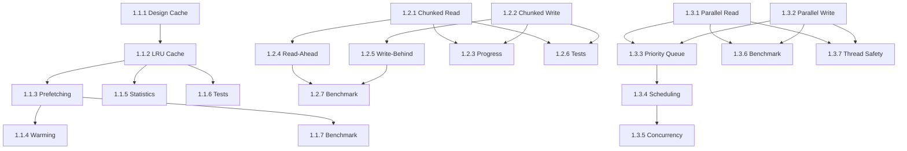

# Phase 1 Tasks: Performance Optimization

## Feature 1.1: Intelligent Caching System

### Task 1.1.1: Design Cache Architecture
- [ ] Design two-tier cache structure (L1 memory, L2 compressed)
- [ ] Define cache entry format and metadata
- [ ] Document eviction policies
- [ ] Create cache architecture diagram
**Assigned**: fuse-cache-specialist
**Priority**: HIGH
**Estimated**: 4 hours

### Task 1.1.2: Implement LRU Cache
- [ ] Create `infinite_map_cache.py` with LRUCache class
- [ ] Implement `get()`, `set()`, `evict()` methods
- [ ] Add configurable size limits
- [ ] Add cache statistics tracking
**Assigned**: fuse-cache-specialist
**Priority**: HIGH
**Estimated**: 6 hours

### Task 1.1.3: Add Predictive Prefetching
- [ ] Implement access pattern tracker
- [ ] Add sequential detection algorithm
- [ ] Implement prefetch queue
- [ ] Integrate with FUSE read operations
**Assigned**: fuse-cache-specialist
**Priority**: MEDIUM
**Estimated**: 6 hours

### Task 1.1.4: Implement Cache Warming
- [ ] Add mount-time cache population
- [ ] Prioritize hot zone files
- [ ] Add async warming option
- [ ] Track warming progress
**Assigned**: fuse-cache-specialist
**Priority**: MEDIUM
**Estimated**: 4 hours

### Task 1.1.5: Add Cache Statistics
- [ ] Track hit/miss rates
- [ ] Track eviction counts
- [ ] Track prefetch accuracy
- [ ] Add statistics endpoint
**Assigned**: fuse-cache-specialist
**Priority**: LOW
**Estimated**: 2 hours

### Task 1.1.6: Write Cache Tests
- [ ] Test LRU eviction
- [ ] Test cache coherence
- [ ] Test prefetch accuracy
- [ ] Test concurrent access
**Assigned**: fuse-qa-agent
**Priority**: HIGH
**Estimated**: 4 hours

### Task 1.1.7: Benchmark Cache Performance
- [ ] Create cache benchmark script
- [ ] Measure hit rates for various workloads
- [ ] Compare with/without cache
- [ ] Document results
**Assigned**: fuse-benchmark-agent
**Priority**: MEDIUM
**Estimated**: 4 hours

---

## Feature 1.2: Streaming I/O

### Task 1.2.1: Implement Chunked Read
- [ ] Create `infinite_map_streaming.py`
- [ ] Implement chunked read with configurable size
- [ ] Add read-ahead buffer
- [ ] Handle file boundaries correctly
**Assigned**: fuse-streaming-specialist
**Priority**: HIGH
**Estimated**: 6 hours

### Task 1.2.2: Implement Chunked Write
- [ ] Implement chunked write with buffering
- [ ] Add write-behind coalescing
- [ ] Handle partial writes
- [ ] Ensure data consistency
**Assigned**: fuse-streaming-specialist
**Priority**: HIGH
**Estimated**: 6 hours

### Task 1.2.3: Add Progress Callbacks
- [ ] Define progress callback interface
- [ ] Implement progress tracking
- [ ] Add cancellation support
- [ ] Update CLI with progress display
**Assigned**: fuse-streaming-specialist
**Priority**: MEDIUM
**Estimated**: 4 hours

### Task 1.2.4: Implement Read-Ahead Buffering
- [ ] Add sequential access detection
- [ ] Implement read-ahead queue
- [ ] Tune read-ahead window size
- [ ] Handle random access fallback
**Assigned**: fuse-streaming-specialist
**Priority**: MEDIUM
**Estimated**: 4 hours

### Task 1.2.5: Implement Write-Behind Buffering
- [ ] Add write buffer with coalescing
- [ ] Implement dirty page tracking
- [ ] Add background flush thread
- [ ] Handle sync/fsync correctly
**Assigned**: fuse-streaming-specialist
**Priority**: MEDIUM
**Estimated**: 6 hours

### Task 1.2.6: Test Large Files
- [ ] Test with 100MB+ files
- [ ] Verify memory usage bounds
- [ ] Test interrupted transfers
- [ ] Verify data integrity
**Assigned**: fuse-qa-agent
**Priority**: HIGH
**Estimated**: 4 hours

### Task 1.2.7: Benchmark Streaming
- [ ] Create streaming benchmark
- [ ] Measure throughput for various sizes
- [ ] Measure memory usage
- [ ] Compare with non-streaming
**Assigned**: fuse-benchmark-agent
**Priority**: MEDIUM
**Estimated**: 4 hours

---

## Feature 1.3: Parallel I/O

### Task 1.3.1: Implement Parallel Read Executor
- [ ] Create `infinite_map_parallel.py`
- [ ] Implement thread pool for reads
- [ ] Add parallel chunk reading
- [ ] Handle read ordering
**Assigned**: fuse-parallel-specialist
**Priority**: HIGH
**Estimated**: 6 hours

### Task 1.3.2: Implement Parallel Write Executor
- [ ] Implement parallel write with ordering
- [ ] Add write serialization points
- [ ] Handle write conflicts
- [ ] Ensure consistency
**Assigned**: fuse-parallel-specialist
**Priority**: HIGH
**Estimated**: 6 hours

### Task 1.3.3: Add I/O Priority Queue
- [ ] Implement priority queue for I/O
- [ ] Add priority levels (high/normal/low)
- [ ] Implement aging for fairness
- [ ] Track queue statistics
**Assigned**: fuse-parallel-specialist
**Priority**: MEDIUM
**Estimated**: 4 hours

### Task 1.3.4: Implement I/O Scheduling
- [ ] Implement deadline scheduler
- [ ] Add fair-share option
- [ ] Tune scheduling parameters
- [ ] Handle priority inversion
**Assigned**: fuse-parallel-specialist
**Priority**: MEDIUM
**Estimated**: 6 hours

### Task 1.3.5: Add Concurrency Limits
- [ ] Add configurable max threads
- [ ] Implement backpressure
- [ ] Add queue size limits
- [ ] Handle overload gracefully
**Assigned**: fuse-parallel-specialist
**Priority**: MEDIUM
**Estimated**: 4 hours

### Task 1.3.6: Benchmark Parallel Performance
- [ ] Create parallel benchmark
- [ ] Measure scaling with threads
- [ ] Find optimal thread count
- [ ] Document results
**Assigned**: fuse-benchmark-agent
**Priority**: MEDIUM
**Estimated**: 4 hours

### Task 1.3.7: Test Thread Safety
- [ ] Run stress tests with high concurrency
- [ ] Verify no race conditions
- [ ] Test with thread sanitizers
- [ ] Document any issues
**Assigned**: fuse-qa-agent
**Priority**: HIGH
**Estimated**: 6 hours

---

## Summary

| Feature | Tasks | Estimated Time |
|---------|-------|----------------|
| 1.1 Caching | 7 | 30 hours |
| 1.2 Streaming | 7 | 34 hours |
| 1.3 Parallel I/O | 7 | 36 hours |
| **Total** | **21** | **100 hours** |

## Dependencies

