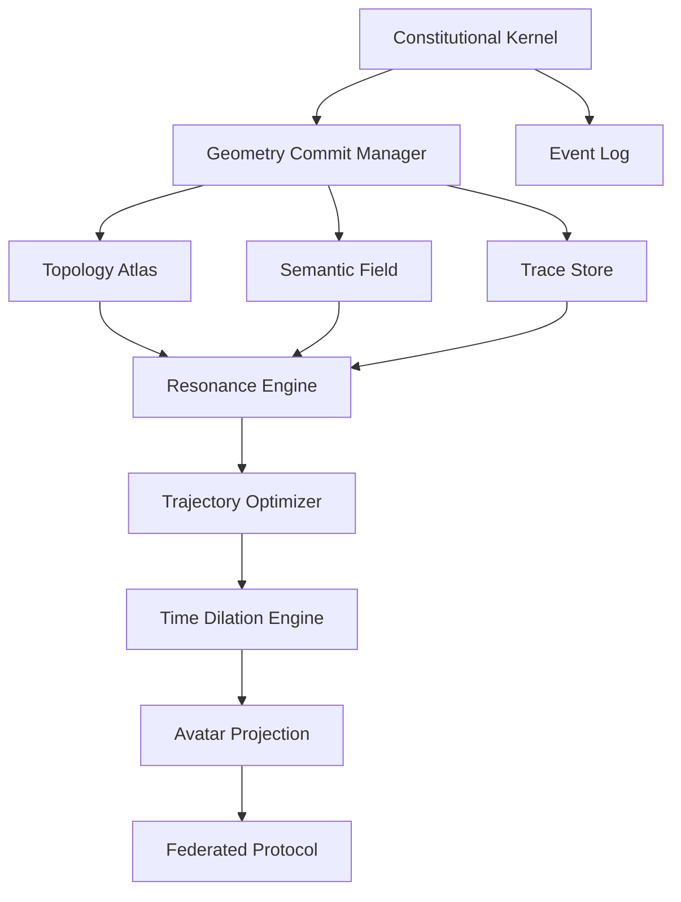

# COMPONENT MAPPING: EXISTING CODEBASE → UNIFIED AI OS ARCHITECTURE

## 1. KERNEL LAYER MAPPING

### Constitutional Kernel
**Existing Components:**
- `src/ctrm_core/truth_manager.py` → Truth validation & governance
- `src/ghost_architecture/ctrm_integration.py` → Permission enforcement
- `src/vector_llm_tools/cvfs_engine.py` → Transaction engine

**Required New Components:**
- `src/kernel/constitutional_kernel.py` → Main kernel implementation
- `src/kernel/geometry_commit_manager.py` → Atomic commit/rollback
- `src/kernel/event_log.py` → Immutable audit trail

### Geometry Commit Manager
**Existing Components:**
- `src/vector_llm_tools/cvfs_main.py` → Vector operations
- `src/vfs/vector_file_system_cvfs.py` → File system integration

**Required Enhancements:**
- Add atomic transaction support
- Implement receipt generation
- Add rollback capability

## 2. NEXUS LAYER MAPPING

### Topology Atlas (Graph)
**Existing Components:**
- `src/vector_llm_tools/cvfs_engine.py` → Graph operations
- `src/vector_llm_tools/cvfs_daemon.py` → Continuous updates

**Required New Components:**
- `src/nexus/topology_atlas.py` → Main graph implementation
- `src/nexus/tensile_edge.py` → Dynamic relationship management

### Semantic Field (Vector)
**Existing Components:**
- `src/vector_llm_tools/vector_interface.py` → Vector operations
- `src/vector_llm_tools/cvfs_engine.py` → Vector storage

**Required Enhancements:**
- Add HNSW graph navigation
- Implement semantic addressing
- Add vector similarity search

### Artifact Store (Object)
**Existing Components:**
- `src/vfs/vector_file_system_cvfs.py` → Content storage
- `src/ctrm_core/database.py` → Database integration

**Required New Components:**
- `src/nexus/artifact_store.py` → Content-addressable storage
- `src/nexus/cas_engine.py` → Git-like blob storage

### Trace Store (Executable Memory)
**Existing Components:**
- `src/vector_llm_tools/vpl_compiler.py` → Program execution
- `src/ghost_architecture/ctrm_integration.py` → Reasoning patterns

**Required New Components:**
- `src/nexus/trace_store.py` → Main trace implementation
- `src/nexus/trace_replayer.py` → Trace execution engine

## 3. COGNITION ENGINE MAPPING

### Resonance Engine
**Existing Components:**
- `src/vector_llm_tools/vector_interface.py` → Vector search
- `src/vector_llm_tools/cvfs_engine.py` → Context assembly

**Required New Components:**
- `src/cognition/resonance_engine.py` → Harmonic retrieval
- `src/cognition/context_assembler.py` → Coherent context building

### Recursive Executor
**Existing Components:**
- `src/vector_llm_tools/vpl_compiler.py` → Program execution
- `src/main.py` → Main execution loop

**Required Enhancements:**
- Add trace replay capability
- Implement recursive decomposition
- Add confidence-aware execution

## 4. EXECUTION ENGINE MAPPING

### Trajectory Optimizer
**Existing Components:**
- `src/vector_llm_tools/vpl_compiler.py` → Plan generation
- `src/ghost_architecture/ctrm_integration.py` → Intent processing

**Required New Components:**
- `src/execution/trajectory_optimizer.py` → DAG creation
- `src/execution/plan_generator.py` → Intent to plan translation

### Time Dilation Engine
**Existing Components:**
- `src/vector_llm_tools/cvfs_engine.py` → Parallel operations
- `src/main.py` → Simulation capabilities

**Required New Components:**
- `src/execution/time_dilation.py` → Parallel simulation
- `src/execution/sandbox_manager.py` → Isolated execution

### Vector Bus
**Existing Components:**
- `src/vector_llm_tools/vector_interface.py` → Vector operations
- `src/vector_llm_tools/cvfs_engine.py` → Data bus

**Required Enhancements:**
- Add HNSW graph navigation
- Implement multi-layer addressing
- Add vector routing

## 5. INTERFACE LAYER MAPPING

### Avatar Projection
**Existing Components:**
- `src/vector_llm_tools/vpl_compiler.py` → Interface generation
- `src/main.py` → User interaction

**Required New Components:**
- `src/interface/avatar_projection.py` → 3D interface
- `src/interface/narrative_generator.py` → Explanation engine

### Vector Shell
**Existing Components:**
- `src/main.py` → CLI interface
- `src/vector_llm_tools/vpl_compiler.py` → Command processing

**Required Enhancements:**
- Add semantic command interpretation
- Implement intent-based navigation
- Add vector-based file operations

## 6. GLOBAL HIVE MAPPING

### Federated Resonance Protocol
**Existing Components:**
- `src/vector_llm_tools/cvfs_engine.py` → Network operations
- `src/ghost_architecture/ctrm_integration.py` → Multi-agent communication

**Required New Components:**
- `src/hive/federated_protocol.py` → Inter-instance communication
- `src/hive/consensus_engine.py` → Global agreement

## 7. IMPLEMENTATION PRIORITY MATRIX

| Component | Priority | Complexity | Existing Coverage | Estimated Effort |
|-----------|----------|------------|-------------------|------------------|
| Constitutional Kernel | HIGH | MEDIUM | 60% | 2 weeks |
| Geometry Commit Manager | HIGH | HIGH | 40% | 3 weeks |
| Topology Atlas | HIGH | MEDIUM | 70% | 1 week |
| Semantic Field | HIGH | LOW | 80% | 1 week |
| Trace Store | HIGH | HIGH | 30% | 4 weeks |
| Resonance Engine | MEDIUM | MEDIUM | 50% | 2 weeks |
| Trajectory Optimizer | MEDIUM | HIGH | 40% | 3 weeks |
| Time Dilation Engine | MEDIUM | HIGH | 30% | 4 weeks |
| Avatar Projection | LOW | HIGH | 20% | 6 weeks |
| Federated Protocol | LOW | HIGH | 10% | 8 weeks |

## 8. INTEGRATION STRATEGY

### Phase 1: Core Integration (Weeks 1-4)
1. **Unify storage layers** - Merge CVFS and CTRM into Geometric Nexus
2. **Implement kernel** - Build Constitutional Kernel with existing truth manager
3. **Add transaction support** - Enhance CVFS with atomic operations
4. **Create basic interface** - Extend VPL compiler for trace execution

### Phase 2: Execution Pipeline (Weeks 5-8)
1. **Build trajectory optimizer** - Extend VPL compiler for DAG generation
2. **Implement time dilation** - Add parallel simulation to CVFS
3. **Enhance resonance** - Improve vector search with harmonic retrieval
4. **Add verification** - Integrate CTRM governance into execution

### Phase 3: Advanced Features (Weeks 9-12)
1. **Implement trace store** - Build executable memory system
2. **Add multi-agent support** - Extend ghost architecture for collaboration
3. **Enhance interface** - Develop avatar projection layer
4. **Add federated learning** - Implement global hive protocol

## 9. DEPENDENCY GRAPH

## 10. MIGRATION PLAN

### Step 1: Assessment (Week 1)
- Audit all existing components
- Identify integration points
- Create detailed migration plan

### Step 2: Core Migration (Weeks 2-3)
- Migrate CTRM to Constitutional Kernel
- Enhance CVFS to Geometric Nexus
- Unify vector operations

### Step 3: Execution Integration (Weeks 4-5)
- Add trajectory optimization
- Implement time dilation
- Integrate verification

### Step 4: Interface Development (Weeks 6-7)
- Build avatar projection
- Enhance vector shell
- Add narrative generation

### Step 5: Testing & Optimization (Weeks 8-9)
- Performance testing
- Security auditing
- Efficiency optimization

### Step 6: Deployment (Week 10)
- Alpha release
- Documentation
- Demo preparation

This mapping provides a clear path from the existing codebase to the unified AI OS architecture, leveraging existing components while identifying the new implementations needed to complete the vision.