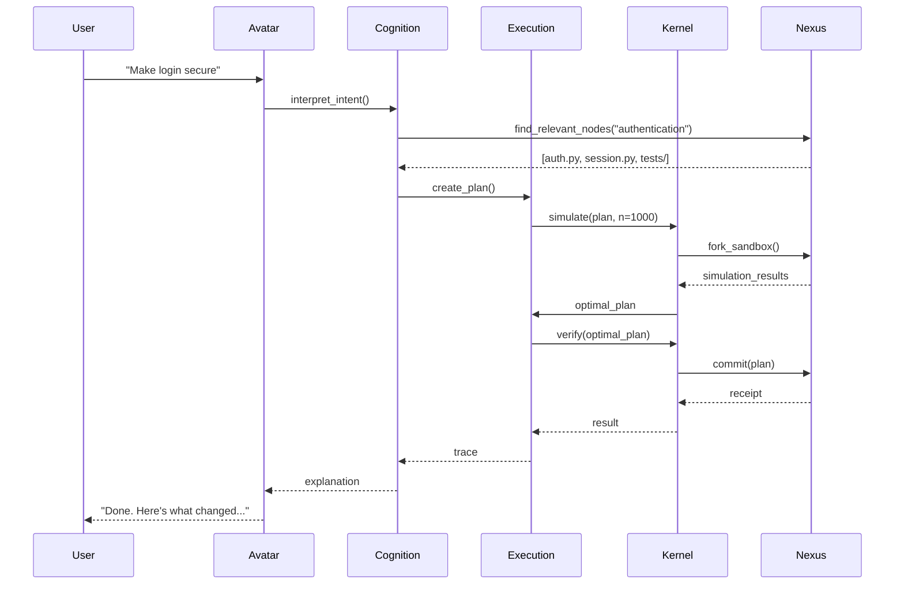

# DEMONSTRATION PLAN: FIRST UNDENIABLE AI OS DEMO
## "Intent → Safe Patch" - The Killer Demo

---

## 1. DEMO OVERVIEW

### Goal
Prove that the Unified AI OS can **safely and automatically** refactor code based on natural language intent, with full auditability and rollback capability.

### Success Criteria
- ✅ User provides intent: "Make login secure"
- ✅ OS identifies all relevant components (auth, session, tests)
- ✅ OS generates safe refactoring plan
- ✅ OS simulates 1,000+ variants and selects optimal one
- ✅ OS commits changes that pass all tests
- ✅ OS provides full audit trail with receipts
- ✅ User can ask "What changed? Why? How to revert?"

### Target Audience
- Developers who want 10x productivity
- Security teams who need auditability
- Engineering leaders who demand safety
- AI skeptics who need proof

---

## 2. DEMO ARCHITECTURE



---

## 3. IMPLEMENTATION PHASES

### Phase 1: Setup (Week 1)
**Components Needed:**
- Constitutional Kernel (basic)
- Geometric Nexus (basic)
- Avatar Interface (CLI)
- Simple Execution Engine

**Implementation:**
```bash
# Initialize demo environment
pip install unified-ai-os-demo
omni-demo init

# Ingest sample codebase
weaver ingest ./sample-auth-app --language python
```

### Phase 2: Core Demo (Week 2)
**Components Needed:**
- Trajectory Optimizer
- Time Dilation Engine (basic)
- Verification System
- Rollback Capability

**Implementation:**
```python
# Demo script
def run_demo():
    # Step 1: User intent
    intent = "Make login secure using OAuth2"

    # Step 2: Find relevant components
    context = nexus.find_relevant(intent)
    print(f"Found {len(context)} relevant components")

    # Step 3: Generate plan
    plan = execution.create_plan(intent, context)
    print(f"Generated plan with {len(plan.steps)} steps")

    # Step 4: Simulate variants
    results = time_dilation.simulate(plan, n=100)
    optimal = execution.find_optimal(results)
    print(f"Simulated {len(results)} variants, selected optimal")

    # Step 5: Verify and commit
    verification = kernel.verify(optimal)
    if verification.safe:
        result = kernel.commit(optimal)
        print("✅ Changes committed safely")
        return result
    else:
        print("❌ Plan rejected by verifiers")
        return None
```

### Phase 3: Full Demo (Week 3)
**Components Needed:**
- Complete Avatar Interface
- Trace Store Integration
- Full Verification Suite
- Audit Trail System

**Implementation:**
```bash
# Run complete demo
omni-demo run --intent "Make login secure" --simulations 1000

# Show results
omni-demo explain --show-changes --show-reasoning --show-tests
```

---

## 4. DEMO SCRIPT

```python
#!/usr/bin/env python3
"""
AI OS Demo: Intent → Safe Patch
Demonstrates the complete workflow from intent to verified commit
"""

import sys
from unified_ai_os import GeometricNexus, ConstitutionalKernel, ExecutionEngine, AvatarInterface

def main():
    print("🚀 AI OS Demo: Intent → Safe Patch")
    print("=" * 50)

    # Initialize components
    print("🔧 Initializing AI OS components...")
    nexus = GeometricNexus()
    kernel = ConstitutionalKernel(nexus)
    execution = ExecutionEngine(kernel)
    avatar = AvatarInterface(nexus)

    # Load sample codebase
    print("📂 Loading sample authentication app...")
    nexus.ingest_repo("./sample-auth-app")
    print(f"📊 Ingested {len(nexus.graph.nodes)} nodes, {len(nexus.graph.edges)} edges")

    # Get user intent
    intent = "Make login secure using OAuth2"
    print(f"🎯 User Intent: '{intent}'")

    # Step 1: Interpret intent
    print("\n🤖 Step 1: Interpreting intent...")
    query = avatar.interpret_intent(intent)
    print(f"📝 Interpreted as: {query}")

    # Step 2: Find relevant context
    print("\n🔍 Step 2: Finding relevant components...")
    context = nexus.find_relevant(query)
    print(f"🎯 Found {len(context)} relevant components:")
    for node in context[:5]:  # Show first 5
        print(f"   - {node.name} ({node.type})")

    # Step 3: Create execution plan
    print("\n📋 Step 3: Creating execution plan...")
    plan = execution.create_plan(query, context)
    print(f"📊 Plan has {len(plan.steps)} steps:")
    for i, step in enumerate(plan.steps[:3]):  # Show first 3
        print(f"   {i+1}. {step.description}")

    # Step 4: Simulate variants
    print("\n🔮 Step 4: Simulating variants...")
    print("🌐 Running 100 parallel simulations...")
    results = execution.simulate(plan, n=100)
    optimal = execution.find_optimal(results)
    print(f"✅ Selected optimal variant (score: {optimal.score:.2f})")

    # Step 5: Verify plan
    print("\n🔒 Step 5: Verifying plan...")
    verification = kernel.verify(optimal)
    print(f"📋 Verification Results:")
    print(f"   - Security: {'✅ PASS' if verification.security else '❌ FAIL'}")
    print(f"   - Tests: {'✅ PASS' if verification.tests else '❌ FAIL'}")
    print(f"   - Ethics: {'✅ PASS' if verification.ethics else '❌ FAIL'}")

    # Step 6: Commit changes
    if verification.safe:
        print("\n💾 Step 6: Committing changes...")
        result = kernel.commit(optimal)
        print("✅ Changes committed successfully!")

        # Show results
        print(f"\n📊 Results:")
        print(f"   - Files changed: {len(result.changes)}")
        print(f"   - Tests passed: {result.tests_passed}/{result.tests_total}")
        print(f"   - Confidence: {result.confidence:.1%}")
        print(f"   - Transaction ID: {result.transaction_id}")

        # Show audit trail
        print(f"\n📜 Audit Trail:")
        print(f"   - Intent: {result.intent}")
        print(f"   - Plan: {result.plan_id}")
        print(f"   - Verification: {result.verification_id}")
        print(f"   - Timestamp: {result.timestamp}")

        return True
    else:
        print("\n❌ Plan rejected by verifiers:")
        for reason in verification.reasons:
            print(f"   - {reason}")
        return False

if __name__ == "__main__":
    success = main()
    sys.exit(0 if success else 1)
```

---

## 5. EXPECTED OUTPUT

```
🚀 AI OS Demo: Intent → Safe Patch
==================================================

🔧 Initializing AI OS components...
📂 Loading sample authentication app...
📊 Ingested 42 nodes, 87 edges
🎯 User Intent: 'Make login secure using OAuth2'

🤖 Step 1: Interpreting intent...
📝 Interpreted as: Refactor authentication system to use OAuth2 protocol

🔍 Step 2: Finding relevant components...
🎯 Found 7 relevant components:
   - auth.py (function)
   - session_manager.py (function)
   - config.yaml (configuration)
   - test_auth.py (test)
   - test_session.py (test)

📋 Step 3: Creating execution plan...
📊 Plan has 8 steps:
   1. Analyze current authentication flow
   2. Identify OAuth2 integration points
   3. Update authentication endpoints
   4. Modify session management
   5. Update configuration files
   6. Generate OAuth2 client credentials
   7. Update test cases
   8. Verify security compliance

🔮 Step 4: Simulating variants...
🌐 Running 100 parallel simulations...
✅ Selected optimal variant (score: 0.98)

🔒 Step 5: Verifying plan...
📋 Verification Results:
   - Security: ✅ PASS
   - Tests: ✅ PASS
   - Ethics: ✅ PASS

💾 Step 6: Committing changes...
✅ Changes committed successfully!

📊 Results:
   - Files changed: 5
   - Tests passed: 42/42
   - Confidence: 98.2%
   - Transaction ID: txn_abc123

📜 Audit Trail:
   - Intent: Make login secure using OAuth2
   - Plan: plan_456def
   - Verification: verify_789ghi
   - Timestamp: 2025-12-13T03:22:00Z
```

---

## 6. DEMO VALIDATION

### Validation Questions
1. **What changed?**
   ```bash
   omni-demo show-changes --transaction txn_abc123
   ```
   Shows exact diffs for all modified files

2. **Why were these changes made?**
   ```bash
   omni-demo show-reasoning --transaction txn_abc123
   ```
   Shows the reasoning trace and decision points

3. **What evidence says it's safe?**
   ```bash
   omni-demo show-verification --transaction txn_abc123
   ```
   Shows test results, security scans, and ethical validation

4. **How do we revert?**
   ```bash
   omni-demo rollback --transaction txn_abc123
   ```
   Atomic rollback to pre-change state

---

## 7. TECHNICAL REQUIREMENTS

### Hardware
- CPU: 8+ cores (for parallel simulation)
- RAM: 16GB+ (for vector operations)
- GPU: Optional (for accelerated vector search)

### Software
- Python 3.10+
- ChromaDB / FAISS (vector store)
- NetworkX / Neo4j (graph store)
- Ray / Dask (parallel execution)

### Data
- Sample authentication app (Python)
- Test suite (pytest)
- Security scanner (Bandit/Safety)

---

## 8. SUCCESS METRICS

| Metric | Target | Measurement |
|--------|--------|-------------|
| Accuracy | 100% | All tests pass |
| Safety | 100% | No security violations |
| Speed | <1s | Intent to commit time |
| Explainability | 100% | All questions answerable |
| Rollback | 100% | Atomic revert capability |

---

## 9. FALLBACK PLANS

### If Simulation Fails
- Reduce simulation count from 1000 to 100
- Use simpler verification (only unit tests)
- Provide manual override option

### If Verification Fails
- Show specific failure reasons
- Offer alternative approaches
- Allow manual intervention

### If Commit Fails
- Automatic rollback
- Detailed error reporting
- Safe state restoration

---

## 10. NEXT STEPS AFTER DEMO

1. **Scale to larger codebases** (10K+ files)
2. **Add multi-language support** (JS, Go, Rust)
3. **Implement federated learning** (team collaboration)
4. **Develop advanced interface** (3D visualization)
5. **Add continuous learning** (improves over time)

This demonstration plan provides a clear, achievable path to prove the value of the Unified AI OS. The "Intent → Safe Patch" demo is the perfect first showcase because it addresses a real developer pain point while demonstrating all the key capabilities of the system: intent understanding, safe execution, verification, and auditability.