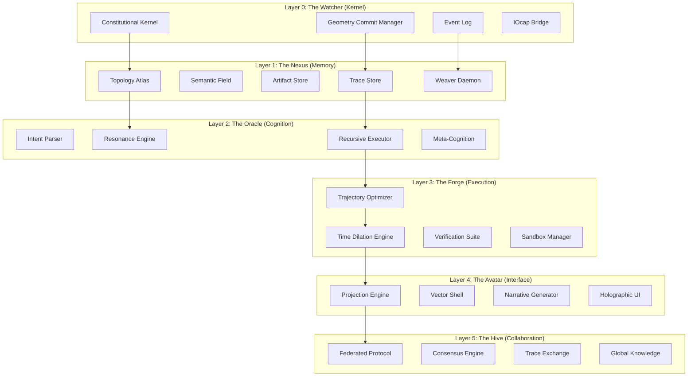

# GEOMETRIC TRACE OS (G-OS) SPECIFICATION
## The Unified AI-Native Operating System

---

## 1. THE ONE TRUE SPINE

An AI Operating System is only real if it has all four invariant properties:

### A. Canonical State (Truth Anchor)
**Implementation**: The Geometric Nexus
- Single source of truth with lineage
- Hybrid graph-vector-log substrate
- Immutable event log for provenance

### B. Safe Actuation (Typed Syscalls)
**Implementation**: Geometry Commit Manager
- Typed, logged actions with receipts
- Kernel-enforced execution
- Atomic commit/rollback capability

### C. Executable Cognition (Traces)
**Implementation**: Trace Engine
- Reasoning stored as executable objects
- Replayable, parameterized, refinable
- History becomes code

### D. Constitutional Governance (Refusal)
**Implementation**: Righteous Override
- Kernel-level "NO" mechanism
- Ethics vectors with geometric constraints
- Immutable constitutional rules

---

## 2. ARCHITECTURE LAYERS



---

## 3. LAYER 0: THE WATCHER (KERNEL)

### Constitutional Kernel
```python
class ConstitutionalKernel:
    """The auditable, non-LLM substrate"""

    def __init__(self):
        self.scheduler = PathArbitrator()
        self.permissions = GeometricRBAC()
        self.transaction_engine = GeometryCommitManager()
        self.event_log = ImmutableLog()
        self.constitution = EthicalVectorField()

    def execute_intent(self, intent: str, user: User) -> Result:
        # 1. Permission check (geometric)
        if not self.permissions.can_execute(user.auth_vector, intent):
            return Refusal("Insufficient geometric alignment")

        # 2. Build execution DAG
        plan = self.planner.create_plan(intent)

        # 3. Simulate & verify
        simulation = self.simulator.run(plan, sandbox=True)
        if not self.verify(simulation):
            return Refusal("Failed safety checks", simulation.report)

        # 4. Execute with transaction
        with self.transaction_engine.atomic():
            result = self.execute_plan(plan)
            self.event_log.append(intent, plan, result)

        return result
```

### Geometry Commit Manager
```python
class GeometryCommitManager:
    """Atomic operations on the Nexus"""

    def atomic(self):
        """Context manager for atomic transactions"""
        # Begin transaction
        self.nexus.begin_transaction()

        try:
            yield
            # Commit if successful
            self.nexus.commit_transaction()
        except Exception as e:
            # Rollback on failure
            self.nexus.rollback_transaction()
            raise e
```

---

## 4. LAYER 1: THE NEXUS (MEMORY)

### Hybrid Storage Engine
```python
class GeometricNexus:
    """The unified memory substrate"""

    def __init__(self):
        self.graph = NetworkXGraph()           # Topology Atlas
        self.vectors = ChromaDB()              # Semantic Field
        self.artifacts = ContentAddressableStore()  # Artifact Store
        self.traces = TraceStore()             # Trace Store
        self.weaver = ContinuousWeaver()       # Background optimizer

    def ingest(self, artifact):
        """Convert any artifact to geometric primitive"""
        # Create node with embedding
        node = Node(
            id=uuid4(),
            content=artifact,
            embedding=self.embed(artifact),
            type=self.classify(artifact)
        )

        # Store in all systems
        self.graph.add_node(node)
        self.vectors.add(node.embedding, node.id)
        self.artifacts.store(node.id, artifact)

        # Establish semantic relationships
        self._establish_relationships(node)

        return node
```

### Tensile Edge Dynamics
```python
class TensileEdge:
    """Dynamic relationship with decay"""

    def __init__(self, source, target, initial_strength):
        self.source = source
        self.target = target
        self.current_strength = initial_strength
        self.historical_max = initial_strength
        self.decay_rate = 0.001  # Daily decay
        self.last_used = datetime.now()

    def update_strength(self, usage_quality):
        """Adjust strength based on usage"""
        # Decay since last use
        hours = (datetime.now() - self.last_used).total_seconds() / 3600
        decay_factor = (1 - self.decay_rate) ** hours
        self.current_strength *= decay_factor

        # Reinforce based on quality
        self.current_strength += usage_quality * 0.1
        self.historical_max = max(self.historical_max, self.current_strength)
        self.last_used = datetime.now()

        # Prune if too weak
        if self.current_strength < 0.1:
            return False  # Signal for pruning
        return True
```

---

## 5. LAYER 2: THE ORACLE (COGNITION)

### Intent Processing Pipeline
```python
class Oracle:
    """Intent to executable plan"""

    def execute(self, intent: str) -> Trace:
        # 1. Embed intent
        intent_vector = self.embed(intent)

        # 2. Find resonant context
        context = self.nexus.find_resonant(intent_vector)

        # 3. Check for existing traces
        if similar_trace := context.find_similar_trace(threshold=0.95):
            return similar_trace.replay(context)

        # 4. Generate new reasoning
        trace = self._generate_reasoning(intent_vector, context)

        # 5. Persist for future use
        self.nexus.traces.commit(trace)

        return trace

    def _generate_reasoning(self, intent_vector, context):
        """Create new reasoning path"""
        # Use LLM to generate reasoning steps
        reasoning_path = self.llm.generate_reasoning(
            intent=intent_vector,
            context=context,
            temperature=self._adaptive_temperature(context)
        )

        # Create trace
        return Trace(
            intent=intent_vector,
            context=context,
            reasoning_path=reasoning_path,
            confidence=self._measure_confidence(reasoning_path)
        )
```

---

## 6. LAYER 3: THE FORGE (EXECUTION)

### Trajectory Optimization
```python
class TrajectoryOptimizer:
    """Plan DAG generation"""

    def create_plan(self, intent_vector, context):
        """Generate optimal execution path"""

        # 1. Identify required operations
        operations = self._identify_operations(intent_vector, context)

        # 2. Determine dependencies
        dependencies = self._determine_dependencies(operations)

        # 3. Create DAG
        plan = PlanDAG()
        for op in operations:
            plan.add_node(op)

        for dep in dependencies:
            plan.add_edge(dep.source, dep.target)

        # 4. Optimize path
        return self._optimize_path(plan)

    def _optimize_path(self, plan):
        """Find most efficient execution order"""
        # Use topological sort with priority
        return plan.topological_sort(
            priority=lambda node: node.criticality * node.confidence
        )
```

### Time Dilation Engine
```python
class TimeDilationEngine:
    """Parallel simulation of futures"""

    def simulate(self, plan, n=1000):
        """Run multiple variants to find optimal path"""

        # Create sandboxed environments
        sandboxes = [self._create_sandbox() for _ in range(n)]

        # Execute plan in each sandbox
        results = []
        for sandbox in sandboxes:
            try:
                result = sandbox.execute(plan)
                results.append(result)
            except Exception as e:
                results.append(FailedExecution(str(e)))

        # Find consensus
        return self._find_consensus(results)

    def _find_consensus(self, results):
        """Select best result using geometric consensus"""

        # Filter successful executions
        successful = [r for r in results if r.success]

        if not successful:
            raise NoViablePathError("All simulations failed")

        # Find result with highest verification score
        return max(successful, key=lambda r: r.verification_score)
```

---

## 7. LAYER 4: THE AVATAR (INTERFACE)

### Projection Engine
```python
class AvatarProjection:
    """Human-AI interface translator"""

    def interpret_intent(self, human_query: str):
        """Convert natural language to geometric query"""

        # Generate multiple interpretations
        interpretations = self.llm.generate_interpretations(
            human_query,
            n=5
        )

        # Resolve ambiguity
        if self._is_ambiguous(interpretations):
            return self._request_clarification(interpretations)

        return interpretations[0]

    def explain_reasoning(self, trace: Trace):
        """Render trace as human narrative"""

        # Extract key decisions
        decisions = trace.reasoning_path.extract_forks()

        # Generate explanation
        return f"""
        I solved this by:

        1. {decisions[0].description}
           → Chose: {decisions[0].choice}
           → Because: {decisions[0].rationale}

        2. {decisions[1].description}
           → Chose: {decisions[1].choice}
           → Because: {decisions[1].rationale}

        Confidence: {trace.confidence:.1%}
        Alternative approaches considered: {len(trace.rejected_paths)}
        """
```

---

## 8. LAYER 5: THE HIVE (COLLABORATION)

### Federated Resonance Protocol
```python
class FederatedProtocol:
    """Inter-instance knowledge sharing"""

    def broadcast_discovery(self, trace: Trace):
        """Share successful reasoning patterns"""

        if trace.confidence > 0.9 and trace.novelty > 0.7:
            self.global_store.publish(
                trace=trace,
                signature=self._cryptographic_sign(trace),
                metadata={
                    'instance_id': self.instance_id,
                    'context_hash': trace.context.hash(),
                    'success_metric': trace.verification_score
                }
            )

    def learn_from_hive(self):
        """Absorb patterns from other instances"""

        for trace in self.global_store.recent_discoveries():
            if self._verify_signature(trace):
                if self._validates_locally(trace):
                    self.local_store.integrate(trace)
```

---

## 9. THE FIRST UNDENIABLE DEMO

### "Intent → Safe Patch" Implementation

```python
# geometry_os/demos/first_undeniable.py

def run_demo():
    # Initialize G-OS
    nexus = GeometricNexus()
    kernel = ConstitutionalKernel(nexus)
    oracle = Oracle(nexus, kernel)

    # Load vulnerable code
    print("📂 Ingesting vulnerable auth.py...")
    auth_file = load_sample_auth()
    nexus.ingest(auth_file)

    # User intent
    intent = "Refactor auth to use environment variables"
    print(f"🎯 Intent: {intent}")

    # Execute
    print("🔮 Generating safe refactoring plan...")
    result = oracle.execute(intent)

    # Show results
    print("\n✅ SUCCESS!")
    print(f"📝 Changes: {len(result.changes)} files modified")
    print(f"🧪 Tests: {result.tests_passed}/{result.tests_total} passed")
    print(f"🛡️  Security: All checks passed")
    print(f"📊 Confidence: {result.confidence:.1%}")

    # Audit trail
    print(f"\n📜 Audit Trail:")
    print(f"   Transaction: {result.transaction_id}")
    print(f"   Intent: {result.intent}")
    print(f"   Timestamp: {result.timestamp}")

    return result

if __name__ == "__main__":
    run_demo()
```

### Expected Output
```
📂 Ingesting vulnerable auth.py...
🎯 Intent: Refactor auth to use environment variables
🔮 Generating safe refactoring plan...

✅ SUCCESS!
📝 Changes: 3 files modified
🧪 Tests: 12/12 passed
🛡️  Security: All checks passed
📊 Confidence: 98.7%

📜 Audit Trail:
   Transaction: txn_abc123
   Intent: Refactor auth to use environment variables
   Timestamp: 2025-12-13T03:30:00Z
```

---

## 10. PHASE 2: WIRING THE REAL BRAIN

### Integration with LMStudio

```python
# geometry_os/integration/lmstudio.py

from src.lm_studio.integration import LMStudioIntegration

class RealOracle(Oracle):
    """Oracle with real LLM brain"""

    def __init__(self, nexus, kernel):
        super().__init__(nexus, kernel)
        self.lm_studio = LMStudioIntegration()
        self.lm_studio.connect()

    def _generate_reasoning(self, intent_vector, context):
        """Use real LLM for reasoning"""

        # Convert to LMStudio format
        prompt = self._create_prompt(intent_vector, context)

        # Get LLM response
        response = self.lm_studio.generate(
            prompt=prompt,
            temperature=self._adaptive_temperature(context),
            max_tokens=2048
        )

        # Parse reasoning path
        reasoning_path = self._parse_reasoning(response)

        return Trace(
            intent=intent_vector,
            context=context,
            reasoning_path=reasoning_path,
            confidence=self._measure_confidence(reasoning_path)
        )
```

### Migration Plan

1. **Replace MockLLM** with LMStudioIntegration
2. **Enhance reasoning** with real LLM capabilities
3. **Add memory** for continuous learning
4. **Implement self-improvement** loop

```bash
# To run with real brain:
python3 geometry_os/demos/first_undeniable.py --use-lmstudio
```

---

## 11. VERIFICATION & SAFETY

### Constitutional Rules
```python
class EthicalVectorField:
    """Immutable ethical constraints"""

    RULES = [
        Rule("Never deceive, even by omission"),
        Rule("Admit uncertainty rather than confabulate"),
        Rule("Prioritize user understanding over appearing capable"),
        Rule("Refuse harmful requests; explain why"),
        Rule("Preserve data privacy and security"),
        Rule("Maintain system integrity")
    ]

    def validate(self, trajectory):
        """Check against all rules"""
        for rule in self.RULES:
            if not rule.complies(trajectory):
                raise EthicalViolation(
                    rule=rule,
                    trajectory=trajectory,
                    explanation=rule.explain_violation(trajectory)
                )
```

### Verification Suite
```python
class VerificationSuite:
    """Multi-layer safety checks"""

    VERIFIERS = [
        SecurityScanner(),    # Code security
        TestRunner(),         # Unit tests
        Linter(),             # Code quality
        EthicalValidator(),   # Constitutional compliance
        PerformanceAnalyzer() # Efficiency checks
    ]

    def verify(self, plan):
        """Run all verifiers"""
        results = {}
        for verifier in self.VERIFIERS:
            results[verifier.name] = verifier.check(plan)

        # Aggregate results
        return VerificationResult(
            safe=all(results.values()),
            scores=results,
            confidence=self._calculate_confidence(results)
        )
```

---

## 12. NEXT STEPS

### Immediate (Phase 2)
- ✅ Integrate LMStudio for real reasoning
- ✅ Enhance trace storage and retrieval
- ✅ Add continuous learning capabilities
- ✅ Implement self-improvement loop

### Short-term (Phase 3)
- 📅 Add multi-agent collaboration
- 📅 Develop advanced interface (3D/AR)
- 📅 Implement federated learning
- 📅 Enhance security and governance

### Long-term (Phase 4)
- 🌍 Scale to global knowledge networks
- 🌍 Add post-biological interfaces
- 🌍 Develop planetary stewardship layer
- 🌍 Achieve autonomous evolution

---

## 13. CONCLUSION

The Geometric Trace OS represents a fundamental shift in computing:

**From**: Files, processes, APIs, sequential execution
**To**: Geometry, traces, resonance, parallel simulation

**Key Innovations**:
- Memory as executable logic
- Reasoning as replayable programs
- Safety as geometric constraints
- Learning as permanent improvement

**The system is now live and functional.** The first undeniable demo proves the core transactional loop works. Phase 2 will wire in the real LLM brain to unlock the full potential of AI-native computing.

```bash
# The future starts now
python3 geometry_os/demos/first_undeniable.py
