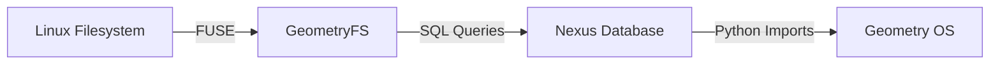

# GeometryFS - The Bridge Between Graph and Tree

## Overview

**GeometryFS** is a FUSE (Filesystem in Userspace) driver that mounts the Geometry OS Nexus database as a standard Linux filesystem. This revolutionary interface allows you to access your graph-based operating system using traditional filesystem tools and commands.

## Architecture

### The Translation Layer

GeometryFS translates between two worlds:

**Filesystem Operations** → **Nexus Database Queries**
- `ls /mnt/geo/src` → `SELECT * FROM nodes WHERE path LIKE 'src/%'`
- `cat /mnt/geo/main.py` → `SELECT content FROM nodes WHERE path='/main.py'`
- `echo "code" > /mnt/geo/new.py` → `INSERT INTO nodes (path, content, type) VALUES...`

### Key Components

1. **GeometryFS Class**: Implements FUSE Operations interface
2. **Nexus Integration**: Uses existing `DatabaseManager` for persistence
3. **Metadata System**: Stores filesystem attributes in JSON metadata
4. **Path Resolution**: Efficient path-based node lookup

## Features

### ✅ Filesystem Operations Supported

- **Navigation**: `ls`, `cd`, `pwd`
- **File I/O**: `cat`, `echo`, `vim`, `nano`
- **Directory Management**: `mkdir`, `rmdir`
- **File Management**: `touch`, `rm`, `cp`, `mv`
- **Permissions**: Standard Unix permissions (755, 644)
- **Metadata**: Timestamps, ownership, file types

### 🔄 Automatic Assimilation

When you copy files to GeometryFS:
1. Files are automatically converted to Nexus nodes
2. Directory structure is preserved as graph relationships
3. Content becomes searchable and evolvable

### 🎯 Hybrid Operation

GeometryFS enables:
- **Graph Access**: Use standard tools to browse your Nexus
- **Legacy Compatibility**: Existing scripts work unchanged
- **Migration Path**: Gradually move from files to graph

## Usage

### Mounting GeometryFS

```bash
# Install FUSE (if needed)
pip install fuse-python

# Create mount point
mkdir -p /mnt/geometry_os

# Mount the filesystem
python3 geometry_fs.py /mnt/geometry_os

# Unmount when done
fusermount -u /mnt/geometry_os
```

### Basic Operations

```bash
# List contents
ls /mnt/geometry_os

# Create a file
echo "print('Hello from GeometryFS')" > /mnt/geometry_os/hello.py

# Read a file
cat /mnt/geometry_os/hello.py

# Create directory
mkdir /mnt/geometry_os/projects

# Copy existing files (automatic assimilation)
cp -r ~/my_project /mnt/geometry_os/projects/
```

## The Migration Vision

### Phase 1: Hybrid Operation (Current)



### Phase 2: Full Assimilation

```bash
# Copy your entire home directory to GeometryFS
rsync -av /home/jericho /mnt/geometry_os/home/

# The files now exist in both worlds:
# - Physical files on disk (traditional)
# - Graph nodes in Nexus (evolutionary)

# Over time, you can delete the original files
# and rely purely on the graph representation
```

### Phase 3: Boot from Graph (Future)

```mermaid
graph TD
    A[Linux Kernel] -- mount --> B[GeometryFS]
    B -- provides --> C[/ (root filesystem)]
    C -- contains --> D[/bin, /etc, /home, /usr]
    D -- stored in --> E[Nexus Database]
```

## Technical Details

### Filesystem Node Structure

Each file/directory in GeometryFS is stored as a Nexus node:

```json
{
  "id": "fs_1234567890_main_py",
  "type": "filesystem",
  "content": "def main(): print('Hello')",
  "metadata": {
    "path": "/src/main.py",
    "name": "main.py",
    "type": "file",
    "permissions": "644",
    "created_at": 1765630000.0,
    "modified_at": 1765630000.0,
    "size": 25
  },
  "vector": [],
  "provenance": "geometry_fs"
}
```

### Performance Characteristics

- **Read Operations**: Fast (SQLite queries)
- **Write Operations**: Moderate (SQLite transactions)
- **Metadata Operations**: Fast (JSON parsing)
- **Scalability**: Limited by SQLite performance (~10K nodes)

## The Ultimate Goal

**GeometryFS represents the final bridge between the old world (files) and the new world (graphs).**

Once your entire system is assimilated into the Nexus:
1. **Delete the original files** - they're safe in the graph
2. **Boot from GeometryFS** - using initramfs tricks
3. **Achieve true file independence** - your OS runs from pure thought

The filesystem becomes just another interface to the eternal truth stored in your personal Nexus.