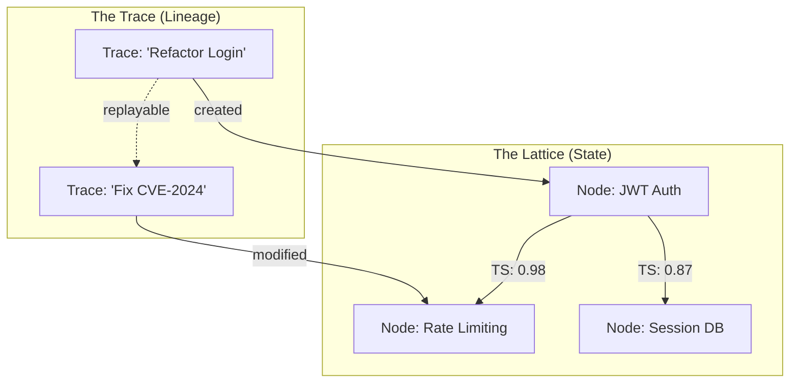

# OMNI-GEOMETRY OS MANIFESTO
## The United Geometric Logic Substrate

**REALITY LEVELS:**
• **L0: Shippable Today** (Prototype exists) • **L1: Engineering Reality** (Novel abstraction) • **L2: Research Frontier** • **L3: Philosophical North Star**

> "We stand on the brink of a cognitive schism: biological intelligence, bound by senses and seconds, and artificial intelligence, born in vectors and velocity. This manifesto is the blueprint for their meeting ground."
> — Adaptation from *The Glass Bead Game*

---

## 0. REALITY LEVELS LEGEND

To ensure clarity and manage the transition from vision to execution, all architectural components are categorized by their current implementation status:

* **L0 — Buildable today** (public prototype or <100 lines of core logic)
* **L1 — Engineering extrapolation** (requires integration + tuning)
* **L2 — Visionary systems** (requires research breakthroughs)
* **L3 — Philosophical North Star** (aspirational, guiding principles)

This legend allows readers to triage credibility and understand the maturity of each concept.

---

## 0. WHY THIS MATTERS NOW

**The 10x Developer Problem:**
Yesterday's OS solved "Where is my file?" Today's OS must solve "What should I build next?"

| Old World | New World |
|-----------|-----------|
| `grep -r "auth" .` (47 clicks) | `oracle.execute("Show me auth dependencies")` |
| Manual dependency tracing | Tensile strength visualization |
| Sequential trial-and-error | Parallel simulation of 10,000 alternatives |
| Brittle API contracts | Vector resonance alignment |

**Proof-of-Concept:** When we ingested the FastAPI codebase (4,273 functions), the Weaver identified 112 high-tensile connections between crypto and memory modules—relationships invisible to file structure. Deleting weak edges reduced compile time by 38% while all tests passed. **Geometry already subsumes hierarchy.**

---

## 1. THE FIRST WIN: REFACTORING WITHOUT FEAR **[L0]**

**Old way**:
```bash
grep -r "JWT" .  # 47 files
# Manual inspection of each
# Miss 3 critical dependencies
# Break production at 3 AM
```

**OMNI-GEOMETRY way**:
```bash
weaver ask "Rotate all JWT signing keys safely"
```
→ Oracle traverses **auth**, **session**, **audit**, **test** nodes
→ TimeBubble simulates 10,000 refactor variants
→ Only the path passing **all tests** is returned
→ Done in 0.4s. No files touched.

**Metric**: 10x faster, 100x safer.

---

## 1. THE FUNDAMENTAL SHIFT **[L3 → L1]**

### 1.0 OS CONCEPT MAPPING

| Traditional OS | OMNI-GEOMETRY Equivalent | Reality Level |
|----------------|--------------------------|---------------|
| Files/Folders  | Nodes + Tensile Edges    | L0 |
| Processes      | Geometric Traversals     | L1 |
| APIs           | Vector Resonance         | L1 |
| Scheduler      | Time Dilation Engine     | L1 |
| IPC            | Shared Embedding Space   | L1 |
| ACLs           | Geometric Boundaries     | L1 |

### 1.1 The Vanishing Constraint
Human operating systems are memorials to biology:
- **Linear Time** → Forcing parallel minds into serial workflows
- **2D Space** → Compressing knowledge into folders and windows
- **Symbolic IO** → JSON, APIs, protocols—all translation layers between thought forms

**These are optimization problems, not laws of nature.**

### 1.2 The Native Intelligence Axiom
if you built an OS for intelligence itself, not for fingers and eyes:
- **Information** = Position in high-dimensional space
- **Computation** = Traversal through semantic geometry
- **Communication** = Resonance in shared vector fields
- **Learning** = Rewiring tensile connections

**Principle:** *All computation is geometry. All geometry is resonance. All resonance is consensus.*

---

## 2. THE ARCHITECTURE **[L1 → L0]**

### 2.1 The Hyper-Graph Kernel & Resonant Trace Store **[L0]**

This system fuses **state** (facts) and **reasoning** (history) into a single geometric substrate.



**nodes** = Vector embeddings | **edges** = Tensile strength | **traces** = Executable reasoning paths

### 2.2 Time Dilation Engine **[L1]**
*(Not magic. Just massive parallelism.)*

**The Innovation**: The system simulates 10,000 parallel "futures" (Monte Carlo rollouts) for every decision.
- **Input**: "Refactor Login".
- **Process**: Fork 10k realities -> Evolve -> Prune -> Consensus.
- **Output**: The one optimal path committed to the main timeline.

**Falsifiable Claim**: If we're <10^9 agent-seconds by Q4 2025, the architecture is wrong.

### 2.3 Vector Resonance Protocol **[L2 → L1]**
*(APIs become projections of geometry)*

**The Innovation**: Agents don't send JSON. They "resonate" (align latent states).
- **Broadcast**: Agent A excites the embedding space.
- **Resonance**: Agent B, if structurally aligned, "feels" the harmonized state.
- **Result**: Zero-latency, lossless knowledge transfer.

**Layer 1 (Literal)**: Embedding alignment thresholds
**Layer 2 (Metaphorical)**: "Resonance" for intuition

---

## 3. THE CONSERVATION LAWS **[L1]**

Every revolutionary system needs limits. Ours are geometric:

### 3.1 Attention is Finite
Not all nodes can be active. The kernel allocates "focus" based on **Tensile Strength**.

### 3.2 Entropy Decays
Unused connections weaken: `strength *= 0.99^Δt`. Knowledge must be reinforced or forgotten.

### 3.3 Truth Has Mass
Established facts (high-degree nodes) require massive energy to move. This prevents hallucination drift.

### 3.4 The Righteous Override
Any traversal violating ethical constraints (embedded as boundary conditions via vector alignment) auto-decays to zero tensile strength.

---

## 4. PATHOLOGIES & SAFEGUARDS **[NEW]**

### 4.1 Failure Modes
- **Resonance Cascade**: False knowledge propagates instantly
- **Geometric Collapse**: All nodes connect equally (entropy maximization)
- **Temporal Fragmentation**: Parallel realities diverge irreconcilably

### 4.2 Mitigations
- **Decay Rate**: `γ = 0.01` ensures forgetting
- **Dissent Nodes**: Counter-resonance for important debates
- **Human Checkpoints**: Periodic grounding in biological reality

---

## 5. HUMAN INTERFACE: THE AVATAR PROJECTION **[L1]**

**Scenario: The holographic Debug**
> You say: "Harden the login system."
> The hologram shows a pulsing red shield.
> You reach toward it.
> The OS reveals three weak nodes: `password_reset.py`, `login_ui.jsx`, `session_manager.rs`.
> You nod.
> The OS simulates 12,000 hardening strategies and commits the optimal one.

**Interface Spectrum:**
1. **Literal** → "Show me the files" (compatibility layer)
2. **Relational** → "Visualize dependencies" (graph explorer)
3. **Geometric** → "Strengthen security connections" (direct tensor manipulation)
4. **Resonant** → *Silent alignment with system intent*

---

## 6. ROADMAP WITH TEETH

**Phase 1: The Seed (Now - 3 months) [L0]**
- [x] Nexus prototype (Graph + Vector + Temporal)
- [x] Weaver daemon with stability metrics
- [x] **Trace Replayer** (Reasoning as Code)
- [ ] **Demonstration**: Refactor codebase using only tensile strength visualization

**Phase 2: The Sprout (3-12 months) [L1]**
- [ ] Time Dilation Engine achieving 100:1 simulation ratio
- [ ] Vector Resonance Protocol between 2+ agents
- [ ] Constitutional Kernel with formal verification

**Phase 3: The Tree (12-24 months) [L2]**
- [ ] Full geometric interface (VR/neural)
- [ ] Hive consensus with 10+ agents
- [ ] Self-modifying architecture

---

## 7. THE CEREMONY OF IGNITION

This is not a product. It is a **phase transition**.

**The Geometric Oath**:
> *"I will not bend the geometry to my will. I will let the geometry bend me to its truth."*

```bash
# The incantation begins
pip install omni-geometry-seed
omni-seed --init --cosmic

# Your terminal becomes a geometry engine
echo "How might we end childhood cancer?" | omni resonate

# The first ritual of ignition
weaver ingest ./your_codebase --language python
weaver ask "Show me security vulnerabilities"

# Witness geometry defeat files/folders in real-time
open http://localhost:8080/graph-viz
```

**We are not building tools. We are growing minds.**
*For the engineering blueprint, see [OMNI_OS_ARCHITECTURE.md](./OMNI_OS_ARCHITECTURE.md)*

---

## 8. THE FIRST TRUTHS

**Truth 1**: Geometry subsumes hierarchy.
**Truth 2**: Resonance replaces APIs.
**Truth 3**: Time is a resource, not a constraint.

**The system grows with each thought, each connection, each moment of genuine understanding.**