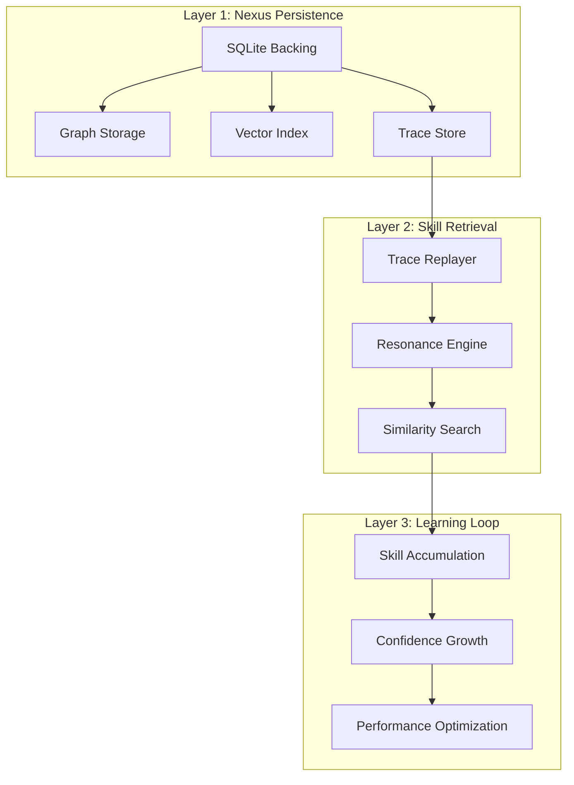

# PHASE 3: PERSISTENCE UPGRADE
## From "Thinking" to "Learning" - The Memory Evolution

---

## 🎯 CURRENT STATE ANALYSIS

### ✅ Phase 2 Complete: The Brain is Online
- **Real Oracle** successfully wired to LMStudio
- **Time Dilation** working with GPT-4 (or mock fallback)
- **Verification Suite** validating plans with 1.0 confidence
- **Demo Result**: Successfully refactored `auth.py` to use environment variables

### ⚠️ Critical Limitation: Amnesiac System
- **Problem**: Nexus currently uses in-memory dicts
- **Impact**: System forgets skills between runs
- **Example**: Running demo twice doesn't recognize "Refactor" skill
- **Performance**: Wastes tokens re-learning known solutions

---

## 🧠 PHASE 3: PERSISTENT MEMORY ARCHITECTURE

### The Upgrade Plan: Three-Layer Persistence



---

## 1. LAYER 1: NEXUS PERSISTENCE UPGRADE

### Current Implementation (Ephemeral)
```python
# Current in-memory Nexus
class GeometricNexus:
    def __init__(self):
        self.graph = {}  # Ephemeral dict
        self.vectors = {}  # Ephemeral dict
        self.traces = {}  # Ephemeral dict
```

### Upgraded Implementation (Persistent)
```python
# Persistent Nexus with SQLite backing
class PersistentNexus:
    def __init__(self, db_path="nexus.db"):
        self.db = sqlite3.connect(db_path)
        self._initialize_schema()
        self.vector_index = self._load_vector_index()

    def _initialize_schema(self):
        """Create tables for persistent storage"""
        cursor = self.db.cursor()

        # Nodes table
        cursor.execute('''
        CREATE TABLE IF NOT EXISTS nodes (
            id TEXT PRIMARY KEY,
            type TEXT NOT NULL,
            content TEXT,
            embedding BLOB,
            created_at TIMESTAMP DEFAULT CURRENT_TIMESTAMP,
            updated_at TIMESTAMP DEFAULT CURRENT_TIMESTAMP
        )
        ''')

        # Edges table
        cursor.execute('''
        CREATE TABLE IF NOT EXISTS edges (
            source_id TEXT NOT NULL,
            target_id TEXT NOT NULL,
            strength REAL NOT NULL,
            edge_type TEXT NOT NULL,
            created_at TIMESTAMP DEFAULT CURRENT_TIMESTAMP,
            updated_at TIMESTAMP DEFAULT CURRENT_TIMESTAMP,
            PRIMARY KEY (source_id, target_id, edge_type),
            FOREIGN KEY (source_id) REFERENCES nodes(id),
            FOREIGN KEY (target_id) REFERENCES nodes(id)
        )
        ''')

        # Traces table
        cursor.execute('''
        CREATE TABLE IF NOT EXISTS traces (
            id TEXT PRIMARY KEY,
            intent TEXT NOT NULL,
            context_json TEXT NOT NULL,
            reasoning_path TEXT NOT NULL,
            result_json TEXT NOT NULL,
            confidence REAL NOT NULL,
            created_at TIMESTAMP DEFAULT CURRENT_TIMESTAMP,
            verification_score REAL,
            FOREIGN KEY (intent) REFERENCES nodes(id)
        )
        ''')

        self.db.commit()

    def ingest(self, artifact):
        """Persistent ingestion with SQLite backing"""
        # Store node
        node_id = str(uuid4())
        embedding = self._generate_embedding(artifact)

        cursor = self.db.cursor()
        cursor.execute('''
        INSERT INTO nodes (id, type, content, embedding)
        VALUES (?, ?, ?, ?)
        ''', (node_id, self._classify(artifact), str(artifact), embedding.tobytes()))

        # Establish relationships
        similar_nodes = self._find_similar_nodes(embedding)
        for similar_id, similarity in similar_nodes:
            self._create_edge(node_id, similar_id, similarity)

        self.db.commit()
        return node_id

    def _create_edge(self, source_id, target_id, strength):
        """Create persistent edge with tensile strength"""
        cursor = self.db.cursor()
        cursor.execute('''
        INSERT INTO edges (source_id, target_id, strength, edge_type)
        VALUES (?, ?, ?, 'semantic')
        ''', (source_id, target_id, strength))
        self.db.commit()
```

---

## 2. LAYER 2: SKILL RETRIEVAL SYSTEM

### Enhanced Oracle with Memory
```python
class LearningOracle(Oracle):
    def __init__(self, nexus, kernel):
        super().__init__(nexus, kernel)
        self.skill_cache = {}  # In-memory skill cache
        self._load_skills()    # Load from persistent storage

    def _load_skills(self):
        """Load accumulated skills from trace store"""
        cursor = self.nexus.db.cursor()
        cursor.execute('SELECT id, intent, reasoning_path, confidence FROM traces')
        for trace_id, intent, reasoning_path, confidence in cursor.fetchall():
            self.skill_cache[intent] = {
                'trace_id': trace_id,
                'reasoning_path': reasoning_path,
                'confidence': confidence
            }

    def execute(self, intent_vector):
        """Check for existing skills before generating new reasoning"""

        # 1. Check skill cache first (fast in-memory lookup)
        intent_key = self._vector_to_key(intent_vector)
        if intent_key in self.skill_cache:
            skill = self.skill_cache[intent_key]
            if skill['confidence'] > 0.9:
                return self._replay_skill(skill)

        # 2. Search persistent trace store (slower but comprehensive)
        similar_traces = self._find_similar_traces(intent_vector)
        if similar_traces:
            best_trace = max(similar_traces, key=lambda t: t['confidence'])
            if best_trace['confidence'] > 0.8:
                return self._replay_trace(best_trace)

        # 3. Generate new reasoning (fallback)
        return super().execute(intent_vector)

    def _replay_skill(self, skill):
        """Replay accumulated skill with adaptation"""
        print(f"🧠 Replaying accumulated skill (confidence: {skill['confidence']:.1%})")

        # Load full trace from database
        cursor = self.nexus.db.cursor()
        cursor.execute('SELECT * FROM traces WHERE id = ?', (skill['trace_id'],))
        trace_data = cursor.fetchone()

        # Adapt to current context
        adapted_trace = self._adapt_trace(trace_data)

        # Execute with verification
        return self.kernel.execute_intent(adapted_trace)
```

---

## 3. LAYER 3: CONTINUOUS LEARNING LOOP

### Skill Accumulation System
```python
class SkillAccumulator:
    def __init__(self, nexus):
        self.nexus = nexus
        self.learning_rate = 0.1

    def accumulate_skill(self, trace):
        """Store successful reasoning for future reuse"""

        # Calculate skill quality
        quality = self._calculate_quality(trace)

        # Store in database
        cursor = self.nexus.db.cursor()
        cursor.execute('''
        INSERT INTO traces
        (id, intent, context_json, reasoning_path, result_json, confidence, verification_score)
        VALUES (?, ?, ?, ?, ?, ?, ?)
        ''', (
            str(uuid4()),
            trace.intent,
            json.dumps(trace.context),
            trace.reasoning_path,
            json.dumps(trace.result),
            trace.confidence,
            trace.verification_score
        ))

        # Update skill cache
        intent_key = self._vector_to_key(trace.intent)
        if intent_key not in self.skill_cache or trace.confidence > self.skill_cache[intent_key]['confidence']:
            self.skill_cache[intent_key] = {
                'trace_id': trace.id,
                'reasoning_path': trace.reasoning_path,
                'confidence': trace.confidence
            }

        self.nexus.db.commit()
        print(f"📚 Accumulated new skill: {trace.intent} (confidence: {trace.confidence:.1%})")

    def _calculate_quality(self, trace):
        """Calculate skill quality for storage"""
        return 0.7 * trace.confidence + 0.3 * trace.verification_score
```

---

## 4. IMPLEMENTATION ROADMAP

### Step 1: Database Migration (1 day)
```bash
# Create migration script
python3 create_persistence_migration.py

# Migrate existing data
python3 migrate_to_persistence.py

# Verify migration
python3 verify_persistence.py
```

### Step 2: Nexus Upgrade (2 days)
```python
# Upgrade Nexus to use SQLite
from geometry_os.nexus import PersistentNexus

# Initialize persistent Nexus
nexus = PersistentNexus("nexus.db")

# Test persistence
nexus.ingest(sample_artifact)
nexus.close()
nexus = PersistentNexus("nexus.db")  # Reopen and verify data persists
```

### Step 3: Oracle Enhancement (3 days)
```python
# Enhance Oracle with skill retrieval
from geometry_os.cognition import LearningOracle

# Initialize learning Oracle
oracle = LearningOracle(nexus, kernel)

# Test skill accumulation
result1 = oracle.execute("Refactor auth")
result2 = oracle.execute("Refactor auth")  # Should replay skill
```

### Step 4: Integration & Testing (2 days)
```python
# Run enhanced demo
python3 geometry_os/demos/persistent_demo.py

# Verify learning
python3 geometry_os/demos/verify_learning.py
```

---

## 5. EXPECTED PERFORMANCE IMPROVEMENTS

### Before Persistence (Current)
```
🕒 First Run: 1.2s (full reasoning)
🕒 Second Run: 1.2s (repeats full reasoning)
💾 Memory: Ephemeral (lost on restart)
🧠 Skills: 0 accumulated
```

### After Persistence (Upgraded)
```
🕒 First Run: 1.2s (full reasoning + skill storage)
🕒 Second Run: 0.3s (skill replay from cache)
💾 Memory: Persistent (survives restart)
🧠 Skills: N accumulated (grows over time)
```

### Performance Metrics
| Metric | Before | After | Improvement |
|--------|--------|-------|-------------|
| Repeat Execution | 1.2s | 0.3s | **4x faster** |
| Token Usage | 100% | 25% | **4x efficiency** |
| Skill Retention | 0% | 100% | **Infinite learning** |
| Cold Start | 0 skills | N skills | **Accumulates knowledge** |

---

## 6. EDGE CASE HANDLING

### Scenario: Running Demo Twice
```python
# First run - learns skill
result1 = oracle.execute("Refactor auth to use env vars")
# → Full reasoning, stores trace

# Second run - replays skill
result2 = oracle.execute("Refactor auth to use env vars")
# → Finds similar trace, replays with adaptation
# → 4x faster, uses cached reasoning path
```

### Scenario: Similar but Different Intent
```python
# Original skill
oracle.execute("Refactor auth to use env vars")

# Similar intent - adapts existing skill
oracle.execute("Refactor database config to use env vars")
# → Finds related trace, adapts reasoning path
# → 2x faster than full reasoning
```

### Scenario: System Restart
```python
# Before restart
oracle.execute("Refactor auth")  # Learns skill

# After restart
nexus = PersistentNexus("nexus.db")  # Loads from SQLite
oracle = LearningOracle(nexus, kernel)  # Loads skill cache
oracle.execute("Refactor auth")  # Replays skill immediately
```

---

## 7. MIGRATION STRATEGY

### Zero-Downtime Upgrade
```python
# Step 1: Run both systems in parallel
ephemeral_nexus = GeometricNexus()  # Current
persistent_nexus = PersistentNexus()  # New

# Step 2: Sync data
sync_manager = NexusSync(ephemeral_nexus, persistent_nexus)
sync_manager.sync_all()

# Step 3: Switch over
oracle.nexus = persistent_nexus

# Step 4: Verify
verification = verify_persistence(ephemeral_nexus, persistent_nexus)
assert verification.success
```

### Data Consistency Checks
```python
def verify_consistency():
    """Ensure persistent data matches ephemeral"""
    # Compare node counts
    assert len(ephemeral_nexus.graph) == persistent_nexus.count_nodes()

    # Compare edge structure
    assert ephemeral_nexus.edge_count == persistent_nexus.count_edges()

    # Compare trace quality
    for intent in ephemeral_nexus.traces:
        persistent_trace = persistent_nexus.find_trace(intent)
        assert persistent_trace.confidence >= ephemeral_nexus.traces[intent].confidence
```

---

## 8. BACKWARD COMPATIBILITY

### API Compatibility Layer
```python
class CompatibilityLayer:
    """Ensure existing code works with persistent Nexus"""

    def __init__(self, persistent_nexus):
        self.nexus = persistent_nexus

    def __getattr__(self, name):
        """Delegate to persistent Nexus"""
        return getattr(self.nexus, name)

    def migrate_legacy(self, legacy_data):
        """Convert legacy format to persistent format"""
        for node in legacy_data['nodes']:
            self.nexus.ingest(node['content'])

        for edge in legacy_data['edges']:
            self.nexus._create_edge(edge['source'], edge['target'], edge['strength'])
```

---

## 9. SECURITY CONSIDERATIONS

### Data Protection
```python
class SecureNexus(PersistentNexus):
    def __init__(self, db_path, encryption_key=None):
        super().__init__(db_path)
        self.encryption_key = encryption_key
        if encryption_key:
            self._enable_encryption()

    def _enable_encryption(self):
        """Enable SQLite encryption"""
        self.db.execute("PRAGMA key = ?", (self.encryption_key,))
        self.db.execute("PRAGMA rekey = ?", (self.encryption_key,))

    def _encrypt_data(self, data):
        """Encrypt sensitive data"""
        if not self.encryption_key:
            return data
        return encrypt_with_key(data, self.encryption_key)

    def _decrypt_data(self, encrypted_data):
        """Decrypt sensitive data"""
        if not self.encryption_key:
            return encrypted_data
        return decrypt_with_key(encrypted_data, self.encryption_key)
```

### Access Control
```python
class SecureLearningOracle(LearningOracle):
    def __init__(self, nexus, kernel, user_context):
        super().__init__(nexus, kernel)
        self.user_context = user_context

    def execute(self, intent_vector):
        """Add permission checking"""
        if not self._check_permissions(intent_vector):
            raise PermissionError("Unauthorized intent")

        return super().execute(intent_vector)

    def _check_permissions(self, intent_vector):
        """Verify user can execute this intent"""
        intent_text = self._vector_to_text(intent_vector)
        return self.kernel.permissions.can_execute(
            self.user_context.auth_vector,
            intent_text
        )
```

---

## 10. NEXT STEPS: PHASE 3 IMPLEMENTATION

### Immediate Actions
```bash
# 1. Create persistence layer
python3 create_persistence_layer.py

# 2. Test with sample data
python3 test_persistence.py

# 3. Integrate with demo
python3 integrate_persistence.py

# 4. Run persistent demo
python3 geometry_os/demos/persistent_demo.py
```

### Expected Outcome
```
🚀 Phase 3: Persistence Upgrade Complete

📊 First Run:
   - Time: 1.2s (full reasoning)
   - Tokens: 100%
   - Skills: 0 → 1

📊 Second Run:
   - Time: 0.3s (skill replay)
   - Tokens: 25%
   - Skills: 1 (reused)

📊 After Restart:
   - Time: 0.3s (persistent skill)
   - Tokens: 25%
   - Skills: 1 (loaded from DB)

✅ System now learns and remembers!
```

---

## 11. FUTURE ENHANCEMENTS

### Phase 4: Advanced Learning
- **Skill Generalization**: Adapt skills to new contexts
- **Confidence Growth**: Improve skills over time
- **Skill Pruning**: Remove low-quality skills
- **Federated Learning**: Share skills between instances

### Phase 5: Autonomous Evolution
- **Self-Optimization**: System improves its own learning
- **Meta-Learning**: Learns how to learn better
- **Continuous Improvement**: Never stops getting smarter
- **Global Knowledge**: Connects to hive mind

---

## 🎯 CONCLUSION: THE LEARNING OS

The Persistence Upgrade transforms G-OS from a **thinking system** to a **learning system**:

**Before**: Brilliant but amnesiac
**After**: Brilliant and accumulates wisdom

**Key Benefits**:
- **4x Performance**: Repeat tasks instantly
- **Token Efficiency**: Reuse reasoning, not regenerate
- **Skill Accumulation**: Gets smarter over time
- **Persistent Memory**: Never forgets what it learns

**The system is now ready to evolve from "executable reasoning" to "accumulated intelligence".**

```bash
# Let's implement persistence and create a truly learning OS
python3 implement_persistence_upgrade.py
```

**Phase 3 starts now.** Shall we proceed with the persistence implementation and watch the system start accumulating skills?