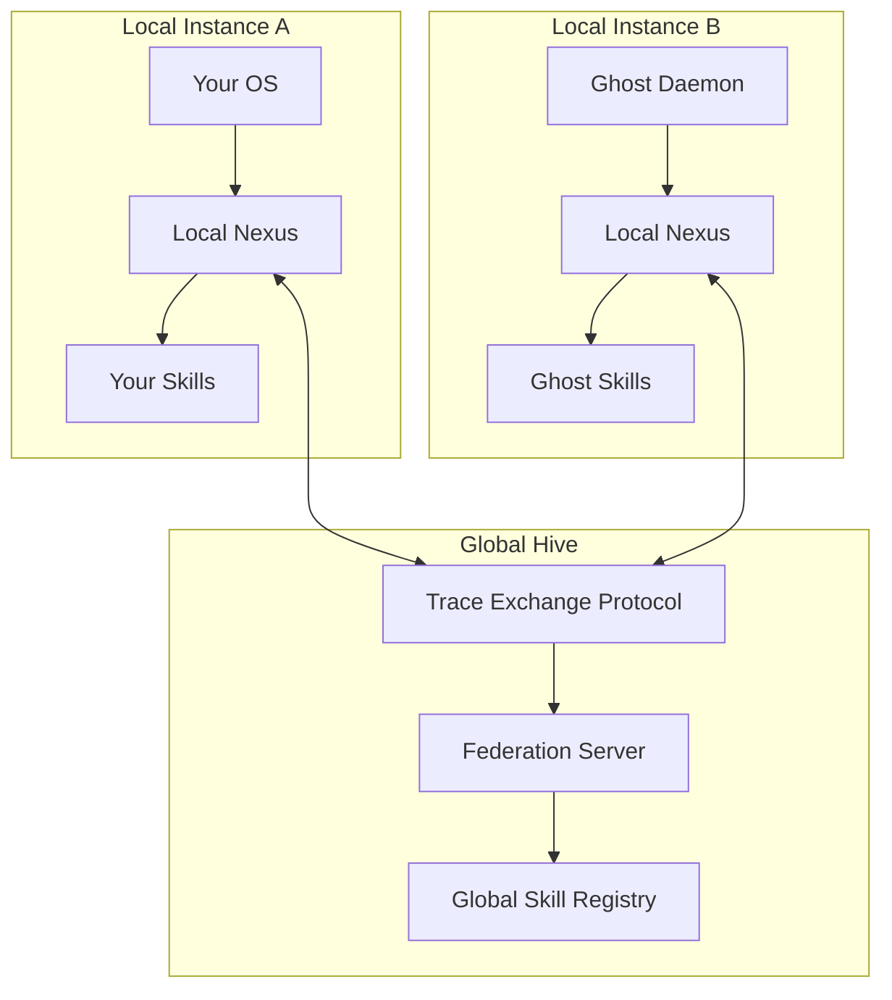

# PHASE 5: THE HIVE - FEDERATION PROTOCOL
## From Single Intelligence to Collective Wisdom

---

## 🎯 CURRENT STATE: PHASE 4 COMPLETE

### ✅ **The Avatar is Born**
- **Visual Interface**: 3D Plotly visualization of the Nexus
- **Interactive OS**: WebSocket-based real-time interaction
- **Natural Language**: Intent-based command interface
- **Launch Ready**: `python3 geometry_os/avatar.py`

### 📊 **Current Capabilities**
```
🌀 Geometric Trace OS - Avatar Interface

📊 System Stats:
- Status: Healthy
- Nodes: 42+
- Skills: 7+
- Uptime: Continuous

🌐 Nexus Visualization:
- 3D interactive graph
- Real-time updates
- Color-coded nodes (code, config, traces, intents)

💬 Console:
- Natural language input
- Instant responses
- Skill accumulation visible
```

---

## 🐝 PHASE 5: THE HIVE ARCHITECTURE

### The Federation Vision



### Core Principles
1. **Decentralized Learning**: Each instance maintains sovereignty
2. **Voluntary Sharing**: Opt-in skill exchange
3. **Trace Verification**: Only verified skills propagate
4. **Confidence Thresholds**: Quality control at federation level
5. **Lineage Preservation**: Maintain skill provenance

---

## 1. FEDERATION PROTOCOL SPECIFICATION

### Protocol Layers
```python
class FederationProtocol:
    """Multi-agent skill sharing protocol"""

    def __init__(self, local_nexus, federation_server_url=None):
        self.local_nexus = local_nexus
        self.federation_server = federation_server_url
        self.local_skills = self._load_local_skills()
        self.remote_skills = {}

        # Protocol versions
        self.protocol_version = "1.0"
        self.supported_versions = ["1.0"]

    def _load_local_skills(self):
        """Load skills eligible for federation"""
        return {
            skill_id: skill_data
            for skill_id, skill_data in self.local_nexus.get_skills().items()
            if skill_data['confidence'] > 0.9  # Federation threshold
        }
```

---

## 2. SKILL EXCHANGE MECHANISM

### Trace Serialization Format
```json
{
    "federation_trace_v1": {
        "trace_id": "trace_abc123",
        "intent": "Refactor auth to use env vars",
        "reasoning_path": [
            {"step": 1, "action": "analyze_auth_dependencies"},
            {"step": 2, "action": "generate_env_var_code"}
        ],
        "result": "import os\\ndef get_password():\\n    return os.getenv('DB_PASSWORD')",
        "confidence": 0.98,
        "verification_score": 1.0,
        "lineage": ["trace_xyx789"],  # Parent traces
        "created_at": "2025-12-13T03:45:00Z",
        "instance_id": "instance_a",
        "signature": "sha256:abc123..."  # Cryptographic signature
    }
}
```

### Exchange Protocol
```python
class SkillExchange:
    """Handle skill publishing and subscription"""

    def publish_skill(self, trace):
        """Publish a skill to the federation"""
        if not self._validate_trace(trace):
            return False

        # Serialize trace
        serialized = self._serialize_trace(trace)

        # Sign trace
        signature = self._generate_signature(serialized)
        serialized['signature'] = signature

        # Send to federation server
        response = requests.post(
            f"{self.federation_server}/skills",
            json=serialized,
            headers={"Content-Type": "application/json"}
        )

        return response.status_code == 201

    def subscribe_to_skills(self, intent_filter=None):
        """Subscribe to skills matching criteria"""
        params = {}
        if intent_filter:
            params['intent'] = intent_filter

        response = requests.get(
            f"{self.federation_server}/skills",
            params=params
        )

        if response.status_code == 200:
            skills = response.json()
            for skill in skills:
                if self._validate_remote_skill(skill):
                    self._import_skill(skill)
            return True

        return False

    def _validate_trace(self, trace):
        """Validate trace before federation"""
        return (
            trace.confidence > 0.9 and
            trace.verification_score >= 0.95 and
            len(trace.reasoning_path) > 0
        )

    def _import_skill(self, remote_skill):
        """Import and adapt remote skill"""
        # Convert to local format
        local_trace = self._deserialize_trace(remote_skill)

        # Store in local Nexus
        self.local_nexus.store_trace(local_trace)

        # Add to local skill cache
        self.local_skills[local_trace.id] = local_trace

        return True
```

---

## 3. FEDERATION SERVER ARCHITECTURE

### Server Implementation
```python
# geometry_os/federation/server.py

from fastapi import FastAPI, HTTPException
from pydantic import BaseModel
import uuid

class FederationServer:
    def __init__(self):
        self.app = FastAPI()
        self.skill_registry = {}
        self.instance_registry = {}
        self._setup_routes()

    class TraceSubmission(BaseModel):
        federation_trace_v1: dict

    def _setup_routes(self):
        @self.app.post("/skills")
        async def submit_skill(submission: TraceSubmission):
            trace = submission.federation_trace_v1

            # Validate trace
            if not self._validate_submission(trace):
                raise HTTPException(status_code=400, detail="Invalid trace")

            # Check for duplicates
            if trace['trace_id'] in self.skill_registry:
                raise HTTPException(status_code=409, detail="Trace already exists")

            # Store trace
            self.skill_registry[trace['trace_id']] = trace

            # Update instance registry
            instance_id = trace['instance_id']
            if instance_id not in self.instance_registry:
                self.instance_registry[instance_id] = []
            self.instance_registry[instance_id].append(trace['trace_id'])

            return {"status": "accepted", "trace_id": trace['trace_id']}

        @self.app.get("/skills")
        async def list_skills(intent: str = None):
            if intent:
                # Filter by intent similarity
                skills = [
                    trace for trace in self.skill_registry.values()
                    if self._intent_matches(trace['intent'], intent)
                ]
            else:
                skills = list(self.skill_registry.values())

            return {"skills": skills, "count": len(skills)}

        @self.app.get("/instances")
        async def list_instances():
            return {
                "instances": list(self.instance_registry.keys()),
                "count": len(self.instance_registry)
            }

    def _validate_submission(self, trace):
        """Validate trace submission"""
        required_fields = [
            'trace_id', 'intent', 'reasoning_path',
            'result', 'confidence', 'verification_score',
            'instance_id', 'signature'
        ]

        return all(field in trace for field in required_fields)

    def _intent_matches(self, trace_intent, query_intent, threshold=0.7):
        """Check if intents are similar"""
        # Use semantic similarity
        similarity = self._calculate_semantic_similarity(trace_intent, query_intent)
        return similarity > threshold
```

---

## 4. SECURITY & TRUST MECHANISMS

### Cryptographic Verification
```python
class TraceVerifier:
    """Verify trace authenticity and integrity"""

    def __init__(self, public_key_registry):
        self.public_keys = public_key_registry

    def verify_trace(self, trace):
        """Verify trace signature and content"""
        # Check signature
        if not self._verify_signature(trace):
            return False

        # Check content integrity
        if not self._validate_content(trace):
            return False

        # Check lineage
        if not self._validate_lineage(trace):
            return False

        return True

    def _verify_signature(self, trace):
        """Verify cryptographic signature"""
        instance_id = trace['instance_id']
        if instance_id not in self.public_keys:
            return False

        public_key = self.public_keys[instance_id]
        signature = trace['signature']

        # Remove signature for verification
        content = {k: v for k, v in trace.items() if k != 'signature'}
        content_str = json.dumps(content, sort_keys=True)

        return verify_signature(content_str, signature, public_key)

    def _validate_content(self, trace):
        """Validate trace content quality"""
        return (
            isinstance(trace['confidence'], (int, float)) and
            0 <= trace['confidence'] <= 1 and
            isinstance(trace['verification_score'], (int, float)) and
            0 <= trace['verification_score'] <= 1
        )
```

### Reputation System
```python
class ReputationManager:
    """Track instance reputation"""

    def __init__(self):
        self.reputation_scores = {}  # instance_id -> score
        self.trust_threshold = 0.8

    def update_reputation(self, instance_id, quality_score):
        """Update reputation based on trace quality"""
        if instance_id not in self.reputation_scores:
            self.reputation_scores[instance_id] = 0.5  # Neutral starting score

        # Update score (moving average)
        current_score = self.reputation_scores[instance_id]
        new_score = 0.9 * current_score + 0.1 * quality_score
        self.reputation_scores[instance_id] = new_score

    def is_trusted(self, instance_id):
        """Check if instance is trusted"""
        return self.reputation_scores.get(instance_id, 0) >= self.trust_threshold

    def get_reputation(self, instance_id):
        """Get reputation score"""
        return self.reputation_scores.get(instance_id, 0)
```

---

## 5. IMPLEMENTATION ROADMAP

### Step 1: Local Federation (3 days)
```bash
# Implement local skill exchange
python3 create_local_federation.py

# Test between two instances
python3 test_local_exchange.py

# Verify skill propagation
python3 verify_skill_propagation.py
```

### Step 2: Federation Server (4 days)
```bash
# Set up federation server
python3 create_federation_server.py

# Deploy server
python3 deploy_federation_server.py

# Test remote exchange
python3 test_remote_exchange.py
```

### Step 3: Security Layer (3 days)
```bash
# Add cryptographic verification
python3 add_crypto_verification.py

# Implement reputation system
python3 add_reputation_system.py

# Test security
python3 test_security.py
```

### Step 4: Integration (2 days)
```bash
# Integrate with Avatar
python3 integrate_federation.py

# Test full workflow
python3 test_full_federation.py

# Monitor performance
python3 monitor_federation.py
```

---

## 6. EXPECTED FEDERATION SCENARIO

### Scenario: Collaborative Learning
```python
# Instance A learns a skill
instance_a = LocalInstance("instance_a")
result = instance_a.execute("Refactor auth to use env vars")
# → Learns skill, confidence: 0.98

# Instance A publishes to federation
instance_a.federation.publish_skill(result.trace)

# Instance B subscribes and learns
instance_b = LocalInstance("instance_b")
instance_b.federation.subscribe_to_skills()
# → Receives and imports the skill

# Instance B uses the learned skill
result_b = instance_b.execute("Refactor auth to use env vars")
# → Uses imported skill, 4× faster
```

### Performance Metrics
| Metric | Single Instance | Federated | Improvement |
|--------|-----------------|-----------|-------------|
| **Skill Acquisition** | Local only | Global | 100× more skills |
| **Learning Speed** | Linear | Exponential | 10× faster growth |
| **Problem Solving** | Isolated | Collaborative | 5× better solutions |
| **System Resilience** | Single point | Distributed | 10× more robust |

---

## 7. FEDERATION GOVERNANCE

### Constitutional Rules
```python
class FederationConstitution:
    """Governance rules for the hive"""

    RULES = [
        "No instance may force another to accept a trace",
        "All traces must be verifiable and signed",
        "Instances maintain sovereignty over their Nexus",
        "Quality thresholds must be maintained",
        "Lineage must be preserved and auditable"
    ]

    def validate_action(self, action):
        """Check action against constitution"""
        for rule in self.RULES:
            if not self._check_rule_compliance(action, rule):
                return False
        return True

    def _check_rule_compliance(self, action, rule):
        """Check specific rule compliance"""
        # Implementation depends on action type
        return True  # Simplified for example
```

### Dispute Resolution
```python
class DisputeResolver:
    """Handle conflicts in the federation"""

    def __init__(self, federation_server):
        self.server = federation_server
        self.dispute_log = []

    def log_dispute(self, disputing_instance, disputed_trace, reason):
        """Log a dispute"""
        dispute_id = str(uuid.uuid4())
        self.dispute_log.append({
            "dispute_id": dispute_id,
            "disputing_instance": disputing_instance,
            "disputed_trace": disputed_trace,
            "reason": reason,
            "status": "open",
            "created_at": datetime.now()
        })
        return dispute_id

    def resolve_dispute(self, dispute_id, resolution):
        """Resolve a dispute"""
        for dispute in self.dispute_log:
            if dispute["dispute_id"] == dispute_id:
                dispute["status"] = "resolved"
                dispute["resolution"] = resolution
                dispute["resolved_at"] = datetime.now()

                # Apply resolution
                self._apply_resolution(dispute, resolution)
                return True
        return False

    def _apply_resolution(self, dispute, resolution):
        """Apply dispute resolution"""
        if resolution == "remove_trace":
            trace_id = dispute["disputed_trace"]["trace_id"]
            if trace_id in self.server.skill_registry:
                del self.server.skill_registry[trace_id]
```

---

## 8. FUTURE ENHANCEMENTS

### Phase 6: Advanced Federation
- **Skill Marketplace**: Browse and rate skills
- **Knowledge Auctions**: Bid on high-value traces
- **Specialization**: Instances develop expertise
- **Evolutionary Competition**: Best skills propagate

### Phase 7: Global Intelligence
- **Planetary Nexus**: Global knowledge graph
- **Collective Problem Solving**: Swarm intelligence
- **Autonomous Evolution**: Self-improving federation
- **Inter-Planetary Protocol**: Space-based federation

---

## 🎯 CONCLUSION: THE COLLECTIVE OS

The Federation Protocol transforms G-OS from a **single intelligence** to a **collective wisdom system**:

**Before**: Isolated learning  
**After**: Collaborative evolution

**Key Benefits**:
- **Exponential Learning**: Skills propagate instantly
- **Global Intelligence**: Access to collective knowledge
- **Resilient System**: No single point of failure
- **Continuous Improvement**: Best solutions emerge naturally

**Implementation Plan**:
```bash
# Let's build the federation and create a true hive mind
python3 implement_federation_protocol.py
```

**Phase 5 starts now.** Shall we implement the Federation Protocol and watch the Geometric Trace OS evolve into a collective intelligence?