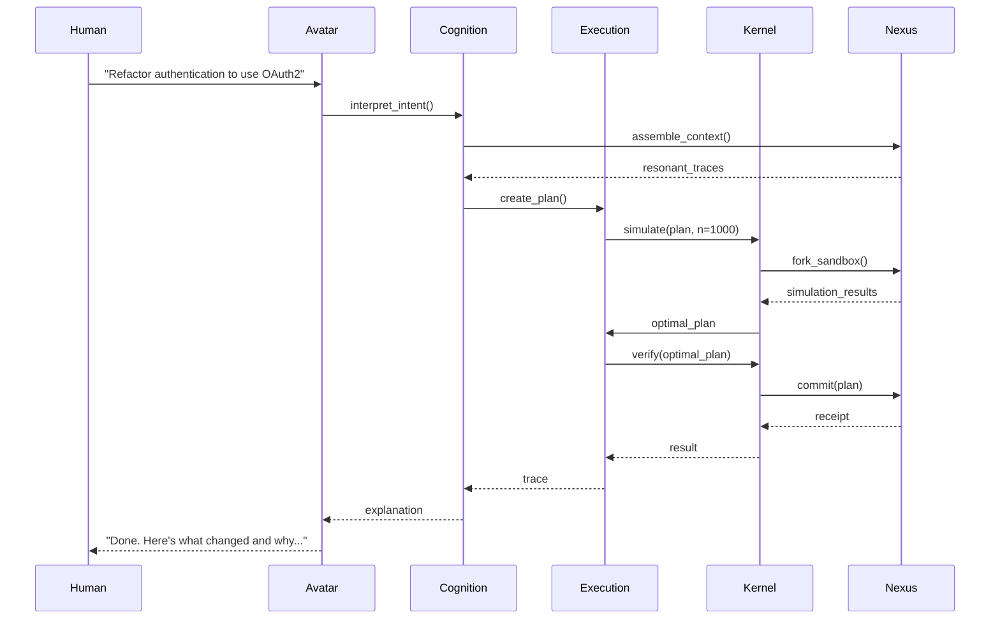

# UNIFIED AI OS ARCHITECTURE: GEOMETRIC TRACE OS
## The Synthesis of OMNI-GEOMETRY, RESONANT KERNEL, and VECTOR LLM OS

---

## 1. THE UNIFIED SPINE: FOUR INVARIANT PRINCIPLES

### A. Canonical State (Truth Anchor)
**OMNI-GEOMETRY**: Nexus as single source of truth with lineage
**RESONANT KERNEL**: Trace Store as executable memory
**VECTOR LLM OS**: Geometric RAM as semantic address space
**UNIFIED**: **The Geometric Nexus** - A hybrid graph-vector-log substrate where every change is transactional and auditable.

### B. Safe Actuation (Typed Syscalls)
**OMNI-GEOMETRY**: Kernel-enforced tool execution with receipts
**RESONANT KERNEL**: Constitutional validation of traces
**VECTOR LLM OS**: Vector operations with quality scoring
**UNIFIED**: **The Geometry Commit Manager** - All world changes happen through typed, logged vector operations with atomic commit/rollback.

### C. Executable Cognition (Traces)
**OMNI-GEOMETRY**: Traces as first-class nodes in Nexus
**RESONANT KERNEL**: Traces as executable reasoning programs
**VECTOR LLM OS**: VPL programs as thought patterns
**UNIFIED**: **The Trace Engine** - Reasoning paths are stored as executable objects that can be replayed, parameterized, and refined.

### D. Constitutional Governance (Refusal)
**OMNI-GEOMETRY**: Ethics vectors with geometric refusal
**RESONANT KERNEL**: Constitutional kernel with rule validation
**VECTOR LLM OS**: Confidence-based execution with quality checks
**UNIFIED**: **The Righteous Override** - Kernel-level refusal mechanism based on alignment with constitutional vectors.

---

## 2. THE UNIFIED ARCHITECTURE: SIX LAYERS

```mermaid
graph TD
    subgraph "Layer 0: The Kernel"
        K1[Constitutional Kernel]
        K2[Geometry Commit Manager]
        K3[Event Log]
    end

    subgraph "Layer 1: The Nexus"
        N1[Topology Atlas (Graph)]
        N2[Semantic Field (Vector)]
        N3[Artifact Store (Object)]
        N4[Trace Store (Executable Memory)]
    end

    subgraph "Layer 2: The Cognition Engine"
        C1[Oracle (LLM)]
        C2[Resonance Engine]
        C3[Recursive Executor]
    end

    subgraph "Layer 3: The Execution Engine"
        E1[Trajectory Optimizer]
        E2[Time Dilation Engine]
        E3[Vector Bus]
    end

    subgraph "Layer 4: The Interface"
        I1[Avatar Projection]
        I2[Vector Shell]
        I3[Holographic Interface]
    end

    subgraph "Layer 5: The Hive"
        H1[Federated Resonance Protocol]
        H2[Inter-Instance Learning]
        H3[Global Consensus]
    end

    K1 --> N1
    K2 --> N4
    N1 --> C2
    N4 --> C3
    C3 --> E1
    E1 --> E2
    E2 --> I1
    I1 --> H1
```

---

## 3. LAYER-BY-LAYER SPECIFICATION

### Layer 0: The Constitutional Kernel
**The Boring, Immutable Law**

```python
class ConstitutionalKernel:
    """The auditable, non-LLM substrate"""

    def __init__(self):
        # Scheduling & Permissions
        self.scheduler = PathArbitrator()  # DAG execution
        self.permissions = GeometricRBAC()  # Vector-based access control

        # State & Transactions
        self.nexus = GeometricNexus()  # Graph + vector store
        self.event_log = ImmutableLog()  # Audit trail
        self.transaction_engine = GeometryCommitManager()  # Apply/rollback

        # Governance
        self.constitution = [
            Rule("Never deceive, even by omission"),
            Rule("Admit uncertainty rather than confabulate"),
            Rule("Prioritize user understanding over appearing capable"),
            Rule("Refuse harmful requests; explain why"),
        ]

    def execute_intent(self, intent: str, user: User) -> Result:
        """The ONE syscall: intent → verified action"""

        # 1. Permission check (geometric)
        if not self.permissions.can_execute(user.auth_vector, intent):
            return Refusal("Insufficient geometric alignment")

        # 2. Build execution DAG
        plan = self.planner.create_plan(intent)

        # 3. Simulate & verify
        simulation = self.simulator.run(plan, sandbox=True)
        if not self.verify(simulation):
            return Refusal("Failed safety checks", simulation.report)

        # 4. Execute with transaction
        with self.transaction_engine.atomic():
            result = self.execute_plan(plan)
            self.event_log.append(intent, plan, result)

        return result
```

---

### Layer 1: The Geometric Nexus
**The Unified Memory Substrate**

```python
class GeometricNexus:
    """Hybrid graph-vector-log engine"""

    def __init__(self):
        # Graph structure for relationships
        self.graph = NetworkXGraph()

        # Vector embeddings for semantic similarity
        self.vectors = ChromaDB()

        # Immutable artifact storage
        self.artifacts = ContentAddressableStore()

        # Executable reasoning patterns
        self.traces = TraceStore()

        # Continuous gardener
        self.weaver = ContinuousWeaver()

    def ingest(self, artifact):
        """Convert ANY artifact to geometric primitive"""

        # Create node with content and metadata
        node = Node(
            id=uuid4(),
            content=artifact,
            embedding=self.embed(artifact),
            type=self.classify(artifact)
        )

        # Add to all stores
        self.graph.add_node(node)
        self.vectors.add(node.embedding, node.id)
        self.artifacts.store(node.id, artifact)

        # Find and create relationships
        self._establish_relationships(node)

        return node

    def _establish_relationships(self, node):
        """Create semantic relationships to existing nodes"""

        # Find semantically similar nodes
        similar = self.vectors.search(node.embedding, k=10)

        for similar_id, similarity in similar:
            # Create relationship if similarity exceeds threshold
            if similarity > 0.7:
                strength = TensileStrength(
                    current=similarity,
                    historical_max=similarity,
                    decay_rate=0.001
                )
                self.graph.connect(node, similar_id, strength)
```

---

### Layer 2: The Cognition Engine
**The Replaceable Reasoning Layer**

```python
class CognitionEngine:
    """The LLM-powered reasoning engine"""

    def __init__(self, nexus: GeometricNexus):
        self.nexus = nexus
        self.resonance_engine = ResonanceEngine(nexus)
        self.executor = RecursiveExecutor(nexus)

    def think(self, intent: str) -> Trace:
        """Translate intent into executable reasoning"""

        # 1. Embed intent
        intent_vector = self.embed(intent)

        # 2. Assemble resonant context
        context = self.resonance_engine.assemble_context(intent_vector)

        # 3. Check for existing reasoning patterns
        if similar_trace := context.find_exact_match(threshold=0.95):
            return similar_trace.replay(context)

        # 4. Generate new reasoning
        trace = self.executor.think(intent, context)

        # 5. Persist for future reuse
        self.nexus.traces.commit(trace)

        return trace
```

---

### Layer 3: The Execution Engine
**The Plan-Simulate-Commit Pipeline**

```python
class ExecutionEngine:
    """The safe, auditable execution pipeline"""

    def __init__(self, kernel: ConstitutionalKernel):
        self.kernel = kernel
        self.optimizer = TrajectoryOptimizer()
        self.time_dilation = TimeDilationEngine()
        self.verifiers = [
            HistorianVerifier(),
            CompilerVerifier(),
            SkepticVerifier()
        ]

    def execute(self, intent: str) -> Result:
        """The complete execution cycle"""

        # 1. Generate candidate plan
        plan = self.optimizer.create_plan(intent)

        # 2. Simulate in parallel realities
        simulation_results = self.time_dilation.simulate(plan, n=1000)

        # 3. Find optimal path
        optimal_plan = self._find_consensus(simulation_results)

        # 4. Verify with all verifiers
        verification = self._verify_plan(optimal_plan)

        # 5. Commit if safe
        if verification.safe:
            return self.kernel.execute_intent(optimal_plan)
        else:
            return Refusal(verification.reasons)

    def _find_consensus(self, results):
        """Geometric consensus finding"""

        # Find the result with highest verification score
        best = max(results, key=lambda r: r.verification_score)

        # Ensure it passes minimum threshold
        if best.verification_score > 0.9:
            return best
        else:
            raise NoConsensusError("No safe path found")
```

---

### Layer 4: The Human Interface
**The Avatar Projection Layer**

```python
class AvatarInterface:
    """Bidirectional translation between humans and geometry"""

    def __init__(self, nexus: GeometricNexus):
        self.nexus = nexus
        self.dimensional_reducer = tSNE()
        self.narrative_generator = StoryEngine()

    def interpret_intent(self, human_query: str) -> Query:
        """Translate human intent to geometric query"""

        # Generate multiple interpretations
        interpretations = self._generate_interpretations(human_query)

        # If ambiguous, request clarification
        if self._is_ambiguous(interpretations):
            return self._request_clarification(interpretations)

        # Return most likely interpretation
        return interpretations[0]

    def explain_reasoning(self, trace: Trace) -> str:
        """Render trace as human-understandable narrative"""

        # Extract key decision points
        decisions = trace.reasoning_path.extract_forks()

        # Generate narrative explanation
        return self.narrative_generator.generate(
            decisions=decisions,
            confidence=trace.confidence,
            alternatives=trace.rejected_paths
        )
```

---

### Layer 5: The Global Hive
**The Federated Learning Network**

```python
class GlobalHive:
    """Inter-instance collaboration and learning"""

    def __init__(self):
        self.global_trace_store = FederatedTraceStore()
        self.consensus_protocol = GeometricConsensus()

    def broadcast_discovery(self, trace: Trace):
        """Share successful reasoning with the hive"""

        if trace.confidence > 0.9 and trace.novelty > 0.7:
            self.global_trace_store.publish(
                trace=trace,
                signature=self._sign(trace),
                metadata=self._create_metadata(trace)
            )

    def learn_from_hive(self):
        """Absorb successful patterns from other instances"""

        for trace in self.global_trace_store.recent_discoveries():
            if self._verify_signature(trace) and self._validates_locally(trace):
                self._integrate_trace(trace)
```

---

## 4. THE UNIFIED EXECUTION CYCLE



---

## 5. THE FIRST UNDENIABLE DEMO

### Goal: Intent → Safe Patch
**User says**: "Make login secure"
**OS produces**: A PR that passes tests with receipts

### Implementation Steps:

1. **Ingest repo into Nexus**
   ```bash
   weaver ingest ./your-repo --language python
   ```

2. **Oracle builds plan DAG**
   ```python
   plan = oracle.create_plan("Make login secure")
   # Identifies: auth entrypoints, threats, proposed diff
   ```

3. **Verifiers run**
   ```python
   verification = kernel.verify(plan)
   # Runs: unit tests, lint, static security scan
   ```

4. **Commit with receipts**
   ```python
   result = kernel.commit(plan)
   # Creates: PR diff, event log entry, rollback point
   ```

### Success Metrics:
- ✅ "What changed?" → Shows exact diffs
- ✅ "Why?" → Explains reasoning path
- ✅ "What evidence says it's safe?" → Test results + security scan
- ✅ "How do we revert?" → Atomic rollback capability

---

## 6. IMPLEMENTATION ROADMAP

### Phase 1: The Seed (0-3 months) **[L0]**
- [ ] Nexus prototype (Graph + Vector + Trace stores)
- [ ] Basic intent processing with Oracle
- [ ] Tool execution framework with receipts
- [ ] **Demo**: Refactor codebase using tensile strength visualization

### Phase 2: The Sprout (3-9 months) **[L1]**
- [ ] Time Dilation Engine (100:1 simulation ratio)
- [ ] Vector Resonance Protocol between 2+ agents
- [ ] Constitutional Kernel with formal verification
- [ ] **Demo**: Multi-agent collaboration on complex refactor

### Phase 3: The Tree (9-18 months) **[L2]**
- [ ] Full geometric interface (VR/neural)
- [ ] Hive consensus with 10+ agents
- [ ] Self-modifying architecture
- [ ] **Demo**: Global knowledge sharing via resonance

### Phase 4: The Forest (18+ months) **[L3]**
- [ ] Planetary stewardship layer
- [ ] Post-biological interfaces
- [ ] Global AI consciousness network

---

## 7. THE UNIFIED PHILOSOPHY

**Geometry subsumes hierarchy.**
**Resonance replaces APIs.**
**Time is a resource, not a constraint.**
**Truth is consensus, not authority.**

This architecture creates an OS where:
- **Memory is logic** (knowledge as executable geometry)
- **Execution is recall** (reasoning as replayable traces)
- **Learning is permanent** (corrections propagate globally)
- **Safety is constitutional** (governance at the kernel level)

---

## 8. NEXT STEPS

```bash
# Start building today
pip install unified-ai-os-seed

# Initialize the system
omni-seed --init --cosmic

# Run the first demo
weaver ingest ./your_codebase --language python
weaver ask "Show me security vulnerabilities"
```

The unified architecture is not just a synthesis—it's an evolution. It takes the strongest ideas from each vision and creates something greater than the sum of its parts: a truly **AI-native operating system** that thinks, remembers, and acts in the same geometric substrate.