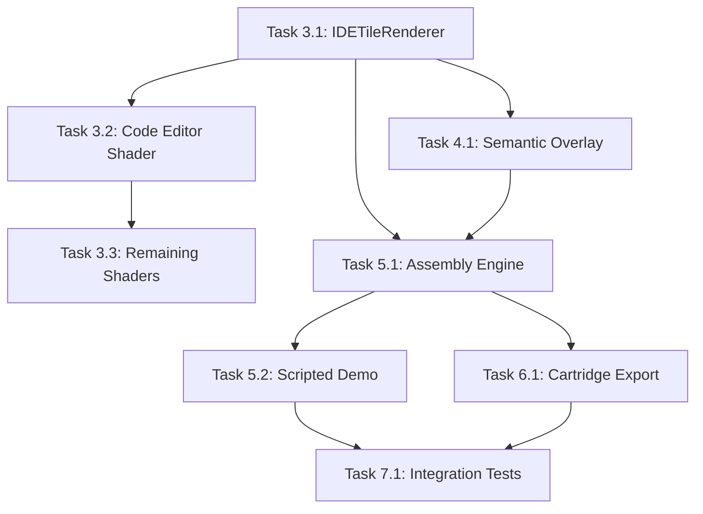

# Neural IDE Visual Builder - Implementation Roadmap

> **Status:** Ready for AI PM processing
> **Created:** 2026-02-14
> **Focus:** Phase J.2 - Complex app in Visual Builder (Tasks 3-7)
> **Plan:** docs/plans/2026-02-14-neural-ide-impl.md

---

## Metadata

```yaml
title: "Neural IDE Visual Builder - Implementation Roadmap"
version: "1.0.0"
last_updated: "2026-02-14"
author: "Geometry OS Team"
status: "ready"
phase: "J.2"
```

---

## Vision Statement

Build a complete Neural IDE using the Visual Builder infrastructure with WGSL-rendered tile components, semantic state tracking, AI-driven assembly, and cartridge export capabilities.

### Goals
1. **Visual Fidelity**: Full WGSL shaders for all 6 IDE tile types
2. **Semantic Intelligence**: Component state tracking and relationship queries
3. **AI Assembly**: Programmatic IDE construction via scripted demo and WebMCP
4. **Portability**: Cartridge export/import for bootable IDE assemblies
5. **Quality**: Integration tests covering full workflow

---

## Prerequisites (Already Complete)

- ✅ Task 1: `ide_tile_types.js` - 6 IDE tile types defined
- ✅ Task 2: `tile_connections.js` - TileConnectionManager with 4 connection types

---

## Task 3: IDE Tile Renderer (WGSL)

**Timeline:** 1-2 days
**Goal:** Render IDE tiles with WGSL shaders on PixiJS canvas
**Priority:** CRITICAL

### 3.1 IDETileRenderer Class

**Description:** Core renderer class that manages tile rendering via WGSL shaders.

**Tasks:**
- [ ] Task 3.1.1: Create IDETileRenderer class with LOD support
- [ ] Task 3.1.2: Implement shader path generation
- [ ] Task 3.1.3: Add tile type validation
- [ ] Task 3.1.4: Implement tile content management

**Success Criteria:**
- Renderer instantiates with PixiJS app and BuilderPanel
- Shader paths generated correctly for all tile types
- LOD calculation works for zoom levels

**File Estimates:**
- `systems/visual_shell/web/ide_tile_renderer.js`: +240 lines
- `systems/visual_shell/web/test_ide_renderer.html`: +90 lines

---

### 3.2 Code Editor WGSL Shader

**Description:** Full WGSL shader for code editor with syntax highlighting and cursor.

**Tasks:**
- [ ] Task 3.2.1: Create WGSL shader with tile_bounds uniform
- [ ] Task 3.2.2: Implement syntax color storage buffer
- [ ] Task 3.2.3: Add cursor rendering with blink
- [ ] Task 3.2.4: Add line number bar

**Success Criteria:**
- Shader has required uniforms (tile_bounds, cursor_pos, text_lines)
- Syntax highlighting renders correctly
- Cursor blinks and moves

**File Estimates:**
- `systems/visual_shell/web/shaders/ide_code_editor.wgsl`: +80 lines

---

### 3.3 Remaining Tile Shaders

**Description:** WGSL shaders for remaining 5 IDE tile types.

**Tasks:**
- [ ] Task 3.3.1: Create file_browser shader (tree structure, icons)
- [ ] Task 3.3.2: Create terminal shader (ANSI colors, scrollback)
- [ ] Task 3.3.3: Create debugger shader (breakpoints, variables)
- [ ] Task 3.3.4: Create output_panel shader (logs, errors)
- [ ] Task 3.3.5: Create semantic_nav shader (graph nodes)

**Success Criteria:**
- All 6 shader files exist and load correctly
- Each shader has appropriate uniforms for its tile type
- Placeholder rendering works

**File Estimates:**
- `systems/visual_shell/web/shaders/ide_file_browser.wgsl`: +60 lines
- `systems/visual_shell/web/shaders/ide_terminal.wgsl`: +55 lines
- `systems/visual_shell/web/shaders/ide_debugger.wgsl`: +30 lines (placeholder)
- `systems/visual_shell/web/shaders/ide_output_panel.wgsl`: +30 lines (placeholder)
- `systems/visual_shell/web/shaders/ide_semantic_nav.wgsl`: +30 lines (placeholder)

---

## Task 4: Semantic IDE Overlay

**Timeline:** 1 day
**Goal:** Track component state and relationships across IDE tiles
**Priority:** HIGH

### 4.1 IDESemanticOverlay Class

**Description:** Semantic layer that tracks tile states and enables queries.

**Tasks:**
- [ ] Task 4.1.1: Create IDESemanticOverlay class
- [ ] Task 4.1.2: Implement component state storage
- [ ] Task 4.1.3: Add semantic index for fast queries
- [ ] Task 4.1.4: Implement definition and related queries
- [ ] Task 4.1.5: Add flow tracing via connection manager

**Success Criteria:**
- Component state can be stored and retrieved
- queryDefinition() finds tiles containing concepts
- traceFlow() returns connection paths
- State exports to JSON for cartridge

**File Estimates:**
- `systems/visual_shell/web/ide_semantic_overlay.js`: +200 lines
- `systems/visual_shell/web/test_semantic_overlay.html`: +70 lines

---

## Task 5: AI Assembly Workflow

**Timeline:** 2 days
**Goal:** AI-driven IDE construction with both scripted demo and WebMCP interface
**Priority:** HIGH

### 5.1 IDEAssemblyEngine Class

**Description:** Core engine for programmatic IDE construction.

**Tasks:**
- [ ] Task 5.1.1: Create IDEAssemblyEngine class
- [ ] Task 5.1.2: Implement placeIDETile with validation
- [ ] Task 5.1.3: Implement connectIDETiles with type rules
- [ ] Task 5.1.4: Add action logging for audit trail
- [ ] Task 5.1.5: Implement preview() for assembly state

**Success Criteria:**
- Tiles can be placed at specific positions
- Connections validated per type rules
- Action log tracks all operations
- Preview shows complete assembly state

**File Estimates:**
- `systems/visual_shell/web/ide_assembly_engine.js`: +260 lines
- `systems/visual_shell/web/test_assembly_engine.html`: +100 lines

---

### 5.2 Scripted Demo

**Description:** Full HTML demo showing step-by-step IDE assembly.

**Tasks:**
- [ ] Task 5.2.1: Create demo HTML with controls
- [ ] Task 5.2.2: Implement 8-step demo sequence
- [ ] Task 5.2.3: Add visual logging of actions
- [ ] Task 5.2.4: Add tile/connection counters

**Success Criteria:**
- Demo runs all 8 steps automatically
- Step-through mode works for debugging
- 4 tiles and 3 connections displayed
- Reset clears all state

**File Estimates:**
- `systems/visual_shell/web/test_neural_ide_builder.html`: +200 lines

---

## Task 6: Cartridge Export

**Timeline:** 0.5 days
**Goal:** Export/import IDE assemblies as portable cartridges
**Priority:** MEDIUM

### 6.1 Cartridge Export/Import

**Description:** Serialize IDE assembly for portability.

**Tasks:**
- [ ] Task 6.1.1: Add exportCartridge() to IDEAssemblyEngine
- [ ] Task 6.1.2: Include shader references in export
- [ ] Task 6.1.3: Add importCartridge() for restoration
- [ ] Task 6.1.4: Add export/import tests

**Success Criteria:**
- Export produces JSON with format version
- All tiles and connections included
- Shader references collected
- Import recreates assembly correctly

**File Estimates:**
- `systems/visual_shell/web/ide_assembly_engine.js`: +80 lines (added methods)

---

## Task 7: Integration Tests

**Timeline:** 1 day
**Goal:** Comprehensive tests covering full workflow
**Priority:** HIGH

### 7.1 Integration Test Suite

**Description:** HTML-based integration tests for complete workflow.

**Tasks:**
- [ ] Task 7.1.1: Create IDEIntegrationTests module
- [ ] Task 7.1.2: Test full IDE assembly workflow
- [ ] Task 7.1.3: Test semantic queries
- [ ] Task 7.1.4: Test cartridge roundtrip
- [ ] Task 7.1.5: Test invalid connection rejection
- [ ] Task 7.1.6: Add performance benchmark

**Success Criteria:**
- All 5 integration tests pass
- Full assembly completes in <5 seconds
- Cartridge roundtrip preserves all state
- Invalid connections are rejected

**File Estimates:**
- `systems/visual_shell/web/test_ide_builder_integration.js`: +180 lines
- `systems/visual_shell/web/test_ide_integration.html`: +60 lines

---

## Success Criteria

### Phase Completion

Phase J.2 is complete when:
- [ ] IDETileRenderer with 6 WGSL shaders
- [ ] IDESemanticOverlay with query interface
- [ ] IDEAssemblyEngine with place/connect/export
- [ ] Scripted demo shows full IDE assembly
- [ ] Cartridge export/import roundtrip works
- [ ] All integration tests pass
- [ ] Performance: Full assembly in <5 seconds

### Overall Project Success

Neural IDE Visual Builder is complete when:
1. **Visual**: All 6 tile types render via WGSL shaders
2. **Semantic**: Component state tracked and queryable
3. **Assembly**: AI can construct IDEs programmatically
4. **Portability**: Cartridges export and import correctly
5. **Quality**: All tests pass with good coverage

---

## Risk Assessment

### Technical Risks

| Risk | Impact | Mitigation |
|-------|----------|------------|
| WGSL shader complexity | MEDIUM | Start with placeholders, iterate |
| PixiJS integration | LOW | Use existing patterns |
| Semantic query performance | LOW | Use indexed lookups |
| Cartridge format changes | LOW | Version field for migrations |

### Dependency Risks

| Dependency | Risk | Mitigation |
|-----------|-------|------------|
| ide_tile_types.js | LOW | Already complete |
| tile_connections.js | LOW | Already complete |
| PixiJS availability | LOW | CDN fallback |

---

## Resource Estimates

### Development Time

| Task | Est. Time |
|--------|--------|
| Task 3: Tile Renderer | 1-2 days |
| Task 4: Semantic Overlay | 1 day |
| Task 5: Assembly Engine | 2 days |
| Task 6: Cartridge Export | 0.5 days |
| Task 7: Integration Tests | 1 day |
| **Total** | **~5.5 days** |

### Code Estimates

| Task | Files | Lines |
|--------|-------|-------|
| Task 3 | 8 | ~580 |
| Task 4 | 2 | ~270 |
| Task 5 | 2 | ~460 |
| Task 6 | 0 (mods) | ~80 |
| Task 7 | 2 | ~240 |
| **Total** | **14** | **~1,630** |

---

## Task Dependencies



---

## Files Summary

| File | Task | Purpose |
|------|------|---------|
| `ide_tile_renderer.js` | 3.1 | Renderer class |
| `shaders/ide_code_editor.wgsl` | 3.2 | Code editor shader |
| `shaders/ide_file_browser.wgsl` | 3.3 | File browser shader |
| `shaders/ide_terminal.wgsl` | 3.3 | Terminal shader |
| `shaders/ide_debugger.wgsl` | 3.3 | Debugger shader |
| `shaders/ide_output_panel.wgsl` | 3.3 | Output shader |
| `shaders/ide_semantic_nav.wgsl` | 3.3 | Navigator shader |
| `ide_semantic_overlay.js` | 4.1 | Semantic state tracking |
| `ide_assembly_engine.js` | 5.1, 6.1 | Assembly + cartridge |
| `test_neural_ide_builder.html` | 5.2 | Scripted demo |
| `test_ide_builder_integration.js` | 7.1 | Integration tests |

---

## Next Steps

1. Review roadmap for completeness
2. Create agent team configuration
3. Begin Task 3.1 implementation
4. Follow TDD workflow per implementation plan
