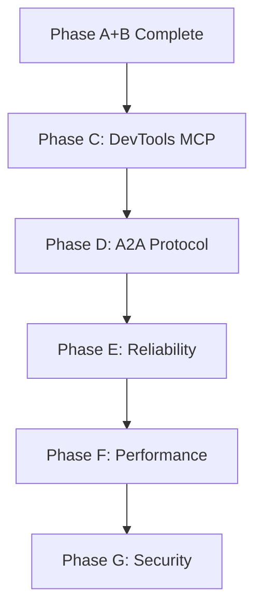

# WebMCP Bridge - Improvement Roadmap

> **Status:** Ready for AI PM Processing
> **Created:** 2026-02-13
> **Focus:** Phase C (DevTools MCP), Phase D (A2A Protocol), and production enhancements

---

## Metadata

```yaml
title: "WebMCP Bridge - Improvement Roadmap"
version: "1.0.0"
last_updated: "2026-02-13"
author: "Geometry OS Team"
status: "planning"
dependencies:
  - "Phase A: Core 4 Tools (COMPLETE)"
  - "Phase B: Expanded 8 Tools (COMPLETE)"
```

---

## Vision Statement

Transform WebMCP Bridge into a production-ready AI-OS interface that enables seamless agent-to-OS communication with full debugging, coordination, and verification capabilities.

### Goals
1. **Debuggability**: AI can inspect and debug the Visual Shell in real-time via DevTools MCP
2. **Coordination**: Multiple agents can collaborate via A2A protocol
3. **Reliability**: Graceful degradation, error recovery, and health monitoring
4. **Performance**: Sub-millisecond tool invocation, efficient WebSocket management
5. **Security**: Input validation, rate limiting, sandboxed execution

---

## Current State (v1.3.0)

### Completed: Phase A + B (8 Tools)

| Tool | Phase | Backend | Status |
|------|-------|---------|--------|
| `navigate_map` | A | PixiJS viewport | ✅ |
| `get_os_state` | A | Scene graph | ✅ |
| `execute_pixel_program` | A | Pixel CPU/GPU | ✅ |
| `load_rts_cartridge` | A | RTS loader | ✅ |
| `query_hilbert_address` | B | HilbertLUT (JS) | ✅ |
| `trigger_evolution` | B | WebSocket | ✅ |
| `send_llm_prompt` | B | HTTP (LM Studio) | ✅ |
| `spawn_area_agent` | B | WebSocket | ✅ |

### Key Files
- `systems/visual_shell/web/webmcp_bridge.js` (1,485 lines)
- `systems/visual_shell/web/hilbert_lut.js` (Hilbert conversion)
- `systems/visual_shell/web/test_webmcp_bridge.html` (verification)

---

## Phase C: DevTools MCP Integration (Priority: CRITICAL)

**Timeline:** 1 day
**Goal:** Enable AI coding assistants to debug the Visual Shell in real-time

### C.1 Install chrome-devtools-mcp Package

**Description:** Install and configure the MCP server that provides Chrome DevTools Protocol access.

**Tasks:**
- [ ] Task C.1.1: Install `@anthropic-ai/chrome-devtools-mcp` via npm
- [ ] Task C.1.2: Verify package installation in `package.json`
- [ ] Task C.1.3: Document package version and capabilities

**Success Criteria:**
- Package listed in `package.json` devDependencies
- `npm list @anthropic-ai/chrome-devtools-mcp` shows version

**Dependencies:** None

**File Estimates:**
- `package.json`: +1 line
- `package-lock.json`: +50 lines

---

### C.2 Create MCP Server Configuration

**Description:** Configure the MCP server with Chrome debugging parameters.

**Tasks:**
- [ ] Task C.2.1: Create `.mcp/` directory in visual_shell/web
- [ ] Task C.2.2: Write `config.json` with server settings
- [ ] Task C.2.3: Configure Chrome path and debugging port
- [ ] Task C.2.4: Add start URL for Visual Shell

**Success Criteria:**
- Valid JSON configuration file
- Chrome path resolves correctly
- Port 9222 configured for DevTools Protocol

**Dependencies:** Task C.1

**File Estimates:**
- `systems/visual_shell/web/.mcp/config.json`: +30 lines

---

### C.3 Create Chrome Debug Launcher

**Description:** Create a shell script to launch Chrome with remote debugging enabled.

**Tasks:**
- [ ] Task C.3.1: Write `debug_chrome.sh` launcher script
- [ ] Task C.3.2: Add port and URL configuration options
- [ ] Task C.3.3: Add Chrome existence check
- [ ] Task C.3.4: Add port availability check
- [ ] Task C.3.5: Make script executable

**Success Criteria:**
- Script launches Chrome with `--remote-debugging-port=9222`
- Script handles port conflicts gracefully
- DevTools Protocol accessible at `localhost:9222/json`

**Dependencies:** Task C.2

**File Estimates:**
- `systems/visual_shell/web/debug_chrome.sh`: +65 lines

---

### C.4 Create Verification Test Page

**Description:** Create an HTML test page to verify DevTools MCP integration.

**Tasks:**
- [ ] Task C.4.1: Create `test_devtools_mcp.html` test page
- [ ] Task C.4.2: Add prerequisite tests (Chrome version, WebMCP)
- [ ] Task C.4.3: Add DevTools Protocol connectivity tests
- [ ] Task C.4.4: Add WebMCP bridge integration tests
- [ ] Task C.4.5: Add results summary section

**Success Criteria:**
- Test page shows Chrome 146+ requirement
- Test page connects to DevTools Protocol
- Test page verifies MCP config exists

**Dependencies:** Task C.3

**File Estimates:**
- `systems/visual_shell/web/test_devtools_mcp.html`: +200 lines

---

### C.5 Write Design Documentation

**Description:** Document the DevTools MCP architecture and usage.

**Tasks:**
- [ ] Task C.5.1: Write architecture diagram
- [ ] Task C.5.2: Document MCP server capabilities
- [ ] Task C.5.3: Document usage workflow
- [ ] Task C.5.4: Document integration with WebMCP tools

**Success Criteria:**
- Clear architecture documentation
- Step-by-step usage instructions
- Tool comparison table (WebMCP vs DevTools MCP)

**Dependencies:** Task C.4

**File Estimates:**
- `docs/plans/2026-02-13-webmcp-phase-c-design.md`: +150 lines

---

## Phase D: A2A Protocol Integration (Priority: HIGH)

**Timeline:** 2-3 days
**Goal:** Enable Agent2Agent communication for horizontal agent coordination

### D.1 Research A2A Protocol

**Description:** Research Google's Agent2Agent protocol specification.

**Tasks:**
- [ ] Task D.1.1: Search for A2A protocol specification
- [ ] Task D.1.2: Document message format and transport
- [ ] Task D.1.3: Identify integration points with WebMCP
- [ ] Task D.1.4: Assess compatibility with existing tools

**Success Criteria:**
- A2A protocol documented
- Integration approach defined
- Dependency assessment complete

**Dependencies:** Phase C

**File Estimates:**
- `docs/plans/2026-02-13-webmcp-phase-d-design.md`: +100 lines

---

### D.2 Implement A2A Message Router

**Description:** Implement the A2A message routing layer in WebMCP bridge.

**Tasks:**
- [ ] Task D.2.1: Add A2A message schema to bridge
- [ ] Task D.2.2: Implement message serialization/deserialization
- [ ] Task D.2.3: Add agent discovery via A2A
- [ ] Task D.2.4: Add message routing logic
- [ ] Task D.2.5: Add error handling for A2A failures

**Success Criteria:**
- A2A messages correctly formatted
- Agent discovery works
- Message routing delivers to correct agent

**Dependencies:** Task D.1

**File Estimates:**
- `systems/visual_shell/web/webmcp_bridge.js`: +200 lines

---

### D.3 Create Area Agent A2A Integration

**Description:** Enable Area Agents to communicate via A2A protocol.

**Tasks:**
- [ ] Task D.3.1: Extend `spawn_area_agent` with A2A config
- [ ] Task D.3.2: Add inter-agent messaging capability
- [ ] Task D.3.3: Add agent status broadcasting
- [ ] Task D.3.4: Add agent coordination primitives

**Success Criteria:**
- Area Agents can send/receive A2A messages
- Agents can discover each other
- Coordination primitives work (lock, barrier)

**Dependencies:** Task D.2

**File Estimates:**
- `systems/visual_shell/web/webmcp_bridge.js`: +150 lines

---

### D.4 Add A2A Verification Tests

**Description:** Create tests for A2A integration.

**Tasks:**
- [ ] Task D.4.1: Add A2A message format tests
- [ ] Task D.4.2: Add agent discovery tests
- [ ] Task D.4.3: Add inter-agent messaging tests
- [ ] Task D.4.4: Add coordination primitive tests

**Success Criteria:**
- All A2A tests pass
- Test coverage > 80% for A2A code

**Dependencies:** Task D.3

**File Estimates:**
- `systems/visual_shell/web/test_webmcp_bridge.html`: +150 lines

---

## Phase E: Reliability & Error Handling (Priority: HIGH)

**Timeline:** 2 days
**Goal:** Improve error handling, graceful degradation, and recovery

### E.1 Implement Circuit Breaker Pattern

**Description:** Add circuit breaker for WebSocket and HTTP backends.

**Tasks:**
- [ ] Task E.1.1: Implement circuit breaker state machine
- [ ] Task E.1.2: Add half-open state for recovery testing
- [ ] Task E.1.3: Add configurable thresholds
- [ ] Task E.1.4: Add circuit breaker metrics

**Success Criteria:**
- Circuit breaker trips after 5 consecutive failures
- Half-open state allows recovery testing
- Metrics track open/half-open/closed duration

**Dependencies:** Phase D

**File Estimates:**
- `systems/visual_shell/web/webmcp_bridge.js`: +100 lines

---

### E.2 Add Retry with Exponential Backoff

**Description:** Implement retry logic with exponential backoff for transient failures.

**Tasks:**
- [ ] Task E.2.1: Add retry wrapper function
- [ ] Task E.2.2: Implement exponential backoff calculation
- [ ] Task E.2.3: Add jitter to prevent thundering herd
- [ ] Task E.2.4: Configure per-tool retry settings

**Success Criteria:**
- Transient failures automatically retried
- Backoff prevents backend overload
- Configurable max retries and delays

**Dependencies:** Task E.1

**File Estimates:**
- `systems/visual_shell/web/webmcp_bridge.js`: +80 lines

---

### E.3 Add Health Monitoring

**Description:** Add health monitoring for backend connections.

**Tasks:**
- [ ] Task E.3.1: Add health check endpoint polling
- [ ] Task E.3.2: Add connection status tracking
- [ ] Task E.3.3: Add health status to `get_os_state`
- [ ] Task E.3.4: Add health event notifications

**Success Criteria:**
- Health status tracked for all backends
- `get_os_state` includes health information
- Unhealthy backends trigger events

**Dependencies:** Task E.2

**File Estimates:**
- `systems/visual_shell/web/webmcp_bridge.js`: +100 lines

---

## Phase F: Performance Optimization (Priority: MEDIUM)

**Timeline:** 2 days
**Goal:** Optimize tool invocation latency and resource usage

### F.1 Add Tool Invocation Metrics

**Description:** Add detailed metrics for tool performance analysis.

**Tasks:**
- [ ] Task F.1.1: Add per-tool latency tracking
- [ ] Task F.1.2: Add success/failure rate tracking
- [ ] Task F.1.3: Add throughput tracking
- [ ] Task F.1.4: Add metrics export endpoint

**Success Criteria:**
- All tools track latency (p50, p95, p99)
- Success/failure rates available
- Metrics accessible via `get_os_state`

**Dependencies:** Phase E

**File Estimates:**
- `systems/visual_shell/web/webmcp_bridge.js`: +100 lines

---

### F.2 Implement Request Batching

**Description:** Batch multiple tool calls into single requests where possible.

**Tasks:**
- [ ] Task F.2.1: Design batch request format
- [ ] Task F.2.2: Implement batch executor
- [ ] Task F.2.3: Add dependency analysis for parallel execution
- [ ] Task F.2.4: Add batch timeout handling

**Success Criteria:**
- Multiple independent calls batched
- Batch execution reduces total latency
- Timeout prevents batch hangs

**Dependencies:** Task F.1

**File Estimates:**
- `systems/visual_shell/web/webmcp_bridge.js`: +150 lines

---

### F.3 Add Response Caching

**Description:** Cache responses for read-only tools.

**Tasks:**
- [ ] Task F.3.1: Implement LRU cache for tool responses
- [ ] Task F.3.2: Add cache invalidation triggers
- [ ] Task F.3.3: Add cache hit/miss metrics
- [ ] Task F.3.4: Configure TTL per tool

**Success Criteria:**
- `get_os_state` with same params cached
- Cache hit rate > 50% for read-heavy workloads
- Cache invalidation works correctly

**Dependencies:** Task F.2

**File Estimates:**
- `systems/visual_shell/web/webmcp_bridge.js`: +100 lines

---

## Phase G: Security Hardening (Priority: MEDIUM)

**Timeline:** 1-2 days
**Goal:** Improve input validation and security posture

### G.1 Add Input Validation

**Description:** Add comprehensive input validation for all tool parameters.

**Tasks:**
- [ ] Task G.1.1: Define JSON Schema for each tool
- [ ] Task G.1.2: Implement schema validator
- [ ] Task G.1.3: Add sanitization for string inputs
- [ ] Task G.1.4: Add validation error messages

**Success Criteria:**
- All tool inputs validated against schema
- Invalid inputs rejected with clear errors
- No injection vulnerabilities

**Dependencies:** Phase F

**File Estimates:**
- `systems/visual_shell/web/webmcp_bridge.js`: +150 lines

---

### G.2 Add Rate Limiting

**Description:** Add rate limiting to prevent abuse.

**Tasks:**
- [ ] Task G.2.1: Implement sliding window rate limiter
- [ ] Task G.2.2: Add per-tool rate limits
- [ ] Task G.2.3: Add rate limit headers in responses
- [ ] Task G.2.4: Add rate limit bypass for trusted sources

**Success Criteria:**
- Rate limiting enforced per tool
- Burst handling configurable
- Rate limit status visible in responses

**Dependencies:** Task G.1

**File Estimates:**
- `systems/visual_shell/web/webmcp_bridge.js`: +100 lines

---

## Summary

| Phase | Priority | Timeline | Key Deliverables |
|-------|----------|----------|------------------|
| C: DevTools MCP | CRITICAL | 1 day | Chrome debug integration |
| D: A2A Protocol | HIGH | 2-3 days | Agent coordination |
| E: Reliability | HIGH | 2 days | Circuit breaker, retry |
| F: Performance | MEDIUM | 2 days | Metrics, batching, caching |
| G: Security | MEDIUM | 1-2 days | Validation, rate limiting |

**Total Estimated Time:** 8-11 days

---

## Dependencies



---

## References

- Phase A Design: `docs/plans/2026-02-12-webmcp-bridge-design.md`
- Phase B Design: `docs/plans/2026-02-12-webmcp-phase-b-design.md`
- Phase C Implementation: `docs/plans/2026-02-13-webmcp-phase-c-devtools-mcp.md`
- WebMCP Spec: https://github.com/GoogleChrome/webmcp
- MCP Protocol: https://modelcontextprotocol.io/
