# WebMCP Bridge - Improvement Roadmap

> **Status:** Phase D COMPLETE - Planning Phase F (AI-Driven Visual Builder)
> **Created:** 2026-02-13
> **Updated:** 2026-02-13 15:30 CST
> **Focus:** Phase F (AI Visual Builder), Phase E, H-I (Production Hardening)

---

## Metadata

```yaml
title: "WebMCP Bridge - Improvement Roadmap"
version: "2.0.0"
last_updated: "2026-02-13"
author: "Geometry OS Team"
status: "planning"
dependencies:
  - "Phase A: Core 4 Tools (COMPLETE)"
  - "Phase B: Expanded 8 Tools (COMPLETE)"
  - "Phase C: DevTools MCP (COMPLETE)"
  - "Phase D: A2A Protocol (COMPLETE)"
```

---

## Vision Statement

Transform WebMCP Bridge into a production-ready AI-OS interface that enables seamless agent-to-OS communication with full debugging, coordination, and verification capabilities.

### Goals
1. **Debuggability**: AI can inspect and debug the Visual Shell in real-time via DevTools MCP
2. **Coordination**: Multiple agents can collaborate via A2A protocol
3. **Reliability**: Graceful degradation, error recovery, and health monitoring
4. **Performance**: Sub-millisecond tool invocation, efficient WebSocket management
5. **Security**: Input validation, rate limiting, sandboxed execution

---

## Current State (v1.5.0)

### Completed: Phase A-D (14 Tools)

| Tool | Phase | Backend | Status |
|------|-------|---------|--------|
| `navigate_map` | A | PixiJS viewport | ✅ |
| `get_os_state` | A | Scene graph | ✅ |
| `execute_pixel_program` | A | Pixel CPU/GPU | ✅ |
| `load_rts_cartridge` | A | RTS loader | ✅ |
| `query_hilbert_address` | B | HilbertLUT (JS) | ✅ |
| `trigger_evolution` | B | WebSocket | ✅ |
| `send_llm_prompt` | B | HTTP (LM Studio) | ✅ |
| `spawn_area_agent` | B | WebSocket | ✅ |
| `browser_navigate` | C | DevTools MCP | ✅ |
| `browser_screenshot` | C | DevTools MCP | ✅ |
| `browser_evaluate` | C | DevTools MCP | ✅ |
| `a2a_send_message` | D | A2A Router | ✅ |
| `a2a_broadcast` | D | A2A Router | ✅ |
| `a2a_subscribe` | D | A2A Router | ✅ |

### Key Files
- `systems/visual_shell/web/webmcp_bridge.js` (2,100+ lines)
- `systems/visual_shell/web/hilbert_lut.js` (Hilbert conversion)
- `systems/visual_shell/web/test_webmcp_bridge.html` (verification)
- `systems/pixel_compiler/a2a_router.py` (backend routing)

---

## Phase C: DevTools MCP Integration ✅ COMPLETE

**Timeline:** 1 day
**Goal:** Enable AI coding assistants to debug the Visual Shell in real-time
**Status:** ✅ COMPLETE (committed: fc2dab9)

### C.1 Install chrome-devtools-mcp Package ✅

**Tasks:**
- [x] Task C.1.1: Install `chrome-devtools-mcp` via npm
- [x] Task C.1.2: Verify package installation in `package.json`
- [x] Task C.1.3: Document package version (v0.17.0)

### C.2 Create MCP Server Configuration ✅

**Tasks:**
- [x] Task C.2.1: Create `.mcp/` directory in visual_shell/web
- [x] Task C.2.2: Write `config.json` with server settings
- [x] Task C.2.3: Configure Chrome path and debugging port
- [x] Task C.2.4: Add start URL for Visual Shell

### C.3 Create Chrome Debug Launcher ✅

**Tasks:**
- [x] Task C.3.1: Write `debug_chrome.sh` launcher script
- [x] Task C.3.2: Add port and URL configuration options
- [x] Task C.3.3: Make script executable

### C.4 Create Verification Test Page ✅

**Tasks:**
- [x] Task C.4.1: Create `test_devtools_mcp.html` test page (27KB)
- [x] Task C.4.2: Add prerequisite tests (Chrome version, WebMCP)
- [x] Task C.4.3: Add DevTools Protocol connectivity tests

### C.5 Write Design Documentation ✅

**Tasks:**
- [x] Task C.5.1: Write architecture diagram
- [x] Task C.5.2: Document MCP server capabilities
- [x] Task C.5.3: Document usage workflow

---

## Phase D: A2A Protocol Integration ✅ COMPLETE

**Timeline:** 2-3 days
**Goal:** Enable Agent2Agent communication for horizontal agent coordination
**Status:** ✅ COMPLETE (committed: merged to master)

### D.1 Research A2A Protocol ✅

**Tasks:**
- [x] Task D.1.1: Search for A2A protocol specification
- [x] Task D.1.2: Document message format and transport
- [x] Task D.1.3: Identify integration points with WebMCP
- [x] Task D.1.4: Assess compatibility with existing tools

### D.2 Implement A2A Message Router ✅

**Tasks:**
- [x] Task D.2.1: Create backend A2A router (`a2a_router.py`)
- [x] Task D.2.2: Implement agent registration/discovery
- [x] Task D.2.3: Add message routing with subscriptions
- [x] Task D.2.4: Add broadcast capabilities
- [x] Task D.2.5: Add 12 unit tests for routing

### D.3 Create A2A WebMCP Tools ✅

**Tasks:**
- [x] Task D.3.1: Add `a2a_send_message` tool
- [x] Task D.3.2: Add `a2a_broadcast` tool
- [x] Task D.3.3: Add `a2a_subscribe` tool
- [x] Task D.3.4: Create test page for A2A tools

**Key Files Created:**
- `systems/pixel_compiler/a2a_router.py` (956 lines)
- `systems/pixel_compiler/tests/test_a2a_router.py` (243 lines, 12 tests)
- `systems/visual_shell/web/test_a2a_tools.html`

---

## Phase E: Reliability & Error Handling (Priority: HIGH)

**Timeline:** 2 days
**Goal:** Improve error handling, graceful degradation, and recovery

### E.1 Implement Circuit Breaker Pattern

**Description:** Add circuit breaker for WebSocket and HTTP backends.

**Tasks:**
- [ ] Task E.1.1: Implement circuit breaker state machine
- [ ] Task E.1.2: Add half-open state for recovery testing
- [ ] Task E.1.3: Add configurable thresholds
- [ ] Task E.1.4: Add circuit breaker metrics

**Success Criteria:**
- Circuit breaker trips after 5 consecutive failures
- Half-open state allows recovery testing
- Metrics track open/half-open/closed duration

**Dependencies:** Phase D

**File Estimates:**
- `systems/visual_shell/web/webmcp_bridge.js`: +100 lines

---

### E.2 Add Retry with Exponential Backoff

**Description:** Implement retry logic with exponential backoff for transient failures.

**Tasks:**
- [ ] Task E.2.1: Add retry wrapper function
- [ ] Task E.2.2: Implement exponential backoff calculation
- [ ] Task E.2.3: Add jitter to prevent thundering herd
- [ ] Task E.2.4: Configure per-tool retry settings

**Success Criteria:**
- Transient failures automatically retried
- Backoff prevents backend overload
- Configurable max retries and delays

**Dependencies:** Task E.1

**File Estimates:**
- `systems/visual_shell/web/webmcp_bridge.js`: +80 lines

---

### E.3 Add Health Monitoring

**Description:** Add health monitoring for backend connections.

**Tasks:**
- [ ] Task E.3.1: Add health check endpoint polling
- [ ] Task E.3.2: Add connection status tracking
- [ ] Task E.3.3: Add health status to `get_os_state`
- [ ] Task E.3.4: Add health event notifications

**Success Criteria:**
- Health status tracked for all backends
- `get_os_state` includes health information
- Unhealthy backends trigger events

**Dependencies:** Task E.2

**File Estimates:**
- `systems/visual_shell/web/webmcp_bridge.js`: +100 lines

---

## Phase F: AI-Driven Visual Builder (Priority: HIGH) 🎯 NEXT

**Timeline:** 3-4 days
**Goal:** Enable AI agents to "build" Geometry OS visually by triggering UI controls
**Design Doc:** `docs/plans/2026-02-13-webmcp-phase-f-design.md`
**Implementation Plan:** `docs/plans/2026-02-13-webmcp-phase-f-implementation.md`

**Paradigm:** "The AI doesn't write code - it clicks buttons and watches the canvas."

### F.1 Create BuilderPanel UI Component

**Description:** Create the AI Builder Panel with Tile Palette, Shader Editor, Cartridge Rack, and Action Log.

**Tasks:**
- [ ] Task F.1.1: Create `BuilderPanel.js` component structure
- [ ] Task F.1.2: Add Tile Palette tab with tile type selection
- [ ] Task F.1.3: Add Shader Editor tab with load/evolve/preview
- [ ] Task F.1.4: Add Cartridge Rack tab for assembly
- [ ] Task F.1.5: Add Action Log for real-time AI activity feed
- [ ] Task F.1.6: Create `BuilderPanel.css` styling

**Success Criteria:**
- BuilderPanel renders with all tabs
- Tab switching works
- Action Log updates in real-time

**File Estimates:**
- `systems/visual_shell/web/BuilderPanel.js`: ~400 lines
- `systems/visual_shell/web/BuilderPanel.css`: ~150 lines

---

### F.2 Add Builder Tools to WebMCP Bridge

**Description:** Implement 6 new WebMCP tools for AI-driven building.

**Tasks:**
- [ ] Task F.2.1: Implement `builder_place_tile` tool
- [ ] Task F.2.2: Implement `builder_load_shader` tool
- [ ] Task F.2.3: Implement `builder_evolve_shader` tool
- [ ] Task F.2.4: Implement `builder_assemble_cartridge` tool
- [ ] Task F.2.5: Implement `builder_preview` tool
- [ ] Task F.2.6: Implement `builder_get_state` tool

**Success Criteria:**
- 6 new tools registered (17 total)
- All tools return structured responses
- Preview URLs generated correctly

**File Estimates:**
- `systems/visual_shell/web/webmcp_bridge.js`: +350 lines

---

### F.3 Connect Tools to UI Components

**Description:** Wire WebMCP tools to BuilderPanel UI and Infinite Map.

**Tasks:**
- [ ] Task F.3.1: Connect `builder_place_tile` to PixiJS viewport
- [ ] Task F.3.2: Connect `builder_load_shader` to shader editor
- [ ] Task F.3.3: Connect `builder_evolve_shader` to evolution backend
- [ ] Task F.3.4: Connect `builder_assemble_cartridge` to RTS builder
- [ ] Task F.3.5: Connect `builder_preview` to canvas capture
- [ ] Task F.3.6: Connect Action Log to all tool callbacks

**Success Criteria:**
- Tools update UI in real-time
- Preview screenshots work
- Action Log shows AI activity

**Dependencies:** Task F.1, F.2

**File Estimates:**
- `systems/visual_shell/web/webmcp_bridge.js`: +150 lines

---

### F.4 Add Multi-Channel Feedback Loop

**Description:** Implement verification feedback channels for AI builders.

**Tasks:**
- [ ] Task F.4.1: Add structured response verification
- [ ] Task F.4.2: Add DevTools MCP screenshot verification
- [ ] Task F.4.3: Add `builder_get_state` + `get_os_state` integration
- [ ] Task F.4.4: Add A2A region change notifications for monitoring

**Success Criteria:**
- Multiple verification channels available
- AI can verify builds via screenshots
- Agent-to-agent region notifications work

**Dependencies:** Task F.3

**File Estimates:**
- `systems/visual_shell/web/webmcp_bridge.js`: +100 lines

---

### F.5 Create Builder Test Page

**Description:** Create interactive test page for builder tools.

**Tasks:**
- [ ] Task F.5.1: Create `builder_tools_test.html`
- [ ] Task F.5.2: Add prerequisite checks (WebMCP, tools registered)
- [ ] Task F.5.3: Add interactive tool test buttons
- [ ] Task F.5.4: Add visual verification panel
- [ ] Task F.5.5: Add example AI building session

**Success Criteria:**
- Test page loads and runs
- All 6 builder tools testable
- Visual feedback shows results

**Dependencies:** Task F.4

**File Estimates:**
- `systems/visual_shell/web/builder_tools_test.html`: ~200 lines

---

## Phase E: Reliability & Error Handling (Priority: HIGH)

**Timeline:** 2 days
**Goal:** Improve error handling, graceful degradation, and recovery

### E.1 Implement Circuit Breaker Pattern

**Description:** Add circuit breaker for WebSocket and HTTP backends.

**Tasks:**
- [ ] Task E.1.1: Implement circuit breaker state machine
- [ ] Task E.1.2: Add half-open state for recovery testing
- [ ] Task E.1.3: Add configurable thresholds
- [ ] Task E.1.4: Add circuit breaker metrics

**Success Criteria:**
- Circuit breaker trips after 5 consecutive failures
- Half-open state allows recovery testing
- Metrics track open/half-open/closed duration

**Dependencies:** Phase D

**File Estimates:**
- `systems/visual_shell/web/webmcp_bridge.js`: +100 lines

---

### E.2 Add Retry with Exponential Backoff

**Description:** Implement retry logic with exponential backoff for transient failures.

**Tasks:**
- [ ] Task E.2.1: Add retry wrapper function
- [ ] Task E.2.2: Implement exponential backoff calculation
- [ ] Task E.2.3: Add jitter to prevent thundering herd
- [ ] Task E.2.4: Configure per-tool retry settings

**Success Criteria:**
- Transient failures automatically retried
- Backoff prevents backend overload
- Configurable max retries and delays

**Dependencies:** Task E.1

**File Estimates:**
- `systems/visual_shell/web/webmcp_bridge.js`: +80 lines

---

### E.3 Add Health Monitoring

**Description:** Add health monitoring for backend connections.

**Tasks:**
- [ ] Task E.3.1: Add health check endpoint polling
- [ ] Task E.3.2: Add connection status tracking
- [ ] Task E.3.3: Add health status to `get_os_state`
- [ ] Task E.3.4: Add health event notifications

**Success Criteria:**
- Health status tracked for all backends
- `get_os_state` includes health information
- Unhealthy backends trigger events

**Dependencies:** Task E.2

**File Estimates:**
- `systems/visual_shell/web/webmcp_bridge.js`: +100 lines

---

## Phase H: Performance Optimization (Priority: MEDIUM)

**Timeline:** 2 days
**Goal:** Optimize tool invocation latency and resource usage

### H.1 Add Tool Invocation Metrics

**Description:** Add detailed metrics for tool performance analysis.

**Tasks:**
- [ ] Task H.1.1: Add per-tool latency tracking
- [ ] Task H.1.2: Add success/failure rate tracking
- [ ] Task H.1.3: Add throughput tracking
- [ ] Task H.1.4: Add metrics export endpoint

**Success Criteria:**
- All tools track latency (p50, p95, p99)
- Success/failure rates available
- Metrics accessible via `get_os_state`

**Dependencies:** Phase F

**File Estimates:**
- `systems/visual_shell/web/webmcp_bridge.js`: +100 lines

---

### H.2 Implement Request Batching

**Description:** Batch multiple tool calls into single requests where possible.

**Tasks:**
- [ ] Task H.2.1: Design batch request format
- [ ] Task H.2.2: Implement batch executor
- [ ] Task H.2.3: Add dependency analysis for parallel execution
- [ ] Task H.2.4: Add batch timeout handling

**Success Criteria:**
- Multiple independent calls batched
- Batch execution reduces total latency
- Timeout prevents batch hangs

**Dependencies:** Task H.1

**File Estimates:**
- `systems/visual_shell/web/webmcp_bridge.js`: +150 lines

---

### H.3 Add Response Caching

**Description:** Cache responses for read-only tools.

**Tasks:**
- [ ] Task H.3.1: Implement LRU cache for tool responses
- [ ] Task H.3.2: Add cache invalidation triggers
- [ ] Task H.3.3: Add cache hit/miss metrics
- [ ] Task H.3.4: Configure TTL per tool

**Success Criteria:**
- `get_os_state` with same params cached
- Cache hit rate > 50% for read-heavy workloads
- Cache invalidation works correctly

**Dependencies:** Task H.2

**File Estimates:**
- `systems/visual_shell/web/webmcp_bridge.js`: +100 lines

---

## Phase I: Security Hardening (Priority: MEDIUM)

**Timeline:** 1-2 days
**Goal:** Improve input validation and security posture

### I.1 Add Input Validation

**Description:** Add comprehensive input validation for all tool parameters.

**Tasks:**
- [ ] Task I.1.1: Define JSON Schema for each tool
- [ ] Task I.1.2: Implement schema validator
- [ ] Task I.1.3: Add sanitization for string inputs
- [ ] Task I.1.4: Add validation error messages

**Success Criteria:**
- All tool inputs validated against schema
- Invalid inputs rejected with clear errors
- No injection vulnerabilities

**Dependencies:** Phase H

**File Estimates:**
- `systems/visual_shell/web/webmcp_bridge.js`: +150 lines

---

### I.2 Add Rate Limiting

**Description:** Add rate limiting to prevent abuse.

**Tasks:**
- [ ] Task I.2.1: Implement sliding window rate limiter
- [ ] Task I.2.2: Add per-tool rate limits
- [ ] Task I.2.3: Add rate limit headers in responses
- [ ] Task I.2.4: Add rate limit bypass for trusted sources

**Success Criteria:**
- Rate limiting enforced per tool
- Burst handling configurable
- Rate limit status visible in responses

**Dependencies:** Task I.1

**File Estimates:**
- `systems/visual_shell/web/webmcp_bridge.js`: +100 lines

---

## Phase G: Collaborative Multi-AI Building (Priority: HIGH)

**Timeline:** 7 days
**Goal:** Enable multiple AI agents to collaborate on building Geometry OS
**Design Doc:** `docs/plans/2026-02-13-webmcp-phase-g-design.md`

### G.1 Session Management (2 days)

**Description:** Create collaborative build sessions with agent management.

**Tasks:**
- [ ] Task G.1.1: Implement `session_create` tool
- [ ] Task G.1.2: Implement `session_join` tool
- [ ] Task G.1.3: Implement `session_leave` tool
- [ ] Task G.1.4: Implement `session_get_state` tool
- [ ] Task G.1.5: Create SessionCoordinator.js

**Success Criteria:**
- Multiple agents can join same session
- Session state visible to all agents
- Agent roles (architect/builder/tester/observer) enforced

---

### G.2 Region Management (2 days)

**Description:** Implement region claiming with conflict detection.

**Tasks:**
- [ ] Task G.2.1: Implement `region_claim` tool
- [ ] Task G.2.2: Implement `region_release` tool
- [ ] Task G.2.3: Implement `region_query` tool
- [ ] Task G.2.4: Add conflict detection and suggestions
- [ ] Task G.2.5: Integrate with A2A locks

**Success Criteria:**
- Region claims prevent overlapping work
- Conflict detection returns suggestions
- Claims auto-expire with timeout

---

### G.3 Task Delegation (2 days)

**Description:** Enable agents to assign tasks to each other.

**Tasks:**
- [ ] Task G.3.1: Implement `task_delegate` tool
- [ ] Task G.3.2: Implement `task_accept` tool
- [ ] Task G.3.3: Implement `task_report` tool
- [ ] Task G.3.4: Implement `task_get_queue` tool
- [ ] Task G.3.5: Add priority queue and dependency tracking

**Success Criteria:**
- Tasks can be delegated to specific agents or "any"
- Task completion unblocks dependent tasks
- Task queue shows all pending work

---

### G.4 Checkpoints & Events (1 day)

**Description:** Add checkpointing and event broadcasting.

**Tasks:**
- [ ] Task G.4.1: Implement `build_checkpoint` tool
- [ ] Task G.4.2: Implement `build_rollback` tool
- [ ] Task G.4.3: Add event broadcasting via A2A
- [ ] Task G.4.4: Create collab_test.html test page

**Success Criteria:**
- Checkpoints capture session state
- Rollback restores previous state
- Events notify all subscribed agents

**Dependencies:** Phase D (A2A Protocol) + Phase F (AI-Driven Visual Builder)

---

## Summary

| Phase | Priority | Timeline | Key Deliverables |
|-------|----------|----------|------------------|
| C: DevTools MCP | ✅ COMPLETE | 1 day | Chrome debug integration |
| D: A2A Protocol | ✅ COMPLETE | 2-3 days | Agent coordination |
| E: Reliability | HIGH | 2 days | Circuit breaker, retry |
| F: AI Visual Builder | 🎯 NEXT | 3-4 days | Builder tools, UI panel |
| **G: Multi-AI Building** | **DESIGNED** | **7 days** | **13 collab tools** |
| H: Performance | MEDIUM | 2 days | Metrics, batching, caching |
| I: Security | MEDIUM | 1-2 days | Validation, rate limiting |

**Total Estimated Time:** 21-25 days remaining

---

## Dependencies

```mermaid
graph TD
    A[Phase A+B Complete] --> C[Phase C: DevTools MCP ✅]
    C --> D[Phase D: A2A Protocol ✅]
    D --> E[Phase E: Reliability]
    D --> F[Phase F: AI Visual Builder]
    F --> G[Phase G: Multi-AI Building 🎯]
    D --> G
    G --> H[Phase H: Performance]
    E --> H
    H --> I[Phase I: Security]
```



---

## References

- Phase A Design: `docs/plans/2026-02-12-webmcp-bridge-design.md`
- Phase B Design: `docs/plans/2026-02-12-webmcp-phase-b-design.md`
- Phase C Design: `docs/plans/2026-02-13-webmcp-phase-c-design.md`
- Phase C Implementation: `docs/plans/2026-02-13-webmcp-phase-c-devtools-mcp.md`
- Phase D Design: `docs/plans/2026-02-13-webmcp-phase-d-design.md`
- **Phase F Design:** `docs/plans/2026-02-13-webmcp-phase-f-design.md`
- **Phase F Implementation:** `docs/plans/2026-02-13-webmcp-phase-f-implementation.md`
- **Phase G Design:** `docs/plans/2026-02-13-webmcp-phase-g-design.md`
- WebMCP Spec: https://github.com/GoogleChrome/webmcp
- MCP Protocol: https://modelcontextprotocol.io/
