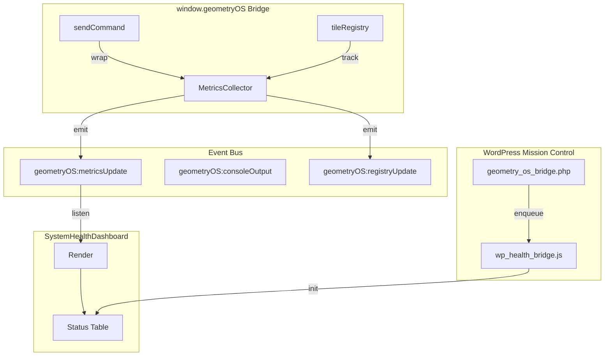

# Design: wp-mission-control-health

## Overview

Three-component system: MetricsCollector for data gathering, SystemHealthDashboard for visualization, and wp_health_bridge for WordPress integration. Event-driven architecture with `geometryOS:metricsUpdate` custom events.

## Architecture



## Components

### MetricsCollector

**Purpose**: Gather and aggregate system health metrics

**Responsibilities**:
- Start/end latency measurement with performance.now()
- Track sync count, tile count, buffer drops, reconnects
- Maintain rolling window of last 100 latency samples
- Emit `geometryOS:metricsUpdate` on metric changes

**Public API**:

```javascript
class MetricsCollector {
    startLatencyMeasure(id)  // Returns t0 timestamp
    endLatencyMeasure(id, t0)  // Returns latency delta
    recordLatency(latency)  // Add sample to rolling window
    recordSync()  // Increment sync count
    setTileCount(count)  // Update tile count
    recordBufferDrop()  // Increment drop count
    recordReconnect()  // Increment reconnect count
    getMetric(key)  // Get single metric
    getAverageLatency()  // Calculate mean from samples
    getAllMetrics()  // Get all metrics object
    reset()  // Clear all metrics
}
```

### SystemHealthDashboard

**Purpose**: Render real-time health metrics table

**Responsibilities**:
- Render HTML table with metric/status columns
- Listen for `geometryOS:metricsUpdate` events
- Apply PASS/WARN/FAIL status coloring
- Format timestamps for "last updated"

**Configuration**:

```javascript
{
    latencyTarget: 100,  // ms threshold
    tileTarget: 100      // expected tile count
}
```

**Rendered Metrics**:

| Metric | Target | Status Logic |
|--------|--------|--------------|
| Bridge Latency | <100ms | PASS if under, WARN if over |
| Tile Count | 100+ | OK if >=10, LOW if under |
| Sync Coherence | 100% | Always PASS (placeholder) |
| Buffer Drops | 0 | PASS if 0, FAIL if >0 |
| Reconnects | 0 | PASS if 0, WARN if >0 |

### wp_health_bridge

**Purpose**: Initialize dashboard in WordPress DOM

**Responsibilities**:
- Wait for DOM ready and dependencies
- Create or find `#geometry-os-health-dashboard` container
- Inject container into Mission Control widget area
- Initialize SystemHealthDashboard instance

### Bridge Integration

**Purpose**: Wire MetricsCollector into existing geometryOS bridge

**Changes to application.js**:

1. Create global `window.geometryOSMetrics` instance
2. Wrap `sendCommand` to measure latency
3. Track tile count on registry updates
4. Expose `window.geometryOS.metrics` accessor

## Data Flow

1. User sends command via `sendCommand(tileId, cmd)`
2. Wrapped call starts latency measurement
3. Original `sendCommand` executes
4. First `consoleOutput` event ends measurement
5. `recordLatency()` adds sample, emits `metricsUpdate`
6. `SystemHealthDashboard` receives event, re-renders

## Technical Decisions

| Decision | Options | Choice | Rationale |
|----------|---------|--------|-----------|
| Timing API | Date.now() vs performance.now() | performance.now() | Sub-millisecond precision |
| Sample storage | Array vs Float64Array | Array | Simpler, samples <=100 |
| Event namespace | New vs existing | geometryOS:* | Consistency with existing |
| DOM update | InnerHTML vs diff | InnerHTML | Simple table, small payload |
| CSS | Inline vs stylesheet | Inline | No external dependency |

## File Structure

| File | Action | Purpose |
|------|--------|---------|
| `systems/visual_shell/web/MetricsCollector.js` | Create | Core metrics gathering |
| `systems/visual_shell/web/SystemHealthDashboard.js` | Create | Dashboard widget |
| `systems/visual_shell/web/wp_health_bridge.js` | Create | WordPress integration |
| `systems/visual_shell/web/tests/test_metrics_collector.js` | Create | Unit tests |
| `systems/visual_shell/web/tests/test_system_health_dashboard.js` | Create | Unit tests |
| `systems/visual_shell/web/tests/stress_test_wp_bridge.js` | Create | Stress tests |
| `systems/visual_shell/web/tests/resilience_test_wp_bridge.js` | Create | Resilience tests |
| `systems/visual_shell/web/tests/run_all_wp_tests.js` | Create | Unified runner |
| `systems/visual_shell/web/application.js` | Modify | Bridge integration |
| `systems/visual_shell/web/tests/verification_wp_integration.js` | Modify | Add Test 6, 7 |
| `wordpress_zone/wordpress/wp-content/mu-plugins/geometry_os_bridge.php` | Modify | Script enqueue |

## Error Handling

| Error | Handling | User Impact |
|-------|----------|-------------|
| MetricsCollector not loaded | Dashboard shows "Loading..." | Graceful degradation |
| SystemHealthDashboard fails | Console warning, no UI | Silent failure |
| performance.now() unavailable | Fallback to Date.now() | Lower precision |
| DOM container not found | Create container at body | Dashboard at page bottom |

## Existing Patterns to Follow

- **Event naming**: `geometryOS:*` namespace (from verification_wp_integration.js:91)
- **Registration**: `window.geometryOS?.registerTile(id, {x, y, state})` pattern
- **Test structure**: `class WPIntegrationVerifier` with `runAll()` and `report()`
- **Console output**: `console.log('%c...', 'color: #00ffcc')` styled logging
