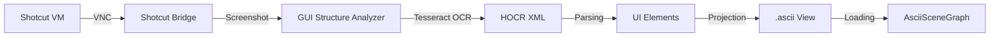
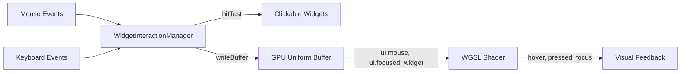

# Visual Extraction Pipeline

This directory contains the tools for the "Reverse Pipeline" - extracting GUI structure from visual applications (like Shotcut running in a VM) into Geometry OS's ASCII Scene Graph format.

## Architecture



## Tools

### 1. `shotcut_vm_bridge.py`
Manages the QEMU VM and provides a WebSocket API for:
- Booting/Shutdown
- Input Injection (Mouse/Keyboard via QMP)
- Visual Capture (Screenshots)

### 2. `gui_structure_analyzer.py`
The core extraction engine.
- Input: Image file (PNG/JPG)
- Processing: Tesseract OCR with HOCR output
- Output: `.ascii` file with `[CLICKABLE]` metadata

**Usage:**
```bash
python3 gui_structure_analyzer.py screenshot.png --output view.ascii
```

## ASCII Scene Graph Format

The output format is compatible with `systems/visual_shell/ascii_scene`:

```
┌─────────────────────────┐
│ File  Edit  View       │
│                         │
│ [ Open Project ]        │
└─────────────────────────┘

# [CLICKABLE: 10,10,50,20 → action:click_file]
# [CLICKABLE: 60,10,100,20 → action:click_edit]
```

## Interactive UI (Ouroboros Level 2)

Ouroboros Level 2 extends the render-only pipeline with full mouse/keyboard interactivity using a hybrid CPU/GPU architecture: CPU hit-testing for click dispatch, GPU uniforms for real-time visual feedback.

### Architecture



### Components

#### WidgetInteractionManager (JavaScript)

The `WidgetInteractionManager` class handles all user interactions:

```javascript
import { WidgetInteractionManager } from './widget_interaction_manager.js';

const manager = new WidgetInteractionManager({
    canvas: document.getElementById('canvas'),
    device: gpuDevice,
    uniformBuffer: uniformBuffer,
    widgets: widgetsArray,  // From extraction_pipeline
    callbacks: {
        onHover: (widget, x, y) => console.log('Hover:', widget.text),
        onClick: (widget, x, y) => console.log('Click:', widget.action),
        onFocus: (widget, index) => console.log('Focus:', widget.text)
    }
});
```

**API Reference:**

| Method | Description |
|--------|-------------|
| `hitTest(x, y)` | Returns widget at (x,y) or null |
| `focusNext()` | Move focus to next clickable widget (Tab) |
| `focusPrev()` | Move focus to previous widget (Shift+Tab) |
| `updateMouse(x, y, pressed)` | Update mouse state programmatically |
| `destroy()` | Remove all event listeners |

**Properties:**

| Property | Type | Description |
|----------|------|-------------|
| `hoveredWidget` | Object/null | Currently hovered widget |
| `focusedIndex` | number | Index in clickableWidgets (-1 if none) |
| `mousePressed` | boolean | Mouse button state |
| `clickableWidgets` | Array | Widgets with `action` field |

**Widget Format:**

```javascript
{
    bbox: [x1, y1, x2, y2],  // Pixel coordinates
    action: "click_handler",  // Optional: makes widget clickable
    text: "Button Label",     // Optional: display text
    type: "button"            // Optional: widget type
}
```

#### UITransmuter Interaction Enhancements (Python)

The `UITransmuter` generates WGSL shaders with interaction support:

**Uniform Buffer Layout (32 bytes, 16-byte aligned):**

| Offset | Field | Type | Description |
|--------|-------|------|-------------|
| 0 | time | f32 | Animation time |
| 4 | mouse_pressed | f32 | 0.0 or 1.0 |
| 8 | mouse | vec2f | Mouse position in pixels |
| 16 | resolution | vec2f | Canvas dimensions |
| 24 | focused_widget | f32 | Focused widget index |
| 28 | pad | f32 | Alignment padding |

**WGSL Helper Functions:**

```wgsl
fn is_hovered(widget_center: vec2f, threshold: f32) -> bool
fn is_focused(widget_index: i32) -> bool
fn is_pressed(hover: bool) -> bool
```

**Visual Feedback:**

| State | Effect | Value |
|-------|--------|-------|
| Hover | Color brightening | `+vec4f(0.08)` |
| Pressed | Color darkening | `-vec4f(0.05)` |
| Focused | Blue glow outline | `vec4f(0.2, 0.6, 1.0, 1.0)` |

### Usage Example

**1. Extract widgets from screenshot:**

```bash
python3 extraction_pipeline.py screenshots/shotcut.png --output widgets.json
```

**2. Generate interactive shader:**

```python
from ui_transmuter import UITransmuter
import json

widgets = json.load(open('widgets.json'))
transmuter = UITransmuter(width=1920, height=1080)
wgsl = transmuter.transmute(widgets)
open('interactive.wgsl', 'w').write(wgsl)
```

**3. Initialize in browser:**

```html
<canvas id="canvas" width="1920" height="1080" tabindex="0"></canvas>
<script type="module">
import { WidgetInteractionManager } from './widget_interaction_manager.js';

const response = await fetch('widgets.json');
const { widgets } = await response.json();

const manager = new WidgetInteractionManager({
    canvas,
    device: gpuDevice,
    uniformBuffer,
    widgets,
    callbacks: {
        onClick: (widget, x, y) => {
            console.log('Action:', widget.action);
            // Handle click...
        }
    }
});
</script>
```

### Keyboard Navigation

| Key | Action |
|-----|--------|
| Tab | Focus next clickable widget |
| Shift+Tab | Focus previous widget |
| Enter | Activate focused widget |

### Testing

Run the interactive test:

```bash
# Open in browser with local server
python3 -m http.server 8000
# Navigate to: http://localhost:8000/interactive_test.html
```

Run automated tests:

```bash
# Python tests (UITransmuter)
python3 -m pytest tests/test_ui_transmuter_interaction.py -v

# JavaScript tests (WidgetInteractionManager)
node tests/test_widget_interaction_manager.js

# Integration tests
python3 -m pytest tests/test_interactive_integration.py -v
```

---

## Next Steps

1.  **Semantic Clustering**: Group words into logical components (menus, toolbars).
2.  **Layout Inference**: Detect lines and boxes (using OpenCV or edge detection) to improve the ASCII drawing.
3.  **Real-time Feed**: Connect the bridge directly to the analyzer for live updates.
