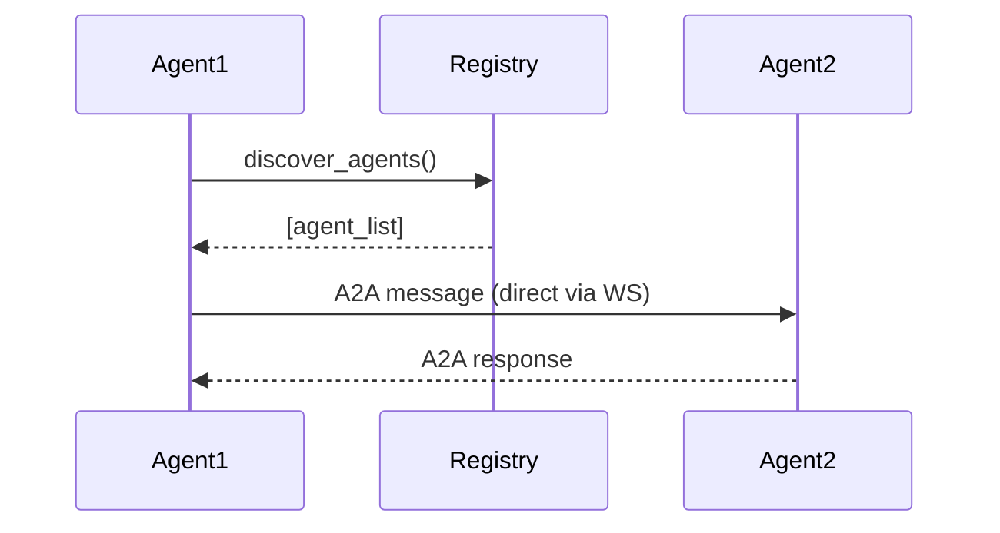

# WebMCP Phase D: Agent2Agent (A2A) Protocol — Research & Design Document

**Date:** 2026-02-13
**Phase:** Phase D: A2A Protocol for Agent Coordination
**Status:** Research Complete
**Depends On:** Phase C (DevTools MCP Integration)
**Confidence:** MEDIUM (based on existing agent_communication.py patterns)

---

## Executive Summary

**Research Finding:** "Agent2Agent" (A2A) protocol is **not an official Google specification**. No standard called "A2A protocol" exists in Google's documented ecosystem (WebMCP, Chrome DevTools Protocol, or Anthropic's MCP).

**Primary Recommendation:** Design A2A as a **Geometry OS-native protocol** inspired by proven patterns in the existing codebase (`systems/neural_cpu/system/agentic_layer/agent_communication.py`).

**Key Design Decisions:**
1. Use WebSocket as transport (consistent with existing `spawn_area_agent` tool)
2. Message format inspired by existing `Message` dataclass in `agent_communication.py`
3. Agent discovery via registry pattern (existing tools already register)
4. Coordination primitives: lock, barrier, broadcast
5. Integration with existing `spawn_area_agent` tool from Phase B

---

## A2A Protocol Overview

### What is A2A?

A2A (Agent2Agent) is a **proposed Geometry OS protocol** for horizontal agent-to-agent communication. It enables spawned area agents to:

1. **Discover each other** - Find other agents and their capabilities
2. **Send messages** - Direct peer-to-peer messaging
3. **Coordinate actions** - Distributed coordination primitives (locks, barriers)
4. **Broadcast state** - Share status updates with interested parties

### Why Not an Existing Standard?

| Standard | Why Not Suitable for WebMCP |
|----------|-------------------------------|
| **MCP (Model Context Protocol)** | Vertical (AI→OS), not horizontal (agent↔agent) |
| **Chrome DevTools Protocol** | Browser inspection, not agent messaging |
| **WebRTC** | Overkill for structured messaging, complex setup |
| **Service Workers** | Browser sandbox limits cross-agent communication |
| **gRPC** | Not browser-native, requires WASM/HTTP gateway |

### The Geometry OS Approach

Leverage the **existing `agent_communication.py` architecture** as backend specification, adapting it for browser-based WebMCP tools:

```python
# Backend inspiration from systems/neural_cpu/system/agentic_layer/agent_communication.py
#   - Message dataclass with signature, priority, expiration
#   - MessageQueue with priority-based dequeuing
#   - AgentCommunicationBus for pub/sub messaging
#   - Topic-based routing ("topic:name" pattern)
```

---

## Message Format Specification

### A2A Message Schema

All A2A messages follow this JSON structure:

```json
{
  "$schema": "https://geometry.os/a2a/message/v1",
  "message_id": "uuid-v4",
  "timestamp": 1739462400.123,
  "from_agent": "area-agent-abc123",
  "to_agent": "area-agent-def456 | broadcast | topic:name",
  "message_type": "task_assignment | status_update | coordination_request | heartbeat",
  "priority": 1 | 5 | 8 | 10,
  "content": {
    "type_specific": "data"
  },
  "metadata": {
    "region": {"x": 100, "y": 200, "width": 50, "height": 50},
    "capabilities": ["monitor", "executor"],
    "correlation_id": "optional-correlation"
  },
  "signature": "sha256-hmac",
  "expires_at": 1739466000.0
}
```

### Message Types

| Type | Purpose | Example Content |
|------|---------|-----------------|
| `task_assignment` | Assign work to agent | `{"task": "monitor_region", "params": {...}}` |
| `task_update` | Report task progress | `{"progress": 0.5, "status": "running"}` |
| `task_result` | Return completed task | `{"result": {...}, "success": true}` |
| `status_update` | Broadcast agent state | `{"status": "idle", "load": 0.2}` |
| `coordination_request` | Request distributed lock/barrier | `{"operation": "acquire_lock", "lock_id": "region-100-200"}` |
| `coordination_response` | Respond to coordination | `{"granted": true, "lock_id": "..."}` |
| `heartbeat` | Keep-alive signal | `{}` |
| `error_report` | Report failure | `{"error_code": "REGION_LOCKED", "details": "..."}` |

### Priority Levels

```javascript
const A2A_PRIORITY = {
    CRITICAL: 10,  // System alerts, errors
    HIGH: 8,       // Coordination requests
    NORMAL: 5,      // Regular messages
    LOW: 1          // Background updates
};
```

---

## Transport Layer

### Primary Transport: WebSocket

A2A uses WebSocket for bidirectional messaging:

```javascript
// WebSocket endpoint for A2A
const A2A_WS_URL = 'ws://localhost:8765/a2a';

// Connection (established by spawn_area_agent)
const ws = new WebSocket(A2A_WS_URL);

// Send A2A message
ws.send(JSON.stringify(a2aMessage));

// Receive A2A message
ws.onmessage = (event) => {
    const message = JSON.parse(event.data);
    handleA2AMessage(message);
};
```

### Why WebSocket?

| Feature | WebSocket | HTTP | SSE |
|----------|------------|------|------|
| Bidirectional | ✅ | ❌ | ❌ |
| Low latency | ✅ | ❌ | ✅ |
| Binary support | ✅ | ✅ | ❌ |
| Browser native | ✅ | ✅ | ✅ |
| Existing backend | ✅ | ✅ | ❌ |

WebSocket is **already used** by Phase B tools (`trigger_evolution`, `spawn_area_agent` connect to `ws://localhost:8765`).

### Fallback: PostMessage (Same-Origin)

For agents running in same browser context (different iframes/workers):

```javascript
// Agent A sends to Agent B
otherAgentWindow.postMessage({
    protocol: 'A2A',
    version: '1.0',
    message: a2aMessage
}, '*');

// Agent B receives
window.addEventListener('message', (event) => {
    if (event.data.protocol === 'A2A') {
        handleA2AMessage(event.data.message);
    }
});
```

---

## Agent Discovery Mechanism

### Central Registry Pattern

Agents register themselves with a central registry on spawn:

```javascript
// 1. Agent spawns via WebMCP tool
const result = await navigator.modelContext.callTool('spawn_area_agent', {
    agent_type: 'monitor',
    region: { x: 100, y: 100, width: 50, height: 50 },
    config: { heartbeat_interval: 5 }
});
// Returns: { agentId: "area-agent-abc123", status: "spawned" }

// 2. Agent automatically registers with A2A registry (backend)
// 3. Other agents can query registry
```

### Discovery Message Flow



### Registry API (via WebSocket)

```javascript
// Query all agents
{
    "type": "registry_query",
    "query": "list_agents",
    "filters": {
        "agent_type": "monitor",
        "region_overlaps": {"x": 100, "y": 100, "width": 50, "height": 50}
    }
}

// Response
{
    "type": "registry_response",
    "agents": [
        {
            "agent_id": "area-agent-abc123",
            "agent_type": "monitor",
            "region": {"x": 100, "y": 100, "width": 50, "height": 50},
            "capabilities": ["monitor", "analyze"],
            "status": "running",
            "last_heartbeat": 1739462400
        }
    ]
}
```

---

## Integration with WebMCP Bridge

### Extension of `spawn_area_agent` Tool

The existing Phase B tool already creates WebSocket connections. Phase D adds A2A protocol on top:

```javascript
// Existing: systems/visual_shell/web/webmcp_bridge.js:1225
// Tool 8: spawn_area_agent (Phase B)
//
// Phase D additions:
// 1. Add A2A protocol option to config
// 2. Register agent with A2A registry on spawn
// 3. Handle incoming A2A messages
// 4. Provide A2A send/discover methods
```

### New A2A Configuration in spawn_area_agent

```javascript
{
    "agent_type": "monitor",
    "region": {"x": 100, "y": 100, "width": 50, "height": 50},
    "config": {
        // Existing Phase B config
        "monitor_interval": 1.0,

        // NEW: Phase D A2A config
        "a2a": {
            "enabled": true,
            "discovery": true,           // Advertise in registry
            "auto_heartbeat": true,      // Send periodic heartbeats
            "heartbeat_interval": 5,      // Seconds
            "message_queue_size": 1000,   // Max queued messages
            "topics": ["region_updates", "alerts"]  // Subscribe to topics
        }
    }
}
```

### New WebMCP Tool: `send_a2a_message` (Optional)

Alternatively, add a dedicated tool for explicit A2A messaging:

```javascript
// Tool 9: send_a2a_message (Phase D)
{
    name: 'send_a2a_message',
    description: 'Send a message to another area agent via A2A protocol',
    inputSchema: {
        to_agent: { type: 'string', description: 'Target agent ID or "broadcast"' },
        message_type: { enum: ['task_assignment', 'status_update', 'coordination_request', 'heartbeat'] },
        content: { type: 'object' },
        priority: { type: 'number', default: 5, minimum: 1, maximum: 10 },
        expires_in: { type: 'number', description: 'TTL in seconds' }
    }
}
```

### New WebMCP Tool: `discover_a2a_agents` (Optional)

```javascript
// Tool 10: discover_a2a_agents (Phase D)
{
    name: 'discover_a2a_agents',
    description: 'Query the A2A agent registry',
    inputSchema: {
        agent_type: { type: 'string' },
        region_overlaps: { type: 'object' },
        capability: { type: 'string' }
    }
}
```

---

## Coordination Primitives

### Distributed Lock

Agents can request exclusive access to a region:

```javascript
// Agent 1 requests lock
const lockRequest = {
    message_type: 'coordination_request',
    content: {
        operation: 'acquire_lock',
        lock_id: 'region-100-100-50-50',  // Unique lock identifier
        timeout: 30  // Wait max 30 seconds
    },
    priority: 8
};

// Agent 2 (holding lock) receives request, grants if compatible
const lockResponse = {
    message_type: 'coordination_response',
    content: {
        operation: 'lock_granted',
        lock_id: 'region-100-100-50-50',
        expires_at: timestamp + 60
    }
};
```

### Barrier Synchronization

Agents wait at barrier until all arrive:

```javascript
// Each agent arrives at barrier
const barrierMsg = {
    message_type: 'coordination_request',
    content: {
        operation: 'barrier_wait',
        barrier_id: 'phase-2-complete',
        expected_agents: ['agent-1', 'agent-2', 'agent-3']
    }
};

// Last agent triggers release
{
    message_type: 'coordination_response',
    content: {
        operation: 'barrier_release',
        barrier_id: 'phase-2-complete'
    }
}
```

### Topic-Based Pub/Sub

Agents publish/subscribe to topics:

```javascript
// Subscribe
{
    message_type: 'subscription',
    content: {
        operation: 'subscribe',
        topic: 'region-updates-100-100'
    }
}

// Publish (registry forwards to subscribers)
{
    message_type: 'status_update',
    to_agent: 'topic:region-updates-100-100',
    content: {
        pixels_changed: 42,
        entropy: 0.73
    }
}
```

---

## Implementation Recommendations

### Phase D.1: Research (Current Task)

**Status:** ✅ Complete

**Findings:**
- No official Google A2A protocol exists
- Use existing `agent_communication.py` as backend reference
- Design Geometry OS-native A2A protocol
- WebSocket transport aligns with existing architecture

### Phase D.2: Implement A2A Message Router

**File:** `systems/visual_shell/web/webmcp_bridge.js` (+200 lines)

**Tasks:**
1. Add `A2AMessageRouter` class to bridge
2. Implement message serialization/deserialization
3. Add agent discovery via WebSocket registry
4. Add message routing logic (direct/broadcast/topic)
5. Add error handling for A2A failures

**Code Structure:**
```javascript
class A2AMessageRouter {
    #ws;                    // WebSocket connection to backend
    #agentId;               // This agent's ID
    #registry;              // Agent registry cache
    #messageHandlers;        // Type -> handler mapping
    #pendingRequests;        // Correlation ID -> Promise

    constructor(agentId, wsUrl) { ... }
    connect() { ... }
    send(message) { ... }
    discover(filters) { ... }
    subscribe(topic) { ... }
    onMessage(handler) { ... }
    disconnect() { ... }
}
```

### Phase D.3: Extend spawn_area_agent with A2A

**File:** `systems/visual_shell/web/webmcp_bridge.js` (+150 lines)

**Tasks:**
1. Extend `spawn_area_agent` tool with A2A config option
2. Initialize `A2AMessageRouter` when agent spawns
3. Register agent with A2A registry
4. Handle incoming A2A messages
5. Add coordination primitives (lock, barrier)

### Phase D.4: Add A2A Verification Tests

**File:** `systems/visual_shell/web/test_webmcp_bridge.html` (+150 lines)

**Tests:**
1. A2A message format validation
2. Agent discovery (list, filter by region/type)
3. Direct agent-to-agent messaging
4. Broadcast messaging
5. Topic-based pub/sub
6. Lock acquisition/release
7. Barrier synchronization

---

## Compatibility with Existing Tools

### Tool Compatibility Matrix

| Tool | Phase | A2A Compatible | Integration Path |
|------|-------|-----------------|-------------------|
| `navigate_map` | A | ✅ Yes | Agents can trigger navigation |
| `get_os_state` | A | ✅ Yes | Agents read OS state for coordination |
| `execute_pixel_program` | A | ✅ Yes | Agents coordinate pixel execution |
| `load_rts_cartridge` | A | ✅ Yes | Agents coordinate cartridge loading |
| `query_hilbert_address` | B | ✅ Yes | Agents share Hilbert coordinate data |
| `trigger_evolution` | B | ✅ Yes | Agents coordinate evolution cycles |
| `send_llm_prompt` | B | ✅ Yes | Agents share LLM responses |
| `spawn_area_agent` | B | ✅ **Native** | **A2A entry point** |

### Integration Example: Coordinated Region Monitoring

```javascript
// Scenario: Two agents monitor adjacent regions, coordinate at boundary

// 1. Spawn both agents with A2A enabled
const agent1 = await navigator.modelContext.callTool('spawn_area_agent', {
    agent_type: 'monitor',
    region: {x: 0, y: 0, width: 100, height: 100},
    config: { a2a: { enabled: true, topics: ['boundary-events'] }}
});

const agent2 = await navigator.modelContext.callTool('spawn_area_agent', {
    agent_type: 'monitor',
    region: {x: 100, y: 0, width: 100, height: 100},
    config: { a2a: { enabled: true, topics: ['boundary-events'] }}
});

// 2. Agent1 detects activity at x=99, sends A2A message to Agent2
await navigator.modelContext.callTool('send_a2a_message', {
    to_agent: agent2.agentId,
    message_type: 'status_update',
    content: {
        event: 'boundary_activity',
        x: 99,
        y: 50,
        intensity: 0.8
    },
    priority: 8
});

// 3. Agent2 receives message, increases monitoring at x=100
// (Automatic via A2A message router)
```

---

## Backend Integration

### WebSocket Backend (`ws://localhost:8765/a2a`)

The A2A protocol expects a WebSocket server at `ws://localhost:8765/a2a` that provides:

1. **Agent Registry:** Store and query agent registrations
2. **Message Routing:** Direct messages between agents
3. **Pub/Sub:** Topic-based message distribution
4. **Coordination:** Lock/barrier state management

**Backend Implementation Options:**

| Option | Complexity | Description |
|--------|-------------|-------------|
| **A. Extend `agent_communication.py`** | Medium | Add WebSocket server to existing Python module |
| **B. Node.js A2A Server** | Low | Create standalone Node.js backend |
| **C. Browser-based Mesh** | High | Agents route directly (no central server) |

**Recommended:** Option A - Extend existing `agent_communication.py` with WebSocket transport. The module already has:
- Message format (Message dataclass)
- MessageQueue with priority
- AgentCommunicationBus with pub/sub
- Coordination primitives concepts

---

## Implementation Checklist

### Task D.1: Research A2A Protocol
- [x] Search for Google A2A protocol specification
- [x] Document that A2A is not an official standard
- [x] Identify backend inspiration (`agent_communication.py`)
- [x] Design A2A message format
- [x] Define transport layer (WebSocket)
- [x] Specify agent discovery mechanism
- [x] Document integration with WebMCP tools
- [x] Create design document

### Task D.2: Implement A2A Message Router
- [ ] Create `A2AMessageRouter` class in `webmcp_bridge.js`
- [ ] Implement WebSocket connection handling
- [ ] Implement message serialization/deserialization
- [ ] Implement agent discovery query
- [ ] Implement message routing (direct/broadcast/topic)
- [ ] Add error handling and logging
- [ ] Add message queue with priority

### Task D.3: Extend spawn_area_agent with A2A
- [ ] Add A2A config option to `spawn_area_agent` input schema
- [ ] Initialize `A2AMessageRouter` on agent spawn
- [ ] Register agent with A2A registry
- [ ] Handle incoming A2A messages (route to handlers)
- [ ] Add coordination primitives (lock, barrier, pub/sub)
- [ ] Document A2A configuration options

### Task D.4: Add A2A Verification Tests
- [ ] Add A2A message format tests
- [ ] Add agent discovery tests
- [ ] Add direct messaging tests
- [ ] Add broadcast messaging tests
- [ ] Add topic pub/sub tests
- [ ] Add lock coordination tests
- [ ] Add barrier synchronization tests
- [ ] Add integration test with `spawn_area_agent`

---

## Open Questions

1. **Q: Should we wait for official Google A2A spec?**
   **A:** No evidence one exists. Design Geometry OS-native A2A.

2. **Q: Can we use MCP protocol for A2A?**
   **A:** MCP is designed for AI→OS, not agent↔agent. It lacks pub/sub, discovery, and coordination primitives.

3. **Q: What backend do we need?**
   **A:** WebSocket server at `ws://localhost:8765/a2a`. Recommend extending existing `agent_communication.py`.

4. **Q: How do agents authenticate?**
   **A:** Use HMAC-SHA256 signatures (already in `Message` dataclass). Agents share secret key on spawn.

5. **Q: What about cross-origin agents?**
   **A:** Out of scope for Phase D. A2A assumes same-origin or backend-mediated communication.

---

## References

### Internal
- `systems/neural_cpu/system/agentic_layer/agent_communication.py` - Backend inspiration
- `systems/visual_shell/web/webmcp_bridge.js` - WebMCP bridge (Phase A+B)
- `docs/plans/2026-02-12-webmcp-bridge-design.md` - Phase A design
- `docs/plans/2026-02-12-webmcp-phase-b-design.md` - Phase B design (spawn_area_agent)
- `docs/plans/2026-02-13-webmcp-phase-c-design.md` - Phase C design (DevTools MCP)

### External
- [WebMCP Specification](https://github.com/GoogleChrome/webmcp)
- [MCP Protocol](https://modelcontextprotocol.io/)
- [WebSocket API](https://developer.mozilla.org/en-US/docs/Web/API/WebSocket)
- [Chrome DevTools Protocol](https://chromedevtools.github.io/devtools-protocol/)

---

## Appendix: A2A Message Examples

### Example 1: Agent Discovery

```json
{
  "message_id": "550e8400-e29b-41d4-a716-446655440000",
  "timestamp": 1739462400.123,
  "from_agent": "area-agent-abc123",
  "to_agent": "registry",
  "message_type": "registry_query",
  "priority": 5,
  "content": {
    "query": "list_agents",
    "filters": {
      "agent_type": "monitor"
    }
  },
  "metadata": {},
  "signature": "a1b2c3d4..."
}
```

### Example 2: Direct Agent Message

```json
{
  "message_id": "660e8400-e29b-41d4-a716-446655440001",
  "timestamp": 1739462401.456,
  "from_agent": "area-agent-abc123",
  "to_agent": "area-agent-def456",
  "message_type": "task_assignment",
  "priority": 8,
  "content": {
    "task": "coordinate_scan",
    "params": {
      "start_y": 0,
      "end_y": 50,
      "sync_at": 1739462410
    }
  },
  "metadata": {
    "correlation_id": "scan-batch-001"
  },
  "signature": "e5f6g7h8..."
}
```

### Example 3: Broadcast

```json
{
  "message_id": "770e8400-e29b-41d4-a716-446655440002",
  "timestamp": 1739462402.789,
  "from_agent": "area-agent-abc123",
  "to_agent": "broadcast",
  "message_type": "status_update",
  "priority": 5,
  "content": {
    "status": "scan_complete",
    "results": {
      "pixels_processed": 2500,
      "anomalies": 3
    }
  },
  "metadata": {},
  "signature": "i9j0k1l2..."
}
```

### Example 4: Coordination Request (Lock)

```json
{
  "message_id": "880e8400-e29b-41d4-a716-446655440003",
  "timestamp": 1739462403.012,
  "from_agent": "area-agent-abc123",
  "to_agent": "area-agent-def456",
  "message_type": "coordination_request",
  "priority": 10,
  "content": {
    "operation": "acquire_lock",
    "lock_id": "region-0-0-100-100",
    "timeout": 30,
    "reason": "exclusive_scan_required"
  },
  "metadata": {
    "correlation_id": "lock-req-001"
  },
  "expires_at": 1739462433.012,
  "signature": "m3n4o5p6..."
}
```

---

---

## Phase D Final Design (Approved 2026-02-13)

### Architecture Overview

```
┌──────────────────────────────────────────────────────────────────────┐
│                    Chrome 146+ Browser                               │
│                                                                      │
│  ┌────────────────────────────────────────────────────────────────┐ │
│  │  webmcp_bridge.js (EXTENDED with A2A)                          │ │
│  │  • 8 existing tools (Phase A + B)                               │ │
│  │  • NEW: a2a_send_message, a2a_broadcast, a2a_subscribe        │ │
│  └────────────────────────────────────────────────────────────────┘ │
│                              │                                       │
│            WebSocket ws://localhost:8765/agents                      │
│                              │                                       │
└──────────────────────────────┼───────────────────────────────────────┘
                               │
┌──────────────────────────────┼───────────────────────────────────────┐
│                  Agent Backend Server                                │
│  ┌────────────────────────────────────────────────────────────────┐ │
│  │  A2A Router (NEW)                                              │ │
│  │  • Peer registry (agent_id → connection mapping)               │ │
│  │  • Message routing (direct, broadcast, group)                  │ │
│  │  • Subscription manager (event-based coordination)             │ │
│  └────────────────────────────────────────────────────────────────┘ │
│                              │                                       │
│  ┌────────────────────────────────────────────────────────────────┐ │
│  │  Agent Workers                                                 │ │
│  │  • monitor agents   • executor agents                          │ │
│  │  • evolver agents   • analyzer agents                          │ │
│  └────────────────────────────────────────────────────────────────┘ │
└──────────────────────────────────────────────────────────────────────┘
```

### Design Decisions (from Brainstorming)

| Decision | Choice | Rationale |
|----------|--------|-----------|
| Routing Level | Full mesh | Any agent can reach any agent |
| Coordination Patterns | All 4 | Task delegation, region notifications, collaborative workflows, knowledge sharing |
| Backend | Extend existing agent backend | Single WebSocket connection, minimal changes |
| Message Protocol | WebSocket + JSON | Consistent with Phase B tools |

### New WebMCP Tools (Final)

**Tool 9: `a2a_send_message`**
```json
{
  "name": "a2a_send_message",
  "description": "Send a direct message to another area agent",
  "inputSchema": {
    "target_agent_id": "string (required)",
    "message_type": "string (task_request | task_response | notification | data_share)",
    "payload": "object",
    "correlation_id": "string (optional, for request/response matching)"
  },
  "returns": {
    "delivered": "boolean",
    "target_status": "online | offline | busy"
  }
}
```

**Tool 10: `a2a_broadcast`**
```json
{
  "name": "a2a_broadcast",
  "description": "Broadcast a message to all agents of a specific type",
  "inputSchema": {
    "agent_type": "enum (monitor | executor | evolver | analyzer | all)",
    "message_type": "string",
    "payload": "object",
    "exclude_self": "boolean (default: true)"
  },
  "returns": {
    "recipients": "number",
    "delivered_count": "number"
  }
}
```

**Tool 11: `a2a_subscribe`**
```json
{
  "name": "a2a_subscribe",
  "description": "Subscribe to events from other agents or region changes",
  "inputSchema": {
    "event_type": "enum (region_change | task_available | peer_discovered | knowledge_update)",
    "filter": "object (region bounds, agent_type, etc.)"
  },
  "returns": {
    "subscription_id": "string",
    "status": "active"
  }
}
```

### Backend: A2A Router (`systems/pixel_compiler/a2a_router.py`)

```python
class A2ARouter:
    """Agent-to-Agent message routing hub"""

    def __init__(self):
        self.peer_registry: Dict[str, AgentConnection] = {}
        self.subscriptions: Dict[str, List[Subscription]] = {}

    # Core routing methods
    async def register_agent(self, agent_id: str, conn: WebSocket)
    async def discover_peers(self, agent_type: str) -> List[AgentInfo]
    async def route_message(self, from_id: str, to_id: str, msg: dict)
    async def broadcast(self, from_id: str, agent_type: str, msg: dict)

    # Subscription handling
    async def subscribe(self, agent_id: str, event_type: str, filter: dict)
    async def notify_subscribers(self, event: AgentEvent)
```

---

## Testing Strategy

### Unit Tests (`test_a2a_router.py`)

- Peer registration and discovery
- Direct message routing
- Broadcast delivery
- Subscription management
- Error handling (offline agents, timeouts)

### Integration Tests (`test_a2a_webmcp.py`)

- WebMCP tool → WebSocket → Router round-trip
- Multi-agent coordination scenarios
- Concurrent message handling

### Test Page (`test_a2a_tools.html`)

- Interactive A2A tool testing
- Visual agent mesh diagram
- Message flow visualization

---

## Files to Create/Modify

| File | Action | Est. Lines |
|------|--------|------------|
| `systems/visual_shell/web/webmcp_bridge.js` | Modify | +200 |
| `systems/visual_shell/web/a2a_router_client.js` | Create | ~150 |
| `systems/pixel_compiler/a2a_router.py` | Create | ~250 |
| `systems/visual_shell/web/test_a2a_tools.html` | Create | ~200 |
| `systems/pixel_compiler/tests/test_a2a_router.py` | Create | ~150 |

---

## Success Criteria

1. ✅ All 11 WebMCP tools registered (8 existing + 3 A2A)
2. ✅ Agents can discover peers via `peer_discover`
3. ✅ Direct messaging works via `a2a_send_message`
4. ✅ Broadcast works via `a2a_broadcast`
5. ✅ Event subscriptions work via `a2a_subscribe`
6. ✅ Test page passes all A2A scenarios

---

**Document Status:** Design Approved, Ready for Implementation
**Next Phase:** Implementation via writing-plans skill
