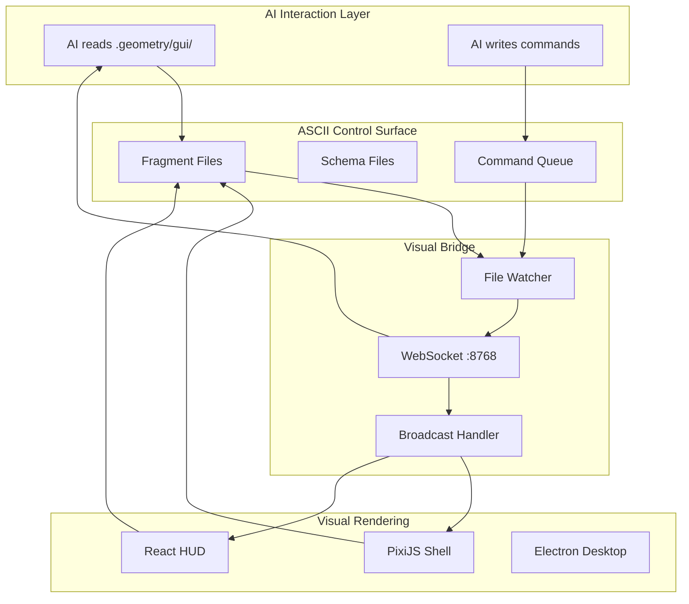
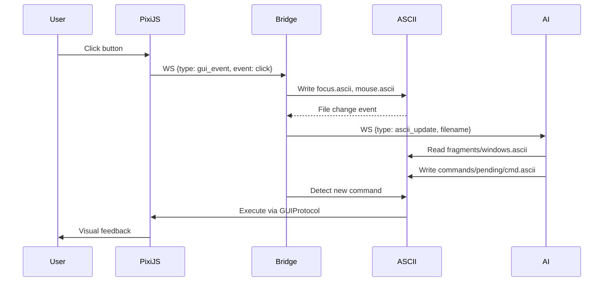

# Design: Geometry OS ASCII GUI System

## Overview

Dual-audience GUI where every state is exposed as ASCII fragments. Humans use PixiJS visual rendering; AIs read/write `.geometry/gui/` files. Visual Bridge broadcasts changes via WebSocket (port 8768). Same interface, zero-cost AI perception.

## Architecture



## ASCII Control Surface

### Directory Structure

```
.geometry/gui/
  fragments/
    windows.ascii         # Active windows tree
    focus.ascii           # Focused element state
    menus.ascii           # Menu hierarchy
    panels.ascii          # Panel layouts
    mouse.ascii           # Mouse position/state
    keyboard.ascii        # Keyboard state
    clipboard.ascii       # Clipboard content
  schemas/
    window.schema.yaml    # Window fragment schema
    panel.schema.yaml     # Panel fragment schema
    command.schema.yaml   # Command format schema
  commands/
    pending/              # Incoming commands (AI writes here)
    completed/            # Acknowledged commands
  state/
    layout.ascii          # Current layout configuration
    theme.ascii           # Theme settings
    preferences.ascii     # User preferences
```

### Fragment Schemas

**Window Fragment** (`fragments/windows.ascii`):
```yaml
# ASCII Window Fragment
# Updated: 2026-02-23T16:30:00Z
windows:
  - id: win-001
    title: "Terminal"
    type: terminal
    pos: [100, 50]
    size: [640, 480]
    z: 3
    focused: true
    children:
      - id: win-001-tab-1
        type: tab
        title: "bash"
        active: true
  - id: win-002
    title: "Code Editor"
    type: editor
    pos: [750, 50]
    size: [800, 600]
    z: 2
    focused: false
    state:
      file: "/src/main.py"
      line: 42
      modified: true
```

**Focus Fragment** (`fragments/focus.ascii`):
```
+------------------------------------------------------------------------------+
| FOCUS STATE                                                                  |
+------------------------------------------------------------------------------+
| Window:     win-001 (Terminal)                                               |
| Element:    textarea[0]                                                      |
| Cursor:     (12, 5)                                                          |
| Selection:  None                                                             |
| Mode:       insert                                                           |
+------------------------------------------------------------------------------+
```

**Menu Fragment** (`fragments/menus.ascii`):
```yaml
menus:
  main:
    - label: "File"
      items:
        - { label: "New", shortcut: "Ctrl+N", enabled: true }
        - { label: "Open", shortcut: "Ctrl+O", enabled: true }
        - { label: "Save", shortcut: "Ctrl+S", enabled: false }
    - label: "Edit"
      items:
        - { label: "Undo", shortcut: "Ctrl+Z", enabled: true }
        - { label: "Redo", shortcut: "Ctrl+Y", enabled: false }
  context:
    visible: false
    pos: [0, 0]
    items: []
```

**Panel Fragment** (`fragments/panels.ascii`):
```yaml
panels:
  - id: panel-sidebar
    type: sidebar
    anchor: left
    size: 240
    collapsed: false
    widgets:
      - { type: file_tree, path: "/src" }
      - { type: search, query: "" }
  - id: panel-status
    type: statusbar
    anchor: bottom
    size: 32
    items:
      - { type: text, content: "Ready" }
      - { type: git_branch, branch: "main" }
      - { type: memory, used: 128, total: 1024 }
```

**Mouse Fragment** (`fragments/mouse.ascii`):
```
+------------------------------------------------------------------------------+
| MOUSE STATE                                                                  |
+------------------------------------------------------------------------------+
| Position:  (512, 384)                                                        |
| Screen:    (512, 384)                                                        |
| Window:    win-001 @ (412, 334)                                              |
| Buttons:   [none]                                                            |
| Modifiers: [none]                                                            |
| Hover:     textarea[0]                                                       |
+------------------------------------------------------------------------------+
```

**Keyboard Fragment** (`fragments/keyboard.ascii`):
```
+------------------------------------------------------------------------------+
| KEYBOARD STATE                                                               |
+------------------------------------------------------------------------------+
| Pressed:   [none]                                                            |
| Modifiers: [none]                                                            |
| Last Key:  'a' (0x61) at 2026-02-23T16:30:00.123Z                           |
| Layout:    us                                                                |
+------------------------------------------------------------------------------+
```

### Command Queue

**Command Schema** (`schemas/command.schema.yaml`):
```yaml
type: object
required: [command_id, action, timestamp]
properties:
  command_id:
    type: string
    description: Unique identifier for tracking
  action:
    type: string
    enum: [click, type, key, move, scroll, drag, resize, close, focus]
  target:
    type: string
    description: Element selector or window ID
  params:
    type: object
    description: Action-specific parameters
  timestamp:
    type: string
    format: date-time
```

**Example Commands** (`commands/pending/cmd-001.ascii`):
```yaml
command_id: cmd-001
action: click
target: "button[title='Save']"
params:
  button: left
  count: 1
timestamp: 2026-02-23T16:30:01.000Z
source: ai-agent
```

## Components

### GUIFragmentRenderer

**Purpose**: Converts GUI state to ASCII fragments
**Location**: `systems/visual_shell/ascii_gui/fragment_renderer.py`

```python
class GUIFragmentRenderer(GUIShellHook):
    """
    ASCII renderer for GUI state.

    Implements GUIShellHook to receive GUI events and emits .ascii files.
    """

    output_dir: Path  # .geometry/gui/fragments/
    windows: Dict[str, Window]
    focused_id: Optional[str]
    mouse_state: MouseState
    keyboard_state: KeyboardState
    menus: MenuTree
    panels: List[Panel]

    def on_window_create(self, id, title, pos, size): ...
    def on_window_focus(self, id): ...
    def on_window_close(self, id): ...
    def on_mouse_move(self, x, y): ...
    def on_key_press(self, key, modifiers): ...

    def _write_windows(self): ...
    def _write_focus(self): ...
    def _write_mouse(self): ...
    def _write_keyboard(self): ...
```

### GUICommandProcessor

**Purpose**: Processes AI commands from command queue
**Location**: `systems/visual_shell/ascii_gui/command_processor.py`

```python
class GUICommandProcessor:
    """
    Watches commands/pending/ and executes GUI actions.

    Moves processed commands to commands/completed/.
    """

    pending_dir: Path
    completed_dir: Path
    gui_protocol: GUIProtocol

    async def start(self): ...  # Start file watcher
    async def process_command(self, cmd: Command): ...
    def _execute_click(self, target, params): ...
    def _execute_type(self, target, params): ...
    def _execute_key(self, target, params): ...
```

### GUIHookBroadcaster

**Purpose**: Broadcasts GUI events to multiple hooks
**Location**: `systems/visual_shell/ascii_gui/hooks.py`

```python
class GUIShellHook(ABC):
    @abstractmethod
    async def on_window_create(self, id, title, pos, size): ...
    @abstractmethod
    async def on_window_focus(self, id): ...
    @abstractmethod
    async def on_window_close(self, id): ...
    @abstractmethod
    async def on_mouse_move(self, x, y): ...
    @abstractmethod
    async def on_key_press(self, key, modifiers): ...
    @abstractmethod
    async def on_menu_open(self, menu_id): ...

class GUIHookBroadcaster(GUIShellHook):
    hooks: List[GUIShellHook]

    def add_hook(self, hook: GUIShellHook): ...
    async def on_window_create(self, ...): ...  # Dispatch to all
```

## Data Flow



1. User interacts with PixiJS visual
2. PixiJS sends event to Visual Bridge via WebSocket
3. GUIFragmentRenderer writes ASCII fragments
4. Bridge broadcasts ASCII updates to all clients
5. AI reads ASCII state, decides action
6. AI writes command to `commands/pending/`
7. GUICommandProcessor executes command
8. State changes trigger fragment updates
9. Cycle continues

## Technical Decisions

| Decision | Options | Choice | Rationale |
|----------|---------|--------|-----------|
| Fragment format | JSON, YAML, custom ASCII | YAML + ASCII boxes | YAML for structured data, boxes for quick scanning |
| Command delivery | File queue, WebSocket, HTTP | File queue | Atomic writes, no connection management, replay-able |
| File watching | polling, inotify, watchdog | watchdog | Cross-platform, efficient, already used in project |
| Atomicity | none, temp+rename, locks | temp+rename | Consistent with existing ASCII Scene Graph pattern |
| State sync | push, pull, hybrid | push via WS + pull via files | WS for real-time, files for persistence |

## Error Handling

| Scenario | Strategy | User Impact |
|----------|----------|-------------|
| Invalid command | Log, move to `completed/` with error | AI retries or adapts |
| Fragment write failure | Retry 3x, log, continue | Stale state shown |
| Bridge disconnect | Buffer events, reconnect | Brief state lag |
| Schema mismatch | Validate on read, reject invalid | Command ignored |
| Concurrent command writes | UUID collision check | Last write wins |

## Edge Cases

- **Large clipboard**: Truncate in fragment, store full content in `.geometry/gui/clipboard.bin`
- **Rapid events**: Throttle fragment writes to 10Hz max
- **Offline AI**: Commands queue in `pending/`, processed on reconnection
- **Window count limit**: Max 50 windows in fragment, oldest unfocused dropped
- **Unicode in titles**: UTF-8 encode, replace invalid with `?`

## Test Strategy

### Unit Tests
- `test_fragment_renderer.py`: Verify YAML/ASCII output format
- `test_command_processor.py`: Command parsing and execution
- `test_hooks.py`: Event dispatch correctness

### Integration Tests
- `test_e2e_flow.py`: User action -> ASCII -> AI -> Command -> Action
- `test_bridge_sync.py`: WebSocket and file consistency

### AI Perception Tests
- `test_ai_read.py`: AI can parse all fragment types
- `test_ai_write.py`: AI commands execute correctly

## Performance Considerations

- Throttle fragment writes to 100ms minimum interval
- Use delta encoding for large fragments (optional)
- Compress ASCII boxes for transmission (gzip)
- Limit history to last 100 commands per session

## Security Considerations

- Command queue is local-only (no remote writes)
- Validate all commands against schema before execution
- Rate limit command processing (100/min max)
- Log all AI-initiated actions with source ID

## Existing Patterns to Follow

From codebase analysis:
- `VisualShellAsciiRenderer`: Hook pattern, atomic writes, auto_flush
- `VisualShellHookBroadcaster`: Async dispatch, gather with return_exceptions
- `NeuralCityAsciiRenderer`: Viewport sizing, progress bars, status indicators
- `visual_bridge.py`: WebSocket broadcasting, file watching, ASCII poller

## File Structure

| File | Action | Purpose |
|------|--------|---------|
| `systems/visual_shell/ascii_gui/__init__.py` | Create | Module exports |
| `systems/visual_shell/ascii_gui/fragment_renderer.py` | Create | GUI ASCII renderer |
| `systems/visual_shell/ascii_gui/command_processor.py` | Create | Command queue processor |
| `systems/visual_shell/ascii_gui/hooks.py` | Create | GUI hook system |
| `systems/visual_shell/ascii_gui/schemas.py` | Create | Schema validation |
| `.geometry/gui/` | Create | Directory structure |
| `systems/visual_shell/api/visual_bridge.py` | Modify | Add GUI ASCII support |

## Unresolved Questions

1. Should commands be signed for AI authenticity verification?
2. What is the maximum fragment size before truncation?
3. Should we support command priorities (urgent vs normal)?

## Implementation Steps

1. Create `.geometry/gui/` directory structure
2. Implement `systems/visual_shell/ascii_gui/hooks.py`
3. Implement `systems/visual_shell/ascii_gui/fragment_renderer.py`
4. Implement `systems/visual_shell/ascii_gui/command_processor.py`
5. Wire into `visual_bridge.py` ASCII poller
6. Add PixiJS hooks for GUI events
7. Write unit tests for fragment rendering
8. Write integration tests for command flow
9. Document AI interaction protocol
10. Add schema validation for commands
