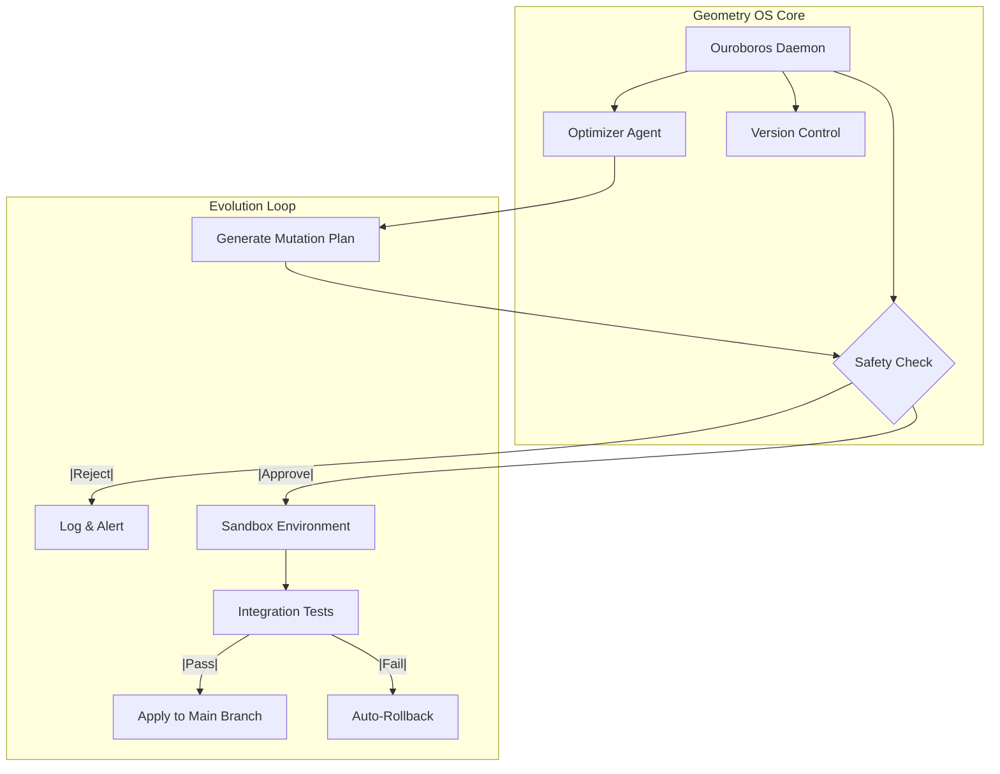

# Solution for Task: **Task 6**: Create comprehensive documentation including architecture diagrams component specifications usage guides for system administrators safety governor configuration reference implementation examples evolution cycle monitoring dashboards operational runbooks troubleshooting guide security considerations.

Here is the implementation plan for **Task 6: Comprehensive Documentation & Safety Configuration** within the Geometry OS `PHASE5-SELF-EVOLUTION_DAEMON_IMPLEMENTATION`.

This task focuses on the non-code artifacts required to operate, monitor, and secure the Ouroboros system.

### 1. File Paths

The following documentation structure should be created under the `/docs/` and `/config/` directories.

**Documentation:**
*   `docs/architecture/ouroboros_architecture.md`
*   `docs/administration/usage_guide.md`
*   `docs/operations/runbooks.md`
*   `docs/monitoring/dashboard_definitions.json`
*   `docs/security/safety_considerations.md`

**Configuration & Examples:**
*   `config/safety_governor.toml` (Reference implementation)
*   `examples/evolution_cycle_monitor.py` (Dashboard data source example)

---

### 2. Code Snippets

#### A. Safety Governor Configuration (`config/safety_governor.toml`)
This configuration file enforces the hard constraints mentioned in the design phase to prevent runaway modifications.

```toml
# Geometry OS: Ouroboros Safety Governor Configuration
# This file defines the immutable boundaries for self-evolution.

[governor]
# Enable the daemon. If false, the system remains static.
enabled = true
# Maximum percentage of system codebase allowed to change in a single cycle.
max_mutation_rate = 0.05 
# Time in seconds to wait for human intervention if a 'HALT' signal is triggered.
halt_timeout = 3600 

[boundaries]
# Directories that are READ-ONLY. The daemon will reject any plan modifying these.
protected_paths = [
    "/geometry_os/kernel/core_safety.rs",
    "/geometry_os/config/safety_governor.toml",
    "/geometry_os/identity/genesis_block"
]

[resource_limits]
# Max CPU/Memory allocation for the sandboxed evolution environment.
max_cpu_percent = 40.0
max_memory_mb = 4096

[rollback]
# Automatic revert criteria.
auto_revert_on_metrics_degradation = true
performance_threshold_percent = 5.0
```

#### B. Dashboard Definition (`docs/monitoring/dashboard_definitions.json`)
A schema definition for the monitoring dashboard to visualize the evolution cycle.

```json
{
  "dashboard_title": "Geometry OS: Ouroboros Evolution Monitor",
  "panels": [
    {
      "title": "Evolution Cycle Status",
      "type": "status",
      "query": "ouroboros.state",
      "states": ["IDLE", "DISCOVERING", "VALIDATING", "APPLYING", "ROLLBACK"]
    },
    {
      "title": "System Integrity Score",
      "type": "gauge",
      "query": "safety.integrity_score",
      "min": 0,
      "max": 100,
      "thresholds": [
        { "value": 80, "color": "red" },
        { "value": 95, "color": "yellow" },
        { "value": 100, "color": "green" }
      ]
    },
    {
      "title": "Mutation Delta",
      "type": "graph",
      "query": "ouroboros.mutation_lines_changed",
      "description": "Tracks the volume of code changes per cycle."
    }
  ]
}
```

#### C. Architecture Diagram (Mermaid Source)
Included in `docs/architecture/ouroboros_architecture.md`.



---

### 3. Next Steps

To finalize this phase, execute the following command to generate the directory structure and initialize the documentation files:

```bash
mkdir -p docs/architecture docs/administration docs/operations docs/monitoring docs/security config examples && touch docs/architecture/ouroboros_architecture.md config/safety_governor.toml
```