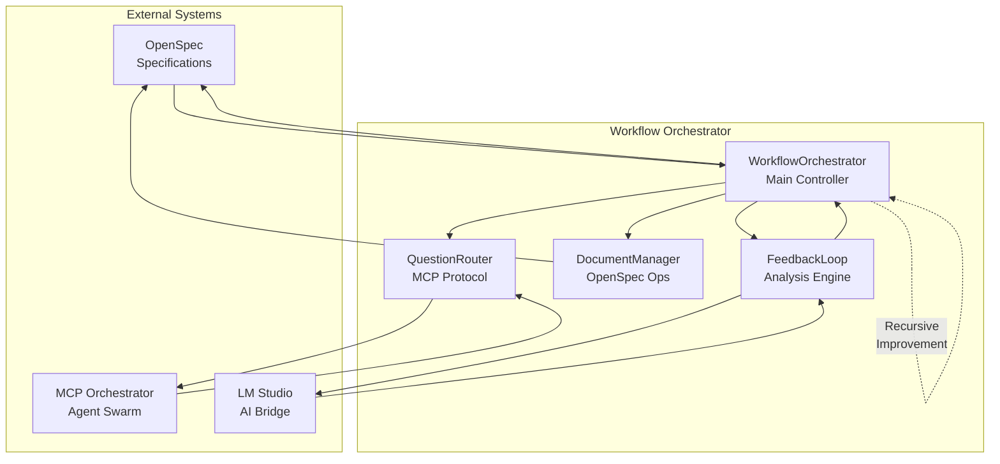
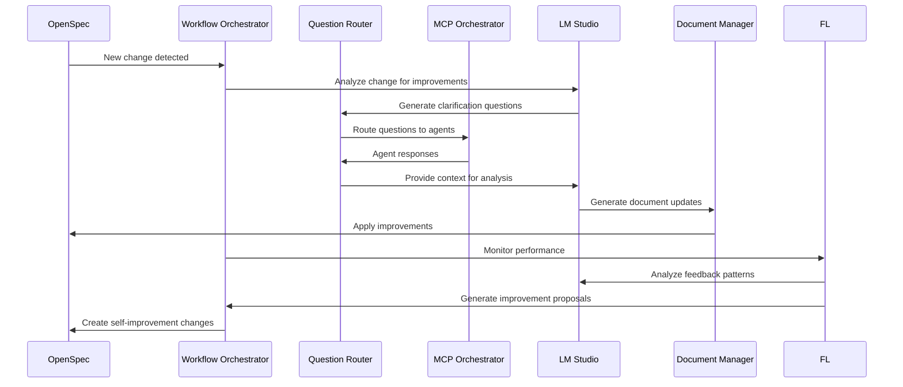

# Self-Improving Workflow System Design

## Architecture Overview

The Self-Improving Workflow System integrates OpenSpec, MCP Orchestrator, and LM Studio in a recursive improvement loop. The system consists of four main components working together:



### Data Flow Architecture



## Component Details

### 1. Workflow Orchestrator
**Location**: `systems/workflow_orchestrator/`

The central coordinator that manages the recursive improvement loop:

- **Question Router**: Routes AI questions to appropriate MCP tools/agents
- **Document Manager**: Handles OpenSpec document updates and versioning
- **Feedback Analyzer**: Analyzes system performance and generates improvement suggestions
- **Loop Controller**: Manages the recursive improvement cycle

**Key Classes**:
- `WorkflowOrchestrator`: Main coordination logic
- `QuestionRouter`: MCP protocol question handling
- `DocumentManager`: OpenSpec document operations
- `FeedbackLoop`: Improvement analysis and application

### 2. Question Routing System
**Integration**: Extends MCP Orchestrator with question handling

**Features**:
- AI agents can ask questions via MCP tools
- Questions routed to appropriate agents or external systems
- Response caching and optimization
- Context preservation across conversations

**MCP Tools Added**:
- `ask_question`: Submit question to routing system
- `get_answer`: Retrieve answers for agents
- `list_questions`: View active questions

### 3. Document Update Mechanisms
**Integration**: OpenSpec filesystem with AI-driven updates

**Features**:
- Automatic document updates based on AI insights
- Version control and change tracking
- Proposal generation from feedback
- Review cycle automation

**Operations**:
- Update existing documents with improvements
- Generate new proposals from analysis
- Track changes and authorship
- Maintain document consistency

### 4. Feedback Loop Analysis
**Integration**: LM Studio analysis + system metrics

**Features**:
- Performance monitoring of all components
- AI-powered improvement suggestions
- Automated implementation of improvements
- Recursive self-enhancement

**Analysis Types**:
- Workflow efficiency analysis
- Error pattern detection
- Performance bottleneck identification
- Feature usage optimization

## Data Flow

### Normal Operation Flow
1. **OpenSpec Change** → Workflow Orchestrator receives change notification
2. **AI Analysis** → LM Studio analyzes change for improvements
3. **Question Generation** → AI asks questions via MCP if clarification needed
4. **Agent Response** → MCP agents provide answers/tools
5. **Document Update** → OpenSpec documents updated with insights
6. **Feedback Loop** → System analyzes its own performance

### Recursive Improvement Flow
1. **Monitor Performance** → Collect metrics from all components
2. **Generate Insights** → LM Studio analyzes patterns and bottlenecks
3. **Propose Improvements** → Create OpenSpec changes for enhancements
4. **Implement Changes** → Apply improvements automatically
5. **Measure Impact** → Verify improvements and continue loop

## Integration Points

### OpenSpec ↔ Workflow Orchestrator
- File system watchers for change detection
- Document parsing and update APIs
- Proposal generation hooks
- Review cycle integration

### MCP Orchestrator ↔ Workflow Orchestrator
- Question submission tools
- Agent capability queries
- Tool execution results
- System health monitoring

### LM Studio ↔ Workflow Orchestrator
- Text generation for analysis
- Code review and suggestions
- Document improvement generation
- Feedback analysis prompts

## API Interfaces

### Workflow Orchestrator API
```python
class WorkflowOrchestrator:
    async def process_openspec_change(self, change_path: str) -> None
    async def route_question(self, question: str, context: dict) -> str
    async def update_document(self, path: str, changes: dict) -> bool
    async def analyze_feedback(self) -> List[Improvement]
```

### Question Router API
```python
class QuestionRouter:
    async def ask_question(self, question: str, agent_id: str) -> str
    async def get_pending_questions(self) -> List[Question]
    async def submit_answer(self, question_id: str, answer: str) -> None
```

### Document Manager API
```python
class DocumentManager:
    async def read_openspec(self, path: str) -> OpenSpecDocument
    async def update_openspec(self, path: str, updates: dict) -> bool
    async def create_proposal(self, title: str, content: str) -> str
    async def get_change_history(self, path: str) -> List[Change]
```

## Configuration

### Environment Variables
- `WORKFLOW_ORCHESTRATOR_SOCKET`: Unix socket path
- `OPENSPEC_WATCH_PATH`: OpenSpec changes directory
- `LM_STUDIO_BASE_URL`: LM Studio API endpoint
- `MCP_ORCHESTRATOR_SOCKET`: MCP orchestrator socket

### Configuration File
```yaml
workflow_orchestrator:
  socket_path: /tmp/workflow_orchestrator.sock
  openspec_path: openspec/changes/
  lm_studio_url: http://localhost:1234
  mcp_socket: /tmp/mcp_orchestrator.sock

question_routing:
  cache_timeout: 3600
  max_concurrent_questions: 10

document_updates:
  auto_commit: true
  backup_before_update: true

feedback_loop:
  analysis_interval: 3600
  improvement_threshold: 0.1
```

## Deployment

### System Requirements
- Python 3.8+
- LM Studio running locally
- MCP Orchestrator active
- OpenSpec filesystem access

### Startup Sequence
1. Start MCP Orchestrator
2. Start LM Studio
3. Start Workflow Orchestrator
4. Register with MCP Orchestrator
5. Begin monitoring OpenSpec changes

### Monitoring
- Health check endpoints
- Performance metrics collection
- Error logging and alerting
- Recursive improvement tracking