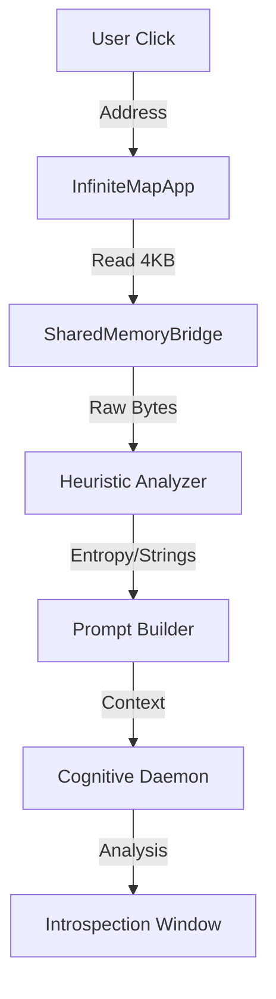

# Design: Synaptic Query Interface

## Visual Architecture
The interface will introduce a new "Introspection" layer to the UI.

### 1. Interaction Flow
1.  **Trigger**: User clicks a pixel in "QEMU RAM" window.
2.  **Highlight**: The clicked pixel (representing 1 byte) expands to show a "Region of Interest" (ROI), perhaps highlighting the surrounding 4KB page on the Hilbert curve.
3.  **Action**: User invokes "Analyze" (keybinding or context menu).
4.  **Feedback**: A "Synaptic Pulse" animation plays while the LLM processes.
5.  **Result**: An overlay or side-panel displays the analysis.

### 2. UI Components
- **IntrospectionWindow**: A new window type inheriting from the standard glass style.
    - **Left Pane**: Hex Editor / Raw View of the selected 4KB page.
    - **Right Pane**: "Neural Insight" markdown viewer.
- **Overlay**: If the analysis is short, it can appear as a floating tooltip following the cursor.

## Data Flow

## Morphological Impact
- **PAS Score Impact**: Low (Text/UI update).
- **Geometric Integrity**: The Hilbert visualization remains the ground truth; this is an annotation layer.

## Technical Constraints
- **Context Limit**: Cannot send GBs of RAM. 4KB chunks are standard OS page sizes and fit well in LLM context windows.
- **Token limit**: Hex dumps are token-heavy. Must use "Heuristic Summary" if raw dump is too large.
