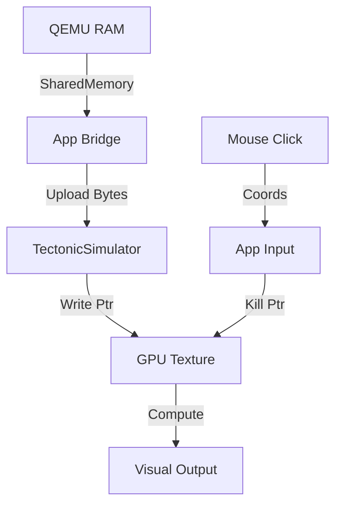

# Design: Tectonic Integration

## Geometric Mapping
-   **Inner Ring (Kernel)**: The `AntigravityDaemon` (AI State) occupies the low Hilbert addresses (Center/Start).
-   **Outer Ring (User)**: The `QEMU` RAM occupies high Hilbert addresses (Periphery).
-   **Segmentation**: 
    -   Texture Size: 4096 x 4096 (16M pixels).
    -   Kernel: First 1M pixels (1024x1024 equivalent area, though distributed via Hilbert).
    -   User: Remaining space.
    -   *Simplification for Phase 4*: Just overlay QEMU RAM on top of the "background" texture, letting the Daemon write to the "Kernel" region.

## Interaction Model
-   **Input**: Mouse Click (Left).
-   **Action**: `write_texture` with `vec4(0.0, 0.0, 0.0, 0.0)` (Void).
-   **Feedback**: The `tectonic_kernel.wgsl` will naturally propagate this "Void" if neighbors are weak, or "Heal" it if neighbors are strong. This turns process termination into a biological wound/healing event.

## Data Flow

