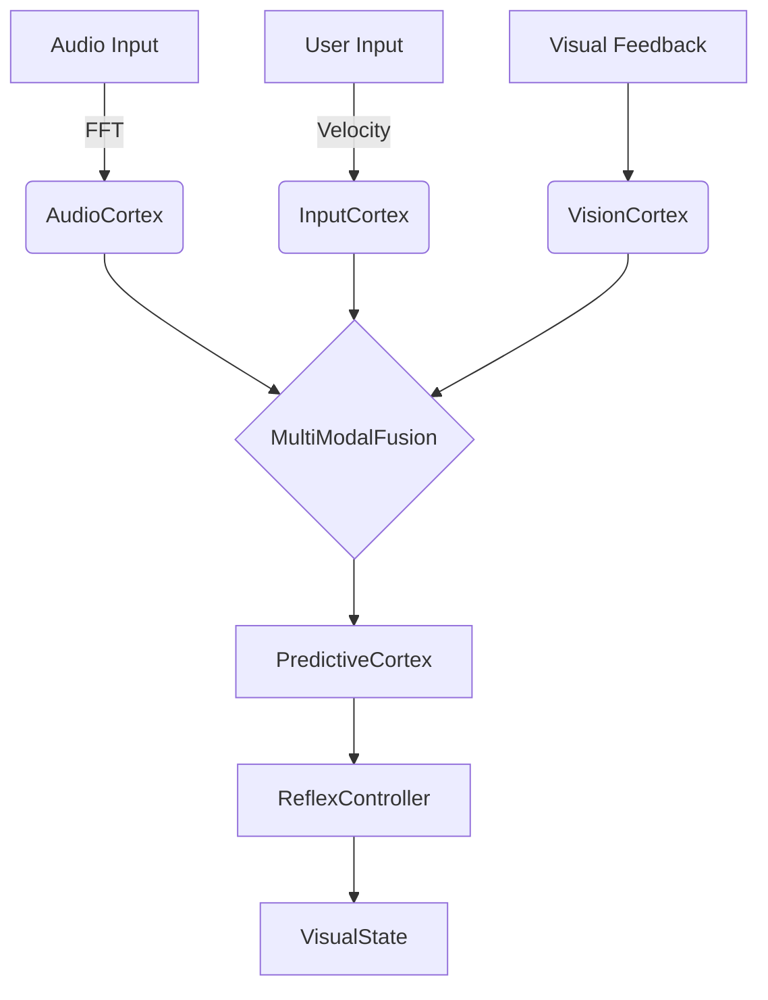

# Design: Multi-Modal Morphological Alignment

## Visual Impact Analysis
The introduction of Audio and Input reflexes will directly drive the **PixelRTS** visual state.

### 1. Auditory Reflexes (Synesthesia)
- **Low Frequencies (Bass)**:
  - **Morph**: Slower, deep geometric contractions.
  - **Color**: Shift towards Deep Purple/Blue.
  - **Reflex**: `BassThump` -> Slight screen shake / Zoom pulse.
- **High Frequencies (Treble)**:
  - **Morph**: Rapid, sharp fractal subdivision.
  - **Reflex**: `TrebleSpark` -> Localized brightness spikes.
- **Volume Spike (Loud)**:
  - **Reflex**: `StartleReflex` -> Instant dampening (Pupillary constriction) followed by rapid recovery.

### 2. Input Reflexes (Kinetic Arousal)
- **High Velocity (Rapid Mouse/Typing)**:
  - **State**: High Arousal / Focus.
  - **Morph**: Increased contrast, reduced entropy (sharpening).
  - **Reflex**: `FocusTunnel` -> Vignette tightens, center brightens.
- **Idle (No Input)**:
  - **State**: Daydreaming / Default Mode Network.
  - **Morph**: Increased entropy, drifting gradients.

## Geometric Integrity (PAS Score)
- **Phase Alignment**: Audio signals must be quantized to the visual frame rate (60fps) to prevent "temporal tearing" (jittery animations).
- **Smoothing**: Raw audio FFT must be smoothed (Release time ~0.2s) to maintain Morphological Continuity.

## Architecture

