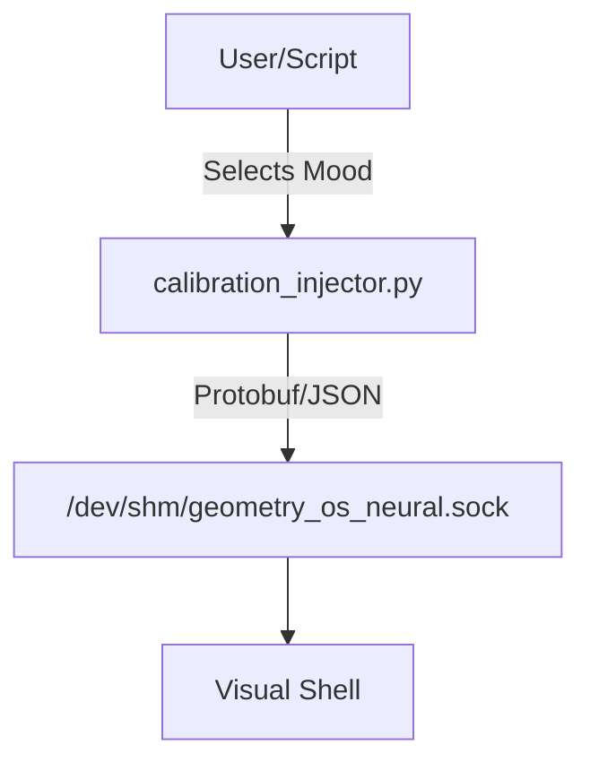

# Design: Neural Calibration Patterns

## Architecture: The Masquerade
The `injector.py` will bind to `/tmp/geometry_os_neural.sock` (replacing the real daemon temporarily). It will accept CLI commands to switch "Moods".

## The Standard Emotions (Test Vectors)

### 1. PANIC (Red Alert)
- **Neural Signature**: 
  - Activations: `[0.9, 0.95, 0.8, 1.0]` (Erratic high peaks)
  - Entropy: `0.9` (High Chaos)
  - Confidence: `0.2` (Confusion)
- **Expected Visuals**:
  - Color: `#ff4d4d` (Red/Orange)
  - Motion: Fast strobe / rapid morphing
  - Form: Jagged, sharp edges

### 2. DEEP FLOW (The Zone)
- **Neural Signature**:
  - Activations: `[0.8, 0.8, 0.8, 0.8]` (High, Stable)
  - Entropy: `0.1` (Ordered)
  - Confidence: `0.98` (Absolute Certainty)
- **Expected Visuals**:
  - Color: `#00ff88` / `#00ffff` (Cyan/Green Neon)
  - Motion: Smooth, flowing waves
  - Form: Symmetrical, coherent Hilbert curves

### 3. VOID (Deep Sleep)
- **Neural Signature**:
  - Activations: `[0.1, 0.05, 0.1, 0.0]` (Near Zero)
  - Entropy: `0.0`
  - Confidence: `0.5`
- **Expected Visuals**:
  - Color: `#050505` (Almost Black)
  - Motion: Barely perceptible "breathing"
  - Form: Minimal structure
