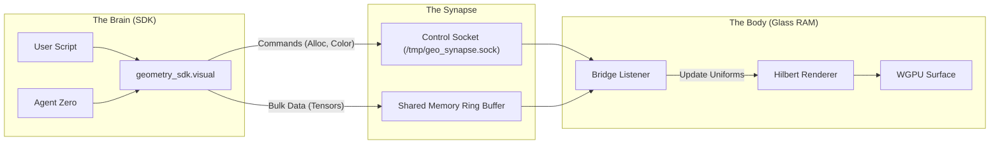

# Design: The Synaptic SDK Bridge

## 1. Architecture

The system uses a **Client-Server** model over **Shared Memory** (or Unix Domain Sockets for control messages) to link Python and Rust.



## 2. Protocol (The "Nerve Impulses")

### 2.1 Control Socket (Commands)
We define a lightweight binary protocol for the Unix Domain Socket:

| Field | Type | Description |
|---|---|---|
| `OpCode` | `u8` | The action (e.g., `ALLOC_TOWER`, `SET_COLOR`, `PULSE`) |
| `Id` | `u64` | Target object ID (or address) |
| `Payload` | `[u8; 16]` | Parameters (color hex, height, duration) |

**OpCodes:**
- `0x01 ALLOC_TOWER`: Create a visual block at Hilbert Index $H$.
- `0x02 SET_COLOR`: Change the color of a block.
- `0x03 PULSE`: Trigger a transient animation.
- `0x04 TEXT_OVERLAY`: (Later) Render text nearby.
- `0x05 CLEAR`: Reset a region.

### 2.2 Python API (`geometry_sdk/visual`)

It should feel like magic:

```python
from geometry_sdk.visual import Cryo, Color

# Connect to the running cortex
cortex = Cryo.connect()

# Create a thought
thought_block = cortex.alloc(size=1024, label="Decision Tree")
thought_block.color = Color.NEON_PURPLE
thought_block.pulse(intensity=0.8)
```

## 3. Rust Implementation (`glass_ram/bridge.rs`)

- **Async Task**: Runs on a separate Tokio thread to avoid blocking the render loop.
- **Command Queue**: Pushes updates to a `Mutex<Vec<VisualCommand>>` which the main render loop consumes each frame.
- **Interpolation**: The renderer smooths out changes (lerp) so Python's 10-60Hz updates look like 144Hz fluid motion.

## 4. Stability
- **Disconnect**: If Python crashes, the "Body" remains stable (visuals persist or fade gently).
- **Latency**: Optimization goal is <2ms roundtrip.
