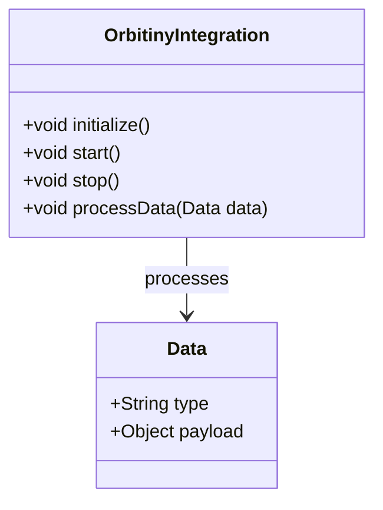
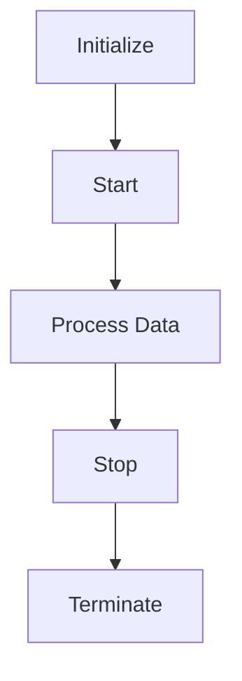

# Design: docs-orbitiny-integration

# Technical Design: Comprehensive Documentation for the Orbitiny Integration Component

## Overview

The `orbitiny_integration` component is a crucial module within the Geometry OS project, responsible for handling specific integration tasks. This documentation aims to provide comprehensive guidance on its functionality, architecture, configuration, and usage.

## Architecture

### Class Diagram



### Flowchart



### Component Interactions

1. **Initialization**: The `OrbitinyIntegration` component is initialized via the `initialize()` method.
2. **Data Processing**: Once initialized, the component can process data using the `processData(Data)` method.
3. **Shutdown**: When no longer needed, the component is shut down through the `stop()` method.

## Configuration

The `orbitiny_integration` component supports configuration for various environments (development, testing, production). Configuration files should be located in the `config` directory and named according to the environment. Example filenames are `dev_config.yaml`, `test_config.yaml`, and `prod_config.yaml`.

### Development Environment
- **Example Config**: `dev_config.yaml`
  ```yaml
  orbitiny:
    debug: true
    poll_interval: 5
  ```

### Testing Environment
- **Example Config**: `test_config.yaml`
  ```yaml
  orbitiny:
    debug: false
    poll_interval: 1
  ```

### Production Environment
- **Example Config**: `prod_config.yaml`
  ```yaml
  orbitiny:
    debug: false
    poll_interval: 10
  ```

## API Documentation

### Public Methods

#### `initialize()`
- **Description**: Initializes the component.
- **Parameters**: None
- **Return Value**: `void`

#### `start()`
- **Description**: Starts the component.
- **Parameters**: None
- **Return Value**: `void`

#### `stop()`
- **Description**: Stops the component.
- **Parameters**: None
- **Return Value**: `void`

#### `processData(Data data)`
- **Description**: Processes incoming data.
- **Parameters**:
  - `data (Data)`: The data to be processed.
- **Return Value**: `void`

### Example Usage

```java
OrbitinyIntegration orbitiny = new OrbitinyIntegration();
orbitiny.initialize();
orbitiny.start();

Data data = new Data("type", "payload");
orbitiny.processData(data);

orbitiny.stop();
```

## Troubleshooting Guide

1. **Error: Unable to Process Data**
   - **Solution**: Ensure that the `processData` method is being called with valid data and that the component has been properly initialized.

2. **Error: Component not Starting**
   - **Solution**: Check the initialization logs for any errors and ensure all dependencies are correctly configured.

3. **Error: Resource Leak**
   - **Solution**: Ensure that the `stop()` method is always called to release resources when the component is no longer needed.

## Conclusion

Comprehensive documentation is essential for effective development, integration, and maintenance of the `orbitiny_integration` component within Geometry OS. By providing detailed information on its architecture, configuration, APIs, and troubleshooting, this documentation will significantly reduce integration time and errors while enhancing collaboration and maintainability.