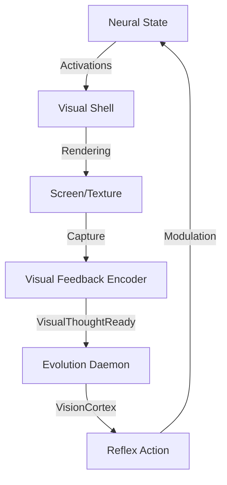

# Design: The Reflection Loop

## Architecture

## Vision Processing (Python)
Since Python is slow, we process thumbnail feedback (e.g., 64x64 or 128x128).
The `VisualFeedbackEncoder` in Rust already downsamples by factor 4.

### Decoding Algorithm
1.  **Base64 Decode** -> Binary RLE.
2.  **RLE Expansion** -> Raw RGBA bytes.
3.  **Numpy/PIL** -> Analysis.

## Reflex Actions

| Stimulus | Condition | Response |
|----------|-----------|----------|
| **Overstimulation** | Avg Brightness > 0.8 | Reduce Activations by 20% (Calm down) |
| **Monotony** | Variance < 0.05 | Inject Random Noise (Get bored) |
| **Red Dominance** | Red Channel > 1.5 * (Green+Blue) | Trigger "Cooling" (Shift to Blue) |

## Geometric Integrity
This closes the loop, turning the OS into a **Cybernetic Organism** satisfying the "Ouroboros" principle of Geometry OS.
