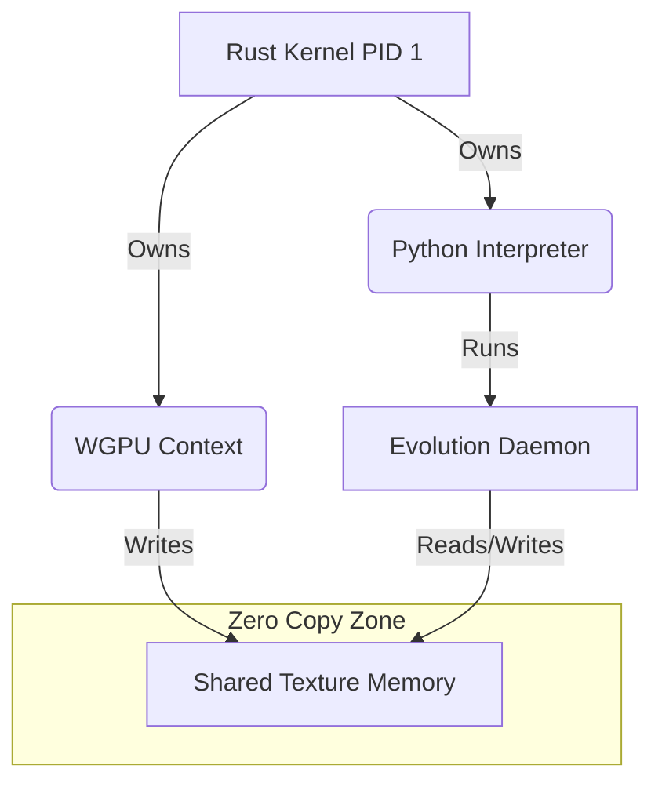

# Design: System Unity Architecture

## Overview
The goal is to embed the Python runtime *inside* the Rust Compositor process. This inverts the typical relationship where Python scripts call compiled libraries. Here, the OS Kernel (Rust) owns the runtime and invokes the Neural Cortex (Python).

## Structural Health & Layout

### Memory Architecture


### Phase Alignment Stability (PAS) Impact
- **Positive**: Removes async de-sync risks. The visual state is always frame-coherent with the neural state if stepped synchronously.
- **Negative**: Python GC pauses could cause frame drops.
- **Mitigation**: Run Python logic in a separate thread, but share memory directly. Use `pyo3`'s `Python::allow_threads` to release GIL during long computations (like LLM inference).

## Bridge Design (PyO3)

We will use `pyo3` to expose the Rust `NeuralState` struct to Python.

```rust
#[pyclass]
struct SharedNeuralState {
    // Shared via Arc<RwLock<...>> internally
}
```

Python will see:
```python
import geometry_os_kernel
state = geometry_os_kernel.get_state()
state.update_activations(...)
```

## Visual Morphology
No change to the *appearance* of the geometry, but the *responsiveness* will change. 
- **Latency**: < 1 frame (immediate update).
- **Glitch Potential**: Lower (no network partitions possible).

## Dependencies
- `pyo3` = "0.20"
- `pyo3-build-config` (for linking)
- `numpy` (for heavy math bridging)
