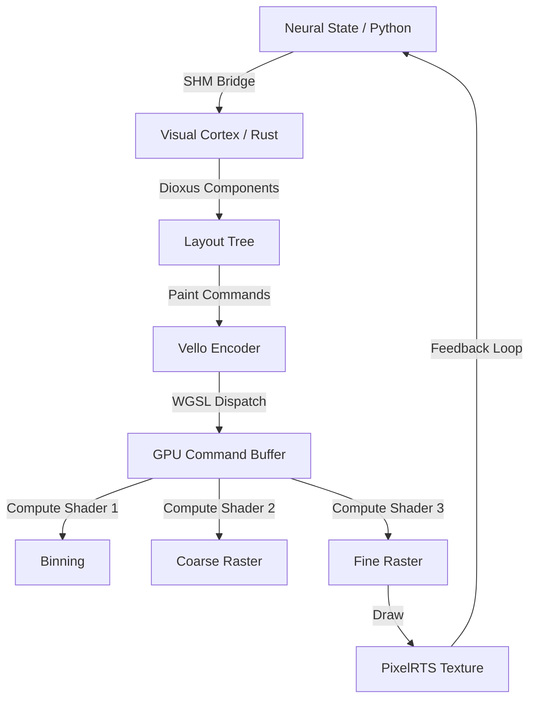
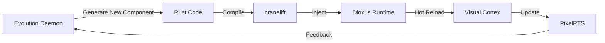

# Design: Dioxus Native + Vello-Powered Visual Shell & Hot-Patching

## Visual Philosophy
The Geometry OS Visual Shell must feel "alive". Every element is a geometric projection of the underlying neural state. By using **Dioxus Native** with **Vello**, we treat the UI as a **continuous signal field** rather than a stack of discrete rectangles.

**Dioxus Native + Vello = The first UI framework to treat the screen as a Signal Field, not a DOM tree.**

### Morphological Approach
- **Texture Synthesis**: The UI is generated as a `wgpu::Texture` via Compute Shaders.
- **Micro-Animations**: All transitions are procedural functions of time ($t$) and State ($\Sigma$), evaluated per-pixel in WGSL.
- **Glassmorphism**: Efficient background blurs and noise generation using `storage_texture` reads/writes.

## Technical Architecture

### Bionic Architecture (Python ↔ Rust)

| Layer | Technology | Role |
| :--- | :--- | :--- |
| **Neural Cortex** | Python (Current) | High-level reasoning, LLM orchestration, App logic |
| **Visual Cortex** | Rust + Dioxus | 120FPS UI rendering, Physics, Input handling |
| **The Bridge** | Shared Memory (SHM) | Zero-copy state sync (systems/health/software_shm.py) |
| **The Retinas** | WGSL / Vello | Pure GPU rasterization of the visual state |

**WGSL Integration**: It allows us to write "Neural Shaders" that live inside the UI components.

### 1. Rendering Pipeline (The "Blitz" Model)


### 2. WGSL Usage
We will adopt the **Parallel Segment Scan** approach:
- **Input**: Flattened list of Bezier curves.
- **Process**:
    - `path_reduce.wgsl`: Calculate bounding boxes.
    - `path_scan.wgsl`: Parallel prefix sum for segment sorting.
    - `tile_alloc.wgsl`: Assign segments to 16x16 tiles.
    - `fine.wgsl`: Calculate coverage and winding number per pixel.

### 3. Hot-Patching Mechanism (Dioxus Subsecond Hot-Patching)
To support "Self-Healing" and "Evolution" with Dioxus Native:
- **Dioxus Subsecond Hot-Patching**: Dioxus's built-in hot-reload system allows the Evolution Daemon to rewrite a Rust UI component, recompile it, and inject it into the running process in <500ms.
- **Watcher**: A file-system watcher monitors `.rs` (Dioxus components) and `.wgsl` (shaders) files.
- **Compiler**: On change, trigger `cranelift` (fast path for Rust) or `naga` (shader path for WGSL).
- **Injector**:
    - **Rust Components**: Dioxus Subsecond reloads the symbol table without dropping the visual frame.
    - **WGSL Shaders**: Re-create `wgpu::ShaderModule` and rebuild `RenderPipeline`.
    - **Visual Feedback**: The OS should "glitch" or "shimmer" briefly during a hot-patch event to indicate mutation.

**Killer Feature**: This is literal "Biological Adaptation" - the Evolution Daemon can mutate the OS provided it doesn't crash, without requiring a full system restart.

## Phase Alignment Stability (PAS)
- **Constraint**: All UI renders must align to the Hilbert Curve mapping of the `PixelRTS` container.
- **Verification**: A "PAS Compute Pass" will run post-render to ensure geometric integrity ($PAS > 0.95$).

## UX/UI Implications
- **Text**: Sub-pixel anti-aliased (Parley/Vello).
- **responsiveness**: <8ms input-to-photon latency.
- **Aesthetics**: High contrast, neon accents, "Dark Mode" native. No generic browser widgets.
- **Declarative UI**: Dioxus provides a reactive, declarative component model that mirrors the neural state.
- **Component Reusability**: Dioxus components can be hot-patched and evolved independently.

## Dioxus Component Architecture

### Component Structure
```rust
// Example: Neural State Visualizer Component
#[component]
fn NeuralStateVisualizer(state: ReadOnlySignal<NeuralState>) -> Element {
    let neural_activity = use_memo(move |_| {
        // Transform neural state into visual parameters
        state.read().activity_level
    });
    
    rsx! {
        div {
            class: "neural-visualizer",
            style: "opacity: {neural_activity}",
            // Vello-powered rendering happens here
            VelloRenderer {
                paths: generate_neural_paths(state),
                shaders: neural_shaders(),
            }
        }
    }
}
```

### State Synchronization
```rust
// Python → Rust State Bridge
extern "C" {
    fn sync_neural_state(shm_ptr: *const u8, size: usize);
}

fn update_from_python() {
    let shm_data = unsafe { read_shared_memory() };
    let neural_state: NeuralState = deserialize(shm_data);
    // Dioxus reactivity automatically updates UI
}
```

### Evolutionary Hot-Patch Flow


## Performance Targets
- **Rendering**: 120+ FPS for complex vector scenes (1000+ elements)
- **Latency**: <8ms input-to-photon latency
- **Hot-Patch**: <500ms component injection time
- **Memory**: <100MB for full Visual Cortex runtime
- **CPU**: <5% utilization (GPU-bound rendering)
