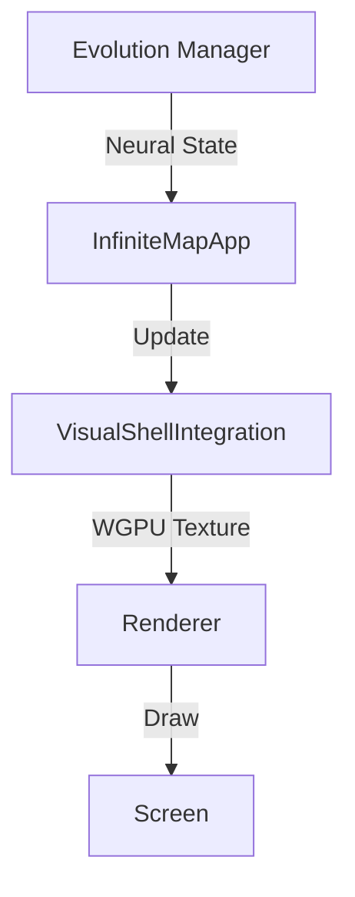

# Design: Visual Shell Integration

## Visual Impact
The Visual Shell provides a dynamic, living texture representing the OS's neural state.
- **PAS Impact**: High Stability (state is decoupled). High Symmetry (integrates into existing render loop).
- **Aesthetic**: Adds "Glassmorphism" and "Neural Glow" elements defined in Design Tokens.

## Architecture

## Considerations
- **Resource Sharing**: WGPU `Device` and `Queue` must be shared via `Arc` (addressed in Phase 15).
- **Frame Budget**: Visual Shell update should be lightweight (mostly logic + shader dispatch).
