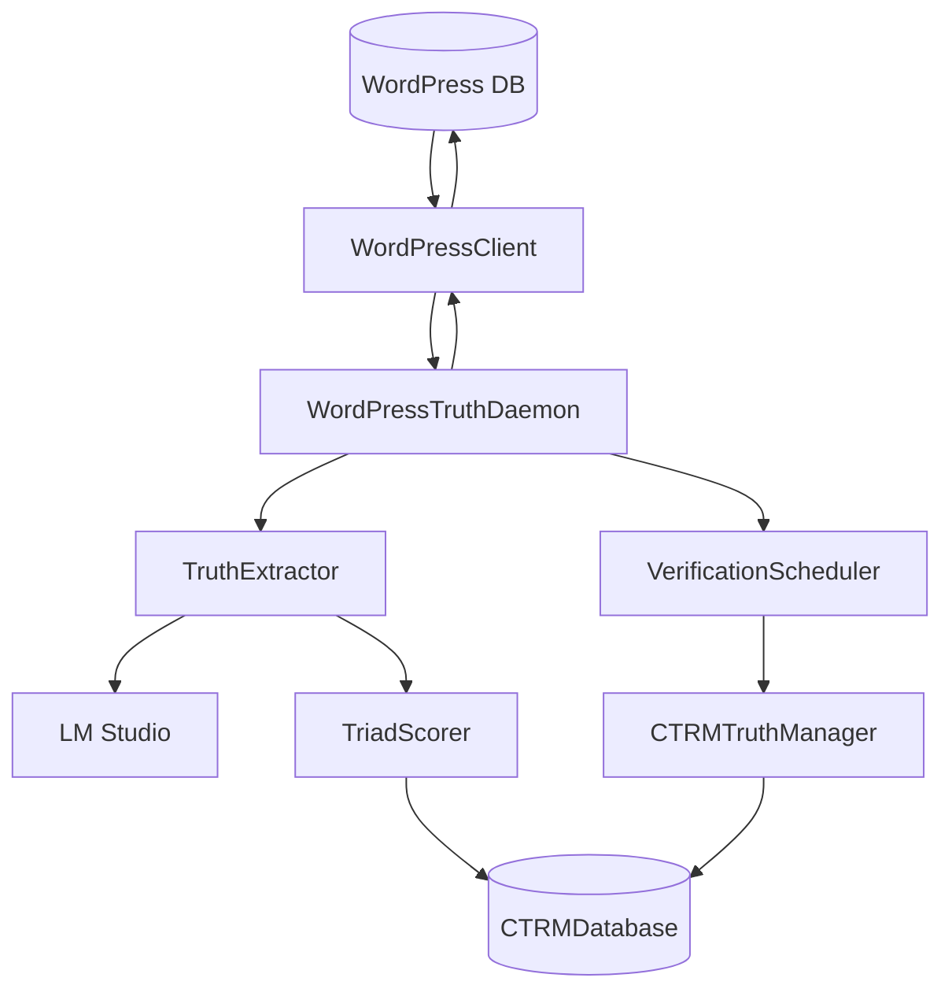

# Design: WordPress Truth Daemon

## Overview
Async daemon with 5 components: WordPressClient (HTTP), TruthExtractor (LLM), TriadScorer (formula), VerificationScheduler (periodic), WordPressTruthDaemon (orchestration). Uses existing CTRM infrastructure.

## Architecture



## Data Flow

1. **Discovery Loop** (every 60s):
   - WordPressClient.get_modified_posts(since=last_poll)
   - For each post: _process_post()
   - TruthExtractor.extract_claims() -> [ExtractedClaim]
   - WordPressClient.get_post_author_info() -> role
   - TriadScorer.calculate_score() -> TriadScore
   - CTRMTruthManager.create_truth()
   - WordPressClient.update_post_meta()

2. **Verification Loop** (every 3600s):
   - VerificationScheduler.run_cycle()
   - CTRMTruthManager.verify_foundational_truths(max_tokens=5000)
   - Updates confidence/distance in database

## Components

### WordPressClient (`wordpress_zone/wp_client.py`)
**Purpose**: HTTP interface to WordPress via ai-publisher.php

| Method | Args | Returns |
|--------|------|---------|
| `__init__` | base_url="http://localhost:8080" | - |
| `get_modified_posts` | since, post_types, limit | List[Dict] |
| `update_post_meta` | post_id, meta_key, meta_value | bool |
| `get_post_author_info` | post_id | Dict(role, post_count) |
| `_make_request` | payload | Dict |

**Request Format**:
```json
{"action": "getModifiedContent", "args": {"since": "...", "post_types": [...], "limit": 50}}
```

### TruthExtractor (`wordpress_zone/truth_extractor.py`)
**Purpose**: Extract claims from content using LM Studio

| Method | Args | Returns |
|--------|------|---------|
| `__init__` | model="microsoft/phi-4" | - |
| `extract_claims` | content, source_title | List[ExtractedClaim] |
| `_call_llm` | prompt | str |
| `_parse_response` | response, source_context | List[ExtractedClaim] |

**ExtractedClaim dataclass**:
- statement: str
- confidence: float (0.0-1.0)
- evidence_type: str (E1/E2/E3)
- source_context: str

**Prompt Template**:
```
You are a Truth Extraction Engine. Analyze content and extract atomic factual claims.
Classify as E1 (Physical), E2 (Textual), E3 (Logical).
Respond in JSON: {"claims": [{"statement": "...", "confidence": 0.0-1.0, "evidence_type": "E1|E2|E3"}]}
```

### TriadScorer (`wordpress_zone/triad_scorer.py`)
**Purpose**: Multi-factor confidence calculation

**Formula**:
```python
confidence = (llm * 0.4) + (author * 0.3) + (source * 0.2) + (corroboration * 0.1)
distance = int(50 + (1 - confidence) * 40)
```

| Method | Args | Returns |
|--------|------|---------|
| `__init__` | author_weights, source_weights | - |
| `calculate_score` | llm_confidence, author_role, source_type, corroboration_count | TriadScore |

**Default Weights**:
- Author: admin=0.9, editor=0.8, author=0.7, contributor=0.6
- Source: research_document=0.9, page=0.85, post=0.8, comment=0.5

### VerificationScheduler (`wordpress_zone/verification_scheduler.py`)
**Purpose**: Periodic truth re-verification

| Method | Args | Returns |
|--------|------|---------|
| `__init__` | db_path, interval_seconds=3600, max_tokens=5000 | - |
| `run_cycle` | - | Dict(verified_truths, total_tokens_used) |
| `start` | - | (async loop) |
| `stop` | - | void |

**Uses**: CTRMTruthManager.verify_foundational_truths()

### WordPressTruthDaemon (`wordpress_zone/wordpress_truth_daemon.py`)
**Purpose**: Main orchestration, signal handling, component wiring

| Method | Args | Returns |
|--------|------|---------|
| `__init__` | config: DaemonConfig | - |
| `run_discovery` | - | int (truth count) |
| `_process_post` | post: Dict | List[CTRMTruth] |
| `start` | - | (async loop) |
| `stop` | - | void |

**DaemonConfig dataclass**:
- poll_interval: int = 60
- batch_size: int = 5
- post_types: List[str] = ["post", "page", "research_document"]
- db_path: str = "ctrm_llm_os.db"
- wordpress_url: str = "http://localhost:8080"
- llm_model: str = "microsoft/phi-4"

## Technical Decisions

| Decision | Options | Choice | Rationale |
|----------|---------|--------|-----------|
| HTTP client | requests, aiohttp | requests | Simpler for synchronous WordPress calls |
| Embedder | Real, Mock | SimpleEmbedder (hash-based) | Fast, no external dep for prototype |
| Verification | Inline, Separate task | Separate scheduler | Decouples discovery from verification |
| Config | YAML, JSON, dataclass | dataclass + YAML | Type-safe defaults, YAML for deployment |

## File Structure

| File | Action | Purpose |
|------|--------|---------|
| `wordpress_zone/wp_client.py` | Create | WordPress HTTP client |
| `wordpress_zone/truth_extractor.py` | Create | LM Studio claim extraction |
| `wordpress_zone/triad_scorer.py` | Create | Multi-factor scoring |
| `wordpress_zone/verification_scheduler.py` | Create | Periodic verification |
| `wordpress_zone/wordpress_truth_daemon.py` | Create | Main daemon |
| `wordpress_zone/truth_daemon_config.yaml` | Create | Deployment config |
| `wordpress_zone/truth_daemon_ctl.sh` | Create | Control script |
| `wordpress_zone/tests/test_*.py` | Create | Unit/integration tests |
| `wordpress_zone/wordpress/ai-publisher.php` | Modify | Add endpoints |

## Error Handling

| Error | Handling | User Impact |
|-------|----------|-------------|
| WordPress unreachable | Log error, return empty posts | No processing this cycle |
| LM Studio unavailable | Log error, return empty claims | Post skipped |
| JSON parse failure | Log warning, skip claim | Partial extraction |
| Database write failure | Log error, continue | Truth not stored |
| Token budget exceeded | Stop verification cycle | Partial verification |

## Existing Patterns to Follow

1. **CTRMDatabase pattern** (`src/ctrm_core/database.py`):
   - Use `db.initialize()` before operations
   - Use `db.close()` in finally block
   - Store truth via `db.store_truth(truth.to_dict())`

2. **CTRMTruthManager pattern** (`src/ctrm_core/truth_manager.py`):
   - Pass confidence externally to skip re-analysis
   - Use `category="wordpress_extracted"` for filtering
   - Store WordPress metadata in truth.metadata dict

3. **LMStudioIntegration pattern** (`src/lm_studio/integration.py`):
   - Use `await lm.get_loaded_model()` for model selection
   - Handle connection errors with fallback
   - Use temperature=0.3 for extraction tasks

4. **Async daemon pattern** (`systems/evolution_daemon/`):
   - Signal handlers for SIGTERM/SIGINT
   - `_running` flag for clean shutdown
   - Background task for verification scheduler
