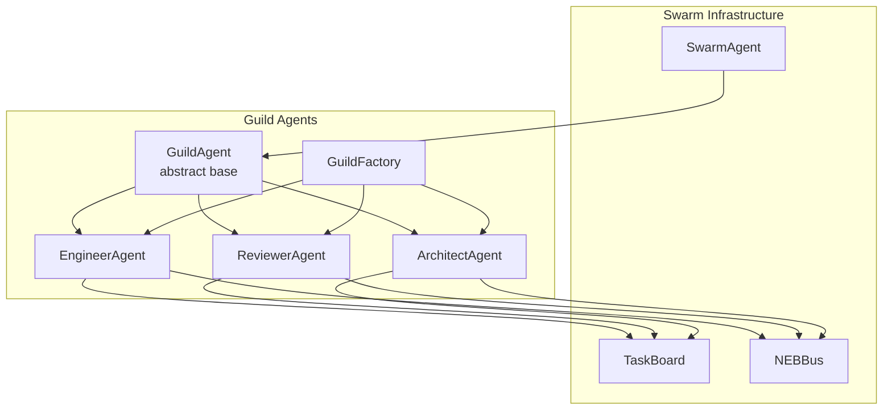

# Design: Agency Era Phase 1 - The Guilds

## Overview
Class hierarchy extending SwarmAgent: abstract GuildAgent base + 3 specialized implementations. Factory pattern for instantiation. NEBBus integration for result broadcasting.

## Architecture



## Components

### GuildAgent (Abstract Base)
**Purpose**: Common guild functionality
**File**: `systems/swarm/guilds/base.py`

```python
class GuildAgent(SwarmAgent):
    """Abstract base for specialized guild agents."""

    role: str  # "engineer" | "reviewer" | "architect"
    event_bus: NEBBus

    def __init__(self, agent_id, task_board, event_bus, handlers):
        super().__init__(agent_id, task_board, handlers=handlers)
        self.event_bus = event_bus

    def complete_task(self, task, result):
        success = super().complete_task(task, result)
        if success:
            self._publish_result(task, result)
        return success

    def _publish_result(self, task, result):
        self.event_bus.publish(f"guild.{self.role}.completed", {
            "task_id": task.task_id,
            "agent_id": self.agent_id,
            "result_summary": self._summarize(result)
        })

    @abstractmethod
    def _summarize(self, result) -> str:
        """Create brief summary of result."""
```

### EngineerAgent
**Purpose**: Code generation and testing
**File**: `systems/swarm/guilds/engineer.py`

| Method | Handler For | Returns |
|--------|-------------|---------|
| `write_code(spec)` | CODE_GENERATION | `{"code": str, "language": "python"}` |
| `test_code(code, tests)` | CODE_TESTING | `{"passed": int, "failed": int, "output": str}` |
| `handle_error(error, code)` | CODE_GENERATION | `{"error_type": str, "line": int, "fix_hint": str}` |

**Capabilities**: `["CODE_GENERATION", "CODE_TESTING"]`

### ReviewerAgent
**Purpose**: Code quality and security
**File**: `systems/swarm/guilds/reviewer.py`

| Method | Handler For | Returns |
|--------|-------------|---------|
| `analyze(code)` | CODE_REVIEW | `{"score": float, "issues": List[Issue]}` |
| `check_security(code)` | SECURITY_SCAN | `{"vulnerabilities": List[Vuln], "severity": str}` |
| `check_style(code)` | CODE_REVIEW | `{"violations": List[str], "pep8_compliant": bool}` |

**Capabilities**: `["CODE_REVIEW", "SECURITY_SCAN"]`

### ArchitectAgent
**Purpose**: System design and planning
**File**: `systems/swarm/guilds/architect.py`

| Method | Handler For | Returns |
|--------|-------------|---------|
| `design_component(spec)` | ARCHITECTURE_DESIGN | `{"components": List[Component], "interfaces": List[Interface]}` |
| `plan_architecture(requirements)` | SYSTEM_PLANNING | `{"components": List[Component], "dependencies": Graph, "strategy": str}` |

**Capabilities**: `["ARCHITECTURE_DESIGN", "SYSTEM_PLANNING"]`

### GuildFactory
**Purpose**: Create guild agents by role
**File**: `systems/swarm/guilds/factory.py`

```python
class GuildFactory:
    @staticmethod
    def create(role: str, agent_id: str, task_board: TaskBoard,
               event_bus: NEBBus) -> GuildAgent:
        if role == "engineer":
            return EngineerAgent(agent_id, task_board, event_bus)
        elif role == "reviewer":
            return ReviewerAgent(agent_id, task_board, event_bus)
        elif role == "architect":
            return ArchitectAgent(agent_id, task_board, event_bus)
        raise ValueError(f"Unknown role: {role}")
```

## Data Flow

1. TaskBoard posts task with guild-specific TaskType
2. NEBBus broadcasts `task.available` event
3. GuildAgent (auto_claim=True) claims task
4. Agent executes registered handler
5. Agent completes task on TaskBoard
6. Agent publishes `guild.{role}.completed` to NEBBus
7. Other agents react to completion event

## Technical Decisions

| Decision | Options | Choice | Rationale |
|----------|---------|--------|-----------|
| Agent state | Stateful vs Stateless | Stateless | Simpler, safer, matches SwarmAgent pattern |
| Handler return type | Any vs Dict | Dict[str, Any] | Matches Task.result type |
| NEB topic format | Flat vs Hierarchical | Hierarchical | `guild.{role}.{action}` enables wildcards |
| Factory vs Direct init | Both | Factory | Convenience, type safety |

## File Structure

| File | Action | Purpose |
|------|--------|---------|
| `systems/swarm/guilds/__init__.py` | Create | Module exports |
| `systems/swarm/guilds/base.py` | Create | GuildAgent abstract base |
| `systems/swarm/guilds/engineer.py` | Create | EngineerAgent implementation |
| `systems/swarm/guilds/reviewer.py` | Create | ReviewerAgent implementation |
| `systems/swarm/guilds/architect.py` | Create | ArchitectAgent implementation |
| `systems/swarm/guilds/factory.py` | Create | GuildFactory helper |
| `systems/swarm/task.py` | Modify | Add 6 new TaskTypes |

## Error Handling

| Error | Handling | User Impact |
|-------|----------|-------------|
| Invalid task type | Skip task, log warning | Task remains pending for capable agent |
| Handler exception | fail_task() with traceback | Error captured in task result |
| NEB publish failure | Log warning, continue | Result persisted, event missed |
| Invalid code syntax | Return error dict with line | User gets actionable fix hint |

## Existing Patterns to Follow

- Handler registration pattern from `swarm_agent.py:37`
- NEB subscription from `swarm_agent.py:169-195`
- Task lifecycle from `task.py:51-85`
- Module exports from `__init__.py`
