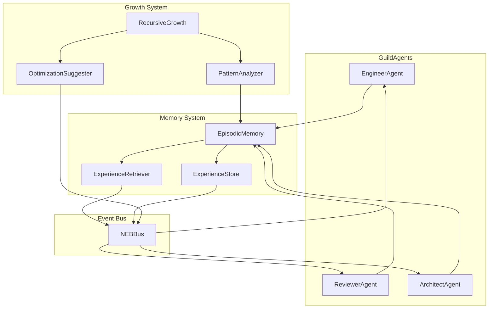

# Design: agency-era-roots

## Overview

Add EpisodicMemory and RecursiveGrowth modules to the swarm system. EpisodicMemory provides vector-based experience storage with semantic retrieval. RecursiveGrowth analyzes patterns and publishes optimization suggestions. Both integrate via NEBBus events.

## Architecture



## Components

### EpisodicMemory

**Purpose**: Store and retrieve agent experiences with semantic matching
**Responsibilities**:
- Store experiences with embeddings
- Query by similarity (failures/successes)
- Persist to JSON file
- Generate simple embeddings from text

```python
@dataclass
class Experience:
    experience_id: str
    agent_id: str
    task_type: str
    action: str
    outcome: str  # "success", "failure", "partial"
    description: str
    embedding: List[float]
    metadata: Dict[str, Any]
    timestamp: float
```

### ExperienceStore

**Purpose**: Persist experiences to disk
**Responsibilities**:
- Load/save JSON file
- Handle concurrent access (file locking)
- Manage experience limit (FIFO eviction)

### ExperienceRetriever

**Purpose**: Query experiences by semantic similarity
**Responsibilities**:
- Compute cosine similarity
- Filter by outcome type
- Rank and return top-k results

### RecursiveGrowth

**Purpose**: Analyze patterns and suggest optimizations
**Responsibilities**:
- Subscribe to task completion events
- Track agent performance metrics
- Detect patterns (bottlenecks, repeated failures)
- Publish `growth.*` events

### PatternAnalyzer

**Purpose**: Detect performance patterns
**Responsibilities**:
- Calculate completion rates per agent
- Identify common failure signatures
- Detect task queue buildup

## Data Flow

1. GuildAgent completes task -> publishes `task.completed` via NEBBus
2. EpisodicMemory subscribes to `task.**` events
3. Experience created with embedding, stored to JSON
4. Before next task, agent queries `check_similar_failures()`
5. If similar failures found, agent can adjust approach
6. RecursiveGrowth subscribes to `task.completed`, `task.failed`
7. PatternAnalyzer aggregates metrics
8. OptimizationSuggester publishes `growth.optimization` events

## Technical Decisions

| Decision | Options | Choice | Rationale |
|----------|---------|--------|-----------|
| Embedding generation | LLM API, Hash-based, Random | Hash-based | POC simplicity, no external deps |
| Storage backend | JSON, SQLite, Vector DB | JSON | POC simplicity, matches TaskBoard pattern |
| Integration method | Inheritance, Composition | Composition | Less intrusive to GuildAgent |
| Event topics | New namespace, Extend existing | New `memory.*`, `growth.*` | Clear separation |

## File Structure

| File | Action | Purpose |
|------|--------|---------|
| `systems/swarm/memory/__init__.py` | Create | Module exports |
| `systems/swarm/memory/episodic_memory.py` | Create | Main memory class |
| `systems/swarm/memory/experience.py` | Create | Experience dataclass |
| `systems/swarm/memory/experience_store.py` | Create | JSON persistence |
| `systems/swarm/memory/experience_retriever.py` | Create | Similarity queries |
| `systems/swarm/growth/__init__.py` | Create | Module exports |
| `systems/swarm/growth/recursive_growth.py` | Create | Main growth class |
| `systems/swarm/growth/pattern_analyzer.py` | Create | Performance analysis |
| `systems/swarm/memory/test_episodic_memory.py` | Create | Unit tests |
| `systems/swarm/growth/test_recursive_growth.py` | Create | Unit tests |

## Error Handling

| Error | Handling | User Impact |
|-------|----------|-------------|
| Memory file corrupted | Reinitialize, log warning | Fresh start, no crash |
| Embedding generation fails | Use zero vector fallback | Reduced similarity accuracy |
| Store write fails | Cache in memory, retry | Temporary inconsistency |
| NEBBus disconnected | Queue locally, sync on reconnect | Delayed learning |

## Existing Patterns to Follow

- **TaskBoard** (`systems/swarm/task_board.py`): File locking pattern for JSON persistence
- **SubscriptionManager** (`systems/swarm/subscription_manager.py`): Cosine similarity implementation
- **GuildAgent** (`systems/swarm/guilds/base.py`): Event bus integration via `_publish_result()`
- **EvolutionDaemon**: Self-improvement loop pattern with analysis/propose/apply phases
