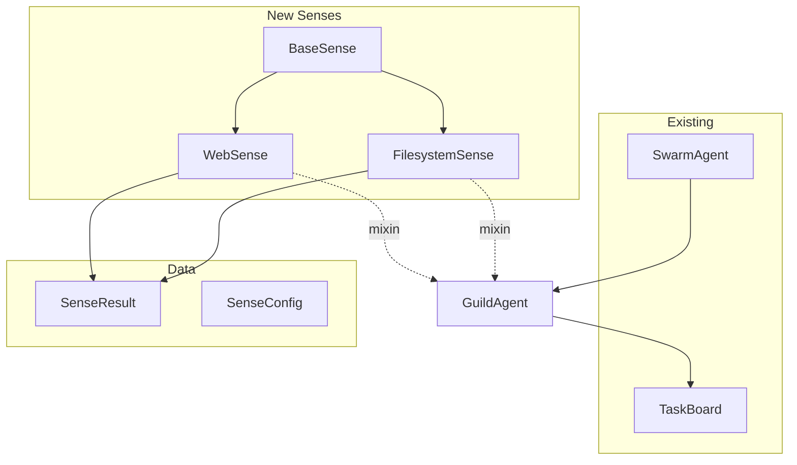

# Design: Agency Era Phase 2 - Broad Senses

## Overview

Mixin-based senses that extend SwarmAgent. Each sense is self-contained with config, validation, and error handling.

## Architecture



## Components

### BaseSense
**Purpose**: Common utilities for all senses
**Responsibilities**:
- `SenseResult` dataclass factory
- Timeout wrapper utility
- Logging setup

### FilesystemSense
**Purpose**: Sandboxed file operations
**Responsibilities**:
- Read files from allowed paths
- Write files to allowed paths
- List directory contents
- Validate paths against whitelist

**Key Methods**:
```python
def read_file(self, path: str) -> SenseResult
def write_file(self, path: str, content: str) -> SenseResult
def list_dir(self, path: str) -> SenseResult
def _validate_path(self, path: str) -> Path  # raises if invalid
```

### WebSense
**Purpose**: HTTP operations with rate limiting
**Responsibilities**:
- Fetch URLs with timeout
- Rate limit requests
- Parse JSON responses
- Handle errors gracefully

**Key Methods**:
```python
async def fetch(self, url: str, method: str = "GET",
                headers: dict = None, timeout: float = 10.0) -> SenseResult
def _check_rate_limit(self) -> bool
```

### SenseResult
**Purpose**: Standardized result wrapper
```python
@dataclass
class SenseResult:
    success: bool
    data: Any = None
    error: Optional[str] = None
    metadata: dict = field(default_factory=dict)
```

## Data Flow

1. Agent calls sense method (e.g., `self.read_file("/config/settings.json")`)
2. Sense validates path against `allowed_paths`
3. If valid, execute operation with timeout
4. Return `SenseResult(success=True, data=...)` or `SenseResult(success=False, error=...)`

## Technical Decisions

| Decision | Options | Choice | Rationale |
|----------|---------|--------|-----------|
| HTTP client | requests, httpx, aiohttp | httpx | Async, already used in project |
| Rate limiting | token bucket, sliding window | sliding window | Simpler, accurate |
| Path validation | regex, pathlib resolve | pathlib resolve | Handles symlinks safely |
| Mixin vs composition | mixin, composition | mixin | Cleaner API, less boilerplate |

## File Structure

| File | Action | Purpose |
|------|--------|---------|
| `systems/swarm/senses/__init__.py` | Create | Module exports |
| `systems/swarm/senses/base.py` | Create | SenseResult, BaseSense |
| `systems/swarm/senses/filesystem.py` | Create | FilesystemSense |
| `systems/swarm/senses/web.py` | Create | WebSense |
| `systems/swarm/tests/test_senses.py` | Create | Unit tests |

## Error Handling

| Error | Handling | User Impact |
|-------|----------|-------------|
| Path outside whitelist | Return SenseResult(error="Path not allowed") | Agent sees error, no crash |
| Network timeout | Return SenseResult(error="Request timed out") | Agent can retry |
| Rate limit exceeded | Return SenseResult(error="Rate limit exceeded") | Agent waits |
| File not found | Return SenseResult(error="File not found") | Agent handles missing |

## Existing Patterns to Follow

- `GuardianGate.REJECTION_PATTERNS` - for unsafe path characters
- `Sandbox.execute()` - for timeout wrapper pattern
- `SandboxManager._check_import()` - for validation style
