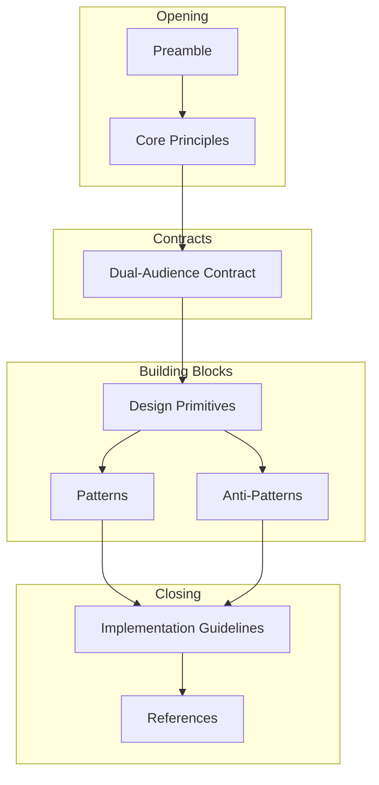

# Design: ascii-exposed-computing-manifesto

## Overview

Single markdown document (`docs/ASCII_EXPOSED_COMPUTING_MANIFESTO.md`) structured as a philosophy reference. 8 sections, ~300-400 lines. Sequential reading for newcomers, random access for reference.

## Document Architecture



## Sections

### Section 1: Preamble

**Purpose**: Establish the WHY - historical context, AI co-working imperative
**Length**: ~30 lines

**Content structure**:
```
- Historical problem statement (40 years of invisible state)
- AI perception model (tokens vs photons)
- Definition: ASCII Exposed Computing
- Key concept: Zero-cost perception
- Scope statement
```

### Section 2: Core Principles

**Purpose**: Establish the WHAT - numbered design rules
**Length**: ~50 lines

**Content structure** (per principle):
```
### Principle N: [Title]
[1-2 sentence definition]
**Good:** [Example]
**Bad:** [Example]
```

| Principle | Title | Key Concept |
|-----------|-------|-------------|
| 1 | State as Text | Readable, not just serializable |
| 2 | Transition as Edit | Diffable mutations |
| 3 | Dual-Audience by Default | Human + AI simultaneously |
| 4 | Grep-ability is a Feature | Simple text search works |
| 5 | Diff-ability Enables Understanding | Version control friendly |

### Section 3: Dual-Audience Contract

**Purpose**: Define requirements for each audience
**Length**: ~40 lines

**Content structure**:
```
### For Humans
| Requirement | Why | Example |

### For AIs
| Requirement | Why | Example |

### The Tension
[Conflict examples and resolution strategies]
```

**Human requirements**: Alignment, Comments, Visual Hierarchy, Units, Truncation
**AI requirements**: Consistent Delimiters, Type Hints, Schema Markers, Semantic Labels, Idempotent Reads

### Section 4: Design Primitives

**Purpose**: Define atomic building blocks
**Length**: ~60 lines

| Primitive | Definition | Rules |
|-----------|------------|-------|
| Fragment | Atomic unit of state | One concept, independently readable, cheap |
| Schema | Explicit type contract | Comments at top, simple types, version bumps |
| Hook | Change notification | Minimal data (diffs), enables reactivity |
| Namespace | Organization by concern | Directory = namespace, cross-cutting separate |

**Code examples**: Each primitive includes example file content.

### Section 5: Patterns

**Purpose**: Proven solutions to common problems
**Length**: ~70 lines

| Pattern | Problem | Solution |
|---------|---------|----------|
| Scene Graph Aggregation | Many fragments, one view | Aggregator reads all, produces unified output |
| Atomic File Writes | Partial writes corrupt | Temp file + rename |
| Change Streams | Polling inefficient | Append-only log |
| Dual-Format Fragments | Different needs | Two files, same state |
| Fragment Inheritance | Common structure | Base fragment + overlay |

**Code examples**: Python snippets from Geometry OS implementation.

### Section 6: Anti-Patterns

**Purpose**: Warn against common mistakes
**Length**: ~60 lines

| Anti-Pattern | Problem | Why Bad |
|--------------|---------|---------|
| Binary in ASCII Clothing | Base64 in text | Not readable |
| Infinite Fragments | Unbounded growth | Expensive to read |
| Timestamps Without Meaning | Epoch only | Humans can't read |
| Fragment Coupling | Inline references | Not independent |
| Inconsistent Delimiters | Mixed syntax | AI parsing fails |
| Mutable History | Editing past entries | Audit broken |

**Format**: Bad example, Good example, Why explanation.

### Section 7: Implementation Guidelines

**Purpose**: Practical adoption checklist
**Length**: ~50 lines

**Content structure**:
```
### Starting a New System
1-6 numbered steps

### Adding to Existing Systems
1-5 numbered steps

### Directory Structure Template
ASCII tree

### Performance Considerations
Table of concerns and solutions

### When NOT to Use
Bullet list of exceptions
```

### Section 8: Closing + References

**Purpose**: Wrap up and cite sources
**Length**: ~20 lines

**Content structure**:
```
## Closing
[Summary paragraph]

## References
- Plan 9's "Everything is a File"
- UNIX /proc filesystem
- The Twelve-Factor App
- Geometry OS ASCII Scene Graph

## Contributors
[Attribution]

---
[Version and license info]
```

## Data Flow

1. Reader opens document
2. Preamble establishes context and motivation
3. Core Principles provide evaluation criteria
4. Dual-Audience Contract defines formatting rules
5. Design Primitives give vocabulary
6. Patterns provide ready solutions
7. Anti-Patterns prevent mistakes
8. Implementation Guidelines enable action

## Technical Decisions

| Decision | Options | Choice | Rationale |
|----------|---------|--------|-----------|
| Output location | `/docs/`, `/manifesto/`, root | `/docs/` | Consistent with project structure |
| Format | Markdown, reStructuredText, HTML | Markdown | Native GitHub rendering |
| Code language | Python, pseudocode, multi | Python | Geometry OS uses Python |
| Section count | 5-12 | 8 | Complete without verbose |
| Example depth | Minimal, moderate, thorough | Moderate | Balance brevity and clarity |

## File Structure

| File | Action | Purpose |
|------|--------|---------|
| `docs/ASCII_EXPOSED_COMPUTING_MANIFESTO.md` | Create | Main manifesto document |

## Error Handling

| Error | Handling | User Impact |
|-------|----------|-------------|
| Markdown syntax errors | Validate with pandoc or markdownlint | Prevents rendering issues |
| Broken internal links | Check all `###` references | Document is self-contained |
| Code examples invalid | Test in isolation | Credibility |

## Existing Patterns to Follow

From `systems/visual_shell/ascii_scene/`:

1. **Atomic writes pattern** (`renderers/neural_city.py:126-156`):
   - Use in "Atomic File Writes" pattern section

2. **Hook broadcaster pattern** (`hooks.py:95-189`):
   - Reference in "Hooks" primitive section

3. **Dual-format naming** (`__init__.py:21-29`):
   - `board.ascii` + `board.json.ascii` pattern

4. **Namespace structure** (output directory):
   - `shell/`, `agents/`, `tasks/`, `system/`

## Style Guide

- Use `**Good:**` and `**Bad:**` for examples (bold + colon)
- Tables for requirements and comparisons
- Fenced code blocks with language hints
- Section headers: `##` for major, `###` for minor
- Lists: `-` for bullets, `1.` for numbered steps
