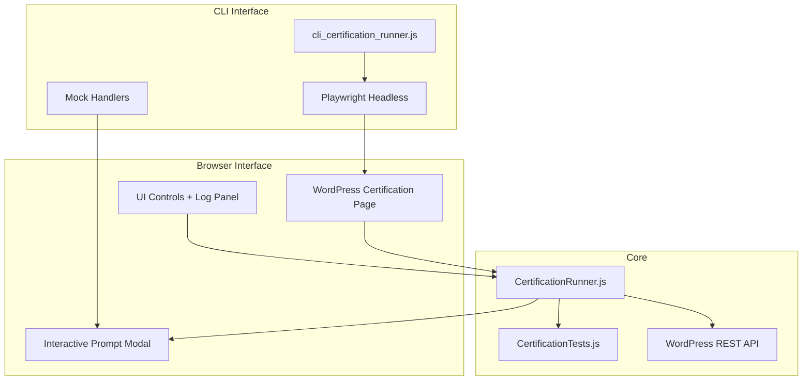

# Design: certification-runner

## Overview

Modular certification system with CertificationTests.js as the test registry, CertificationRunner.js as the event-driven orchestrator, and dual interfaces (WordPress page for browser, Playwright for CLI).

## Architecture



## Components

### CertificationTests.js (Test Registry)

**Purpose**: Central registry for all certification tests

**Responsibilities**:
- Define tests as objects with id, name, level, description, timeout, run()
- Provide query methods: `getByLevel()`, `get()`, `getAll()`
- No dependency on runner (inverted control)

**Test Structure**:
```javascript
{
    id: 'blind-restoration',
    name: 'Blind Restoration',
    level: 3,
    description: 'Recover from tile failure via WordPress',
    timeout: 30000,
    interactive: true,
    promptMessage: '...',
    run: async (runner) => { ... }
}
```

### CertificationRunner.js (Orchestrator)

**Purpose**: Execute tests with event emission and timeout handling

**Responsibilities**:
- Run single test, level, or full suite
- Emit lifecycle events (suite:start, test:complete, etc.)
- Handle interactive prompts via `prompt` event
- Provide `respond()` for external response injection

**Key Methods**:
| Method | Description |
|--------|-------------|
| `on(event, cb)` | Subscribe to events |
| `emit(event, data)` | Emit to listeners + DOM |
| `runTest(id)` | Run single test with timeout |
| `runLevel(level)` | Run all tests for level |
| `runAll()` | Run all levels 1-3 |
| `respond(id, success, details)` | Respond to prompt |
| `getSummary()` | Get pass/fail summary |

### WordPress Certification Page

**Purpose**: Browser UI for running certifications

**Responsibilities**:
- Enqueue CertificationTests.js and CertificationRunner.js
- Render control panel with buttons
- Display progress bar and live log
- Handle interactive prompts via modal

**Layout**:
```
+------------------+------------------------+
| Controls Panel   | Live Log Panel         |
| - Run All btn    | [timestamp] messages   |
| - Level 1-3 btns | color-coded by status  |
| - Reset btn      |                        |
| - Progress bar   |                        |
| - Summary grade  |                        |
+------------------+------------------------+
```

### CLI Runner

**Purpose**: Execute certifications in CI/CD via Playwright

**Responsibilities**:
- Launch headless browser
- Navigate to WordPress certification page
- Handle login if required
- Register mock handlers for interactive tests
- Output results to terminal

**Mock Handlers**:
| Action | Mock Implementation |
|--------|---------------------|
| `restart-tile` | Click `.mc-tile-actions button[title="Restart"]` |
| `verify-sync` | Open second page, verify cross-tab signal |

## Data Flow

1. User clicks "Run All" or CLI triggers `runAll()`
2. Runner emits `suite:start` with test count
3. For each level, emits `level:start`
4. For each test, emits `progress`, `test:start`, runs test
5. Test may emit `prompt` for interactive tests
6. UI/CLI responds via `respond()` or modal
7. Runner emits `test:complete` with result
8. After all tests, emits `suite:complete` with summary

## Technical Decisions

| Decision | Options | Choice | Rationale |
|----------|---------|--------|-----------|
| Event system | Custom vs EventEmitter vs DOM | Custom + DOM dispatch | Simpler, works across components |
| Mock handling | Hardcode vs config | Hardcode in CLI runner | Simple, test-specific |
| Script loading | Inline vs external | External from localhost:8888 | Reuses existing map server |

## File Structure

| File | Action | Purpose |
|------|--------|---------|
| `systems/visual_shell/web/CertificationTests.js` | Create | Standalone test registry |
| `systems/visual_shell/web/CertificationRunner.js` | Create | Event-driven orchestrator |
| `wordpress_zone/wordpress/wp-content/mu-plugins/geometry_os_certification_page.php` | Create | WordPress runner page |
| `systems/visual_shell/web/tests/cli_certification_runner.js` | Modify | Update for new architecture |
| `wordpress_zone/wordpress/wp-content/mu-plugins/geometry_os_scorecard.php` | Modify | Add link to certification page |

## Error Handling

| Error | Handling | User Impact |
|-------|----------|-------------|
| Test timeout | Catch, emit `test:error`, continue | Test marked failed, suite continues |
| Script load failure | Wait with retry, log warning | Tests may not run |
| WordPress login required | Auto-fill from env vars | CLI continues automatically |
| Mock handler fails | Fallback to auto-pass | Test passes with warning |

## Existing Patterns to Follow

- `geometry_os_scorecard.php`: WordPress mu-plugin pattern with `add_action('admin_menu', ...)`
- `CertificationRunner.js`: Class-based with `window.CertificationRunner` export
- `cli_certification_runner.js`: Playwright `chromium.launch({ headless: true })` pattern
