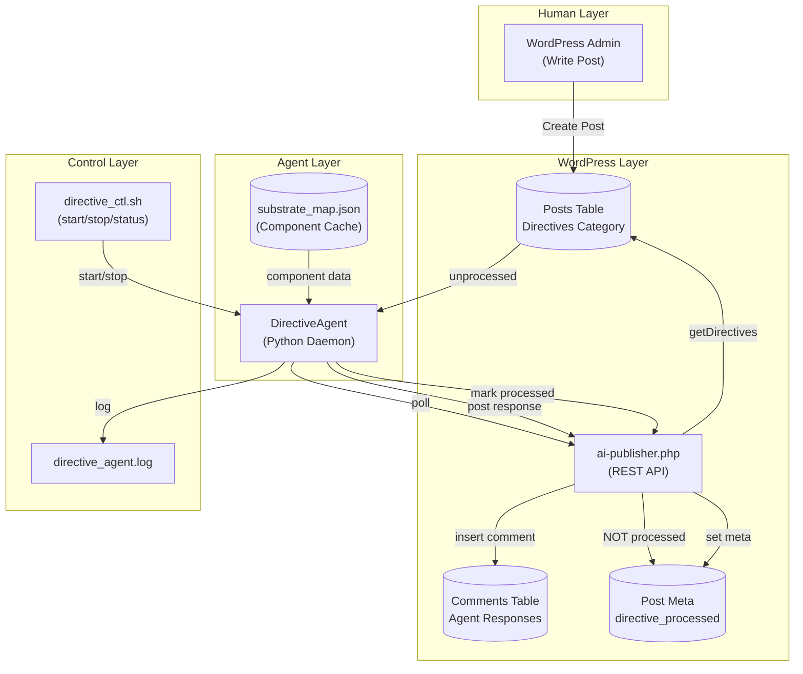
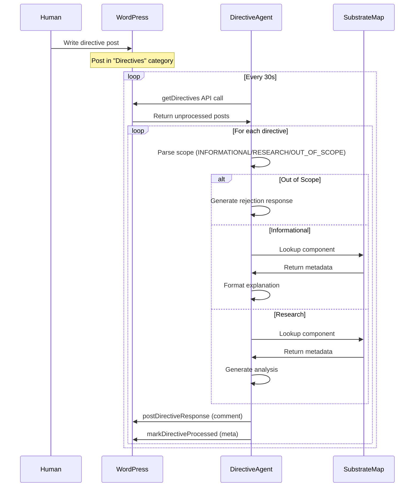

# Design: Command Console

## Overview

Bidirectional human-AI collaboration via WordPress Directives. Humans write posts, DirectiveAgent polls/parses/executes them, posts results as comments. Phase 3 scope: informational + research only.

## Architecture



## Data Flow



## Components

### DirectiveAgent (Python)

**Purpose**: Poll WordPress, parse directives, execute allowed actions, post responses.

**Responsibilities**:
- Poll WordPress every 30s for unprocessed directives
- Parse directive scope via keyword detection
- Execute informational queries from substrate map
- Execute research analysis from component metadata
- Reject out-of-scope directives
- Post responses as WordPress comments
- Mark directives as processed

**Interfaces**:

```python
class DirectiveScope(Enum):
    INFORMATIONAL = "informational"
    RESEARCH = "research"
    UNKNOWN = "unknown"

class DirectiveStatus(Enum):
    COMPLETED = "completed"
    FAILED = "failed"
    OUT_OF_SCOPE = "out_of_scope"
    NEEDS_CLARIFICATION = "needs_clarification"

@dataclass
class Directive:
    id: int
    title: str
    content: str
    date: str
    author: str
    scope: DirectiveScope
    action: str
    target: str

class DirectiveAgent:
    WP_URL: str = "http://localhost:8080"
    POLL_INTERVAL: int = 30

    def poll_directives(self) -> List[Directive]: ...
    def parse_directive(self, directive: Directive) -> Directive: ...
    def execute_directive(self, directive: Directive) -> tuple[DirectiveStatus, str]: ...
    def post_response(self, directive: Directive, status: DirectiveStatus, response: str) -> bool: ...
    def mark_processed(self, directive_id: int) -> bool: ...
    def process_one_cycle(self) -> int: ...
    def run_forever(self) -> None: ...
```

### ai-publisher.php Extensions

**Purpose**: WordPress REST API handlers for directive operations.

**New Handlers**:

| Handler | Input | Output | Purpose |
|---------|-------|--------|---------|
| `getDirectives` | - | `{directives: [...]}` | Fetch unprocessed directive posts |
| `markDirectiveProcessed` | `post_id` | `{success: bool}` | Set directive_processed meta |
| `postDirectiveResponse` | `post_id, response, status` | `{comment_id: int}` | Insert comment with agent response |

**Interfaces**:

```php
// GET /ai-publisher.php (POST with tool=getDirectives)
function handle_get_directives($data): void {
    // Returns: {"success": true, "directives": [...], "category_id": int}
}

// POST /ai-publisher.php with tool=markDirectiveProcessed
function handle_mark_directive_processed($data): void {
    // Input: {"post_id": int}
    // Returns: {"success": true, "post_id": int}
}

// POST /ai-publisher.php with tool=postDirectiveResponse
function handle_post_directive_response($data): void {
    // Input: {"post_id": int, "response": str, "status": str}
    // Returns: {"success": true, "comment_id": int}
}
```

### Substrate Map Cache

**Purpose**: JSON cache of system components for fast lookups.

**Structure**:

```json
{
    "evolution_daemon": {
        "name": "Evolution Daemon",
        "path": "systems/evolution_daemon",
        "description": "Natural Selection for Operating Systems",
        "language": "Python",
        "files": 42,
        "entry_points": ["main.py", "daemon.py"]
    }
}
```

**Source**: Generated by ArchitectAgent.export_cache()

### Control Script

**Purpose**: Start/stop/status for directive agent daemon.

**Commands**:
- `start` - Launch daemon in background with PID file
- `stop` - Terminate daemon and remove PID file
- `status` - Show running state and recent log entries
- `process-once` - Run single poll cycle and exit
- `tail` - Follow log file

## Technical Decisions

| Decision | Options | Choice | Rationale |
|----------|---------|--------|-----------|
| Scope Detection | Regex keywords, LLM classification, Embedding similarity | Regex keywords | Simple, fast, deterministic; covers Phase 3 needs |
| Polling Mechanism | WebSocket push, HTTP polling, Webhook | HTTP polling | No infrastructure changes required |
| Response Format | HTML, Markdown, Plain text | HTML in comments | WordPress native rendering |
| Cache Storage | File JSON, SQLite, Redis | File JSON | Simple, no dependencies, ArchitectAgent already writes |
| Category Creation | Manual, API auto-create | API auto-create | getDirectives creates if missing |
| Agent Identity | Dedicated user, Comment author only | Comment author only | No WordPress user management overhead |

## File Structure

| File | Action | Purpose |
|------|--------|---------|
| `systems/intelligence/directive_agent.py` | Create | Core DirectiveAgent class |
| `systems/intelligence/__init__.py` | Modify | Export DirectiveAgent |
| `wordpress_zone/wordpress/ai-publisher.php` | Modify | Add directive handlers |
| `systems/intelligence/architect_agent_wp.py` | Modify | Add export_cache method |
| `systems/intelligence/directive_ctl.sh` | Create | Control script |
| `tests/test_directive_agent.py` | Create | Unit tests |
| `tests/test_directive_console_e2e.py` | Create | E2E tests |
| `.geometry/substrate_map.json` | Auto-gen | Component cache |

## Error Handling

| Error | Handling | User Impact |
|-------|----------|-------------|
| WordPress unavailable | Log error, continue loop, retry next cycle | Directive stays unprocessed |
| API timeout (10s) | Log error, skip directive, continue | Directive retried next cycle |
| Comment insert fails | Log error, still mark processed | No response shown, but no re-processing |
| Substrate map missing | Return NEEDS_CLARIFICATION | User asked to specify component |
| Out-of-scope detected | Return OUT_OF_SCOPE with explanation | User informed of Phase 3 limitations |
| Unknown directive format | Return NEEDS_CLARIFICATION | User asked to rephrase |

## Edge Cases

- **Empty directives list**: Loop continues, waits next cycle
- **Duplicate directives**: Each processed once, marked processed
- **Malformed post content**: Parsed as-is, may result in UNKNOWN scope
- **Component not found**: NEEDS_CLARIFICATION with helpful message
- **Concurrent agent instances**: PID file prevents duplicate starts
- **Stale PID file**: Detected via process check, cleaned up

## Test Strategy

| Test Type | Files | Coverage Target |
|-----------|-------|-----------------|
| Unit: Scope parsing | `test_directive_agent.py` | All keywords + patterns |
| Unit: Out-of-scope detection | `test_directive_agent.py` | All blocklist patterns |
| Unit: Component lookup | `test_directive_agent.py` | Exact + partial match |
| Unit: API mock responses | `test_directive_agent.py` | All endpoints |
| E2E: Full lifecycle | `test_directive_console_e2e.py` | Create -> Poll -> Execute -> Respond -> Mark |

**Coverage Goal**: 90%+ on DirectiveAgent methods

## Security Considerations

- **Localhost-only**: ai-publisher.php restricts to 127.0.0.1
- **No code execution**: Phase 3 scope explicitly prevents code modifications
- **Comment spam prevention**: Auto-approve only for agent@geometry.os email
- **Input sanitization**: WordPress handles post content escaping

## Performance Considerations

- **API latency target**: <500ms per request
- **Poll interval**: 30s default (configurable)
- **Batch size**: 10 directives max per poll
- **Cache read**: File read on agent init, kept in memory

## Future Integration (Not Phase 3)

```typescript
// WebSocket message schema for real-time HUD updates
interface DirectiveEvent {
    type: "DIRECTIVE_RECEIVED" | "DIRECTIVE_EXECUTING" | "DIRECTIVE_COMPLETED";
    directive_id: number;
    title: string;
    scope: string;
    status?: string;
    timestamp: number;
}
```

**Integration point**: visual_bridge.py WebSocket broadcast on directive events

## Implementation Steps

1. **Task 1**: Extend ai-publisher.php with directive handlers (getDirectives, markDirectiveProcessed, postDirectiveResponse)
2. **Task 2**: Create DirectiveAgent class in `systems/intelligence/directive_agent.py`
3. **Task 3**: Add unit tests for DirectiveAgent parsing and execution
4. **Task 4**: Add export_cache method to ArchitectAgent for substrate map
5. **Task 5**: Create WordPress Directives category (via API call)
6. **Task 6**: Add E2E integration tests
7. **Task 7**: Create directive_ctl.sh control script
