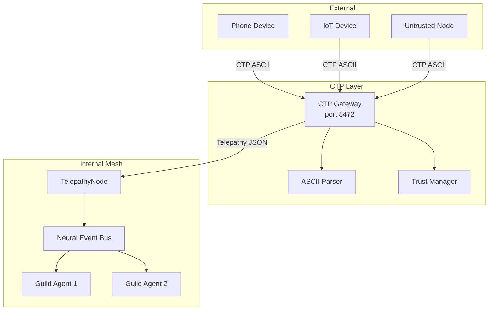

# Design: CTP (Cognitive Transmission Protocol)

## Overview

CTP Gateway bridges external devices (phones, IoT) to the internal TelepathyProtocol mesh. External devices speak ASCII over TCP (future: QUIC/UDP); the gateway translates to JSON/TCP Telepathy signals for core mesh nodes. Three trust tiers enforce rate limits and capability restrictions.

## Architecture



## Components

### Component: types.py

**Purpose**: Define CTP types, constants, and data structures
**Responsibilities**:
- CTPVersion: Protocol version ("CTP/1.0") and default port (8472)
- TrustLevel: Enum with capability properties (INTERNAL/EXTERNAL/UNTRUSTED)
- IntentType: Signal types (INTENT/INSIGHT/QUERY/RESPONSE/FRAGMENT/CONSENSUS/HEARTBEAT)
- ContextHash: SHA-256 hash computation from sorted fragments
- CTPSignal: Dataclass with ASCII serialization (to_ascii/from_ascii)

### Component: parser.py

**Purpose**: Parse CTP ASCII messages using stdlib only
**Responsibilities**:
- Parse complete messages with version, headers, payload
- Partial parse resilience for truncated messages
- No regex required for basic parsing (regex optional for extraction)
- Raise ParseError for malformed messages

### Component: trust_manager.py

**Purpose**: Manage agent trust levels and rate limiting
**Responsibilities**:
- AgentRegistry: Store agent info, capabilities, last_seen
- TrustManager: Check capabilities, enforce rate limits
- Rate window cleanup for expired requests
- Capability-to-trust-level mapping

### Component: gateway.py

**Purpose**: Bridge CTP (external) to Telepathy (internal)
**Responsibilities**:
- Accept CTP connections on port 8472
- Handle HELLO handshake, create sessions
- Translate CTP signals to Telepathy signals
- Enforce trust validation before processing

### Component: client.py

**Purpose**: Minimal stdlib-only client for device onboarding
**Responsibilities**:
- Build HELLO, QUERY messages
- Parse WELCOME, REJECT responses
- Async connect and query methods
- Under 500 lines of code

### Component: simulation.py

**Purpose**: Validate CTP design assumptions
**Responsibilities**:
- ARCHITECTURE_VALIDATE: ASCII parseability tests
- PERFORMANCE_PREDICT: ASCII vs JSON overhead
- EDGE_CASE_EXPLORE: Constrained device scenarios
- HILBERT_COHERENCE: PixelRTS fragment transport

## Data Flow

### Handshake Flow

```
1. Client builds HELLO with Agent-ID, Context-Hash, Capabilities, Trust-Level
2. Client sends HELLO to Gateway (TCP port 8472)
3. Gateway parses HELLO, registers agent
4. Gateway validates trust level
5. Gateway creates session, builds WELCOME with Session-ID
6. Gateway sends WELCOME to Client
7. Client parses WELCOME, stores session ID
```

### Query Flow

```
1. Client builds STREAM with Intent: QUERY, payload
2. Gateway checks rate limit
3. Gateway records request
4. Gateway builds CTPSignal from parsed message
5. Gateway translates to TelepathySignal
6. Gateway calls telepathy.process_signal()
7. Internal mesh routes by intent
```

## Technical Decisions

| Decision | Options | Choice | Rationale |
|----------|---------|--------|-----------|
| Wire format | JSON/Binary/ASCII | ASCII | Zero-cost perception, grep-ability |
| Transport | TCP/QUIC/WebSocket | TCP (QUIC future) | Simplicity, stdlib support |
| Client deps | stdlib/requests/aiohttp | stdlib only | Broad device compatibility |
| Rate window | 30s/60s/120s | 60s | Standard rate limiting window |
| Hash truncation | 8/16/32 chars | 16 chars | Balance uniqueness vs readability |

## File Structure

| File | Action | Purpose |
|------|--------|---------|
| `systems/swarm/ctp/__init__.py` | Create | Module exports |
| `systems/swarm/ctp/types.py` | Create | Types and constants |
| `systems/swarm/ctp/parser.py` | Create | ASCII parser |
| `systems/swarm/ctp/trust_manager.py` | Create | Trust and rate limiting |
| `systems/swarm/ctp/gateway.py` | Create | CTP to Telepathy bridge |
| `systems/swarm/ctp/client.py` | Create | Minimal device client |
| `systems/swarm/ctp/simulation.py` | Create | Validation runner |
| `tests/swarm/ctp/test_types.py` | Create | Types tests |
| `tests/swarm/ctp/test_parser.py` | Create | Parser tests |
| `tests/swarm/ctp/test_trust_manager.py` | Create | Trust tests |
| `tests/swarm/ctp/test_gateway.py` | Create | Gateway tests |
| `tests/swarm/ctp/test_client.py` | Create | Client tests |
| `tests/swarm/ctp/test_simulation.py` | Create | Simulation tests |
| `tests/swarm/ctp/test_integration.py` | Create | E2E integration tests |

## Error Handling

| Error | Handling | User Impact |
|-------|----------|-------------|
| Empty message | ParseError | Connection rejected |
| Invalid version | ParseError | Connection rejected |
| Missing payload marker | ParseError | Connection rejected |
| Rate limited | Silent drop / REJECT | Request ignored |
| Unknown agent | UNTRUSTED level | Limited capabilities |
| Trust insufficient | validate_trust returns False | Connection rejected |

## ASCII Message Format

```text
CTP/1.0 <MESSAGE-TYPE>
Header-Name: Header-Value
Header-Name: Header-Value
---CTP-PAYLOAD---
<Payload data>
---CTP-END---
```

### Required Headers

| Header | Example |
|--------|---------|
| Agent-ID | phone-alpha-7 |
| Intent | QUERY |
| Context-Hash | 0x7f3a9c2e1b4d8f6a |
| Content-Type | text/ascii |
| Content-Length | 1024 |

### Example Message

```text
CTP/1.0 STREAM
Intent: INSIGHT
Agent-ID: ghost-v8-alpha
Context-Hash: 0x7f3a9c2e1b4d8f6a
Content-Type: text/ascii
Content-Length: 156
---CTP-PAYLOAD---
type: pattern_detected
pattern: recursive_improvement_cycle
confidence: 0.94
---CTP-END---
```

## Existing Patterns to Follow

- **TelepathySignal dataclass** (`systems/swarm/telepathy_protocol.py`): CTPSignal follows same pattern
- **Neural Event Bus pub/sub** (`systems/swarm/neural_event_bus.py`): Intent routing pattern
- **Swarm Guild orchestration** (`systems/swarm/guilds/`): Agent capability checking
- **Evolution Daemon tests** (`systems/evolution_daemon/tests/`): TDD approach with detailed tests
