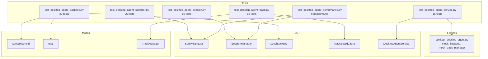

# Design: Desktop Agent Testing Suite

## Overview

Multi-layer testing architecture: Unit tests for each component with mocked dependencies, integration tests for DesktopAgentService orchestration, and performance benchmarks for NFR validation.

## Architecture



## Test Files

### 1. test_desktop_agent_sanitizer.py (25 tests)

**Purpose**: Validate safety layer blocks all dangerous operations

**Test Classes**:
| Class | Tests | Focus |
|-------|-------|-------|
| TestBlockedKeyCombinations | 8 | Ctrl+Alt+Del, Ctrl+Alt+Bksp, Alt+SysRq, VT switch |
| TestBlockedCommands | 12 | rm -rf, mkfs, dd, shutdown, reboot, init, case-insensitive |
| TestIsBlockedCombo | 3 | Helper method coverage |
| TestValidationResult | 2 | Result structure |

**Key Tests**:
- `test_ctrl_alt_del_blocked` - P0 safety
- `test_rm_rf_root_blocked` - P0 safety
- `test_safe_keys_allowed` - Ensure false positives avoided
- `test_case_insensitive_blocking` - RM -RF / blocked

### 2. test_desktop_agent_session.py (15 tests)

**Purpose**: Session lifecycle and limits

**Test Classes**:
| Class | Tests | Focus |
|-------|-------|-------|
| TestSessionCreation | 4 | Create, unique IDs, max limit |
| TestSessionRetrieval | 3 | Get, activity update |
| TestSessionDestruction | 3 | Destroy, disconnect called |
| TestStaleSessionCleanup | 2 | Stale removal, active kept |
| TestSessionList | 3 | List functionality |

**Mock Pattern**:
```python
class MockBackend(BaseBackend):
    async def connect(self, config=None): return True
    async def disconnect(self): return True
    async def send_input(self, tile_id, event): return True
```

### 3. test_desktop_agent_backend.py (20 tests)

**Purpose**: LocalBackend with mocked external tools

**Test Classes**:
| Class | Tests | Focus |
|-------|-------|-------|
| TestLocalBackendInit | 4 | Display, X11/Wayland detection |
| TestLocalBackendConnect | 3 | Connect/disconnect |
| TestLocalBackendInput | 4 | Mouse, key, text, failure |
| TestLocalBackendCapture | 1 | Screenshot via mss |
| TestLocalBackendWindows | 3 | Window list via wmctrl |
| TestLocalBackendClipboard | 2 | Get/set clipboard |
| TestLocalBackendExec | 3 | Command execution, timeout |

**Mock Pattern**:
```python
with patch('subprocess.run') as mock_run:
    mock_run.return_value = MagicMock(returncode=0)
    result = await backend.send_input("root", event)
```

### 4. test_desktop_agent_track.py (15 tests)

**Purpose**: Track coordination with WordPress fallback

**Test Classes**:
| Class | Tests | Focus |
|-------|-------|-------|
| TestTrackBoardClientInit | 3 | Defaults, custom track_id |
| TestTrackBoardClaim | 3 | Success, conflict, WP unavailable |
| TestTrackBoardRelease | 2 | Success, unclaimed |
| TestTrackBoardHeartbeat | 2 | Success, unclaimed |
| TestHeartbeatLoop | 5 | Start, stop, duplicate prevention |

**Mock Pattern**:
```python
with patch.object(client.tm, 'claim') as mock_claim:
    mock_claim.side_effect = WordPressUnavailableError("...")
    result = await client.claim()
    assert result is True  # Fallback succeeds
```

### 5. test_desktop_agent_service.py (15 tests)

**Purpose**: Full service orchestration

**Test Classes**:
| Class | Tests | Focus |
|-------|-------|-------|
| TestDesktopAgentConnect | 4 | Connect local, unsupported, disconnect |
| TestDesktopAgentScreenshot | 2 | Screenshot, invalid session |
| TestDesktopAgentInput | 3 | Click, blocked key, safe key |
| TestDesktopAgentExec | 2 | Safe cmd, blocked cmd |
| TestDesktopAgentWindows | 2 | List, focus |

### 6. test_desktop_agent_performance.py (6 benchmarks)

**Purpose**: NFR latency validation

| Benchmark | Target | Method |
|-----------|--------|--------|
| validate_key_event | < 1ms | pytest-benchmark |
| validate_command | < 1ms | pytest-benchmark |
| validate_blocked_command | < 1ms | pytest-benchmark |
| create_session | < 10ms | pytest-benchmark |
| get_session | < 1ms | pytest-benchmark |
| 1000x key validation | < 1ms avg | manual timing |

## Technical Decisions

| Decision | Options | Choice | Rationale |
|----------|---------|--------|-----------|
| Mock library | unittest.mock, pytest-mock | unittest.mock | Standard library, no extra dep |
| Async test | pytest-asyncio, asyncio.run | pytest-asyncio | De facto standard |
| Coverage tool | coverage.py, pytest-cov | pytest-cov | pytest integration |
| Benchmark | manual, pytest-benchmark | pytest-benchmark | Statistical analysis |

## File Structure

| File | Action | Purpose |
|------|--------|---------|
| tests/test_desktop_agent_sanitizer.py | Create | Safety tests (25) |
| tests/test_desktop_agent_session.py | Create | Session tests (15) |
| tests/test_desktop_agent_backend.py | Create | Backend tests (20) |
| tests/test_desktop_agent_track.py | Create | Track tests (15) |
| tests/test_desktop_agent_service.py | Create | Integration tests (15) |
| tests/test_desktop_agent_performance.py | Create | Benchmarks (6) |
| tests/conftest_desktop_agent.py | Create | Shared fixtures |
| scripts/run_desktop_agent_tests.sh | Create | Quality gate runner |

## Error Handling

| Error | Handling | Test Impact |
|-------|----------|-------------|
| WordPress unavailable | Fallback to local-only | Test fallback path |
| xdotool not found | Return False | Test failure paths |
| Session not found | ErrorCode.SESSION_NOT_FOUND | Test error responses |
| Command timeout | exit_code=-1 | Test timeout handling |

## Existing Patterns to Follow

- `tests/test_directive_agent.py` - AsyncMock pattern for async methods
- `systems/desktop_agent/errors.py` - ErrorCode enum for assertions
- `systems/ai_gui/backends/base.py` - BaseBackend for mock implementations

## Coverage Targets

| Component | Target | Rationale |
|-----------|--------|-----------|
| SafetySanitizer | 100% | P0 safety critical |
| SessionManager | 90% | Core functionality |
| LocalBackend | 80% | External deps mocked |
| TrackBoardClient | 80% | External deps mocked |
| DesktopAgentService | 75% | Integration tests |
| **Overall** | **80%** | Quality gate |
