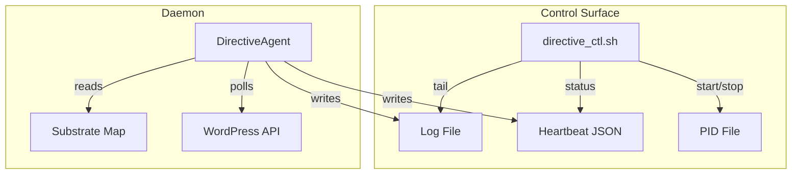

# Design: Directive Control Surface

## Overview

Add heartbeat/CLI support to DirectiveAgent, create directive_ctl.sh control script following evolution_ctl.sh pattern. Minimal changes to existing codebase.

## Architecture

## Components

### DirectiveAgent (Modified)

**Purpose**: Add heartbeat writing and CLI argument parsing
**Changes**:
- Add `heartbeat_path` parameter to `__init__`
- Add `write_heartbeat()` method
- Add `argparse` CLI with `--heartbeat`, `--once`, `--version`
- Increment `_directives_processed` counter in `process_one_cycle()`

### directive_ctl.sh (New)

**Purpose**: Control script for daemon lifecycle
**Responsibilities**:
- start: Launch daemon in background with nohup
- stop: Send SIGTERM, fallback to SIGKILL
- status: Parse heartbeat JSON, display formatted output
- tail: Follow log file with `tail -f`
- process: Run single cycle with `--once` flag
- restart: stop + sleep + start

## Data Flow

1. **Start**: CTL writes PID file, launches DA with `--heartbeat` path
2. **Cycle**: DA processes directives, increments counter, writes heartbeat
3. **Status**: CTL reads heartbeat JSON, formats output
4. **Stop**: CTL sends SIGTERM, DA exits gracefully, PID file removed

## Technical Decisions

| Decision | Options | Choice | Rationale |
|----------|---------|--------|-----------|
| CLI parsing | sys.argv, argparse, click | argparse | Standard library, matches existing pattern |
| Heartbeat format | JSON, YAML, TOML | JSON | Matches evolution_daemon pattern |
| Process tracking | PID file, lock file | PID file | Matches evolution_ctl.sh |
| Log location | script dir, /var/log, .geometry/logs | .geometry/logs | Project convention |

## File Structure

| File | Action | Purpose |
|------|--------|---------|
| `systems/intelligence/directive_agent.py` | Modify | Add heartbeat, CLI |
| `systems/intelligence/directive_ctl.sh` | Create | Control script |
| `tests/test_directive_agent.py` | Modify | Add heartbeat tests |
| `tests/test_directive_ctl.sh` | Create | Control script tests |
| `specs/command-console/README.md` | Modify | Usage docs |

## Error Handling

| Error | Handling | User Impact |
|-------|----------|-------------|
| Daemon already running | Warn and exit | "Daemon is already running (PID: X)" |
| Daemon not running | Clean up stale PID file | "Daemon is not running" |
| Heartbeat read error | Fallback message | "(Could not parse heartbeat file)" |
| WordPress unreachable | Log error, continue | Cycle retries next interval |

## Existing Patterns to Follow

- **evolution_ctl.sh** (`systems/visual_shell/swarm/evolution/evolution_ctl.sh`): Control script structure, color output, wait_for_shutdown pattern
- **evolution_daemon.py**: Heartbeat writing pattern with JSON structure
