# Design: Directive Testing Suite

## Overview

Four-layer testing architecture: edge cases (existing file), performance (new file), stress (new file), contracts (new file). All tests use pytest with fixtures for isolation.

## Architecture

```mermaid
graph TB
    subgraph Edge Cases
        EC1[TestScopeDetectionEdgeCases]
        EC2[TestComponentLookupEdgeCases]
    end

    subgraph Performance
        P1[TestPollingPerformance]
        P2[TestHeartbeatPerformance]
        P3[TestMemoryEfficiency]
    end

    subgraph Stress
        S1[TestHighVolume]
        S2[TestLongRunning]
        S3[TestConcurrentAccess]
        S4[TestErrorRecovery]
    end

    subgraph Contracts
        C1[TestGetDirectivesContract]
        C2[TestMarkDirectiveProcessedContract]
        C3[TestPostDirectiveResponseContract]
        C4[TestSubstrateCacheContract]
    end

    EC1 --> DIR[DirectiveAgent]
    EC2 --> DIR
    P1 --> DIR
    P2 --> DIR
    P3 --> DIR
    S1 --> DIR
    S2 --> DIR
    S3 --> DIR
    S4 --> DIR
    C1 --> DIR
    C2 --> DIR
    C3 --> DIR
    C4 --> DIR
```

## Components

### TestScopeDetectionEdgeCases

**Purpose**: Validate keyword matching edge cases
**Location**: `tests/test_directive_agent.py` (append)
**Tests**: 8

| Test | Description |
|------|-------------|
| test_scope_with_mixed_case_keywords | EXPLAIN == explain |
| test_scope_with_keyword_in_middle_of_word | explanation not match explain |
| test_scope_with_multiple_keywords_same_category | Multiple informational = informational |
| test_scope_mixed_informational_and_research | Informational wins |
| test_scope_with_punctuation | Punctuation ignored |
| test_scope_empty_title_and_content | Empty = UNKNOWN |
| test_scope_whitespace_only | Whitespace = UNKNOWN |
| test_scope_with_html_tags | HTML stripped/ignored |

### TestComponentLookupEdgeCases

**Purpose**: Validate component lookup fuzzy matching
**Location**: `tests/test_directive_agent.py` (append)
**Tests**: 6

| Test | Description |
|------|-------------|
| test_lookup_with_extra_whitespace | Trim whitespace |
| test_lookup_with_underscores_vs_spaces | Equivalent handling |
| test_lookup_partial_name_match | Partial matches |
| test_lookup_description_search | Search descriptions |
| test_lookup_returns_none_for_garbage | No crash on bad input |
| test_lookup_with_numbers | Numbers handled |

### TestPollingPerformance

**Purpose**: Validate latency requirements
**Location**: `tests/test_directive_performance.py` (new)
**Tests**: 4

| Test | Threshold |
|------|-----------|
| test_single_poll_latency_under_100ms | < 100ms |
| test_process_directive_latency_under_50ms | < 50ms |
| test_heartbeat_write_latency_under_10ms | < 10ms |
| test_process_100_directives_under_5_seconds | < 5s |

### TestHeartbeatPerformance

**Purpose**: Validate heartbeat overhead
**Location**: `tests/test_directive_performance.py` (new)
**Tests**: 2

| Test | Threshold |
|------|-----------|
| test_heartbeat_file_size_under_1kb | < 1KB |
| test_heartbeat_overhead_is_negligible | < 10% |

### TestMemoryEfficiency

**Purpose**: Validate memory footprint
**Location**: `tests/test_directive_performance.py` (new)
**Tests**: 1

| Test | Threshold |
|------|-----------|
| test_substrate_cache_size_reasonable | < 10MB for 1000 components |

### TestHighVolume

**Purpose**: Validate high-volume processing
**Location**: `tests/test_directive_stress.py` (new)
**Tests**: 2

| Test | Description |
|------|-------------|
| test_process_1000_directives_no_crash | No crashes, no errors |
| test_all_directives_processed_unique | No duplicates |

### TestLongRunning

**Purpose**: Validate memory stability
**Location**: `tests/test_directive_stress.py` (new)
**Tests**: 2

| Test | Description |
|------|-------------|
| test_no_memory_leak_after_1000_cycles | Memory growth < 10x |
| test_heartbeat_file_does_not_grow | Consistent file size |

### TestConcurrentAccess

**Purpose**: Validate thread safety
**Location**: `tests/test_directive_stress.py` (new)
**Tests**: 1

| Test | Description |
|------|-------------|
| test_concurrent_heartbeat_writes | No file corruption |

### TestErrorRecovery

**Purpose**: Validate error handling
**Location**: `tests/test_directive_stress.py` (new)
**Tests**: 2

| Test | Description |
|------|-------------|
| test_continues_after_api_failure | Recovery after API error |
| test_continues_after_invalid_directive | Recovery after bad data |

### TestGetDirectivesContract

**Purpose**: Validate getDirectives API contract
**Location**: `tests/test_directive_contracts.py` (new)
**Tests**: 4

### TestMarkDirectiveProcessedContract

**Purpose**: Validate markDirectiveProcessed API contract
**Location**: `tests/test_directive_contracts.py` (new)
**Tests**: 2

### TestPostDirectiveResponseContract

**Purpose**: Validate postDirectiveResponse API contract
**Location**: `tests/test_directive_contracts.py` (new)
**Tests**: 3

### TestSubstrateCacheContract

**Purpose**: Validate substrate cache behavior
**Location**: `tests/test_directive_contracts.py` (new)
**Tests**: 4

## Data Flow

1. Tests create temp substrate map via `tmp_path` fixture
2. Agent initialized with mocked `_load_substrate_map` or temp file
3. API calls mocked via `patch.object(agent, '_api_call')`
4. Assertions verify status codes, response content, timing

## Technical Decisions

| Decision | Options | Choice | Rationale |
|----------|---------|--------|-----------|
| Test framework | pytest, unittest | pytest | Existing codebase uses pytest |
| Mocking | unittest.mock, pytest-mock | unittest.mock | Existing pattern |
| File isolation | tmp_path, manual cleanup | tmp_path | Built-in pytest fixture |
| Timing | time.time, time.perf_counter | perf_counter | Higher precision |

## File Structure

| File | Action | Purpose |
|------|--------|---------|
| tests/test_directive_agent.py | Modify | Add 14 edge case tests |
| tests/test_directive_performance.py | Create | 7 performance tests |
| tests/test_directive_stress.py | Create | 7 stress tests |
| tests/test_directive_contracts.py | Create | 13 contract tests |

## Error Handling

| Error | Handling | Test Impact |
|-------|----------|-------------|
| Missing substrate file | Agent returns {} | Test asserts empty dict |
| Invalid JSON | Agent logs warning, returns {} | Test asserts empty dict |
| API failure | Agent returns [] or False | Test asserts graceful handling |
| Concurrent write | Last write wins | Test asserts valid JSON |

## Existing Patterns to Follow

- `tests/test_directive_agent.py:240-274` - `mock_substrate_map` fixture pattern
- `tests/test_directive_agent.py:425-545` - API mocking with `patch('requests.post')`
- `tests/test_directive_agent.py:850-978` - Heartbeat tests with `tmp_path`
- `DirectiveAgent.__init__` - Use `patch.object(DirectiveAgent, '_load_substrate_map', return_value=None)` to prevent file loading
