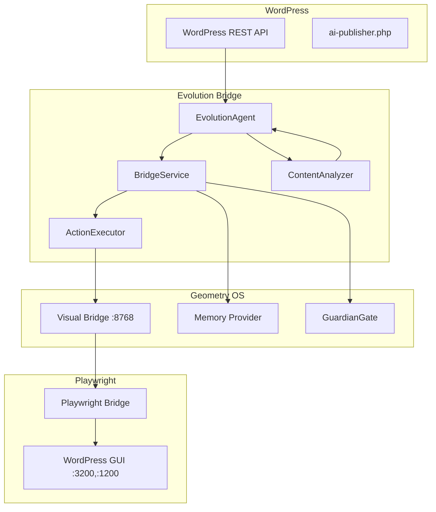

# Design: Evolution Daemon WordPress GUI Integration

## Overview

Bridge service connecting Evolution Daemon to WordPress GUI via Playwright. Follows existing visual_bridge.py WebSocket pattern and evolution_daemon.py async cycle pattern.

## Architecture



## Components

### ContentAnalyzer (`content_analyzer.py`)
**Purpose**: Analyze posts, generate proposals
**Responsibilities**:
- Calculate word count (strip HTML)
- Compute readability score (avg word len, sentences)
- Identify issues and strengths
- Generate ImprovementProposal with confidence

```python
@dataclass
class ContentAnalysis:
    post_id: int
    title: str
    word_count: int
    readability_score: float
    issues: List[str]
    strengths: List[str]

@dataclass
class ImprovementProposal:
    post_id: int
    improvement_type: str  # expand|enhance|correct
    suggested_content: str
    confidence: float
    reason: str
    target_selector: str
```

### EvolutionAgent (`evolution_agent.py`)
**Purpose**: Run evolution cycles on WordPress content
**Responsibilities**:
- Fetch posts via ai-publisher.php
- Analyze each post with ContentAnalyzer
- Filter proposals by confidence threshold
- Return EvolutionCycleResult

```python
@dataclass
class EvolutionCycleResult:
    cycle_number: int
    posts_analyzed: int
    proposals_generated: int
    proposals: List[ImprovementProposal]
    errors: List[str]
```

### ActionExecutor (`action_executor.py`)
**Purpose**: Execute proposals via Playwright bridge
**Responsibilities**:
- Connect to Visual Bridge WebSocket
- Send navigation commands to WordPress admin
- Update content fields
- Click publish button

```python
@dataclass
class ExecutionResult:
    success: bool
    action: str
    post_id: Optional[int]
    error: Optional[str]
    screenshot_path: Optional[str]
```

### BridgeService (`bridge_service.py`)
**Purpose**: Coordinate all components
**Responsibilities**:
- Initialize agent and executor
- Run evolution loop with interval
- Execute approved proposals (if auto_execute)
- Trigger memory sync after changes
- Provide stats endpoint

```python
@dataclass
class BridgeServiceConfig:
    wp_url: str = "http://localhost:8080"
    ws_uri: str = "ws://localhost:8768"
    cycle_interval: int = 300  # 5 minutes
    auto_execute: bool = False
    min_confidence: float = 0.5
```

## Data Flow

1. BridgeService.start() → EvolutionAgent.run_cycle()
2. EvolutionAgent._fetch_posts() → WordPress ai-publisher.php
3. ContentAnalyzer.analyze() → ContentAnalysis
4. ContentAnalyzer.propose_improvement() → ImprovementProposal
5. If auto_execute and confidence >= min_confidence:
   - PlaywrightActionExecutor.execute_proposal()
   - Navigate → Update → Publish
6. If executed: WordPressMemoryProvider.sync_posts()

## Technical Decisions

| Decision | Options | Choice | Rationale |
|----------|---------|--------|-----------|
| WebSocket lib | websockets, aiohttp | websockets | Already used in visual_bridge.py |
| WordPress API | REST, XML-RPC | REST via ai-publisher.php | Existing endpoint |
| Test framework | pytest, unittest | pytest + pytest-asyncio | Project standard |
| Proposal filtering | Pre-execution, post-execution | Pre-execution | Safety first |

## File Structure

| File | Action | Purpose |
|------|--------|---------|
| `systems/evolution_daemon/wordpress/__init__.py` | Create | Package init |
| `systems/evolution_daemon/wordpress/content_analyzer.py` | Create | Content analysis |
| `systems/evolution_daemon/wordpress/evolution_agent.py` | Create | Evolution cycles |
| `systems/evolution_daemon/wordpress/action_executor.py` | Create | Playwright execution |
| `systems/evolution_daemon/wordpress/bridge_service.py` | Create | Main service |
| `systems/evolution_daemon/wordpress/README.md` | Create | Documentation |
| `wordpress_zone/start_evolution_bridge.sh` | Create | Startup script |
| `tests/test_wordpress_content_analyzer.py` | Create | Analyzer tests |
| `tests/test_wordpress_evolution_agent.py` | Create | Agent tests |
| `tests/test_wordpress_action_executor.py` | Create | Executor tests |
| `tests/test_wp_evolution_bridge_service.py` | Create | Service tests |
| `tests/test_evolution_daemon_wordpress_integration.py` | Create | Integration tests |
| `tests/test_wp_evolution_e2e.py` | Create | E2E tests |

## Error Handling

| Error | Handling | User Impact |
|-------|----------|-------------|
| WebSocket disconnect | Reconnect on next cycle | Delayed execution |
| WordPress API error | Log error, skip post, continue | Partial cycle |
| Playwright timeout | Return ExecutionResult.success=False | Proposal not executed |
| Memory provider unavailable | Log warning, skip sync | Memory stale |

## Existing Patterns to Follow

- `systems/visual_shell/api/visual_bridge.py:62` - WebSocket server pattern
- `systems/evolution_daemon/evolution_daemon.py` - Async daemon cycle pattern
- `systems/evolution_daemon/safety/guardian_gate.py` - Proposal validation pattern
- `systems/neural_city/synaptic_query_engine.py` - Semantic search pattern
