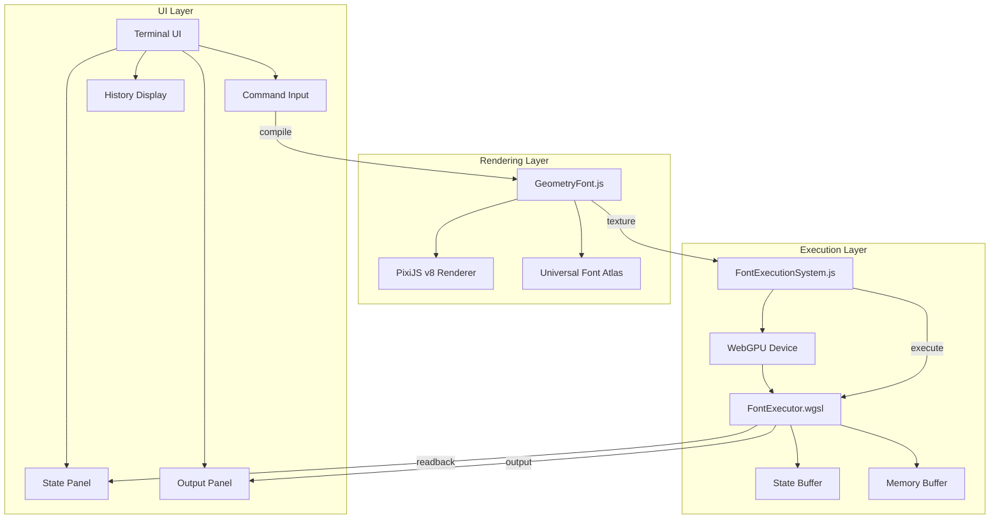

# Design: geometric-font-terminal

## Overview
Enhance existing geo_term.html prototype into full Geometric Terminal. Integrate GeometryFont renderer with FontExecutionSystem for real-time GPU execution of morphological code.

## Architecture



## Components

### Terminal UI (Enhancement)
**Purpose**: Main user interface for command input and output
**File**: `systems/visual_shell/web/geo_term.html`
**Responsibilities**:
- Command input with Enter to execute
- History display with scroll
- State panel showing PC/accumulator/halted
- Output panel for PRINT results

### GeometryFont Renderer (Existing)
**Purpose**: Morphological compilation and glyph rendering
**File**: `systems/visual_shell/web/GeometryFont.js`
**Responsibilities**:
- Load universal font atlas
- Compile text to opcode/operand sequences
- Create PixiJS sprites for glyphs

### FontExecutionSystem (Existing)
**Purpose**: WebGPU orchestration for shader execution
**File**: `systems/visual_shell/web/FontExecutionSystem.js`
**Responsibilities**:
- Initialize WebGPU compute pipeline
- Manage state and memory buffers
- Execute FontExecutor shader
- Read back results

### FontExecutor Shader (Existing)
**Purpose**: GPU-side opcode execution
**File**: `systems/visual_shell/web/shaders/FontExecutor.wgsl`
**Responsibilities**:
- Fetch glyphs from program texture
- Execute 8 opcodes
- Update state struct
- Write to memory/output buffer

## Data Flow

1. User types command (e.g., `+ 10 ! #`)
2. GeometryFont.compile() parses to opcode sequence
3. Sequence encoded to Uint32Array texture (R: visual, G: opcode, B: operand, A: executable)
4. FontExecutionSystem.setProgramTexture() binds texture
5. FontExecutionSystem.run() dispatches compute shader
6. FontExecutor.wgsl executes up to 100 cycles
7. FontExecutionSystem.readState() reads PC/accumulator/halted
8. FontExecutionSystem.readOutput() reads PRINT results
9. UI updates with execution state and output

## Technical Decisions

| Decision | Options | Choice | Rationale |
|----------|---------|--------|-----------|
| UI Framework | Vanilla JS / React / Vue | Vanilla JS | Matches existing geo_term.html pattern |
| State Display | Overlay / Panel / Inline | Side panel | Clear separation, matches geo_edit.html |
| Glyph Rendering | DOM / PixiJS Canvas | PixiJS Canvas | Leverages existing GeometryFont |
| Execution Trigger | Button / Enter key | Enter key | Terminal convention |

## File Structure

| File | Action | Purpose |
|------|--------|---------|
| `systems/visual_shell/web/geo_term.html` | Modify | Enhanced terminal UI |
| `systems/visual_shell/web/GeometryFont.js` | No change | Existing renderer |
| `systems/visual_shell/web/FontExecutionSystem.js` | No change | Existing GPU orchestration |
| `systems/visual_shell/web/shaders/FontExecutor.wgsl` | No change | Existing shader |

## UI Layout

```
+--------------------------------------------------+
| GEOMETRY OS - GEOMETRIC TERMINAL v2.0            |
+--------------------------------------------------+
| State Panel          | Glyph Visualization       |
| PC: 0                | [rendered glyphs here]    |
| ACC: 0               |                           |
| HALT: false          |                           |
| OUTPUT: [30]         |                           |
+--------------------------------------------------+
| History                                           |
| $ + 10                                            |
| $ + 20                                            |
| $ !                                               |
| OUT: 30                                           |
+--------------------------------------------------+
| $ _                                               |
+--------------------------------------------------+
```

## Error Handling

| Error | Handling | User Impact |
|-------|----------|-------------|
| WebGPU unavailable | Show fallback message | Terminal unusable, clear error |
| Atlas load failure | Console error, disabled input | Cannot render glyphs |
| Shader compilation error | Console error | Execution fails gracefully |
| Invalid opcode | Treated as NOP | Non-executable text displayed |

## Existing Patterns to Follow
- geo_edit.html: State panel layout, run button pattern
- FontExecutionSystem.js: Buffer readback with staging buffer pattern
- GeometryFont.js: compile() returns {opcode, operand, executable, visual} objects
