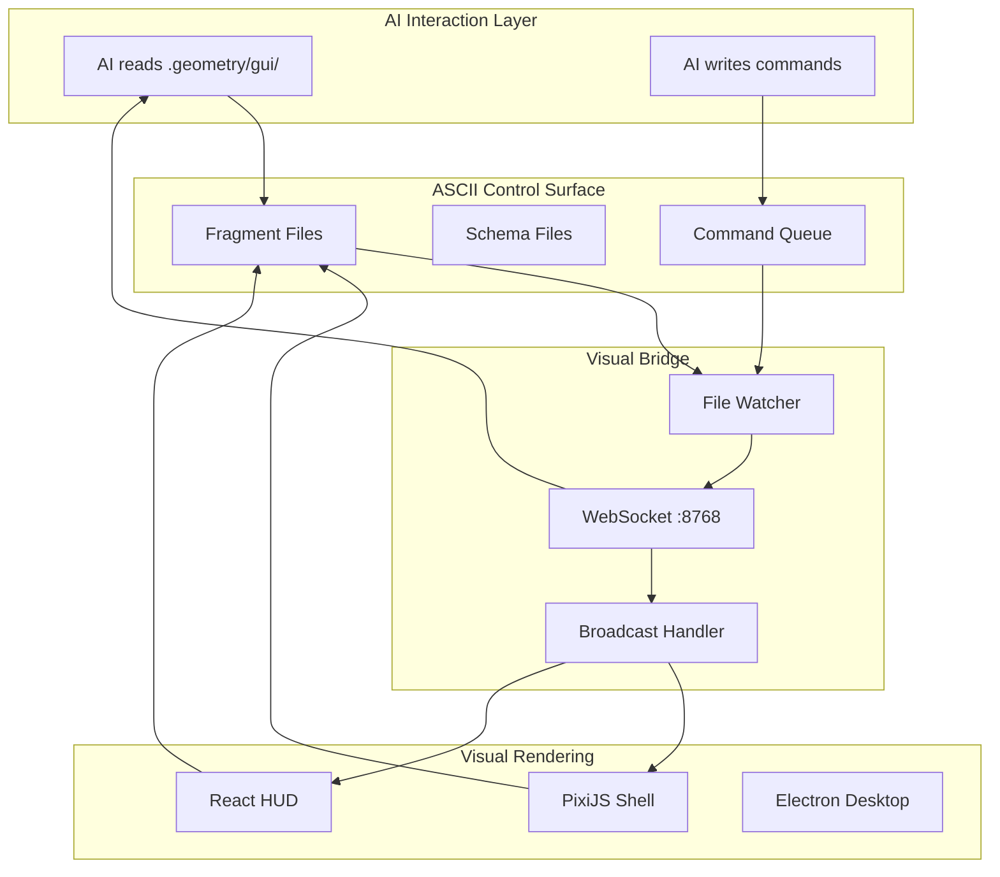
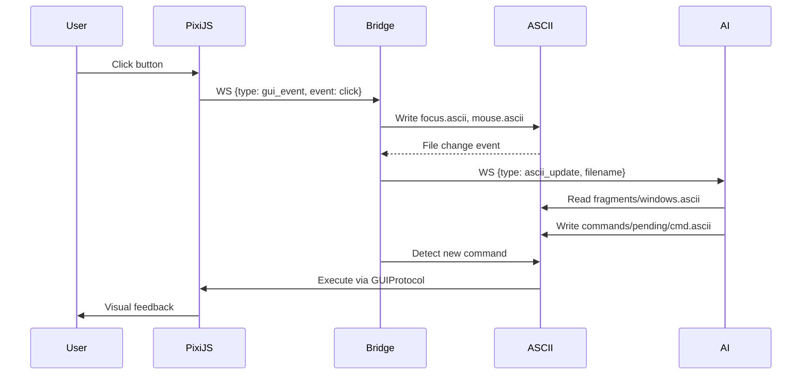

# Design: geometry-os-ascii-gui

## Overview

Dual-audience GUI where every state is exposed as ASCII fragments. Humans use PixiJS visual rendering; AIs read/write `.geometry/gui/` files. Visual Bridge broadcasts changes via WebSocket (port 8768). Same interface, zero-cost AI perception.

## Architecture



## Components

### GUIFragmentRenderer

**Purpose**: Converts GUI state to ASCII fragments
**Location**: `systems/visual_shell/ascii_gui/fragment_renderer.py`

```python
class GUIFragmentRenderer(GUIShellHook):
    """
    ASCII renderer for GUI state.

    Implements GUIShellHook to receive GUI events and emits .ascii files.
    """

    output_dir: Path  # .geometry/gui/fragments/
    windows: Dict[str, Window]
    focused_id: Optional[str]
    mouse_state: MouseState
    keyboard_state: KeyboardState

    def on_window_create(self, id, title, pos, size): ...
    def on_window_focus(self, id): ...
    def on_window_close(self, id): ...
    def on_mouse_move(self, x, y): ...
    def on_key_press(self, key, modifiers): ...

    def _write_windows(self): ...
    def _write_focus(self): ...
    def _write_mouse(self): ...
    def _write_keyboard(self): ...
```

### GUICommandProcessor

**Purpose**: Processes AI commands from command queue
**Location**: `systems/visual_shell/ascii_gui/command_processor.py`

```python
class GUICommandProcessor:
    """
    Watches commands/pending/ and executes GUI actions.

    Moves processed commands to commands/completed/.
    """

    pending_dir: Path
    completed_dir: Path
    executor: Callable[[Command], Awaitable[None]]

    async def start(self): ...  # Start file watcher
    async def process_pending(self) -> List[Command]: ...
    def _load_command(self, path: Path) -> Optional[Command]: ...
    def _execute_command(self, cmd: Command): ...
    def _move_to_completed(self, path: Path, success: bool, error: str): ...
```

### GUIHookBroadcaster

**Purpose**: Broadcasts GUI events to multiple hooks
**Location**: `systems/visual_shell/ascii_gui/hooks.py`

```python
class GUIShellHook(ABC):
    @abstractmethod
    async def on_window_create(self, id, title, pos, size): ...
    @abstractmethod
    async def on_window_focus(self, id): ...
    @abstractmethod
    async def on_window_close(self, id): ...
    @abstractmethod
    async def on_mouse_move(self, x, y): ...
    @abstractmethod
    async def on_key_press(self, key, modifiers): ...
    @abstractmethod
    async def on_menu_open(self, menu_id): ...

class GUIHookBroadcaster(GUIShellHook):
    hooks: List[GUIShellHook]

    def add_hook(self, hook: GUIShellHook): ...
    async def _dispatch(self, method_name: str, *args, **kwargs): ...
```

## Data Flow



1. User interacts with PixiJS visual
2. PixiJS sends event to Visual Bridge via WebSocket
3. GUIFragmentRenderer writes ASCII fragments
4. Bridge broadcasts ASCII updates to all clients
5. AI reads ASCII state, decides action
6. AI writes command to `commands/pending/`
7. GUICommandProcessor executes command
8. State changes trigger fragment updates
9. Cycle continues

## ASCII Control Surface

### Directory Structure

```
.geometry/gui/
  fragments/
    windows.ascii         # Active windows tree (YAML)
    focus.ascii           # Focused element state (ASCII box)
    menus.ascii           # Menu hierarchy (YAML)
    panels.ascii          # Panel layouts (YAML)
    mouse.ascii           # Mouse position/state (ASCII box)
    keyboard.ascii        # Keyboard state (ASCII box)
    clipboard.ascii       # Clipboard content (ASCII box)
  schemas/
    window.schema.yaml    # Window fragment schema
    panel.schema.yaml     # Panel fragment schema
    command.schema.yaml   # Command format schema
  commands/
    pending/              # Incoming commands (AI writes here)
    completed/            # Acknowledged commands
  state/
    layout.ascii          # Current layout configuration
    theme.ascii           # Theme settings
    preferences.ascii     # User preferences
```

### Fragment Formats

**Windows (YAML)**:
```yaml
windows:
  - id: win-001
    title: "Terminal"
    type: terminal
    pos: [100, 50]
    size: [640, 480]
    z: 3
    focused: true
```

**Focus (ASCII Box)**:
```
+------------------------------------------------------------------------------+
| FOCUS STATE                                                                  |
+------------------------------------------------------------------------------+
| Window:     win-001 (Terminal)                                               |
| Element:    textarea[0]                                                      |
| Cursor:     (12, 5)                                                          |
| Mode:       insert                                                           |
+------------------------------------------------------------------------------+
```

## Technical Decisions

| Decision | Options | Choice | Rationale |
|----------|---------|--------|-----------|
| Fragment format | JSON, YAML, custom ASCII | YAML + ASCII boxes | YAML for structured data, boxes for quick scanning |
| Command delivery | File queue, WebSocket, HTTP | File queue | Atomic writes, no connection management, replay-able |
| File watching | polling, inotify, watchdog | watchdog | Cross-platform, efficient, already used in project |
| Atomicity | none, temp+rename, locks | temp+rename | Consistent with existing ASCII Scene Graph pattern |
| State sync | push, pull, hybrid | push via WS + pull via files | WS for real-time, files for persistence |

## Error Handling

| Scenario | Strategy | User Impact |
|----------|----------|-------------|
| Invalid command | Log, move to `completed/` with error | AI retries or adapts |
| Fragment write failure | Retry 3x, log, continue | Stale state shown |
| Bridge disconnect | Buffer events, reconnect | Brief state lag |
| Schema mismatch | Validate on read, reject invalid | Command ignored |
| Concurrent command writes | UUID collision check | Last write wins |

## File Structure

| File | Action | Purpose |
|------|--------|---------|
| `systems/visual_shell/ascii_gui/__init__.py` | Create | Module exports |
| `systems/visual_shell/ascii_gui/models.py` | Create | Data classes (Window, MouseState, KeyboardState, Command) |
| `systems/visual_shell/ascii_gui/hooks.py` | Create | GUI hook system |
| `systems/visual_shell/ascii_gui/fragment_renderer.py` | Create | GUI ASCII renderer |
| `systems/visual_shell/ascii_gui/command_processor.py` | Create | Command queue processor |
| `systems/visual_shell/ascii_gui/example.py` | Create | Usage demonstration |
| `.geometry/gui/` | Create | Directory structure |
| `tests/systems/visual_shell/ascii_gui/` | Create | Unit tests |

## Existing Patterns to Follow

From codebase analysis:
- `VisualShellAsciiRenderer`: Hook pattern, atomic writes, auto_flush
- `VisualShellHookBroadcaster`: Async dispatch, gather with return_exceptions
- `visual_bridge.py`: WebSocket broadcasting, file watching, ASCII poller

## Test Strategy

### Unit Tests
- `test_hooks.py`: Hook interface and broadcaster dispatch
- `test_fragment_renderer.py`: Fragment format verification
- `test_command_processor.py`: Command parsing and execution

### Integration Tests
- `test_e2e_flow.py`: Full cycle from event to fragment to command
