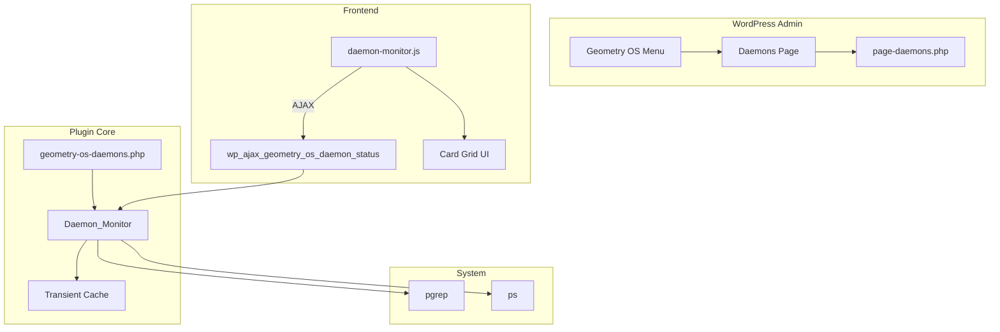

# Design: Geometry OS Daemons Dashboard

## Overview

New WordPress plugin `geometry-os-daemons` with card-based dashboard. Daemon_Monitor class extends pattern from `ascii-desktop-control/includes/class-daemon-status.php` to support multiple daemons with additional metrics (CPU, memory, uptime).

## Architecture

## Components

### Geometry_OS_Daemons (Main Plugin Class)

**Purpose**: Plugin initialization, menu registration, asset loading

**Responsibilities**:
- Register admin menu (top-level "Geometry OS" + "Daemons" submenu)
- Enqueue CSS/JS assets on plugin pages
- Register AJAX handler for status requests
- Load includes (Daemon_Monitor class)

**Pattern**: Same structure as `ASCII_Desktop_Control` in `ascii-desktop-control.php`

### Daemon_Monitor Class

**Purpose**: Multi-daemon status checking with caching

**Responsibilities**:
- Define daemons list (evolution, directive, visual_bridge)
- Check daemon status via `pgrep -f <process>`
- Fetch metrics via `ps -p <pid> -o etimes=,%cpu=,%mem=`
- Cache results in WordPress transient (30s TTL)
- Format uptime to human-readable string

**Pattern**: Extends `Daemon_Status` from `class-daemon-status.php`

### Admin Dashboard Page (page-daemons.php)

**Purpose**: Render card-based daemon status grid

**Responsibilities**:
- Display daemon cards in responsive grid
- Show status indicator (green=running, red=stopped)
- Show metrics (PID, uptime, CPU, memory) for running daemons
- Manual refresh button
- Last updated timestamp

### JavaScript Auto-Refresh (daemon-monitor.js)

**Purpose**: AJAX polling for status updates

**Responsibilities**:
- Auto-refresh every 30 seconds
- Manual refresh button handler
- Update card content with new data
- Show loading animation during refresh

## Data Flow

1. Page load: PHP renders initial cards with cached/fresh data
2. Frontend: JS starts 30s interval timer
3. On interval/button click: JS POST to `wp_ajax_geometry_os_daemon_status`
4. Backend: Check transient cache, refresh if expired/forced
5. Backend: Return JSON with daemon statuses
6. Frontend: Update card DOM elements with new data
7. Frontend: Update "Last updated" timestamp

## Technical Decisions

| Decision | Options | Choice | Rationale |
|----------|---------|--------|-----------|
| Process detection | pgrep, pidof, ps aux | pgrep -f | Pattern match, reliable, used in existing code |
| Metrics source | ps, top, /proc | ps -o | Simple, one command for all metrics |
| Cache storage | WP Transients, Options, custom | Transients | Auto-expiry, existing pattern |
| UI layout | Table, Cards, List | Cards | Visual clarity, responsive grid |
| Refresh method | meta refresh, JS polling | JS polling | No page reload, smoother UX |

## File Structure

| File | Action | Purpose |
|------|--------|---------|
| `wordpress_zone/wordpress/wp-content/plugins/geometry-os-daemons/geometry-os-daemons.php` | Create | Main plugin class |
| `wordpress_zone/wordpress/wp-content/plugins/geometry-os-daemons/includes/class-daemon-monitor.php` | Create | Multi-daemon status checker |
| `wordpress_zone/wordpress/wp-content/plugins/geometry-os-daemons/admin/page-daemons.php` | Create | Dashboard template |
| `wordpress_zone/wordpress/wp-content/plugins/geometry-os-daemons/assets/css/admin.css` | Create | Card grid styles |
| `wordpress_zone/wordpress/wp-content/plugins/geometry-os-daemons/assets/js/daemon-monitor.js` | Create | Auto-refresh logic |
| `wordpress_zone/wordpress/wp-content/plugins/geometry-os-daemons/tests/php/bootstrap.php` | Create | Test bootstrap |
| `wordpress_zone/wordpress/wp-content/plugins/geometry-os-daemons/tests/php/class-test-daemon-monitor.php` | Create | Unit tests |

## Error Handling

| Error | Handling | User Impact |
|-------|----------|-------------|
| shell_exec disabled | Return all daemons as stopped | Shows "Stopped" status |
| pgrep fails | Return null PID | Shows "Stopped" status |
| ps fails | Return null metrics | Shows "N/A" for metrics |
| AJAX fails | Log to console, retry next interval | Stale data shown |

## Existing Patterns to Follow

- Plugin header format: `ascii-desktop-control/ascii-desktop-control.php` lines 1-13
- Transient caching: `ascii-desktop-control/includes/class-daemon-status.php` lines 56-73
- pgrep usage: Same file, lines 89-94
- AJAX handler structure: Same file, lines 802-826
- Admin menu registration: Same file, lines 177-207
- JS localization: Same file, lines 391-394
