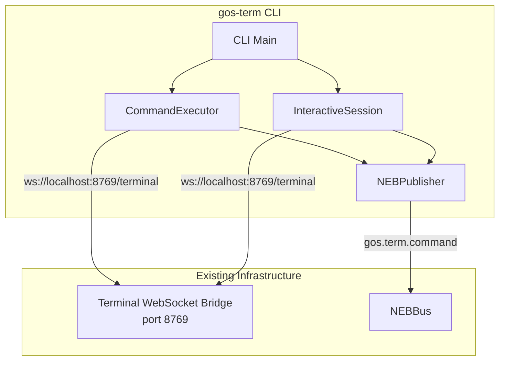
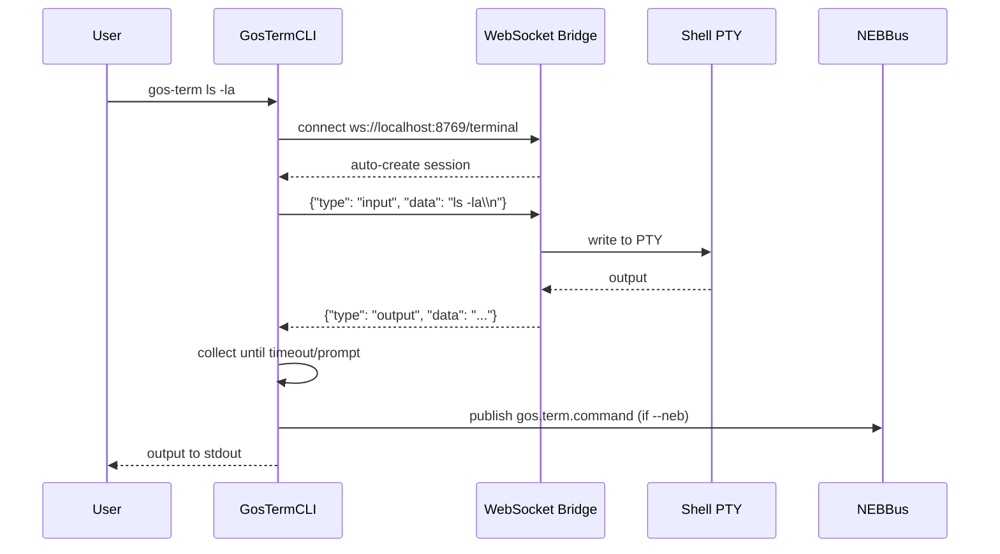

# Design: gos-term CLI

## Overview

CLI tool extending existing Terminal WebSocket Bridge (port 8769) with single-command execution, interactive mode, and optional NEB event publishing. Thin wrapper around existing APIs - minimal new code.

## Architecture



## Components

### CLI Main (gos_term_cli.py)
**Purpose**: Entry point, argument parsing, mode dispatch
**Responsibilities**:
- Parse args with argparse
- Dispatch to CommandExecutor or InteractiveSession
- Handle exit codes

**Interfaces**:
```python
class GosTermCLI:
    def __init__(self, port: int = 8769, timeout: float = 30.0, neb: bool = False)
    async def run(self, command: list[str] | None) -> int  # Exit code

def main() -> None  # Sync entry point
```

### CommandExecutor
**Purpose**: Single command execution via WebSocket
**Responsibilities**:
- Connect to WebSocket bridge
- Send command, collect output
- Handle timeout
- Return output + exit status

**Interfaces**:
```python
class CommandExecutor:
    def __init__(self, ws_url: str, timeout: float)
    async def execute(self, command: str) -> CommandResult

@dataclass
class CommandResult:
    output: str
    success: bool
    error: str | None
```

### InteractiveSession
**Purpose**: Interactive terminal with PTY handling
**Responsibilities**:
- Set terminal to raw mode
- Stream stdin to WebSocket
- Display WebSocket output to stdout
- Restore terminal on exit (always)

**Interfaces**:
```python
class InteractiveSession:
    def __init__(self, ws_url: str)
    async def run(self) -> int
    def _setup_terminal(self) -> termios.attr  # Save original
    def _restore_terminal(self, original: termios.attr)  # Always call
```

### NEBPublisher
**Purpose**: Optional NEB event publishing
**Responsibilities**:
- Publish command events to `gos.term.command`
- Graceful degradation if NEB unavailable
- Truncate output in payload (max 1KB)

**Interfaces**:
```python
class NEBPublisher:
    def __init__(self, enabled: bool = False)
    def publish(self, topic: str, payload: dict) -> bool  # Returns success
```

## Data Flow



1. CLI parses args, determines mode (single vs interactive)
2. Connect to WebSocket bridge (auto-creates session)
3. Single: send command + newline, collect output until timeout
4. Interactive: bidirectional streaming with raw terminal
5. Publish to NEB if flag set (graceful failure)
6. Return exit code (0 success, 1 error)

## Technical Decisions

| Decision | Options Considered | Choice | Rationale |
|----------|-------------------|--------|-----------|
| WebSocket client | websockets, aiohttp | websockets | Already in project, pure asyncio |
| Arg parsing | argparse, click, typer | argparse | No new deps, follows ClipboardCLI pattern |
| NEB integration | Direct NEBBus, HTTP API | Direct NEBBus | In-process, simpler than HTTP bridge |
| Output detection | Prompt regex, timeout, exit code | Timeout only | Shell-agnostic, simplest |
| Interactive PTY | ptyprocess, native termios | Native termios | No new deps, direct control |
| Version display | Hardcoded, importlib.metadata | Hardcoded | Simpler for MVP |

## File Structure

| File | Action | Purpose |
|------|--------|---------|
| systems/visual_shell/api/gos_term_cli.py | Create | CLI module with all components |
| systems/visual_shell/api/tests/test_gos_term_cli.py | Create | Unit tests |
| gos-term | Create | Shell wrapper script |
| specs/gos-term-cli/design.md | Create | This design |

## Error Handling

| Error Scenario | Handling Strategy | User Impact |
|----------------|-------------------|-------------|
| WebSocket connection refused | Print error, exit 1 | "Cannot connect to terminal bridge on port X" |
| Command timeout | Print partial output, exit 1 | "Command timed out after X seconds" |
| NEB unavailable | Log warning, continue | Output succeeds, no event published |
| Terminal restore fails | Best effort, log | Terminal may need `reset` |
| UTF-8 decode error | Replace with U+FFFD | No crash on invalid encoding |

## Edge Cases

- **Empty command**: Print help, exit 0
- **Ctrl+C during interactive**: Clean restore, exit 130
- **Ctrl+D during interactive**: Clean exit, exit 0
- **Very long output**: Stream to stdout, truncate NEB payload to 1KB
- **Binary output**: Replace invalid UTF-8, don't crash

## Test Strategy

### Unit Tests
- `TestGosTermCLI`: Arg parsing, mode dispatch
- `TestCommandExecutor`: Execute mock WebSocket, timeout handling
- `TestInteractiveSession`: Raw mode setup/restore
- `TestNEBPublisher`: Publish success/failure, output truncation

### Integration Tests
- Execute real command via bridge (`echo hello`)
- Interactive session with mock stdin
- NEB event received by subscriber

### E2E Tests (requires running bridge)
- `gos-term echo test` outputs "test"
- `gos-term -i` provides working shell
- `gos-term --neb pwd` publishes event

## Performance Considerations

- Async I/O for WebSocket (no blocking)
- Output streaming (not buffering entire output)
- Memory: <50MB target (WebSocket client is lightweight)

## Security Considerations

- No credential storage (uses existing session auth)
- Command injection: Pass-through to shell (user responsibility)
- NEB events: Sanitize/truncate to prevent log flooding

## Existing Patterns to Follow

Based on codebase analysis:
- `systems/clipboard/cli.py`: argparse pattern, class-based CLI, format_output methods
- `systems/visual_shell/api/tests/test_terminal_bridge.py`: pytest-asyncio, websockets client pattern
- Terminal WebSocket Bridge protocol: JSON with `type` field

## Unresolved Questions

- Exit code from shell output? (Deferred - always 0 on no exception per requirements)
- `-e` env var injection? (Deferred to future)

## Implementation Steps

1. Create `systems/visual_shell/api/gos_term_cli.py` with GosTermCLI, CommandExecutor, InteractiveSession, NEBPublisher classes
2. Add `--version` flag returning "gos-term 1.0.0"
3. Implement WebSocket command execution with timeout
4. Implement interactive mode with termios raw mode + cleanup in finally
5. Add NEB integration with graceful degradation
6. Create `gos-term` shell wrapper at project root
7. Create `systems/visual_shell/api/tests/test_gos_term_cli.py` with unit tests
8. Add integration test requiring running bridge (skipif decorator)
