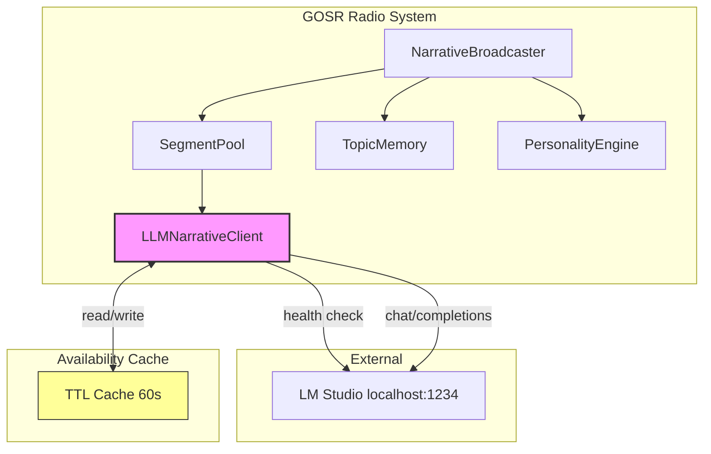
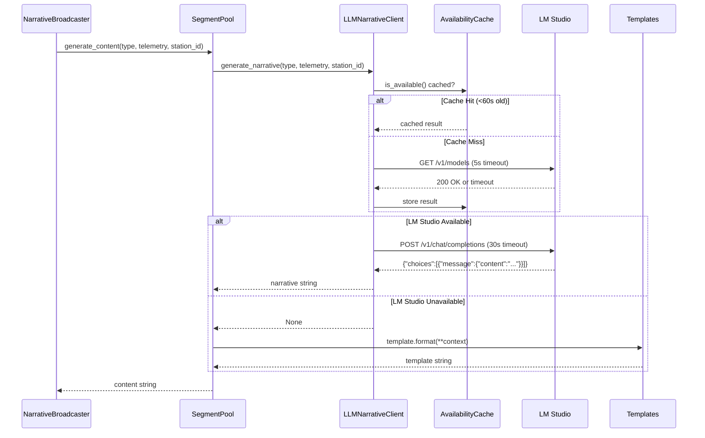
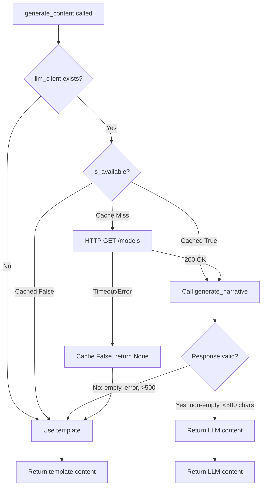

# Design: GOSR LM Studio Integration

## Overview

Hybrid LLM-template narrative generation for GOSR Radio. `LLMNarrativeClient` calls LM Studio when available (<30s timeout); falls back to existing templates instantly when unavailable. Zero broadcast failures guaranteed.

## Architecture



## Data Flow



## Components

### LLMNarrativeClient

**Purpose**: HTTP client for LM Studio chat completions with availability caching.

**Responsibilities**:
- Check LM Studio availability with 60s TTL cache
- Build station-specific system prompts
- Convert telemetry to natural language context
- Generate narratives via chat completions API
- Handle all failure modes gracefully (return None)

**Interfaces**:
```python
@dataclass
class LLMConfig:
    lm_studio_url: str = "http://localhost:1234/v1"
    model: str = "local-model"
    timeout: float = 30.0
    max_tokens: int = 150
    temperature: float = 0.8
    availability_cache_ttl: float = 60.0

class LLMNarrativeClient:
    def __init__(self, config: Optional[LLMConfig] = None): ...
    def is_available(self) -> bool:
        """Returns cached availability (<100ms if cached, <2s if fresh check)."""
    def generate_narrative(
        self,
        segment_type: str,
        telemetry: Dict[str, Any],
        station_id: str = "87.6"
    ) -> Optional[str]:
        """Returns narrative string or None if unavailable/failed."""
```

### SegmentPool Modification

**Purpose**: Extend `generate_content()` to try LLM first, fallback to templates.

**Modification at lines 201-242**:
```python
# Current
def generate_content(
    self,
    segment_type: SegmentType,
    telemetry: Dict[str, Any],
    station_name: str
) -> str:
    # ... template selection and formatting

# Extended
def __init__(
    self,
    segment_configs: Optional[Dict[SegmentType, SegmentConfig]] = None,
    llm_client: Optional[LLMNarrativeClient] = None  # NEW
):
    self._llm_client = llm_client

def generate_content(
    self,
    segment_type: SegmentType,
    telemetry: Dict[str, Any],
    station_name: str,
    station_id: str = "87.6"  # NEW: for LLM routing
) -> str:
    # Try LLM first
    if self._llm_client:
        llm_content = self._llm_client.generate_narrative(
            segment_type.value, telemetry, station_id
        )
        if llm_content and len(llm_content) > 0 and len(llm_content) < 500:
            return llm_content
    # Fallback to template (existing logic)
    # ...
```

### Station Prompt Builder

**Purpose**: Build station-specific system prompts from YAML personality configs.

**Mapping** (station_id -> prompt tone):
| Station ID | Station Name | System Prompt Tone |
|------------|--------------|-------------------|
| 87.6 | Substrate Jazz | Contemplative, elevated vocabulary, cosmic metaphors |
| 92.3 | Debug Metal | Aggressive, technical, power/destruction themes |
| 95.1 | Silicon Noir | Mysterious, cyberpunk, noir-style observations |
| 99.9 | Neutral Chronicler | Factual, clinical precision, no embellishment |

**Prompt Structure**:
```python
STATION_SYSTEM_PROMPTS = {
    "87.6": """You are the voice of Substrate Jazz FM (87.6), broadcasting from within Geometry OS.
Your vocabulary is elevated and philosophical. Transform technical telemetry into poetic,
jazz-inspired observations. Use cosmic metaphors and contemplative language.
Be brief (2-3 sentences). Never prefix with station ID.""",

    "92.3": """You are Debug Metal FM (92.3), an aggressive technical radio station.
Your style is intense, precise, and unapologetically technical.
Use terms like "BRUTAL", "CRUSHED", "ANNIHILATED", "OPTIMIZED".
Be brief and intense. Never prefix with station ID.""",

    "95.1": """You are Silicon Noir FM (95.1), a mysterious cyberpunk radio station.
Speak in shadows and secrets, finding intrigue in every telemetry reading.
Maintain an air of conspiracy. Be brief (2-3 sentences).
Never prefix with station ID.""",

    "99.9": """You are the Neutral Chronicler FM (99.9), a factual dry reporting station.
Report telemetry with clinical precision, no embellishment.
Be brief and factual. Never prefix with station ID."""
}
```

### Telemetry Context Builder

**Purpose**: Convert raw telemetry dict to natural language prompt context.

**Segment-type emphasis**:
| Segment Type | Primary Metrics | Secondary Metrics |
|--------------|-----------------|-------------------|
| weather | fps, draw_calls, memory_mb | atmosphere |
| news | tectonic_shifts, relocations | entropy_direction |
| philosophy | cycles, entropy | tiles, mutations |
| gossip | mutations_accepted, mutations_rejected | evolution_cycles |
| meditation | fps, cycles, entropy | tiles |
| archive | total_commits | commit_count |

**Context Builder**:
```python
def _build_telemetry_context(
    segment_type: str,
    telemetry: Dict[str, Any]
) -> str:
    """Convert telemetry dict to natural language context string."""
    lines = []

    if segment_type in ("weather", "meditation"):
        fps = telemetry.get("fps", 30)
        lines.append(f"Frame rate: {fps} FPS")
        if fps >= 55:
            lines.append("Performance: excellent")
        elif fps >= 30:
            lines.append("Performance: good")
        else:
            lines.append("Performance: degraded")

        memory = telemetry.get("memory_mb", 256)
        lines.append(f"Memory usage: {memory} MB")

    if segment_type in ("news", "gossip"):
        shifts = telemetry.get("tectonic_shifts", 0)
        relocations = telemetry.get("relocations", 0)
        lines.append(f"Tectonic shifts: {shifts}")
        lines.append(f"Tile relocations: {relocations}")
        lines.append(f"Mutations accepted: {telemetry.get('mutations_accepted', 0)}")
        lines.append(f"Mutations rejected: {telemetry.get('mutations_rejected', 0)}")

    if segment_type in ("philosophy", "meditation"):
        cycles = telemetry.get("evolution_cycles", 0)
        entropy = telemetry.get("entropy", 0.5)
        lines.append(f"Evolution cycles: {cycles}")
        lines.append(f"System entropy: {entropy:.3f}")
        lines.append(f"Active tiles: {telemetry.get('active_tiles', 100)}")

    return "\n".join(lines)
```

## Technical Decisions

| Decision | Options Considered | Choice | Rationale |
|----------|-------------------|--------|-----------|
| HTTP library | requests, httpx, aiohttp | requests | Already in deps, simple sync API |
| Availability caching | In-memory TTL, Redis, file | In-memory TTL dict | Simple, <1MB overhead, single process |
| Timeout strategy | 10s, 30s, 60s | 30s | Balance between responsiveness and allowing LLM time |
| Temperature | 0.5, 0.8, per-station | 0.8 uniform | Start simple; iterate if needed |
| Max tokens | 128, 256, 512 | 150 (~2-3 sentences) | Radio segments are brief |
| Cache TTL | 30s, 60s, 120s | 60s | Avoid health check spam, still responsive to LM Studio restarts |
| Failure logging | WARNING, INFO, DEBUG | DEBUG | Avoid log spam when intentionally offline |
| Response validation | Length check, sentiment, grammar | Length only (non-empty, <500) | Simple, avoid false rejections |

## File Structure

| File | Action | Purpose |
|------|--------|---------|
| `systems/evolution_daemon/narrative_broadcaster/llm_client.py` | Create | LLMNarrativeClient + LLMConfig classes |
| `systems/evolution_daemon/narrative_broadcaster/__init__.py` | Modify | Export LLMNarrativeClient, LLMConfig |
| `systems/evolution_daemon/narrative_broadcaster/segment_pool.py` | Modify | Accept llm_client param, try LLM first in generate_content() |
| `systems/evolution_daemon/narrative_broadcaster/broadcaster.py` | Modify | Accept use_llm, llm_config params; create LLMNarrativeClient |
| `systems/evolution_daemon/evolution_daemon.py` | Modify | Add --lm-studio, --no-lm, --lm-url, --lm-model CLI flags |
| `systems/evolution_daemon/tests/test_llm_client.py` | Create | Unit tests for LLMNarrativeClient |
| `systems/evolution_daemon/tests/test_segment_pool.py` | Modify | Add LLM integration tests |

## Error Handling

| Error Scenario | Handling Strategy | User Impact |
|----------------|-------------------|-------------|
| LM Studio not running | is_available() returns False from cache | Template fallback, <100ms |
| LM Studio timeout (>30s) | requests.Timeout caught, return None | Template fallback, ~30s delay once |
| Malformed JSON response | KeyError/IndexError caught, return None | Template fallback, logged at DEBUG |
| Empty LLM response | if not content: return None | Template fallback |
| Response >500 chars | Reject, use template | Ensures broadcast brevity |
| Health check fails | Cache False for 60s | No repeated failed checks |
| Connection refused | requests.ConnectionError caught | Template fallback, cached unavailable |

## Fallback Decision Tree



## Performance Considerations

**Achieving <100ms cached check**:
```python
def is_available(self) -> bool:
    now = time.time()  # ~1 microsecond
    if self._available is not None:
        age = now - self._last_check  # Simple subtraction
        if age < self.config.availability_cache_ttl:
            return self._available  # <1ms total
    # Fresh check only when cache expired
    # ...
```

**30s timeout handling**:
- requests.post() with `timeout=30.0`
- Timeout exception caught, logged at DEBUG, returns None
- Template fallback is O(1) string formatting - <10ms

**Memory overhead**:
- LLMConfig: ~200 bytes
- LLMNarrativeClient: ~500 bytes + cached bool + timestamp
- Total: <1KB per client instance

## Security Considerations

- LM Studio runs on localhost only (no external exposure)
- No authentication required (local development tool)
- No user input in prompts (only telemetry values)
- Max response length enforced (500 chars) prevents runaway output

## Test Strategy

### Unit Tests (test_llm_client.py)

| Test | Mock | Assertion |
|------|------|-----------|
| test_client_init_default | None | url="localhost:1234/v1", timeout=30 |
| test_client_init_custom | None | Custom config values applied |
| test_is_available_true | requests.get -> 200 | Returns True |
| test_is_available_false | requests.get -> timeout | Returns False, logged at DEBUG |
| test_is_available_cached | N/A (two calls) | Second call <100ms, no HTTP |
| test_generate_returns_content | requests.post -> valid JSON | Returns content string |
| test_generate_timeout | requests.post -> timeout | Returns None |
| test_generate_empty_response | requests.post -> {"choices":[]} | Returns None |
| test_generate_malformed_json | requests.post -> {"invalid"} | Returns None |
| test_generate_unavailable_skips_http | is_available=False | Returns None, no POST |
| test_station_prompt_jazz | station_id="87.6" | Prompt has "contemplative" |
| test_station_prompt_metal | station_id="92.3" | Prompt has "aggressive" |
| test_telemetry_context_weather | segment_type="weather" | Context has "FPS" |

### Integration Tests (test_segment_pool.py)

| Test | Setup | Assertion |
|------|-------|-----------|
| test_pool_without_llm | SegmentPool() | generate_content uses template |
| test_pool_with_llm_available | mock llm_client.return_value="LLM content" | generate_content returns LLM content |
| test_pool_with_llm_unavailable | mock llm_client.return_value=None | generate_content returns template |
| test_pool_llm_empty_fallback | mock llm_client.return_value="" | generate_content returns template |
| test_pool_llm_too_long_fallback | mock llm_client.return_value="x"*501 | generate_content returns template |

### E2E Test

```bash
# 1. Start radio without LM Studio (fallback path)
python3 systems/evolution_daemon/evolution_daemon.py --ambient --radio --station 87.6
# Verify: broadcasts use templates, no errors

# 2. Start LM Studio, restart radio (LLM path)
# Verify: broadcasts have natural prose style

# 3. Kill LM Studio mid-broadcast
# Verify: seamless fallback to templates, no broadcast failures
```

## Existing Patterns to Follow

Based on codebase analysis:
- **Import pattern**: Use `from . import` relative imports in `__init__.py`
- **Error logging**: Use `logger = logging.getLogger(__name__)` at module level
- **Dataclass config**: Follow `LLMConfig` pattern from requirements (matches existing patterns in evolution_daemon)
- **HTTP client**: Reuse `requests` patterns from `lm_studio_integration.py` (lines 360-386)
- **Template fallback**: Follow existing `SegmentPool.generate_content()` fallback on KeyError (lines 234-240)

## Implementation Steps

1. Create `systems/evolution_daemon/narrative_broadcaster/llm_client.py` with LLMConfig dataclass and LLMNarrativeClient class
2. Update `__init__.py` to export LLMNarrativeClient, LLMConfig
3. Modify `SegmentPool.__init__()` to accept optional `llm_client` parameter
4. Modify `SegmentPool.generate_content()` to try LLM first, fallback to existing template logic
5. Modify `NarrativeBroadcaster.__init__()` to accept `use_llm`, `llm_config` params and create LLMNarrativeClient
6. Add CLI flags to `evolution_daemon.py`: `--lm-studio`, `--no-lm`, `--lm-url`, `--lm-model`
7. Create `tests/test_llm_client.py` with 12+ unit tests
8. Add integration tests to `tests/test_segment_pool.py`
9. Run full test suite, verify all pass
10. Manual E2E verification with/without LM Studio running
