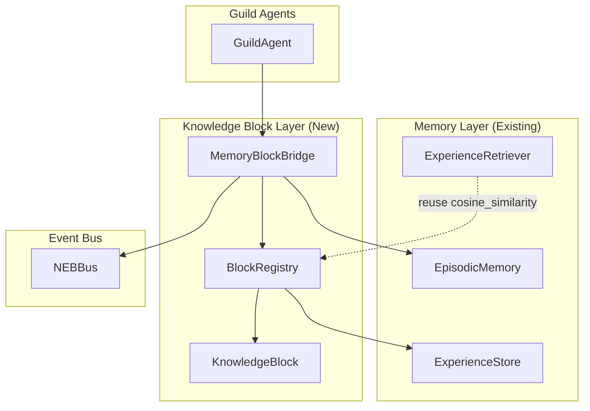
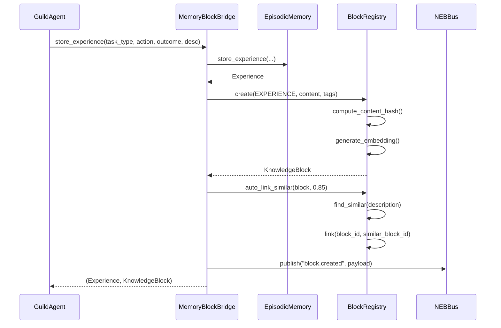

# Design: Heaper Knowledge Blocks

## Overview

KnowledgeBlock layer extends swarm/memory with associative cognition. Blocks wrap experiences with bidirectional linking (mentions/backlinks), enabling emergent knowledge graphs. MemoryBlockBridge preserves EpisodicMemory API while adding graph capabilities.

## Architecture



## Components

### KnowledgeBlock

**Purpose**: Atomic knowledge unit with content, links, metadata.

**Dataclass**:
```python
@dataclass
class KnowledgeBlock:
    block_id: str           # SHA-256 hash of content
    block_type: BlockType   # Enum: CONCEPT, EXPERIENCE, TASK, NOTE, REFERENCE
    content: Dict[str, Any] # Flexible payload
    tags: Set[str]          # #tags for categorization
    mentions: List[str]     # Outgoing links (block_ids I reference)
    backlinks: List[str]    # Incoming links (block_ids referencing me)
    embedding: List[float]  # 128-dim vector for semantic search
    metadata: Dict[str, Any]
    created_at: float
    updated_at: float

    def to_dict(self) -> Dict[str, Any]
    @staticmethod
    def from_dict(data: Dict[str, Any]) -> 'KnowledgeBlock'
    def compute_content_hash() -> str
```

### BlockType Enum

```python
class BlockType(Enum):
    CONCEPT = "concept"       # Abstract ideas, patterns
    EXPERIENCE = "experience" # Agent experiences (wrapped from EpisodicMemory)
    TASK = "task"             # Task-related knowledge
    NOTE = "note"             # Freeform notes
    REFERENCE = "reference"   # External references, docs
```

### BlockRegistry

**Purpose**: CRUD, linking, queries for KnowledgeBlocks.

**Interfaces**:
```python
class BlockRegistry:
    def __init__(self, storage_path: str = ".geometry/knowledge_blocks.json")

    # CRUD
    def create(self, block_type: BlockType, content: Dict[str, Any],
               tags: Optional[Set[str]] = None) -> KnowledgeBlock
    def get(self, block_id: str) -> Optional[KnowledgeBlock]
    def update(self, block_id: str, content: Optional[Dict] = None,
               tags: Optional[Set[str]] = None) -> Optional[KnowledgeBlock]
    def delete(self, block_id: str) -> bool

    # Linking
    def link(self, from_id: str, to_id: str) -> bool  # Bidirectional, idempotent
    def unlink(self, from_id: str, to_id: str) -> bool
    def get_mentions(self, block_id: str) -> List[KnowledgeBlock]
    def get_backlinks(self, block_id: str) -> List[KnowledgeBlock]

    # Queries
    def find_similar(self, query: str, k: int = 5,
                     min_similarity: float = 0.0) -> List[BlockSimilarityResult]
    def find_by_tag(self, tags: Set[str], match_all: bool = False) -> List[KnowledgeBlock]
    def find_by_type(self, block_type: BlockType) -> List[KnowledgeBlock]
    def get_unlinked(self) -> List[KnowledgeBlock]  # Orphan blocks

    # Internal
    def _compute_content_hash(self, content: Dict[str, Any]) -> str
    def _refresh_tag_index(self) -> None
```

### MemoryBlockBridge

**Purpose**: Wraps EpisodicMemory, auto-creates linked ExperienceBlocks.

**Interfaces**:
```python
class MemoryBlockBridge:
    def __init__(self, agent_id: str, episodic_memory: EpisodicMemory,
                 block_registry: BlockRegistry, event_bus: Optional[NEBBus] = None)

    # Enhanced store with linking
    def store_experience(self, task_type: str, action: str, outcome: str,
                         description: str, metadata: Optional[dict] = None,
                         auto_link: bool = True) -> Tuple[Experience, KnowledgeBlock]

    # Pass-through to EpisodicMemory (backward compatible)
    def check_similar_failures(self, query_embedding: List[float],
                               k: int = 5, min_similarity: float = 0.5) -> List[SimilarityResult]
    def find_similar_successes(self, query_embedding: List[float],
                               k: int = 5, min_similarity: float = 0.5) -> List[SimilarityResult]
    def get_all_experiences(self) -> List[Experience]
    def get_my_experiences(self) -> List[Experience]

    # Block-specific
    def find_related_blocks(self, block_id: str, max_depth: int = 2) -> List[KnowledgeBlock]
    def auto_link_similar(self, block: KnowledgeBlock, threshold: float = 0.85) -> int

    # Event publishing
    def _publish_block_event(self, topic: str, payload: dict) -> None
```

## Data Flow



1. Agent calls `store_experience()` on bridge
2. Bridge forwards to EpisodicMemory (existing flow preserved)
3. Bridge creates KnowledgeBlock from experience
4. Bridge auto-links to similar blocks (threshold 0.85)
5. Bridge publishes `block.created` event to NEBBus
6. Returns both Experience and KnowledgeBlock

## Technical Decisions

| Decision | Options Considered | Choice | Rationale |
|----------|-------------------|--------|-----------|
| Block ID generation | UUID, SHA-256 hash, incremental | SHA-256 hash | Auto de-dup, deterministic, matches research |
| Link storage | Adjacency list, edge table | Adjacency list (mentions/backlinks on block) | Simple, follows Heaper, O(1) access |
| Similarity search | Linear scan, FAISS, Annoy | Linear scan (Phase I) | Sufficient for <10k blocks, defer optimization |
| Tag lookup | List scan, dict index | Dict index `{tag: set(block_ids)}` | O(1) lookup per tag |
| Bridge pattern | Replace EpisodicMemory, wrap it | Wrap (composition) | Backward compatible, zero breaking changes |
| File locking | SQLite, fcntl, no locking | fcntl (reuse ExperienceStore pattern) | Proven pattern, no new dependencies |
| Event topics | flat namespace, hierarchical | hierarchical (`block.created`, `block.linked`) | Matches NEBBus wildcard patterns |

## File Structure

| File | Action | Purpose |
|------|--------|---------|
| `systems/swarm/knowledge/__init__.py` | Create | Package exports |
| `systems/swarm/knowledge/knowledge_block.py` | Create | KnowledgeBlock dataclass + BlockType enum |
| `systems/swarm/knowledge/block_registry.py` | Create | BlockRegistry with CRUD, linking, queries |
| `systems/swarm/knowledge/memory_block_bridge.py` | Create | MemoryBlockBridge wrapping EpisodicMemory |
| `systems/swarm/knowledge/test_knowledge_block.py` | Create | Unit tests for KnowledgeBlock |
| `systems/swarm/knowledge/test_block_registry.py` | Create | Unit tests for BlockRegistry |
| `systems/swarm/knowledge/test_memory_block_bridge.py` | Create | Unit tests for MemoryBlockBridge |
| `systems/swarm/knowledge/__init__.py` | Modify | Export public API |

## Error Handling

| Error Scenario | Handling Strategy | User Impact |
|----------------|-------------------|-------------|
| Block not found (get/delete) | Return None/False | Caller handles gracefully |
| Link to non-existent block | Return False, log warning | No silent failures |
| Duplicate block (same content hash) | Return existing block | De-dup transparent |
| Corrupted JSON file | Quarantine, start fresh | No crash, log error |
| Concurrent link race | File lock ensures atomicity | No double-links |
| Invalid block type | ValueError on create | Clear error message |
| Empty content | ValueError on create | Prevents meaningless blocks |

## Edge Cases

- **Self-link**: Block linking to itself - silently ignored, no error
- **Circular links**: A->B->A - allowed, normal graph behavior
- **Orphan blocks**: No mentions, no backlinks - `get_unlinked()` finds them
- **Tag case sensitivity**: Tags stored lowercase, queries case-insensitive
- **Empty tags set**: Valid, block has no tags
- **Very long content**: No size limit in Phase I, future consideration

## Test Strategy

### Unit Tests

| Component | Tests | Coverage Target |
|-----------|-------|-----------------|
| KnowledgeBlock | to_dict/from_dict, content_hash, validation | 100% |
| BlockRegistry.create | de-dup, embedding generation, type validation | 100% |
| BlockRegistry.link | bidirectional, idempotent, non-existent target | 100% |
| BlockRegistry.unlink | bidirectional cleanup, idempotent | 100% |
| BlockRegistry.find_similar | cosine similarity, k limit, min_threshold | 100% |
| BlockRegistry.find_by_tag | single tag, AND/OR, empty result | 100% |
| BlockRegistry.get_unlinked | orphans only, linked excluded | 100% |
| MemoryBlockBridge.store_experience | creates block, links, publishes event | 100% |
| MemoryBlockBridge backward compat | all EpisodicMemory methods work | 100% |

### Integration Tests

- Bridge + EpisodicMemory: store creates both Experience and Block
- Bridge + NEBBus: events published correctly
- Registry + file locking: concurrent access safe

### Performance Tests

- Create 1000 blocks: verify p95 < 10ms
- Link operation: verify p95 < 5ms
- Similarity search on 1000 blocks: verify p95 < 50ms

## Performance Considerations

- **Tag index**: Built on load, updated on create/delete - O(1) tag lookup
- **Embedding cache**: Reuse existing `generate_embedding()`, deterministic
- **File I/O**: Atomic writes via temp file + rename
- **Linear similarity scan**: O(n) acceptable for <10k blocks, profile later

## Security Considerations

- **Path traversal**: storage_path validated, uses pathlib
- **File permissions**: Inherits from parent directory
- **No auth**: All blocks public to agents (per requirements)

## Existing Patterns to Follow

Based on codebase analysis:
- `Experience` dataclass: to_dict/from_dict, field defaults, __post_init__ validation
- `ExperienceStore`: fcntl locking, temp file atomic writes, cache + refresh
- `ExperienceRetriever`: cosine_similarity function, SimilarityResult dataclass
- `EpisodicMemory`: facade pattern, optional NEBBus, text_to_embedding utility

## Unresolved Questions

1. **Auto-link threshold**: Default 0.85, configurable per MemoryBlockBridge instance
2. **Block expiration**: No TTL, blocks permanent (per requirements)
3. **Max cache size**: No limit in Phase I, monitor memory usage

## Implementation Steps

1. Create `systems/swarm/knowledge/__init__.py` (empty package)
2. Create `systems/swarm/knowledge/knowledge_block.py` with KnowledgeBlock dataclass + BlockType enum
3. Create `systems/swarm/knowledge/block_registry.py` with BlockRegistry class
4. Create `systems/swarm/knowledge/memory_block_bridge.py` with MemoryBlockBridge class
5. Update `systems/swarm/knowledge/__init__.py` with public exports
6. Create `test_knowledge_block.py` with 100% coverage
7. Create `test_block_registry.py` with 100% coverage
8. Create `test_memory_block_bridge.py` with 100% coverage
9. Run full test suite, verify performance targets
