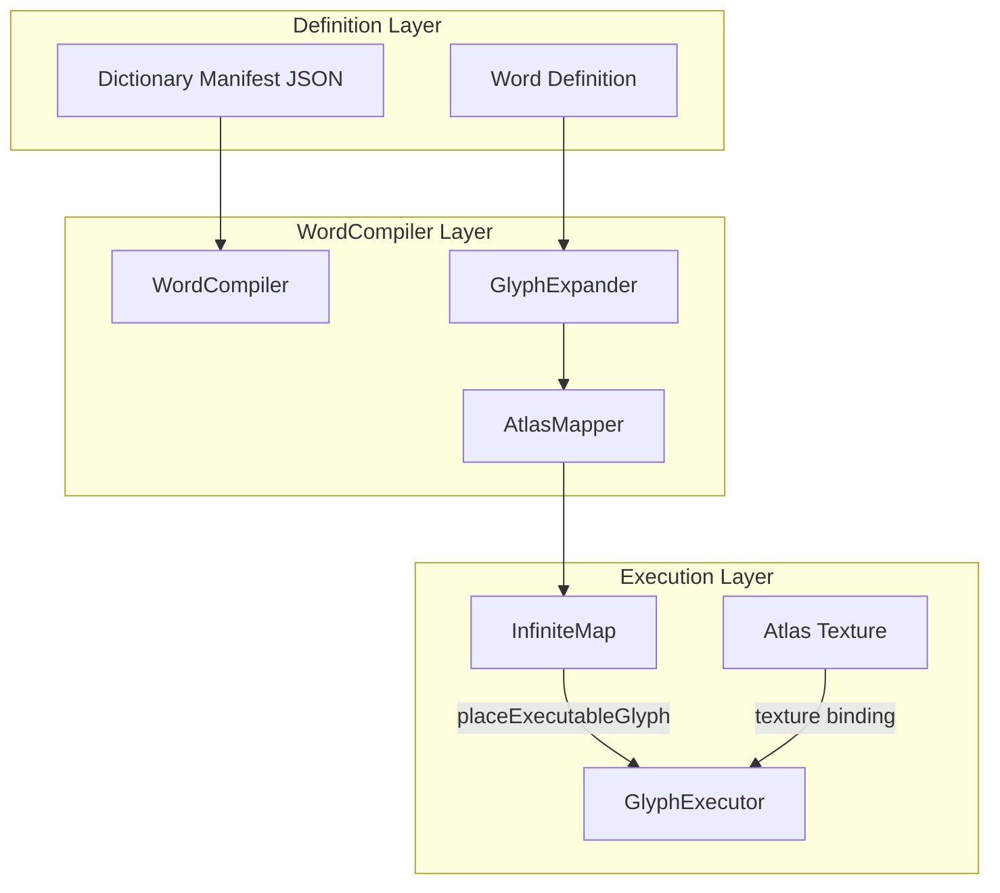

# Design: Holographic Dictionary

## Overview

Three-layer architecture: Word Definition (JSON) -> WordCompiler (JS) -> Placed Glyphs (PixiJS+WebGPU). Dictionary is a collection of Words at (0,0) that expand into executable glyph sequences.

## Architecture



## Components

### WordCompiler

**Purpose**: Transform Word definitions into placed glyphs

**Responsibilities**:
- Load dictionary manifest from JSON
- For each Word, expand glyphs to atlas positions
- Place glyphs on InfiniteMap at Word coordinates
- Register glyphs with GlyphExecutor

**State**:
```javascript
{
    dictionaries: Map<string, Dictionary>,
    wordIndex: Map<string, Word>,  // name -> Word
    atlasMapper: AtlasMapper
}
```

### GlyphExpander

**Purpose**: Convert opcode sequence to atlas coordinates

**Responsibilities**:
- Map opcode name to atlas (x, y)
- Resolve Ligature codes to dual-instruction
- Generate 32-bit instruction encoding

**Mapping Table**:
```javascript
const OPCODE_TO_ATLAS = {
    'ADD': { x: 0, y: 0 },
    'SUB': { x: 1, y: 0 },
    'MUL': { x: 2, y: 0 },
    'LW':  { x: 0, y: 1 },
    'SW':  { x: 1, y: 1 },
    'JAL': { x: 0, y: 2 },
    'BEQ': { x: 1, y: 2 },
    // ... from universal_font.rts.png
};
```

### DictionaryStorage

**Purpose**: Manage dictionary persistence at coordinates

**Responsibilities**:
- Store manifest at `/.geometry/dictionary/{name}.json`
- Track Word placements on map
- Provide lookup by name or coordinate

**File Structure**:
```
.geometry/
  dictionary/
    standard.json      # Standard Library manifest
    math.json          # Future: math operations
    io.json            # Future: I/O operations
```

## Data Flow

1. **Load**: WordCompiler.loadDictionary('standard') -> fetch manifest
2. **Expand**: For each Word -> GlyphExpander.expand(word.glyphs)
3. **Map**: GlyphRef -> AtlasMapper.getAtlasPosition(opcode)
4. **Place**: InfiniteMap.placeExecutableGlyph(x, y, glyphRef)
5. **Register**: GlyphExecutor.registerGlyph(x, y, sprite, atlasX, atlasY)
6. **Execute**: GlyphExecutor.execute() -> runs all glyphs

## Technical Decisions

| Decision | Options | Choice | Rationale |
|----------|---------|--------|-----------|
| Word storage format | JSON, YAML, binary | JSON | Human-readable, web-native |
| Word coordinate scheme | Packed, row-based | Row-based at (0, y) | Simple addressing |
| Atlas mapping | Runtime, precomputed | Precomputed table | O(1) lookup |
| Word expansion timing | Load-time, runtime | Load-time | Zero runtime cost |
| Cross-Word calls | Coordinate, name lookup | Coordinate direct | No indirection |

## File Structure

| File | Action | Purpose |
|------|--------|---------|
| `web/WordCompiler.js` | Create | Transform Words to glyphs |
| `web/GlyphExpander.js` | Create | Opcode to atlas mapping |
| `web/DictionaryStorage.js` | Create | Manifest management |
| `.geometry/dictionary/standard.json` | Create | Standard Library definition |
| `web/infinite_map.js` | Modify | Add loadDictionary() |
| `web/GlyphExecutor.js` | Modify | Support batch registration |

## Standard Library Words

### Arithmetic (y: 1-3)

| Word | y | Glyphs | Description |
|------|---|--------|-------------|
| add | 1 | ADD | x10 = x10 + x11 |
| sub | 2 | SUB | x10 = x10 - x11 |
| mul | 3 | MUL | x10 = x10 * x11 |

### Memory (y: 4-5)

| Word | y | Glyphs | Description |
|------|---|--------|-------------|
| load | 4 | LW | x10 = MEM[x11] |
| store | 5 | SW | MEM[x11] = x10 |

### Control Flow (y: 6-8)

| Word | y | Glyphs | Description |
|------|---|--------|-------------|
| jump | 6 | JAL | Jump to address |
| branch-z | 7 | BEQ | Branch if zero |
| call | 8 | JAL+RET | Call Word at coordinate |

## Word Coordinate Layout

```
Map View at (0,0):

y=0  [DICT_LABEL]
y=1  [ADD]
y=2  [SUB]
y=3  [MUL]
y=4  [LW]
y=5  [SW]
y=6  [JAL]
y=7  [BEQ]
y=8  [CALL]
...

Each y row = one Word
Word width = glyph_count * 16 pixels
```

## Error Handling

| Error | Handling | User Impact |
|-------|----------|-------------|
| Manifest load fail | Console error, skip dictionary | Dictionary unavailable |
| Unknown opcode | Skip glyph, log warning | Partial Word execution |
| Atlas position invalid | Use NOP glyph (0,0) | Degraded execution |
| Coordinate collision | Overwrite previous | Last-write wins |

## Existing Patterns to Follow

| Pattern | Source | Application |
|---------|--------|-------------|
| Async load + callback | `holographic_dictionary.js:157` | Dictionary loading |
| Map coordinate key | `GlyphExecutor.js:199` | `"x,y"` string key |
| Options spread | `infinite_map.js:18-31` | Constructor pattern |
| Sprite creation | `infinite_map.js` | Glyph placement |

## Integration Points

### GlyphExecutor Integration

```javascript
// In WordCompiler.placeWord()
for (const glyph of word.glyphs) {
    const sprite = this.infiniteMap.createSprite(
        glyph.atlasX * 16,
        glyph.atlasY * 16,
        16, 16
    );
    this.executor.registerGlyph(
        word.coordinate[0] + i,
        word.coordinate[1],
        sprite,
        glyph.atlasX,
        glyph.atlasY
    );
}
```

### InfiniteMap Integration

```javascript
// Add to InfiniteMap
async loadDictionary(name) {
    const compiler = new WordCompiler(this, this.executor);
    await compiler.loadDictionary(name);
}
```
