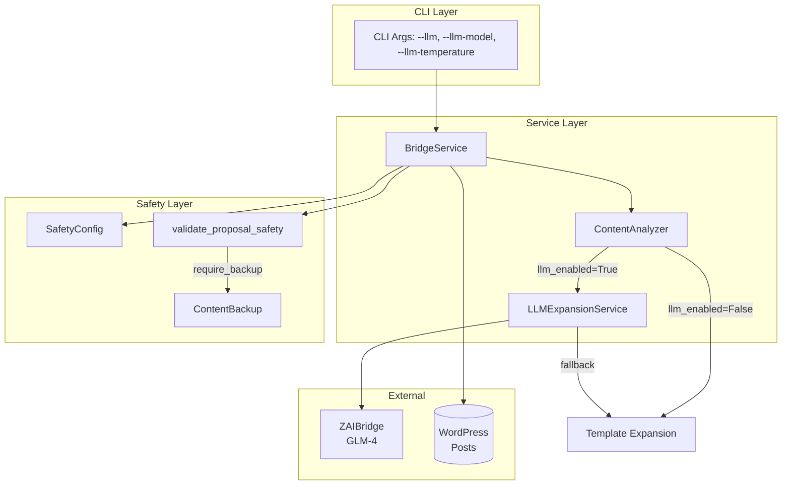
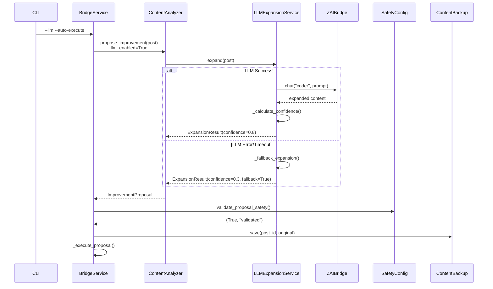

# Design: LLM-Powered WordPress Content Expansion

## Overview

Replace template-based content expansion with intelligent LLM-generated improvements via ZAI Bridge (GLM-4). Add `LLMExpansionService` alongside `ContentAnalyzer` with feature flag toggle, `SafetyConfig` for backups, and CLI flags for configuration. Fallback to templates on any LLM error.

## Architecture



## Components

### LLMExpansionService

**Purpose**: Wrap ZAIBridge.chat() for content generation with fallback

**Responsibilities**:
- Call ZAIBridge with "coder" persona for expansion
- Calculate confidence score (length ratio, structure markers)
- Fallback to template on timeout/error
- Track tokens used and model

**Interfaces**:
```python
@dataclass
class LLMExpansionConfig:
    api_key: Optional[str] = None  # Falls back to ZAI_API_KEY env
    model: str = "glm-4-plus"
    max_tokens: int = 1024
    temperature: float = 0.7
    fallback_to_template: bool = True
    timeout_seconds: float = 30.0

@dataclass
class ExpansionResult:
    post_id: int
    content: str
    confidence: float  # 0.0-1.0
    model_used: str
    tokens_used: int = 0
    fallback_used: bool = False
    error: Optional[str] = None

class LLMExpansionService:
    def __init__(self, config: Optional[LLMExpansionConfig] = None): ...
    def expand(self, post: Dict[str, Any]) -> ExpansionResult: ...
    async def _expand_async(self, post_id: int, title: str, content: str) -> ExpansionResult: ...
    def _fallback_expansion(self, post_id: int, title: str, content: str, error: str) -> ExpansionResult: ...
    def _calculate_confidence(self, original: str, expanded: str) -> float: ...
```

### ContentAnalyzer (Modified)

**Purpose**: Route to LLM or template based on `llm_enabled` flag

**Changes**:
- Add `llm_enabled: bool = False` param to `__init__`
- Add `llm_config: Optional[LLMExpansionConfig]` param
- Lazy-load `LLMExpansionService` on first use
- Route `_generate_expansion()` to LLM service when enabled

**Interfaces**:
```python
class WordPressContentAnalyzer:
    def __init__(
        self,
        llm_enabled: bool = False,
        llm_config: Optional[LLMExpansionConfig] = None
    ): ...

    @property
    def llm_service(self) -> LLMExpansionService: ...

    def _generate_expansion(self, post: Dict[str, Any]) -> str:
        if self.llm_enabled:
            result = self.llm_service.expand(post)
            return result.content
        # ... template fallback
```

### SafetyConfig

**Purpose**: Dataclass with backup/validation settings

**Responsibilities**:
- Define backup requirements and directory
- Set confidence thresholds for auto-execute
- Define content length limits
- Rate limiting config

**Interfaces**:
```python
@dataclass
class SafetyConfig:
    # Backup settings
    require_backup: bool = True
    backup_dir: str = "/tmp/wp_evolution_backups"

    # Confidence thresholds
    min_confidence_for_auto_execute: float = 0.7
    min_confidence_for_llm_expansion: float = 0.5

    # Content limits
    max_content_change_ratio: float = 0.8
    min_content_length: int = 10
    max_content_length: int = 10000

    # Rate limiting
    max_modifications_per_hour: int = 10
```

### ContentBackup

**Purpose**: Save/load JSON backups before modification

**Responsibilities**:
- Save original content to timestamped JSON
- Load most recent backup for restore
- Track restored flag

**Interfaces**:
```python
class ContentBackup:
    def __init__(self, backup_dir: str = "/tmp/wp_evolution_backups"): ...
    def save(self, post_id: int, content: str) -> Optional[str]: ...
    def load(self, post_id: int) -> Optional[str]: ...
    def restore(self, post_id: int) -> Tuple[bool, str]: ...
```

### validate_proposal_safety()

**Purpose**: Validate proposal meets safety thresholds

**Interfaces**:
```python
def validate_proposal_safety(
    proposal: ImprovementProposal,
    config: SafetyConfig
) -> Tuple[bool, str]:
    """
    Returns (is_safe, reason) tuple.
    Checks: confidence, content length, human review requirement
    """
```

### BridgeServiceConfig (Modified)

**Changes**:
```python
@dataclass
class BridgeServiceConfig:
    # ... existing fields ...
    llm_enabled: bool = False
    llm_model: str = "glm-4-plus"
    llm_temperature: float = 0.7
    safety_config: Optional[SafetyConfig] = None
```

### CLI Flags

**New Arguments**:
```python
parser.add_argument("--llm", action="store_true", help="Enable LLM expansion")
parser.add_argument("--llm-model", default="glm-4-plus", help="LLM model")
parser.add_argument("--llm-temperature", type=float, default=0.7, help="Temperature")
parser.add_argument("--no-backup", action="store_true", help="Disable backups (dangerous)")
```

## Data Flow



1. CLI parses `--llm` flag, passes to BridgeServiceConfig
2. BridgeService creates ContentAnalyzer with `llm_enabled=True`
3. ContentAnalyzer calls LLMExpansionService.expand()
4. LLMExpansionService calls ZAIBridge.chat("coder", prompt)
5. On success: calculate confidence (0.5-0.95)
6. On error: fallback to template with confidence 0.3
7. BridgeService validates safety, creates backup, executes

## Technical Decisions

| Decision | Options Considered | Choice | Rationale |
|----------|-------------------|--------|-----------|
| LLM Provider | ZAI (GLM-4), OpenAI, Claude | ZAI (GLM-4) | Already integrated in zai_bridge.py |
| Expansion Persona | architect, coder, oracle, guardian | coder | Best for content generation (lines 159-182 in zai_bridge.py) |
| Fallback Confidence | 0.1, 0.3, 0.5 | 0.3 | Lower than LLM (0.5+) but not too low to be useless |
| Sync vs Async | Pure async, sync wrapper | Sync wrapper with async internals | Matches ContentAnalyzer sync interface |
| Backup Location | /tmp, project dir, config path | /tmp/wp_evolution_backups | Ephemeral OK per requirements (internal devs only) |
| Default LLM Mode | On, Off | Off | Feature flag for safety |
| Timeout | 5s, 15s, 30s | 30s | Allow for slow API, but fallback reliably |
| Confidence Base | 0.3, 0.5, 0.6 | 0.5 | LLM expansion starts at 0.5, template at 0.3 |

## File Structure

| File | Action | Purpose |
|------|--------|---------|
| `systems/evolution_daemon/wordpress/llm_expansion_service.py` | Create | LLMExpansionService, LLMExpansionConfig, ExpansionResult |
| `systems/evolution_daemon/wordpress/safety_config.py` | Create | SafetyConfig, ContentBackup, validate_proposal_safety |
| `systems/evolution_daemon/wordpress/content_analyzer.py` | Modify | Add llm_enabled flag, integrate LLMExpansionService |
| `systems/evolution_daemon/wordpress/bridge_service.py` | Modify | Add CLI flags, SafetyConfig integration |
| `tests/test_llm_expansion_service.py` | Create | Unit tests for LLMExpansionService |
| `tests/test_safety_config.py` | Create | Unit tests for SafetyConfig, ContentBackup |
| `tests/test_bridge_cli.py` | Create | CLI flag parsing tests |
| `tests/test_bridge_service_safety.py` | Create | Safety integration tests |
| `tests/test_llm_expansion_integration.py` | Create | E2E integration tests |
| `tests/test_wordpress_content_analyzer.py` | Modify | Add LLM mode tests |
| `systems/evolution_daemon/wordpress/README_LLM_EXPANSION.md` | Create | Usage documentation |

## Error Handling

| Error Scenario | Handling Strategy | User Impact |
|----------------|-------------------|-------------|
| API timeout (>30s) | Fallback to template, log warning | Gets template expansion instead |
| API rate limit (429) | Fallback to template, log warning | Gets template expansion instead |
| API auth failure (401) | Fallback to template, log error | Gets template expansion instead |
| Invalid API key | Mock mode or fallback | Mock response or template |
| No ZAI_API_KEY set | Mock mode (returns mock response) | Mock content for testing |
| zhipuai not installed | Mock mode | Mock content for testing |
| Confidence below threshold | Proposal rejected, logged | No modification made |
| Backup save failure | Log error, continue (configurable) | Modification proceeds (warning logged) |
| JSON parse error in LLM response | Fallback to template | Gets template expansion |

## Edge Cases

- **Empty content**: Service handles empty input, returns minimal expansion
- **Very long content**: Truncate to 2000 chars for API call (line 206 in plan)
- **Non-ASCII content**: UTF-8 encoding preserved throughout
- **Concurrent requests**: Each request independent, no shared state
- **API key rotation**: Service reads env var on init, restart to update
- **Backup dir missing**: Created automatically with `os.makedirs(exist_ok=True)`
- **Multiple backups for same post**: Load returns most recent (sorted by timestamp)

## Test Strategy

### Unit Tests

| Test File | Tests | Mock Requirements |
|-----------|-------|-------------------|
| `test_llm_expansion_service.py` | ~12 | Mock ZAIBridge.chat() |
| `test_safety_config.py` | ~8 | None (pure data) |
| `test_bridge_cli.py` | ~5 | None (argparse only) |

Key unit tests:
- `test_service_initializes_with_defaults()`
- `test_service_generates_expansion_result()`
- `test_service_falls_back_on_error()`
- `test_safety_config_defaults_are_conservative()`
- `test_backup_saves_original_content()`
- `test_validate_proposal_safety_rejects_low_confidence()`
- `test_cli_accepts_llm_flag()`
- `test_cli_llm_defaults_to_false()`

### Integration Tests

| Test File | Tests | Description |
|-----------|-------|-------------|
| `test_bridge_service_safety.py` | ~4 | Safety integration with BridgeService |
| `test_llm_expansion_integration.py` | ~5 | Full flow from CLI to expansion |

Key integration tests:
- `test_full_expansion_flow_with_llm()`
- `test_template_fallback_when_llm_unavailable()`
- `test_quality_improvement_metrics()`
- `test_bridge_creates_backup_before_execution()`
- `test_bridge_respects_confidence_threshold()`

### E2E Tests (Manual)

1. Start service with `--llm` flag, verify LLM expansion
2. Run with invalid API key, verify template fallback
3. Run with `--no-backup`, verify no backup file created
4. Check logs for model, tokens, confidence, fallback status

## Performance Considerations

- LLM call latency: 1-3s typical, 30s max timeout
- Fallback latency: <10ms (template generation)
- Memory: Single ZAIBridge instance per service (lazy-loaded)
- No caching: Fresh LLM call per expansion (no stale content)

## Security Considerations

- API key from environment only (never logged)
- Content truncated to 2000 chars before API call
- Backup before modification (zero data loss)
- Confidence threshold prevents low-quality changes
- Rate limiting prevents runaway API costs

## Existing Patterns to Follow

Based on codebase analysis:

1. **ZAIBridge lazy loading** (zai_bridge.py:203-236): Initialize with api_key or env var
2. **Async with sync wrapper** (content_analyzer.py:79-108): `asyncio.run()` for sync interface
3. **Dataclass config** (bridge_service.py:26-33): Use dataclass for configuration
4. **CLI with argparse** (bridge_service.py:227-272): Standard argparse pattern
5. **Logging pattern** (guardian_gate.py:19): `logging.getLogger(__name__)`
6. **Retry decorator** (zai_bridge.py:63-100): `@with_retry(max_retries=3)` already in place
7. **Mock mode** (zai_bridge.py:447-455): Return mock when no API key

## Design Inputs

### Interview Responses

| Question | Response |
|----------|----------|
| Primary users | Internal developers only |
| Priority tradeoffs | Prioritize code quality |
| Success criteria | Feature works as specified |
| Architecture style | Extend existing architecture |
| Technology constraints | No constraints |
| Integration approach | Use existing APIs and interfaces |

## Unresolved Questions

1. **Backup retention policy**: Currently /tmp with no cleanup. Need retention period? (Plan says ephemeral OK)
2. **Rate limiting specifics**: Plan mentions 10/hour default. Is this sufficient?
3. **Mock mode behavior**: Should mock return realistic content or simple template? (Current plan: simple mock)

## Implementation Steps

1. Create `LLMExpansionService` at `systems/evolution_daemon/wordpress/llm_expansion_service.py` with ZAIBridge integration
2. Add `SafetyConfig` and `ContentBackup` at `systems/evolution_daemon/wordpress/safety_config.py`
3. Modify `ContentAnalyzer.__init__()` to accept `llm_enabled` flag
4. Replace `_generate_expansion()` to route to LLM when enabled
5. Add CLI flags `--llm`, `--llm-model`, `--llm-temperature` to bridge_service.py
6. Integrate `SafetyConfig` into `BridgeService._execute_proposal()`
7. Write unit tests for each new component
8. Write integration tests for full flow
9. Create documentation at `README_LLM_EXPANSION.md`
