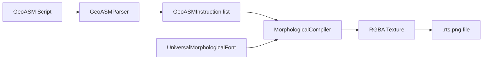

# Design: morphological-compiler

## Overview

Pure Python compiler: GeoASM text → Parsed instructions → RGBA texture. Each 16x16 glyph encodes one instruction in pixel channels while remaining human-readable via morphological font synthesis.

## Architecture



## Components

### Component 1: geoasm_opcodes.py
**Purpose**: Define symbol→opcode mapping
**Responsibilities**:
- Export opcode constants matching visual_cpu.wgsl
- SYMBOL_TO_OPCODE dict for parsing
- OPCODE_TO_SYMBOL dict for disassembly
- OPCODE_NAMES for debugging

### Component 2: geoasm_parser.py
**Purpose**: Parse GeoASM text to instruction list
**Responsibilities**:
- Tokenize symbol characters
- Parse numeric operands
- Handle comments and whitespace
- Report errors with location
- Export GeoASMInstruction dataclass

### Component 3: morphological_compiler.py
**Purpose**: Compile instructions to RGBA textures
**Responsibilities**:
- Load UniversalMorphologicalFont
- Render each instruction as 16x16 glyph
- Encode RGBA channels per pixel
- Save to .rts.png with metadata JSON
- Verify/decode compiled textures

## Data Flow

1. **Input**: GeoASM source string (e.g., `$ 5 $ 3 +`)
2. **Parse**: Tokenize → [(opcode=0x41, operand=5), (opcode=0x41, operand=3), (opcode=0x6A, operand=0)]
3. **Synthesize**: For each instruction, generate morphological glyph for symbol character
4. **Encode**: Each pixel gets R=opcode, G=operand_hi, B=operand_lo, A=morphology
5. **Output**: RGBA PNG, width = len(instructions) * 16

## Technical Decisions

| Decision | Options | Choice | Rationale |
|----------|---------|--------|-----------|
| Glyph size | 8x8, 16x16, 32x32 | 16x16 | Matches existing UniversalMorphologicalFont |
| Operand width | 8-bit, 16-bit, 32-bit | 16-bit | Fits in GB channels, sufficient for demos |
| Symbol set | Subset, Full ASCII | 12 symbols | Matches Visual CPU opcodes |
| Error handling | Strict, Lenient | Lenient | Continue parsing, report errors |

## File Structure

| File | Action | Purpose |
|------|--------|---------|
| `systems/intelligence/geometric_text/geoasm_opcodes.py` | Create | Opcode constants |
| `systems/intelligence/geometric_text/geoasm_parser.py` | Create | Parser + GeoASMInstruction |
| `systems/intelligence/geometric_text/morphological_compiler.py` | Create | Main compiler |
| `systems/intelligence/geometric_text/tests/test_geoasm_parser.py` | Create | Parser unit tests |
| `systems/intelligence/geometric_text/tests/test_morphological_compiler.py` | Create | Compiler unit tests |
| `systems/intelligence/geometric_text/examples/counter.geo` | Create | Counter example |
| `systems/intelligence/geometric_text/examples/fibonacci.geo` | Create | Fibonacci example |
| `systems/intelligence/geometric_text/examples/arithmetic.geo` | Create | Math example |

## Channel Encoding Protocol

```
Pixel[x,y] = {
    R: opcode       # 0x41 for $, 0x6A for +, etc.
    G: operand >> 8 # High byte
    B: operand & 0xFF # Low byte
    A: morphology   # 0-255 from neural synthesis
}
```

**Example**: `$ 255` encodes as:
- R = 0x41 (OP_I32_CONST)
- G = 0x00 (high byte of 255)
- B = 0xFF (low byte of 255)
- A = glyph intensity at that pixel

## Error Handling

| Error | Handling | User Impact |
|-------|----------|-------------|
| Unknown symbol | Report line/col, skip | Warning, continues |
| Operand overflow | Truncate to 16-bit, warn | Value clipped |
| Missing model file | Raise FileNotFoundError | Compilation fails |
| Empty input | Return 16x16 transparent | Empty texture |

## Existing Patterns to Follow

- **Dataclass style**: `systems/swarm/ctp/gateway.py` - use dataclasses for instruction/error types
- **Test structure**: `systems/evolution_daemon/tests/` - pytest with fixtures
- **Module loading**: `universal_font_demo.py` - use importlib for hilbert
- **CLI pattern**: Add `if __name__ == "__main__": main()` with argparse

## Next Steps

1. Create geoasm_opcodes.py with symbol mapping
2. Create geoasm_parser.py with tokenizer
3. Create morphological_compiler.py with RGBA encoder
4. Add unit tests for parser and compiler
5. Create example .geo files
6. Compile examples and verify
