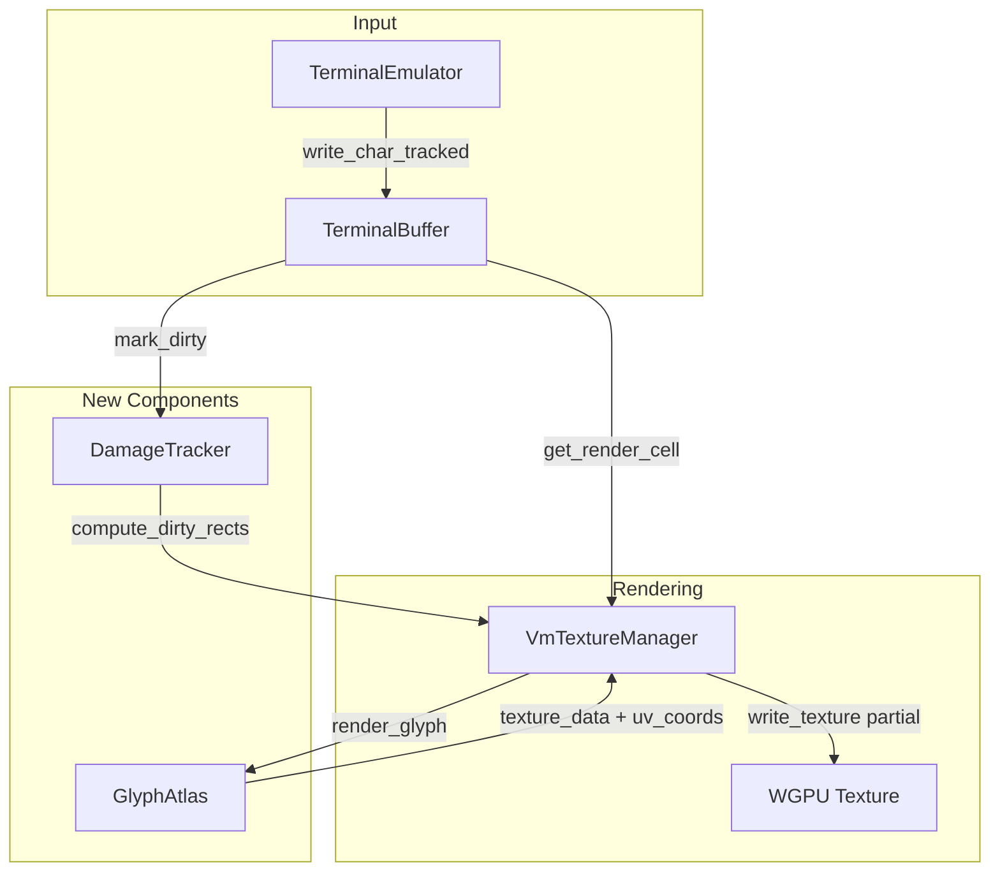

# Design: phase-30-8-terminal-ui

## Overview

Two-component enhancement: (1) GlyphAtlas uses fontdue to render TrueType fonts into a texture atlas with cached metadata, (2) DamageTracker monitors TerminalBuffer for changed cells and computes dirty rectangles for partial GPU texture updates.

## Architecture



## Components

### Component 1: GlyphAtlas

**Purpose**: Cache and render TrueType glyphs into a texture atlas.

**File**: `systems/infinite_map_rs/src/glyph_atlas.rs`

**Responsibilities**:
- Load embedded JetBrains Mono font via fontdue
- Rasterize glyphs on-demand with configurable pixel size
- Pack glyph bitmaps into row-organized texture atlas
- Store UV coordinates and metrics for each cached glyph
- Provide O(1) lookup via HashMap<GlyphKey, CachedGlyph>

**Data Structures**:

```rust
pub struct GlyphKey {
    c: char,      // Unicode codepoint
    size: u8,     // Font size in pixels (e.g., 16)
}

pub struct CachedGlyph {
    width: usize,
    height: usize,
    x_offset: i32,    // Horizontal bearing
    y_offset: i32,    // Vertical bearing from baseline
    advance: f32,     // Advance width to next char
    uv_coords: UvCoords,  // Normalized atlas coordinates
}

pub struct GlyphAtlas {
    width: usize,           // Atlas texture width (512)
    height: usize,          // Atlas texture height (512)
    pen_x: usize,           // Current write X position
    pen_y: usize,           // Current write Y position
    row_height: usize,      // Height of current row
    cache: HashMap<GlyphKey, CachedGlyph>,
    font: Font,             // fontdue Font instance
    texture_data: Vec<u8>,  // R8 texture (grayscale alpha)
}
```

**State Machine**:

```
[Empty] --> render_glyph(key) --> [Cached]
[Cached] --> get_glyph(key) --> [Hit]
[Empty] --> render_glyph(key) --> [Full] (atlas overflow, return None)
```

### Component 2: DamageTracker

**Purpose**: Track dirty terminal cells and compute minimal update rectangles.

**File**: `systems/infinite_map_rs/src/damage_tracker.rs`

**Responsibilities**:
- Maintain per-cell dirty flag array (row-major)
- Merge dirty cells into contiguous rectangles
- Provide Hilbert curve coordinate mapping for PixelRTS
- Clear damage after GPU upload completes

**Data Structures**:

```rust
pub struct DirtyRect {
    x: usize,       // Column start
    y: usize,       // Row start
    width: usize,   // Columns
    height: usize,  // Rows
}

pub struct DamageTracker {
    cols: usize,
    rows: usize,
    dirty_cells: Vec<bool>,  // cols * rows bitmap
    has_damage: bool,
}
```

**Algorithm: compute_dirty_rects()**

```
1. Scan cells row-by-row
2. For each unvisited dirty cell:
   a. Expand right while adjacent cells dirty
   b. Expand down while entire row dirty in expanded width
   c. Mark expanded rect as visited
   d. Add rect to list
3. Merge overlapping rects into bounding boxes
4. Return rect list
```

### Component 3: VmTextureManager Enhancement

**Purpose**: Integrate GlyphAtlas and DamageTracker for efficient rendering.

**File**: `systems/infinite_map_rs/src/vm_texture_manager.rs`

**New Methods**:

| Method | Purpose |
|--------|---------|
| `render_terminal_buffer_unicode()` | Render using GlyphAtlas instead of bitmap |
| `update_terminal_texture_partial()` | Upload only dirty rectangles |
| `render_terminal_region()` | Render subset of buffer for partial update |
| `blit_glyph()` | Copy glyph from atlas to framebuffer with color |

**New Field**:

```rust
pub struct VmTextureManager {
    // ... existing fields ...
    glyph_atlas: GlyphAtlas,  // NEW
}
```

## Data Flow

### Full Update Path (Backward Compatible)

```
1. TerminalBuffer.get_render_cell(row, col) -> TerminalCell
2. VmTextureManager.render_terminal_buffer()
   - For each cell: bitmap lookup, pixel assignment
3. VmTextureManager.update_vm_texture(full_data)
   - queue.write_texture(origin=0, full_size)
```

### Partial Update Path (New)

```
1. TerminalBuffer.write_char_tracked(c, attrs, tracker)
   - Update cell
   - tracker.mark_dirty(col, row)
2. DamageTracker.compute_dirty_rects() -> Vec<DirtyRect>
3. For each DirtyRect:
   a. VmTextureManager.render_terminal_region(rect)
   b. VmTextureManager.update_vm_texture_partial(rect)
      - queue.write_texture(origin=rect_origin, size=rect_size)
4. DamageTracker.clear()
```

## Technical Decisions

| Decision | Options | Choice | Rationale |
|----------|---------|--------|-----------|
| Font embedding | System font vs embedded | Embedded | Reproducible across systems |
| Atlas size | 256x256 / 512x512 / 1024x1024 | 512x512 | Covers ~4000 glyphs at 16px, grows if needed |
| Damage algorithm | Line-based / Cell-based / Frame-diff | Cell-based with rect merging | Optimal for sparse updates |
| Atlas format | R8 / RGBA8 | R8 | Grayscale alpha only, saves memory |
| Glyph key | (char,) / (char, size, style) | (char, size) | Size fixed at 16px for terminal, style deferred |

## File Structure

| File | Action | Purpose |
|------|--------|---------|
| `src/glyph_atlas.rs` | Create | GlyphAtlas component |
| `src/damage_tracker.rs` | Create | DamageTracker component |
| `src/vm_texture_manager.rs` | Modify | Add unicode + partial update methods |
| `src/terminal_emulator.rs` | Modify | Add write_char_tracked() |
| `src/lib.rs` | Modify | Add module exports |
| `fonts/JetBrainsMono-Regular.ttf` | Create | Embedded monospace font |
| `tests/test_glyph_atlas.rs` | Create | GlyphAtlas unit tests |
| `tests/test_damage_tracker.rs` | Create | DamageTracker unit tests |
| `tests/test_terminal_unicode_rendering.rs` | Create | Integration test |
| `tests/test_damage_integration.rs` | Create | E2E integration test |
| `benches/terminal_rendering_benchmark.rs` | Create | Performance validation |

## Error Handling

| Error | Handling | User Impact |
|-------|----------|-------------|
| Atlas full | Log warning, return None, fall back to bitmap | Character renders as blank |
| Font load fail | Panic on startup (embedded) | Application fails to start |
| Invalid dirty rect | Clamp to buffer bounds | May render extra area, never crash |
| WGPU partial update fail | Fall back to full update | Performance degraded, visual OK |

## Performance Model

| Scenario | Before | After |
|----------|--------|-------|
| Full screen (80x24) | 983KB upload | 983KB upload (same) |
| Single line | 983KB upload | ~3KB upload (1/24th) |
| Cursor blink | 983KB upload | ~32 bytes (1 cell) |
| 40 char type burst | 39MB/sec | ~120KB/sec (99.7% reduction) |

## Existing Patterns to Follow

| Pattern | Source File | Application |
|---------|-------------|-------------|
| VTE parsing | `terminal_emulator.rs` | Follow Perform trait pattern for damage hooks |
| Texture upload | `vm_texture_manager.rs` | Use existing `write_texture` pattern with origin |
| Module structure | `lib.rs` | Add `pub mod glyph_atlas; pub mod damage_tracker;` |
| Test structure | `tests/test_*.rs` | Separate test files per component |
| Font bitmap | `font_bitmap.rs` | Replace usage with GlyphAtlas |

## Integration Points

1. **TerminalEmulator.feed()**: No changes, buffer updates trigger damage via tracked methods
2. **VmTextureManager.update_terminal_texture()**: Add partial variant
3. **InfiniteMapApp.render()**: Call partial update when damage exists
4. **PixelRTS**: DamageTracker provides Hilbert coordinates for texture encoding
